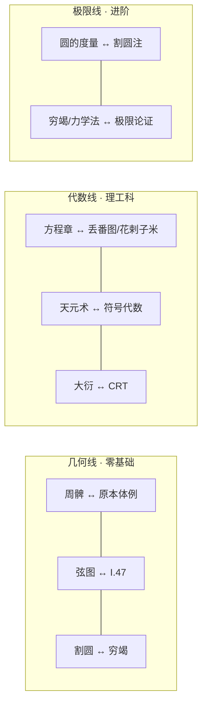

# 跨传统阅读路径

本篇把 [比较阅读策略](01-comparative-reading-strategy.md) 的方法落成可执行的计划：三条对读路线，每条由三个对读节点构成，节点两端分别链入两束的既有文档。读者按自身背景选一条主线，约六个月完成一轮；读完任一条线，都能独立回答对读三问。

## 一、路线总览：按读者背景选线

| 读者背景 | 建议路线 | 理由 |
|----------|----------|------|
| 零基础（高中数学，两束均未读过） | 几何线 | 图形可手画，《周髀》相关篇目与《原本》卷一原文篇幅都短 |
| 理工科（学过线性代数、基本数论） | 代数线 | 消元、同余可直接对接现代课程记忆，对读收益最快 |
| 进阶（已通读两束中至少一束） | 极限线 | 需要耐心面对两套历史形态的极限论证，且有前期术语积累 |

三条线不是隔离赛道：几何线的节点三与极限线的节点一共用割圆材料；代数线的节点三与极限线共享“文献先后不等于传承”的判断纪律（见 [比较阅读策略](01-comparative-reading-strategy.md) 第五节）。

## 二、几何线：周髀 ↔ 原本

三个对读节点：

1. **体例对照**——《周髀》商高答周公问“句广三，股修四，径隅五”是勾股特例的文字记录（F-011），陈子答荣方问给出一般表述（F-012）；《原本》卷一以 23 个定义、5 个公设、5 条公理、48 个命题铺开演绎（F-001）。看问题：同是直角三角形，文本为什么长得完全不同？
2. **弦图 ↔ I.47**——传统观点认为《周髀》赵爽注弦图构成勾股证明，Cullen 质疑此说、认为该信念基于 Needham 的缺陷翻译，MacTutor 将两说并列（F-020）；欧氏侧 I.47 是面积拼接式证明。看问题：两种“证毕”各意味着什么？
3. **割圆 ↔ 穷竭**——刘徽 263 年注《九章》创割圆术，从正六边形倍增至正一百九十二边形、得约 157/50（F-010）；阿基米德《圆的度量》用正 96 边形夹逼（F-009）。两者方法独立、无传播证据，属平行发展（F-021）。

书目搭配表（西方著作与中国算经交替阅读）：

| 步骤 | 西方侧 | 中国侧 | 对读任务 |
|------|--------|--------|----------|
| 1 | [古希腊几何](../../classics-reading/concepts/05-greek-geometry.md) | [周髀算经](../../../../guoxue/suanxue/suanjing-reading/concepts/06-zhoubi-suanjing.md) | 各自通读，各写一页梗概 |
| 2 | [精读示范 I.47](../../classics-reading/examples/01-euclid-close-reading.md) | [勾股算题实战](../../../../guoxue/suanxue/suanjing-reading/examples/04-gougu-pythagoras.md) | 亲手各做一遍，再并置成对照表 |
| 3 | [第一天示例（可选热身）](../../classics-reading/examples/02-first-originals-starter.md) | [刘徽注读法](../../../../guoxue/suanxue/suanjing-reading/concepts/05-liuhui-commentary.md) | 体会两侧注疏/评注传统的角色差异 |
| 4 | [原典信源（阿基米德 Heath 译本入口）](../../classics-reading/references/original-sources.md) | [割圆术示例](../../../../guoxue/suanxue/suanjing-reading/examples/07-geyuan-pi.md) | 倍边计算各复算一轮（96 与 192 边形） |

## 三、代数线：方程章 ↔ 丢番图/花剌子米 → 天元术 ↔ 符号代数 → 大衍 ↔ CRT

三个对读节点：

1. **线性方程组与记法起点**——《九章·方程》以算筹布列线性方程组，用“遍乘直除”消元，与高斯消元等价（F-013），并含现存最早的负数运算系统记载之一“正负术”（F-014、F-018）；丢番图《算术》约 250 年以缩写代数处理不定方程（F-005），花剌子米约 820 年《代数学》以文字修辞表述代数（F-015）。看问题：没有符号系统的代数如何工作？
2. **天元术 ↔ 符号代数**——李冶 1248 年刊《测圆海镜》，以“天元一”设定未知数立多项式方程（F-006）；宋元天元术以筹式位值排列表示多项式，四元术扩展至四未知数，记法为位置式而非符号式（F-016），朱世杰 1303 年《四元玉鉴》为其高峰（F-007）。看问题：位置式记法与符号式记法的表达力边界在哪里？
3. **大衍 ↔ CRT**——《孙子算经》“物不知数”（南北朝）与秦九韶 1247 年《数书九章》大衍总数术的系统化求解程序，对高斯 1801 年《算术研究》的同余一般理论（F-022）；两者间传播路径无文献证据。

书目搭配表：

| 步骤 | 西方侧 | 中国侧 | 对读任务 |
|------|--------|--------|----------|
| 1 | [希腊化数论（丢番图）](../../classics-reading/concepts/06-hellenistic-number-theory.md) | [九章结构](../../../../guoxue/suanxue/suanjing-reading/concepts/03-jiuzhang-structure.md) | 两侧“问题单元”的体例对照 |
| 2 | [伊斯兰代数（花剌子米）](../../classics-reading/concepts/07-islamic-algebra.md) | [方程关键方法](../../../../guoxue/suanxue/suanjing-reading/concepts/04-jiuzhang-key-methods.md) + [三禾题实战](../../../../guoxue/suanxue/suanjing-reading/examples/03-fangcheng-negative.md) | 修辞代数 vs 遍乘直除与正负术 |
| 3 | [17 世纪符号化（笛卡尔/韦达脉络）](../../classics-reading/concepts/08-early-modern-17c.md) | [天元术与四元术](../../../../guoxue/suanxue/suanjing-reading/concepts/10-dayan-tianyuan-siyuan.md) | 位置式 vs 符号式记法对比卡 |
| 4 | [高斯转折](../../classics-reading/concepts/10-gauss-turn.md) | [物不知数实战](../../../../guoxue/suanxue/suanjing-reading/examples/05-wuwuzhishu-crt.md) | 复算物不知数并对接同余一般理论 |

## 四、极限线：刘徽注 ↔ 阿基米德

两个对读节点（进阶线密度更高）：

1. **圆的度量 ↔ 割圆注**——阿基米德（前 287–212）以正 96 边形得上下界（F-009）；刘徽（约 220–280，263 年注《九章》，F-004）以正一百九十二边形得约 157/50（F-010）。年代上阿基米德早约四百五十年，方法独立、无传播证据（F-021）；祖冲之继而求得 π 于 3.1415926 与 3.1415927 之间、密率 355/113（F-019）。
2. **穷竭/力学法 ↔ 极限论证**——阿基米德《方法》以力学穷竭法求积；刘徽在商功章注中以极限论证确立阳马、鳖臑体积公式，并提出“牟合方盖”推求球体积而未竟（F-017）。看问题：两套论证各自“收尾”到哪里、哪里留白？留白处各自的后续是什么？

书目搭配表：

| 步骤 | 西方侧 | 中国侧 | 对读任务 |
|------|--------|--------|----------|
| 1 | [原典信源总表](../../classics-reading/references/original-sources.md) | [刘徽注读法](../../../../guoxue/suanxue/suanjing-reading/concepts/05-liuhui-commentary.md) | 确定底本与译本，通读背景 |
| 2 | [译本与注本谱系](../../classics-reading/references/translations-commentaries.md) | [割圆术示例](../../../../guoxue/suanxue/suanjing-reading/examples/07-geyuan-pi.md) | 倍边迭代复算并核对误差界论证 |
| 3 | [古希腊几何（阿基米德部分）](../../classics-reading/concepts/05-greek-geometry.md) | [祖冲之](../../../../guoxue/suanxue/suanjing-reading/concepts/08-zu-chongzhi.md) | 制作 π 精度对照表（含欧洲 16 世纪通说，F-019） |

## 五、与两束既有阅读计划的衔接

两束各有现成计划：[国外经典十二个月路线图](../../classics-reading/examples/03-reading-roadmap.md)（每周 4–6 小时、四阶段）与 [算经八周通读计划](../../../../guoxue/suanxue/suanjing-reading/examples/08-reading-plan.md)（每周 4–5 小时、含做题产出）。衔接方式有两种：

**模式 A：先分后合（推荐给零基础读者）**。先跑完八周算经计划——它已覆盖方程章与正负术（第 6 周）、割圆（第 7 周）、大衍（第 8 周）；同时用路线图阶段一（月 1–3 的希腊部分）作西方侧打底，然后进入本篇对读节点。

**模式 B：并行交错（推荐给已读过至少一束的读者）**。同一个月内两束各取对应主题的一半时间。例如：路线图阶段一第 4–6 周读《原本》卷一时，平行做八周计划第 2 周（商高、陈子篇），月底完成一次勾股并置对照。

对读主题与两束计划的位置对应：

| 对读节点 | classics 路线图位置 | suanjing 八周计划位置 |
|----------|--------------------|-----------------------|
| 几何线节点 1–2 | 阶段一第 4–6 周（卷一精读） | 第 2 周（商高、陈子） |
| 几何线节点 3 / 极限线 | 阶段一第 9–10 周（阿基米德选读） | 第 7 周（刘徽注割圆） |
| 代数线节点 1 | 阶段二第 13–17 周（丢番图、花剌子米） | 第 6 周（方程、正负术） |
| 代数线节点 3 | 阶段三第 35–36 周（高斯） | 第 8 周（大衍类选读） |

## 六、约六个月时间安排建议

以每周 4–6 小时计，三线串行、每线以对读节点为里程碑：

| 月份 | 主线 | 关键动作 | 产出 |
|------|------|----------|------|
| 月 1 | 几何线节点 1–2 | 《周髀》商高陈子篇 + 《原本》卷一选段；手绘弦图 | 勾股双源对照笔记 |
| 月 2 | 几何线节点 3 | 割圆 vs 穷竭倍边复算（96 与 192 边形） | π 方法对照表 |
| 月 3 | 代数线节点 1 | 方程章三禾题 + 花剌子米六类方程选读 | 修辞代数 vs 算筹布列对照表 |
| 月 4 | 代数线节点 2–3 | 天元术选段 + 符号代数脉络；复算物不知数 | 大衍 ↔ CRT 三栏记录 |
| 月 5 | 极限线 | 刘徽注细读 + 《圆的度量》；体积公式对照 | 两套极限论证笔记 |
| 月 6 | 复盘与扩展 | 按对读三问复盘；选一个接触事件深入（汉译《原本》文献入口见 [联合信源](../references/joint-sources.md)） | 一篇对读复盘 + 术语卡归档 |

弹性调整：

- 零基础者建议拉长到约 9 个月：前两个月先做八周计划的第 1–4 周打底；
- 进阶者可压缩到约 4 个月：跳过各线节点 1，直接从方法对照进入；
- 与十二个月路线图并行者：按第五节对应表把对读任务插入对应周，总时长以两束计划为准。

结业自测（对读版）：

- [ ] 能就消元、圆周率、同余三个案例各写一句规范表述——平行独立发展或文献先后比较、不构成传承证据（F-021、F-022、F-023）；
- [ ] 能说出至少一处两说并列的争议（如弦图证明归属，F-020）并给出双方依据；
- [ ] 术语卡累计不少于 20 张，两侧各半；
- [ ] 完成一篇不少于 1000 字的双源对读复盘。

## 延伸阅读

- 方法入口：[为什么做中西数学对读](00-why-compare.md) · [比较阅读策略](01-comparative-reading-strategy.md)
- 两束计划原文：[十二个月路线图](../../classics-reading/examples/03-reading-roadmap.md) · [八周通读计划](../../../../guoxue/suanxue/suanjing-reading/examples/08-reading-plan.md)
- 两束路径文档：[西方谱系怎么读](../../classics-reading/concepts/00-why-read-originals.md) · [算经阅读路径](../../../../guoxue/suanxue/suanjing-reading/concepts/13-reading-path.md)
- 事实依据：[事实清单](../facts.md)

相关概念：[为什么做中西数学对读](00-why-compare.md) · [比较阅读策略](01-comparative-reading-strategy.md)