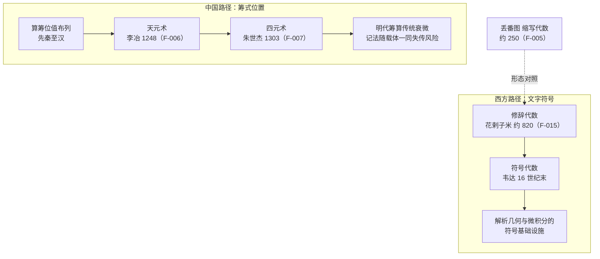

# 符号化与抽象对读

代数史的核心剧情之一，是“未知数”如何从自然语言的束缚中挣脱出来。两条传统在这场挣脱中走了两条完全不同的路：

- 西方路径：修辞代数 → 缩写代数 → 符号代数，用**文字符号**逐步替换语句；
- 中国路径：算筹位值布列 → 天元术 → 四元术，用**空间位置**直接编码结构。

本篇对读两条路径的三个节点：花剌子米的修辞代数与韦达的符号化（西方侧），天元术与四元术的筹式记法（中国侧），并追问一个对读特有的问题——为什么中国路径到达了位置代数的高峰，却几乎没有走向文字符号？记法与载体、抽象与传承之间是什么关系？

## 西方节点

### 花剌子米：修辞代数

花剌子米约 820 年著《代数学》，代数以文字修辞表述、无符号系统（F-015）。所谓修辞代数，是指方程完全写成自然语言的句子——没有 $x$，没有指数记号，“平方”“根”“数”都是日常词汇。

这并非“落后”：修辞代数自足地支撑了配方法、方程分类等系统性工作。但它有两个天然约束：

- 每个方程都是一段文字，运算步骤必须用语言描述，冗长且易歧义；
- 抽象层级受限——“未知数”始终是某个具体问题的量，难以再抽象。

举一个形态学的示意（非原文引录）：花剌子米式的方程读起来像“一个平方与十个根等于三十九个单位”——每个数量都要用名词说出。试着用这种方式向同事口述一道今天的方程应用题，马上会体会到修辞形态的沟通成本。

形态与谱系解读，见 classics-reading 束[伊斯兰代数](../../classics-reading/concepts/07-islamic-algebra.md)。

### 从缩写到符号的接力

符号化的最后一步由韦达在 16 世纪末完成：用字母统一表示已知量与未知量，使“方程”第一次成为符号对象而非文字陈述。符号代数一经出现便与解析几何、微积分汇流——这是欧洲 17 世纪科学革命的语言学前提之一，谱系见 classics-reading 束[17 世纪早期现代](../../classics-reading/concepts/08-early-modern-17c.md)。

一个容易被忽略的细节：缩写代数早在丢番图那里就已出现（约 250 年，F-005），但花剌子米的形态反而是修辞的——记法形态并非线性进步，中途可能“回退”。形态演化的这种非单调性，是评估任何“记法进步史观”时的必要警觉。

**读法要点**：读花剌子米与韦达各一段解方程文本，数一数“把语义搬进记号”的那一刻发生在哪里——符号化的本质就是这次搬运。

## 中国平行

### 筹式：位置即记法

中国传统的记法起点是算筹：数字按位值制布列，计算过程就是筹形的移动与重排。位值制的思想基础见 suanjing-reading 束[筹算与记数](../../../../guoxue/suanxue/suanjing-reading/concepts/02-chousuan-numeration.md)。

宋元算家在这一基础上完成了惊人的跃迁：以筹式位值排列表示多项式，四元术更扩展至四个未知数；其记法为位置式而非符号式（F-016）。也就是说，中国路径没有发明“代表未知数的符号”，而是让**摆放位置本身**承担了符号的功能。

### 天元术：李冶 1248

李冶（1192–1279）1248 年刊《测圆海镜》，用天元术立多项式方程；书中以“天元一”称呼设定未知数（F-006）。天元式的布列规则：按幂次高低纵向排布筹式，以“元”字标记一次项（或以“太”标记常数项）所在——一次布列，多项式便可视化地立在板上，加减乘除即挪动与重排。

### 四元术：朱世杰 1303

朱世杰存世著作两部：《算学启蒙》1299 年、《四元玉鉴》1303 年（F-007）。四元术把位值记法扩展到天、地、人、物四个未知数，多项式从一维排布变为二维平面上的十字形布列，消元程序随之展开。Sarton 称《四元玉鉴》为同类著作中最重要的中文著作与中世纪杰出数学著作之一（F-008）。

记法细节与算例，见 suanjing-reading 束[大衍术、天元术与四元术](../../../../guoxue/suanxue/suanjing-reading/concepts/10-dayan-tianyuan-siyuan.md)。

### 从设未知数看两种抽象

天元术的工作流与现代解方程惊人同构：

1. “立天元一为某某”——相当于现代的“设未知量为某某”；
2. 依题意把两个量各表示为天元式的多项式；
3. “相消”得方程——相当于移项合并；
4. 开方求解——相当于解方程求根。

四步中每一步的语义都能与符号代数对应，不同的只是记法外壳。这正是 Chemla 强调的：中国算学不是“前代数”，而是一门成熟的、自足的代数，只是记法形态不同（r-chemla-roads）。

**读法要点**：读天元术例题时亲手在方格纸上画一次布列图——位置记法的表现力只有画出来才能体会；同时留意它无法表达什么（如四个以上未知数），那是位置编码的边界。

## 比较分析

### 两条路径的分岔图

图中虚线提示一个历史事实：丢番图的缩写形态早于花剌子米的修辞形态，但两者是否构成传承并无定论——图中仅作形态对照，不画传承箭头。

### 位置记法 vs 文字符号

| 维度 | 筹式位置记法 | 文字符号记法 |
|------|-------------|-------------|
| 编码机制 | 空间位置承担语义（幂次、未知数） | 字符本身承担语义（$x$、上标） |
| 载体依赖 | 强——离开筹算板/布列图即失效 | 弱——可脱离载体书写与印刷 |
| 运算方式 | 挪动、重排实物筹 | 纸面变换符号 |
| 可扩展性 | 维数受限（四元术止于四未知数） | 理论上可命名任意多变量 |
| 传播媒介 | 口授 + 实物演示 | 印刷术时代可大规模复制 |

两条路径的共同方向是抽象化——都以记号结构替代自然语言；分岔在于“抽象寄存在哪里”：中国寄存在空间里，西方寄存在字符里。

### 命运分岔：筹式消亡的教训

位置记法的高峰之后是急转直下：宋元算学高峰之后，明代筹算传统整体衰微，天元术在明代几近失传，直到清中叶才被学者重新发掘——脉络见 suanjing-reading 束[明清之际的转变](../../../../guoxue/suanxue/suanjing-reading/concepts/11-ming-qing-transition.md)。

这段历史给对读者的教训是结构性的：

1. **记法依赖载体**：位置记法活在筹与布列的实践中，实践中断，记法即死；
2. **符号的可印刷性是隐形优势**：文字符号天然适配印刷传播，位置记法则难以无损地搬上书页；
3. **失传的是记法而非思想**：天元术的多项式思想在记法消亡后仍可被现代记号重写——思想与记法的可分离性，正是今天还能对读的原因。

### 记法与问题难度的互动

记法形态直接影响一个传统能“看见”哪些问题：

- 筹式位置记法下，多项式布列一目了然，于是消元、开方这类“变换布列”的问题成为主流；
- 符号记法下，符号变形可以脱离具体数值进行，于是恒等式、一般系数方程成为主流；
- 两条传统的问题清单，部分是各自记法的可供性塑造的。

这一视角来自数学史与技术史的交叉研究，对读时不妨反复自问：这道题为什么在这个传统里显得自然？

### 与优先权问题的关系

本主题一般不涉及优先权争议：位置式与符号式是形态学差异而非同题竞速，不存在“谁先发明符号代数”的单一答案。Chemla 对天元术多项式记法的分析表明，位置记法在其自身传统内是充分的表达与运算工具（r-chemla-roads）——评价记法应以它在自己传统中完成的工作为准，而非以它离符号化有多远为准。

同理，四元术止步于四未知数也不是缺陷陈述，而是位置编码维数边界的历史记录。

## 对读示范指引

本束的三篇示例不含本主题，这里给出自组对读方案：

1. **取双源**：西方侧取花剌子米解二次方程的一段修辞表述（入口见[伊斯兰代数](../../classics-reading/concepts/07-islamic-algebra.md)）；中国侧取《测圆海镜》一问的天元式布列（入口见[大衍术、天元术与四元术](../../../../guoxue/suanxue/suanjing-reading/concepts/10-dayan-tianyuan-siyuan.md)）。
2. **做翻译练习**：把两段文本都翻译成现代符号记法，再统计各自丢失了什么——修辞文本丢失了紧凑性，筹式布列丢失了布列位置信息（画图保留）。
3. **重演分岔**：尝试用文字描述你做“消元”的每一步（体会修辞代数的负担），再用方格纸画四元术的一次消元（体会位置记法的负担）——负担清单的对比就是两条路径的比较结论。

4. **写下教训**：用两三句话概括“筹式消亡”对今天软件工程或数据格式设计的启示——记法、载体与传承的关系是永恒的工程问题，对读的价值在此溢出数学史。

延伸阅读：筹式记法的数字编码基础见[筹算与记数](../../../../guoxue/suanxue/suanjing-reading/concepts/02-chousuan-numeration.md)；宋元高峰的总体背景见[宋元数学高峰](../../../../guoxue/suanxue/suanjing-reading/concepts/09-song-yuan-peak.md)；本篇事实依据见本束[事实清单](../facts.md)第一节与第二节。