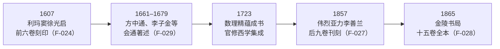

# 接触与互鉴对读

主题 03 至 07 比较的都是两条平行线；本篇讲它们的**交点**。《几何原本》的汉译是两大数学传统第一次在文本层面深度接触，时间跨度超过两个半世纪：

- 1607 年（万历三十五年），利玛窦口译、徐光启笔受的前六卷刻印（F-024）；
- 1857 年（咸丰七年），伟烈亚力与李善兰合译的后九卷刊行（F-027）；
- 1865 年（同治四年），金陵书局合刻十五卷全本（F-028）。

这段历史回答了平行比较无法回答的问题：当公理化传统真正面对算法化传统时，发生了什么？哪些东西被翻译了，哪些被改造了，哪些被拒绝了？译名为什么能存活至今？

## 西方节点

### 克拉维乌斯底本与第一波接触

前六卷的翻译自 1606 年开始，利玛窦口译、徐光启笔受，底本是克拉维乌斯（Christoph Clavius, 1537–1612）的拉丁文本《欧几里得原本 15 卷》，1607 年春译毕刻印（F-024）。

底本选择本身就有信息量：克拉维乌斯是耶稣会罗马学院的数学教授，其 15 卷本是在欧氏 13 卷之外补入后人增补的两卷的教科书式版本——传入中国的《原本》从一开始就是“欧洲大学课堂里的欧几里得”，而非文艺复兴时期人文主义者复原的希腊原本。17 世纪欧洲数学的整体语境，见 classics-reading 束[17 世纪早期现代](../../classics-reading/concepts/08-early-modern-17c.md)。

克拉维乌斯本的地位提示对读者：跨传统接触中的“西方”从来不是一个均质抽象——传来的希腊总是特定时刻、特定教派、特定教育体系里的希腊。这一点与主题 03 的提醒一致：先问底本，再谈比较。

### Billingsley 底本与后九卷

后九卷的合作自 1852 年开始：李善兰（1811–1882）与伟烈亚力（Alexander Wylie, 1815–1887）据比林斯利（Henry Billingsley）1570 年英译《原本》翻译，1856 年译毕，1857 年由韩应陛刊刻（F-027）。两个半世纪后，底本从耶稣会的拉丁教科书换成了伊丽莎白时代的英语 folio 本——底本的更替本身就是西方数学出版史的一面镜子。

**读法要点**：对读两次翻译时，先查清各自底本的面貌——克拉维乌斯本与 Billingsley 本的命题编号、增补内容并不完全相同；汉译本的“差异”可能来自底本而非译者。

## 中国平行

### 前六卷：界说、求作、公论、题

前六卷译本建立了沿用至今的术语骨架（F-025）：

| 欧氏概念 | 汉译术语 |
|---------|---------|
| 定义（definition） | 界说 |
| 公设（postulate） | 求作 |
| 公理（common notion） | 公论 |
| 命题（proposition） | 题 |

这些译名沿用至今，并传入日本、韩国（F-025）——今天东亚数学词汇里的这套骨架，直接发源于 1607 年的这次笔受。

逐词审视这套译名还能看到译者的匠心：“求作”把 postulate 译为一个动作（求而作之），暗合公设的构造性本质；“公论”取其众人可依之义，对应 common notion 的公共性。术语不是贴标签，而是理解的一次压缩。

值得注意的是译本对原文的改造：前六卷译本删去原书结论部分、融合中国传统数学典籍体例，以适应中国读者（F-026）。翻译在这里不是透明传递，而是一次有意识的文本再组织。

### 明清中算家的回应

前六卷刊行后，明清中算家著书揣摩西学几何要旨，存世著述包括（F-029）：

- 方中通《几何约》（1661）；
- 李子金《几何易简录》（1679）；
- 杜知耕《几何论约》；
- 梅文鼎《几何通解》。

这批著述的共同姿态是“会通”：用中算的概念工具重新表述、剪裁、消化欧氏几何。再往后，1723 年康熙敕编的《数理精蕴》成书，系统收录了传入的西方数学——几何与算法在官修体系中合流。这一时期数学传统的整体转折，见 suanjing-reading 束[明清之际的转变](../../../../guoxue/suanxue/suanjing-reading/concepts/11-ming-qing-transition.md)。

### 后九卷：李善兰的执念

1857 年刊本背后有一个动人的文献——李善兰早年读前六卷后自述：“窃思后九卷必更深微，欲见不可得，辄恨徐、利二公之不尽译全书也”，遂有续译之志（F-030）。这段自述说明：到 19 世纪中叶，前六卷已培养出能精确判断“全书价值”的中国读者，续译的动力来自传统内部。

1865 年（同治四年），金陵书局合刻《几何原本》十五卷全本，藏北京图书馆等处（F-028）——从初刻到全本，历时 258 年。

### 时间线

时间线的每一站都有文献支撑，信源登记见本束[中西原文与译本联合信源](../references/joint-sources.md)。

## 比较分析

### 翻译如何改造文本

F-026 记录的改造——删去结论、融合中算体例——值得逐层解读：

1. **删去结论**：克拉维乌斯本每卷末多有总结性论述，译者删之——减少与算法范式无对应物的说理部分；
2. **融合中算体例**：以中算读者熟悉的行文节奏重新组织——降低进入门槛；
3. **代价**：中国读者接触到的《原本》是一个被“驯化”的版本，演绎范式的棱角被磨平了一部分。

这解释了一个表面悖论：《原本》入华并未立刻带来“几何热”，中算家的最初回应（F-029）是以“会通”消化而非以“范式”取代——被改造的文本只能引来改造式的接受。范式层面的冲击要等到主题 07 所述的近代重译与科学教育时代才充分展开。

### 译名的生命力

与文本的命运相反，译名（F-025）表现出惊人的稳定性：界说、求作、公论、题沿用至今，且传入日本、韩国。这一反差是交流史的重要一课：

- 文本会被再组织、再删节，但**术语一旦嵌入教育体系便不可逆**；
- 好译名是概念的“锚”：今天任何读者翻开汉译《原本》卷一，仍能凭“界说—求作—公论—题”直通定义—公设—公理—命题的原初结构；
- 对读实践中，掌握这套译名等于拿到了进入希腊文本的中古汉语接口。

### 三波西学东渐的框架

萧文强把《几何原本》汉译定位为“第一波欧洲科学传入中国”的开端，清代第二波、第三波传播各有不同历史语境（F-031）。这个框架提醒对读者：

- 1607 年的翻译发生在晚明士人圈的特定语境中，不能拿 19 世纪的语境去理解它；
- 1857 年的续译发生在条约体制与洋务运动之间，动力与资源都与第一波不同；
- “接触—回应”的模式在每一波中都不相同，切忌把交流史写成一条单调上升的直线。

### 方法论小结

- 接触不等于融合：250 年的时间差说明范式转换远比译名存续艰难；
- 翻译即改造：比较“翻译了什么”时，必须同时追问“删改了什么”；
- 传统内部的动力最持久：李善兰的执念（F-030）说明外来文本只有被传统内化后，才能产生自发的续接。

### 与平行主题的呼应

本篇与前面五个主题的关系，可以概括为“平行线与交点”：

- 主题 03 的范式差异（演绎 vs 算法）在 1607 年第一次面对面；
- 主题 06 的符号化问题在汉译里以译名形式重演——如何为一个没有对应物的概念造词；
- 主题 07 的认识论差异是两次翻译之间 250 年时间差的深层原因之一。

对读完本篇后，建议回头重读任一平行主题——带着“这两套东西曾经相遇”的意识，平行比较的细节会显出新的意义。

## 对读示范指引

本主题的示范材料在信源层：本束[中西原文与译本联合信源](../references/joint-sources.md)登记了版本源流（1607 初刻、1611 三校本、1857 韩应陛本、1865 金陵书局本，s-guoxuedashi-jhyb）与希英对照原文入口。

建议读法分三步：

1. **对照读卷一开头**：找一部汉译《原本》（如金陵书局本影印或现代排印本），读卷一开头的界说与公论，同时对照[欧几里得精读示范](../../classics-reading/examples/01-euclid-close-reading.md)所用的希英原文——亲手验证“界说=定义、公论=公理”的对应关系。
2. **版本对勘练习**：按[联合信源](../references/joint-sources.md)的版本清单，比较 1607 本与 1865 本卷一的首条界说措辞是否一致——两个半世纪间译名的稳定性是 F-025 的直接检验。
3. **写一份交流史短评**：以“翻译如何改造文本”为题，用 F-024 至 F-026 各举一例，练习把交流史事实与比较分析分开陈述——这是主题 08 特有的写作纪律。

延伸阅读：明清数学传统的整体转折见[明清之际的转变](../../../../guoxue/suanxue/suanjing-reading/concepts/11-ming-qing-transition.md)；两次翻译的欧洲侧语境见[17 世纪早期现代](../../classics-reading/concepts/08-early-modern-17c.md)；本篇事实依据集中于本束[事实清单](../facts.md)第四节。