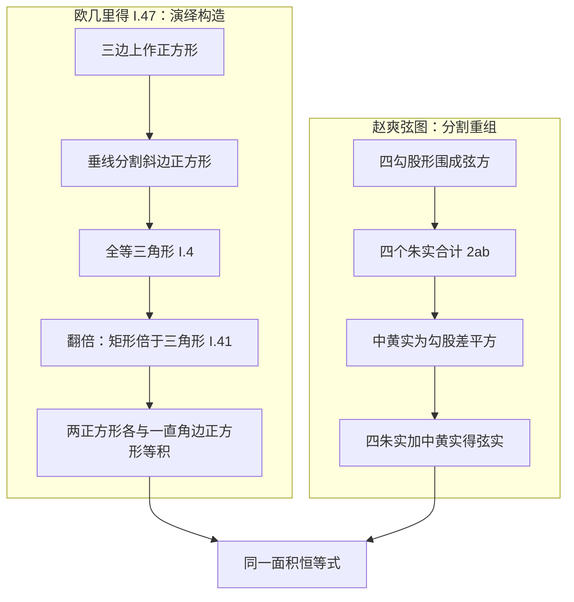

# 勾股定理中西双源对读——欧几里得 I.47 与赵爽弦图

同一条几何事实——直角三角形两条直角边上的正方形之和等于斜边上的正方形——在两大传统中各有一个传世的证明：欧几里得《几何原本》卷一命题 47 用全等与面积翻倍把它从公理演绎出来；《周髀算经》记下的商高句股之说与三国赵爽的弦图注，则用图形割补与算术恒等式把它“拼”出来。本篇把两个证明逐步并排对读，再用现代数学语言统一表述，最后分析两条路径的思想特征与证明归属争议（F-020）。比较框架见本包[几何与度量对读](../concepts/03-geometry-measurement.md)。

## 原文对照

### 西方侧：《几何原本》卷一命题 I.47

欧几里得《原本》约成书于公元前 300 年，全书 13 卷；卷一含 23 个定义、5 个公设、5 条公理与 48 个命题（F-001），命题 47 是全卷高潮，命题 48（逆定理）紧随其后收卷。

> **命题 I.47**：在直角三角形中，直角所对的边上的正方形，等于夹直角两边上的两个正方形之和。
>
> ——欧几里得《原本》卷一（据 Fitzpatrick 英译意译，公共领域；原文关键语即习称的“the square on the hypotenuse …”，见 r-fitzpatrick-euclid）

注意两点行文特征。其一，命题陈述的是**面积相等**（正方形对正方形），而非代数等式。其二，证明只允许使用定义、公设、公理与此前已证的命题——I.47 之前已备好全等法（I.4）、共线判据（I.14）与“平行四边形是同底同高三角形之二倍”（I.41）三件工具，证明全程无一处数值运算。

命题构造的白话转述：设直角三角形 $ABC$，直角在 $A$。在三边上分别立正方形；过直角顶点向斜边作垂线并延长，把斜边上的大正方形一分为二；随后证明左侧矩形与 $AB$ 上的正方形等积、右侧矩形与 $AC$ 上的正方形等积——两大块各归其位，结论即成。

### 中国侧：《周髀算经》商高之说与赵爽弦图注

> 折矩以为句广三，股修四，径隅五。……两矩共长二十有五，是谓积矩。
>
> ——《周髀算经》卷上“商高答周公问”，底本《四部丛刊初编》本（s-ctext-zhoubi）

> 句、股各自乘，并而开方除之，得邪至日。
>
> ——《周髀算经》卷上“陈子答荣方问”（s-ctext-zhoubi）

> 按弦图，又可以句股相乘为朱实二，倍之为朱实四，以句股之差自相乘为中黄实，加差实，亦成弦实。
>
> ——赵爽《句股圆方图说》注《周髀》（s-zdic，汉典古籍赵爽注本）

商高的记载给出特例 $3^2+4^2=5^2$，“两矩共长二十有五”已含以面积割补说理的思路（F-011）；陈子篇“各自乘、并而开方”则给出定理的一般形式，不限于 3-4-5（F-012）。赵爽（3 世纪）的弦图注把这一思路落实为完整证明，以下“解法逐步对照”的中国侧即按赵爽注展开。商高原文保留“句股”古用字，白话表述从今写作“勾股”。

三段文字的白话转述：商高把直角尺折成短边 3、长边 4，斜对角为 5，并说两边上两块矩形（“两矩”）合计面积 25，称为“积矩”；陈子给出一般程序——勾、股各自平方，相加后开方，即得斜至日的距离；赵爽给出弦图构形——四个勾股形围成弦方，勾股相乘之积相当于两个朱实，翻倍即四个朱实，勾股差的平方是中央黄方，四朱实加中黄实便合成弦实。读法提示：西方侧宜对照图形逐命题核对依据，中国侧宜先用 3-4-5 数值把弦图摆一遍，再回到一般勾股。

## 解法逐步对照

### 西方侧：I.47 的翻倍面积推理链

设直角三角形 $ABC$，直角在 $A$，斜边 $BC$。欧几里得的证明分六步：

1. 在三边上各作正方形：斜边上作 $BDEC$，两直角边上分别作 $ABFG$ 与 $ACKH$；
2. 过 $A$ 作 $BC$ 的垂线并延长，交大正方形对边 $DE$ 于 $L$，把大正方形分成两个矩形 $BL$ 与 $CL$；
3. 证 $G,A,C$ 三点共线——$\angle GAB$ 与 $\angle BAC$ 同为直角，相加为平角（I.14）；同理 $H,A,B$ 共线。这一步保证后续各对图形同高，是全文最易看漏的一环；
4. 证 $\triangle ABD \cong \triangle FBC$：$AB=FB$，$BD=BC$（正方形边长相等），夹角各添一直角后仍相等（I.4，边角边）；
5. 翻倍两次：矩形 $BL$ 与 $\triangle ABD$ 同底等高，故矩形是三角形的二倍（I.41）；正方形 $ABFG$ 与 $\triangle FBC$ 同底等高，也是其二倍（I.41）；
6. 于是矩形 $BL=$ 正方形 $ABFG$，同理矩形 $CL=$ 正方形 $ACKH$；两部分相加，斜边正方形等于两直角边正方形之和。证毕。

### 中国侧：赵爽弦图的算术分割

取四个全等的直角三角形（勾 $a$、股 $b$、弦 $c$），按弦图拼合：

1. 四个直角三角形围成边长为 $c$ 的大正方形（“弦实”）。注文先说“句股相乘为朱实二”：勾股相乘 $ab$ 恰是两个朱实（两个三角形）的面积，即每个朱实 $=\dfrac{ab}{2}$；“倍之为朱实四”：四个朱实合计 $2ab$；
2. 中央余下边长为 $b-a$ 的小正方形，即“中黄实”，面积 $(b-a)^2$；
3. “加差实，亦成弦实”：弦实 $c^2=2ab+(b-a)^2$；
4. 以勾 3、股 4 验之：四个朱实共 $4\times6=24$，中黄实 1，合计 25，弦恰为 5——正是商高“两矩共长二十有五，是谓积矩”的数字注脚。

### 逐步对照表

| 步骤 | 欧几里得 I.47 | 赵爽弦图 |
|------|--------------|---------|
| 起点构造 | 三边上作三个正方形，再作垂线分割 | 四直角三角形围成弦方，中余黄方 |
| 核心关系 | 全等三角形（I.4） | 四个等积朱实 |
| 面积过渡 | 同底等高，平行四边形倍于三角形（I.41） | 分割移拼、面积不变（出入相补） |
| 合并方式 | 两个正方形分别等于两直角边上的正方形，再相加 | 算术求和 $2ab+(b-a)^2$ |
| 化简手段 | 无——面积相等直接完成证明 | 代数恒等式 $(b-a)^2+2ab=a^2+b^2$ |
| 依赖工具 | 公理—已证命题链（I.4、I.14、I.41） | 图形直观 + 算术运算 |

对照可见：西方侧第 4 步（全等）与中国侧第 1 步（四个等积朱实）都是“把面积单位化”的动作；西方侧第 5 步（I.41 翻倍）与出入相补都把面积关系转写为可直接合并的形态。真正的分歧在其后——欧几里得到此已证毕，赵爽还需做一次代数展开；而赵爽的展开以 $a,b$ 的符号演算一步完成，欧几里得则须保证对任意直角三角形（包括 $b-a$ 不具整数意义的情形）同样成立。I.47 的编排不含数值情形，弦图的 3-4-5 注脚是特例验证而非证明的组成部分。两条路径的分流与汇合可示意如下：

## 现代统一解读

设直角边为 $a$（勾）、$b$（股），斜边为 $c$（弦）。弦图给出的恒等式为

$$
c^2=4\cdot\frac{ab}{2}+(b-a)^2=2ab+a^2-2ab+b^2=a^2+b^2\,,
$$

即勾股定理 $a^2+b^2=c^2$。弦图还有另一种摆法：把四个朱实改摆进边长为 $a+b$ 的大正方形（同一图像传统的自然变体），中央恰余边长为 $c$ 的正方形，于是

$$
(a+b)^2=4\cdot\frac{ab}{2}+c^2
\quad\Longleftrightarrow\quad
c^2=(a+b)^2-2ab=a^2+b^2\,。
$$

两种摆法对应同一组面积恒等式，合看如下：

| 摆法 | 外框 | 内部 | 恒等式 |
|------|------|------|--------|
| 弦方图 | 边长 $c$ 的大正方形 | 四朱实＋中黄实 $(b-a)^2$ | $c^2=2ab+(b-a)^2$ |
| 实方图 | 边长 $a+b$ 的大正方形 | 四朱实＋弦方 $c^2$ | $c^2=(a+b)^2-2ab$ |

I.47 的矩形分割在现代语言下也收拢于此：斜边正方形被垂线分成两个矩形，面积按 $\tfrac12\times\text{底}\times\text{高}$ 逐块折算，全等把每个矩形与一个小正方形配平，合并即得 $c^2=a^2+b^2$。数值上取 $a=3$，$b=4$：$c^2=7^2-2\times3\times4=49-24=25$，$c=5$，与商高“径隅五”、赵爽“加差实亦成弦实”全部吻合。欧几里得刻意把 I.47 安排在卷五比例论之前，全程不用相似形，只用全等与面积；弦图同样不依赖比例——两案都绕开比例工具，但一个是编排纪律，一个是本来无需。

## 差异分析

两案同为面积证明，路径却分道扬镳。

- **演绎构造 vs 分割重组**。欧几里得从公设与公理出发，每一步援引明确命题号（I.4、I.14、I.41），结论由推理链“构造”出来，图形只辅助记录推理；赵爽以“出入相补”为原理——图形分割后移拼、面积不变——一次观察即可见，随后是纯算术展开。前者每步可审计而繁难，后者直观而经济（F-032）。
- **量与数的不同角色**。I.47 通篇不出现数字与运算，是纯粹“量”的演绎；弦图把面积当作“实”（数），直接相乘相加，展示了中算几何的算术化品格。
- **一般性与特例的文本层次**。I.47 对任意直角三角形成立，证明不依赖数值；《周髀》商高篇以 3-4-5 特例起论，陈子补出一般表述（F-012），赵爽注以一般勾股完成证明——读中国文本须分辨经文与注文两个层次。
- **证明归属争议（并列陈述）**。传统观点认为赵爽弦图注构成对勾股定理的证明；Cullen 质疑此说，认为“《周髀》含证明”的信念基于 Needham 的缺陷翻译；MacTutor 将两说并列（F-020）。据此宜表述为：商高原文是特例记录与测地口诀，弦图证明是赵爽注文的贡献，《周髀》经文本身是否含证明存疑。
- **公理地位 vs 原理地位**。“同底等高则倍”在欧几里得是命题 I.41，可回溯到公设与公理；出入相补在中算中是默认原理，不曾被当作待证命题列出——两者各有自己的“不可再证层”，这正是 F-032 所记“中国数学无公理化发展过程”的一个具体切片。
- **传播问题的天然隔离**。I.47 与弦图分属两个文本传统；在《几何原本》传入中国（1607 年起利玛窦、徐光启首译前六卷，F-024）之前，两条证明路径没有任何接触证据。把弦图读作“I.47 的东方版本”是无文献依据的时代错置，比较的意义恰在并行样本的互照。
- **证明观的当代评注**。MacTutor 称刘徽一系的方法“按我们今天对数学证明的理解并非严格意义上的证明”，但为计算提供了原理依据（F-034）；Chemla 依据注疏传统论证中国古代数学家对算法正确性给出过令人信服的论证（F-035）。弦图恰是两种评价都可援引的样本：它有明确的论证结构，但依据是图形直观而非公理。

## 延伸阅读

- [classics-reading 欧几里得精读示范](../../classics-reading/examples/01-euclid-close-reading.md)——I.47 的“三遍读法”与常见卡点（$G,A,C$ 共线）详解，本篇西方侧步骤与之对应。
- [classics-reading 古希腊几何](../../classics-reading/concepts/05-greek-geometry.md)——《原本》体系在希腊几何传统中的位置。
- [suanjing-reading 句股术](../../../../guoxue/suanxue/suanjing-reading/examples/04-gougu-pythagoras.md)——句股术程序与《九章》句股章应用题的完整复算。
- [suanjing-reading 周髀算经](../../../../guoxue/suanxue/suanjing-reading/concepts/06-zhoubi-suanjing.md)——商高篇、陈子篇与弦图证明的整体导读。
- 本包同题双源对读法的另两个样本：[线性方程组对读](02-linear-systems-comparison.md)、[圆周率对读](03-pi-comparison.md)。
