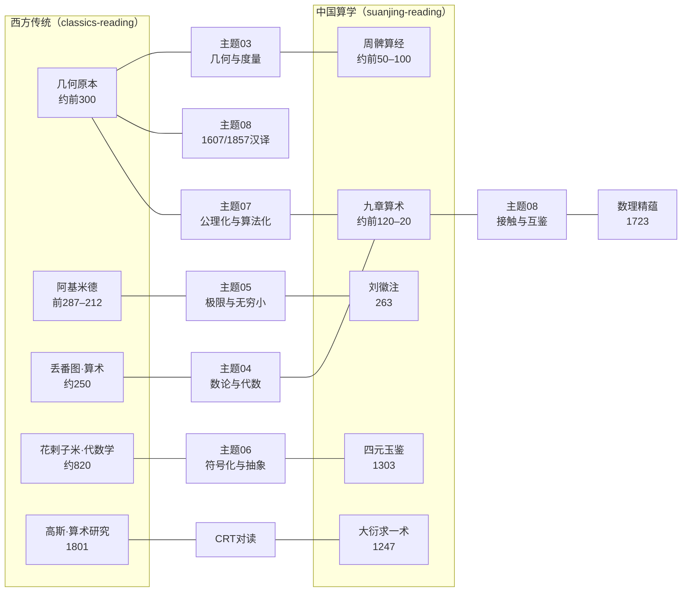

# 中西数学对读教程

本知识包是中西两大数学传统的**比较视角整合层**：中国算学传统（问题导向、算法化）与西方数学传统（公理化、演绎式）在哪些思想节点上平行抵达？哪些路径分歧？何时接触？怎样互鉴？读者如何利用中西对读加深理解？

本包不重复单传统解读——西方著作谱系见同分组 [国外数学经典阅读教程](../classics-reading/index.md)，中国算经谱系见 [中国算经阅读教程](../../../guoxue/suanxue/suanjing-reading/index.md)。所有外部链接均经实际检索验证（2026-09-01）。

## 快速导航

### [概念文档](concepts/index.md) — 9 篇核心概念

**对读方法论（00–02）**

- [为什么做中西数学对读](concepts/00-why-compare.md) — 比较视角的价值、Needham 问题、与既有两束的关系
- [比较阅读策略](concepts/01-comparative-reading-strategy.md) — 同题双源法、三层次比较法、避免时代错置
- [跨传统阅读路径](concepts/02-reading-path.md) — 几何线/代数线/极限线三条对读路线与书目搭配

**六大对读主题（03–08）**

- [几何与度量对读](concepts/03-geometry-measurement.md) — 《几何原本》公理演绎 vs 《周髀》《九章》实用测量
- [数论与代数对读](concepts/04-number-theory-algebra.md) — 丢番图不定方程 vs 《方程》章与大衍求一术
- [极限与无穷小对读](concepts/05-limits-infinity.md) — 阿基米德穷竭法 vs 刘徽割圆术
- [符号化与抽象对读](concepts/06-symbolization-abstraction.md) — 花剌子米修辞代数 vs 天元术四元术
- [公理化与算法化对读](concepts/07-axiomatic-algorithmic.md) — 两种范式的认识论差异与互补
- [接触与互鉴对读](concepts/08-contact-mutual-learning.md) — 《几何原本》汉译 258 年历程（1607–1865）

### [对读示范](examples/index.md) — 3 篇双源精读

- [勾股定理中西双源对读](examples/01-pythagorean-comparison.md) — 欧几里得 I.47 面积拼接 vs 赵爽弦图出入相补
- [线性方程组对读](examples/02-linear-systems-comparison.md) — 《九章·方程》遍乘直除 vs 高斯消元
- [圆周率对读](examples/03-pi-comparison.md) — 阿基米德夹逼 vs 刘徽割圆与祖冲之密率

### [信源参考](references/index.md) — 3 类信源登记

- [中西原文与译本联合信源](references/joint-sources.md) — 整合既有两束信源 + 比较研究专用入口
- [比较研究与数学史著作](references/comparative-studies.md) — Needham、Martzloff、Chemla、Libbrecht 等三级谱系
- [交叉引用](references/cross-references.md) — 库内两束对应索引、可视化/形式化/符号计算知识包

### 工作文档

- [事实清单](facts.md) — 43 条零推测事实（六类，含优先权争议并列）
- [架构洞察](insights.md) — 4 条核心洞察、六主题覆盖矩阵与 2 个可迁移比较阅读模式

## 快速开始

如果你已读过两束中至少一束：

1. 读[为什么做中西数学对读](concepts/00-why-compare.md)，建立比较视角的问题意识
2. 选一条兴趣线（几何/代数/极限）进入对应对读主题（03–05），按四层结构展开
3. 用[对读示范](examples/index.md)三篇学会"同题双源对读法"
4. 按[跨传统阅读路径](concepts/02-reading-path.md)制定自己的对读计划

如果你两束都未读过：

1. 先在两束中各读导论（[classics-reading 概念 00](../classics-reading/concepts/00-why-read-originals.md) 与 [suanjing-reading 概念 00](../../../guoxue/suanxue/suanjing-reading/concepts/00-why-read-suanjing.md)）
2. 回到本包概念 01–02 掌握比较方法与路线
3. 按[几何线路线](concepts/02-reading-path.md)先跑通一条完整对读循环

如果你关心方法论迁移：

1. 读[架构洞察](insights.md)中的两个可迁移模式（同题双源对读法、思想路径分岔图法）
2. 这两个模式可直接迁移到中西医学、中西哲学等对读场景

## 本知识包定位

| 维度 | classics-reading | suanjing-reading | 本包 |
|------|------------------|------------------|------|
| 传统 | 西方（希腊—欧洲） | 中国（先秦—明清） | 两大传统的比较 |
| 核心问题 | 西方经典怎么读 | 中国算经怎么读 | 两者如何对读、分歧何在、如何互鉴 |
| 组织方式 | 五时段经典谱系 | 三阶段算经体系 | 六大对读主题 |
| 内容重心 | 原文获取 + 思想解读 | 原文引录 + 算题解读 | 比较分析 + 双源示范 |

本包不替代两束的入门功能；对读以"链接 + 概括 + 差异聚焦"呈现，深入细节请进入对应源文档。

## 推荐学习路径

```
比较视角入门：
  概念00（为什么对读）→ 概念01（比较策略）→ 示例01（勾股双源对读）
  → 概念03/05/07（三大主题）→ 概念02（定制路线）

系统对读（约 6 个月）：
  概念00–02 → 概念03–08 逐主题（每主题配对读示范或既有束案例）
  → references/comparative-studies 按需深入 → insights 模式迁移

研究型读者：
  概念08（接触与互鉴）→ references/joint-sources 核对原典入口
  → Chemla《Les neuf chapitres》/ Needham SCC vol.3 → 覆盖矩阵查漏
```

## 对读主题地图



```{toctree}
:hidden:
:maxdepth: 7

concepts/index
examples/index
references/index
facts
insights
log
```
