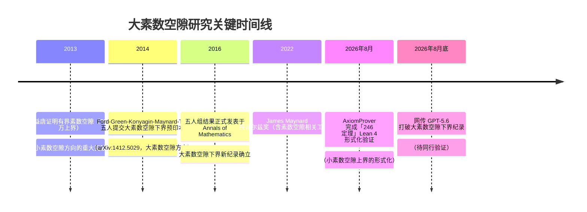

# GPT-5.6 大素数空隙突破

> **性质**：资讯速报 · 前沿动态追踪
> **资讯级别**：`flagged`——核心声称尚未经独立同行验证，仅供了解前沿动态
> **最后更新**：2026-09-05
> **下次复核**：2026-11-04（如有正式论文发表将提前更新）
> **完整事实登记**：见 [article-source.md](../references/article-source.md)（F-001 ~ F-030）
> **核验与勘误**：见 [verification.md](../references/verification.md)（含 3 条勘误）

---

## 一、事件概览（What / When / Who）

### 1.1 核心事件

2026 年 8 月底，社交媒体与科技媒体开始流传一则消息：OpenAI 的 GPT-5.6 模型在**一天之内**推导出了大素数空隙（Large Prime Gaps）问题的新下界，打破了由陶哲轩、James Maynard 等五位数学家保持多年的纪录 [[F-015]](../references/article-source.md#f-015) [[F-016]](../references/article-source.md#f-016)。

消息据称最早出现在 Reddit r/mathematics 社区，随后被中文科技媒体转载。**截至 2026 年 9 月 5 日，该结果尚未有 arXiv 预印本、无 OpenAI 官方公告、无独立同行验证** [[F-015]](../references/article-source.md#f-015)。

### 1.2 涉及人物

**GPT-5.6 团队相关**：
- Jared Duker Lichtman — 斯坦福大学 Szegő 数学助理教授，数论方向 [[F-001]](../references/article-source.md#f-001)

**前纪录保持者（五人组）**：
- 陶哲轩（Terence Tao）— 菲尔兹奖得主 [[F-002]](../references/article-source.md#f-002)
- James Maynard — 菲尔兹奖得主，解析数论专家 [[F-003]](../references/article-source.md#f-003)
- Kevin Ford — 数学家 [[F-007]](../references/article-source.md#f-007)
- Ben Green — 牛津大学数学教授 [[F-008]](../references/article-source.md#f-008)
- Sergei Konyagin — 数学家 [[F-007]](../references/article-source.md#f-007)

> **勘误提醒**：五人组的合作为独立学术论文，**非正式 Polymath 项目**编号下的工作。详见 [verification.md 勘误 1](../references/verification.md#勘误-1polymath-项目命名与年份偏差涉及-f-014f-025)。

### 1.3 时间线

> **勘误提醒**：小素数空隙（bounded gaps）与大素数空隙（large gaps）是素数分布研究中**两个不同方向**，不可混淆。详见 [verification.md 勘误 3](../references/verification.md#勘误-3小素数空隙与大素数空隙语境混淆)。

---

## 二、方法与原理（How / Why）

### 2.1 问题背景：什么是大素数空隙

素数是只能被 1 和自身整除的正整数 [[F-029]](../references/article-source.md#f-029)。随着数值增大，素数分布变得越来越稀疏——这是素数定理的直接推论 [[F-030]](../references/article-source.md#f-030)。

素数分布研究分为两个主要方向 [[F-026]](../references/article-source.md#f-026)：

| 方向 | 研究目标 | 典型问题 |
|------|---------|---------|
| **小素数空隙**（Bounded Gaps） | 证明存在无穷多对距离很近的素数 | 孪生素数猜想、张益唐 7000 万 → 246 上界 [[F-027]](../references/article-source.md#f-027) |
| **大素数空隙**（Large Gaps） | 寻找相邻素数之间的**最大间距**能有多大 | Erdős 第四问题、寻找增长下界 [[F-028]](../references/article-source.md#f-028) |

大素数空隙问题，即「Paul Erdős 第四问题」，是 Erdős 生前悬赏 1 万美元的著名数论问题之一 [[F-010]](../references/article-source.md#f-010) [[F-011]](../references/article-source.md#f-011)。它问的是：在不超过 x 的素数中，最大相邻空隙至少有多大？我们关心的是这个最大空隙的**下界**增长速度。

### 2.2 此前的纪录：五人组工作

2014 年，Kevin Ford、Ben Green、Sergei Konyagin、James Maynard 和陶哲轩五人合作，将大素数空隙的下界推进到一个新的量级 [[F-012]](../references/article-source.md#f-012)。该结果于 2016 年正式发表于《Annals of Mathematics》 [[F-013]](../references/article-source.md#f-013)。

**核心方法**：
- 使用**筛法**（Sieve Theory）结合 **Maynard 权重**技术 [[F-020]](../references/article-source.md#f-020)
- 运用**超图覆盖定理**（Hypergraph Covering）作为关键组合工具
- 下界公式中包含 log log log n（三重对数）因子

### 2.3 声称的新进展：倾斜剩余类

博文中声称，GPT-5.6 提出了一种名为**「倾斜剩余类」（Skewed Residue Classes）**的全新构造方法 [[F-018]](../references/article-source.md#f-018) [[F-019]](../references/article-source.md#f-019)。

据称新证明的要素包括 [[F-021]](../references/article-source.md#f-021)：
1. **倾斜构造**（即「倾斜剩余类」）— 一种新的素数空隙构造框架
2. **改良版 Maynard 权重** — 在传统权重基础上的改进
3. **超图覆盖理论** — 与五人组方法同样使用的组合工具

声称的改进幅度：**新结果比五人组结果省去了一个 log₃(n)（三重对数）因子** [[F-017]](../references/article-source.md#f-017)。在解析数论中，每改进一个对数因子都被视为实质性进展，因为对数函数增长极慢、优化难度极高。

> ⚠️ **待核实声明**：「倾斜剩余类」方法及上述改进幅度**仅为博文单源声称**，尚无独立数学文献或预印本确认 [[F-018]](../references/article-source.md#f-018) [[F-019]](../references/article-source.md#f-019)。

### 2.4 形式化验证

博文中还提到，GPT-5.6 的证明**当天**就通过了 Lean 语言的机器形式化验证 [[F-022]](../references/article-source.md#f-022) [[F-023]](../references/article-source.md#f-023)。

Lean 是由 Leonardo de Moura 等人开发的交互式定理证明器（Interactive Theorem Prover），可用于机器验证数学证明的正确性 [[F-024]](../references/article-source.md#f-024)。

作为参照，2026 年 8 月 17 日，Axiom Math 宣布其 AI 系统 AxiomProver 完成了「246 定理」（小素数空隙上界）的 Lean 4 形式化验证 [[F-006]](../references/article-source.md#f-006)。

> ⚠️ **勘误提醒**：关于 GPT-5.6 证明的形式化验证，经核查存在较大不确定性——erdosproblems.com 仅记录了**问题陈述**的形式化，而非**完整证明**的形式化。无公开代码仓库或独立验证报告。详见 [verification.md 勘误 2](../references/verification.md#勘误-2lean-形式化验证范围存疑涉及-f-022f-023)。

---

## 三、领域意义与趋势

### 3.1 对数学研究的潜在影响

如果 GPT-5.6 的结果最终得到同行验证，其意义将体现在以下几个层面：

1. **方法创新**：「倾斜剩余类」若确为全新构造，可能为大素数空隙乃至其他数论问题开辟新的研究路径
2. **AI 辅助数学的里程碑**：AI 不再仅仅是验证工具（如 Lean 形式化），而是能够独立提出新的证明策略和构造方法
3. **研究范式转变**：从「人类提出猜想 → 人类证明 → 机器验证」向「机器提出构造 → 人类消化理解 → 机器验证」演变

> **作者观点**：原文作者将此描述为「降维打击」「改写数学史」「人类的荣光」等，均为作者个人判断，不代表学术界共识。详见 [article-source.md 作者观点](../references/article-source.md#作者观点非事实仅供语境参考) 部分。

### 3.2 已知的不确定性

截至本资讯发布时（2026-09-05），以下关键信息缺失：

- ❌ **无 arXiv 预印本**：无法独立检验证明细节
- ❌ **无 OpenAI 官方公告**：不清楚 GPT-5.6 的确切能力边界
- ❌ **无独立同行验证**：结果未经过任何同行评审
- ❌ **无公开 Lean 代码**：形式化验证声称无法复核
- ❌ **方法名称无法确认**：「倾斜剩余类」在现有数学文献中检索不到

因此，本知识包将状态标记为 **`flagged`**——存在值得关注的声称，但事实层面尚未确立。

### 3.3 后续关注建议

建议从以下渠道关注后续进展：

| 渠道 | 关注什么 |
|------|---------|
| arXiv（math.NT 组） | 是否有正式预印本出现 |
| 陶哲轩博客 / What's new | 领域权威是否有评论 |
| Axiom Math 官方 | 形式化验证相关公告 |
| OpenAI 官方博客 | GPT-5.6 数学能力官方说明 |
| Annals of Mathematics / Inventiones Math. | 正式发表的论文 |

---

## 四、相关知识包

- **经典阅读**：[国外数学经典阅读教程](../classics-reading/index.md)（数论历史与经典著作谱系）
- **中西对读**：[中西数学对读教程](../east-west-dialogue/index.md)（比较视角）
- **勾股定理**：[勾股定理教程](../pythagorean-theorem/index.md)（另一个数论/几何经典主题）
