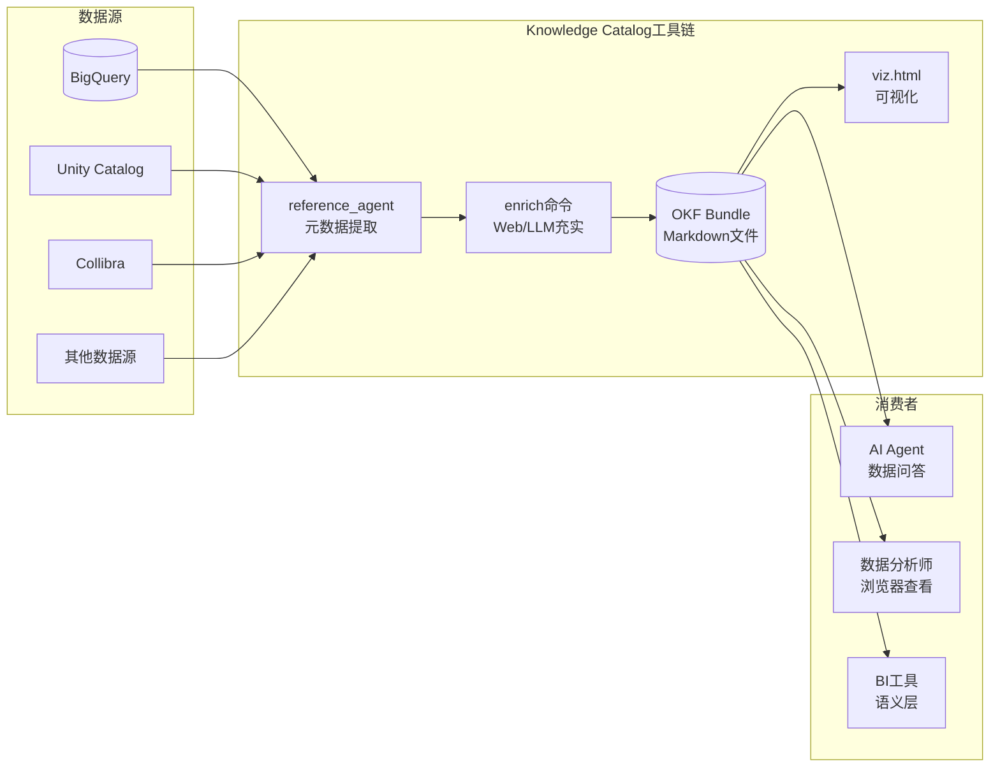
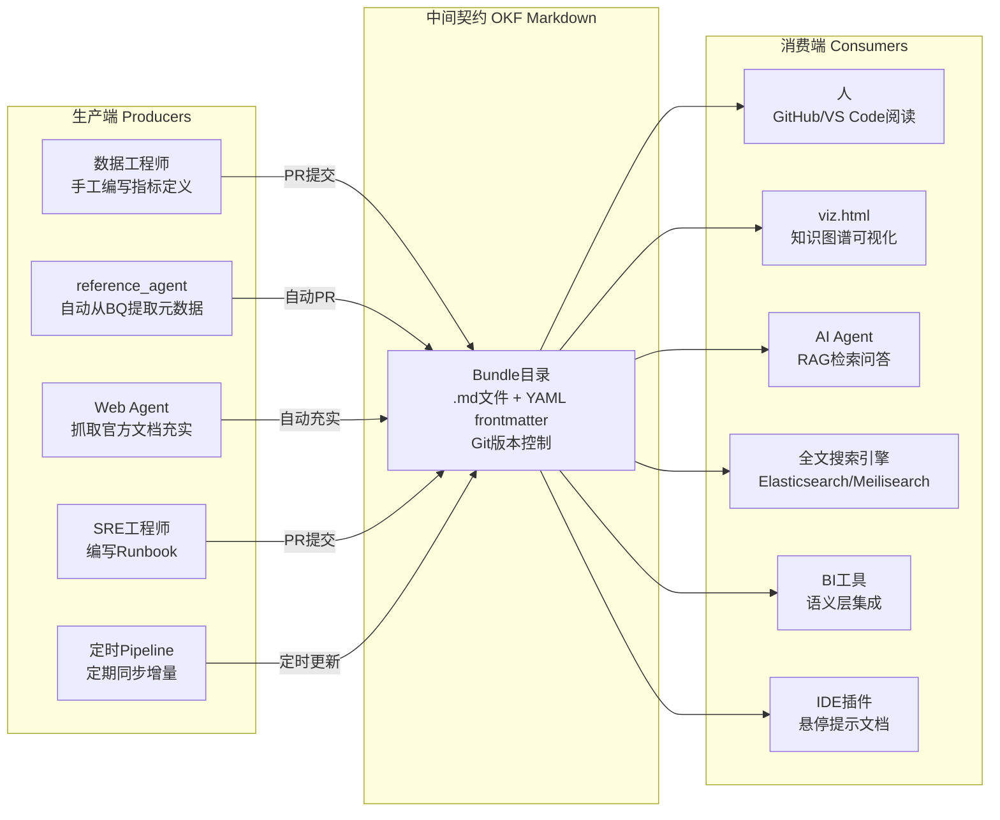
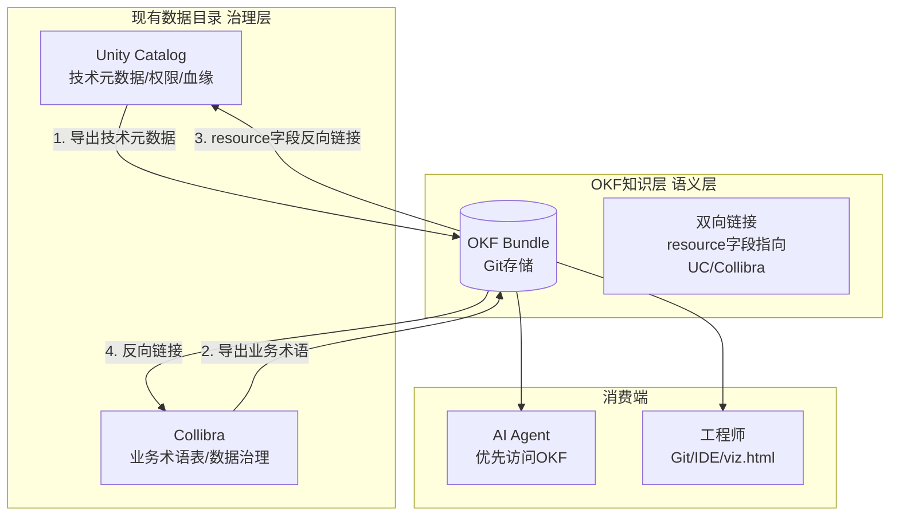
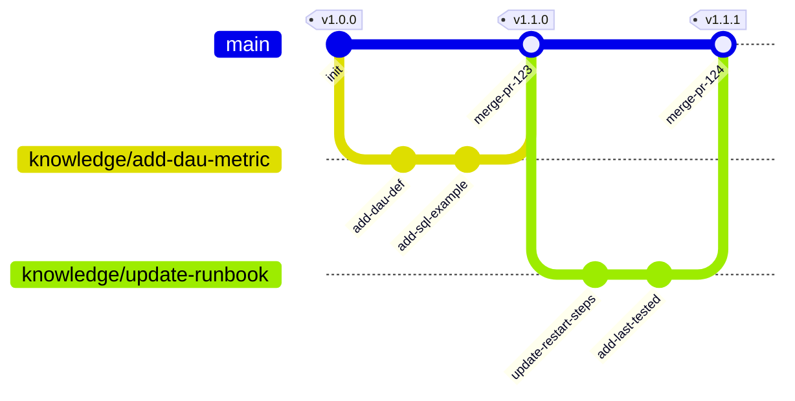
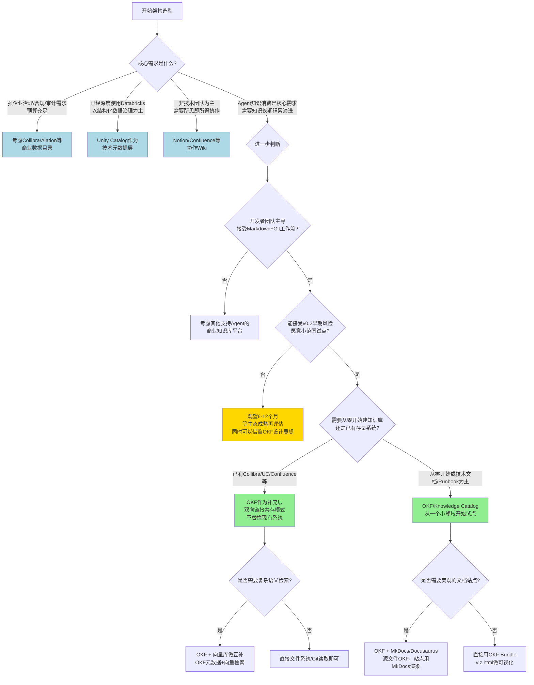

# 06 集成模式与最佳实践

> **本章定位说明**
> - 前五章分别介绍了Knowledge Catalog平台概述（[00 概述与知识地图](00-overview.md)）、核心概念与架构（[01 核心概念与平台架构](01-core-concepts.md)）、OKF规范（[02 OKF规范深度解析](02-okf-specification.md)）、参考Agent实现（[03 参考Agent实现原理与运行指南](03-reference-agent.md)）、工具链与可视化（[04 工具链与可视化系统](04-toolchain-and-visualization.md)）和示例Bundle深度解析（[05 示例Bundle深度解析](05-samples-and-bundles.md)）。
> - 本章聚焦**企业级集成模式与落地实践**——在掌握OKF基础用法后，如何将Knowledge Catalog真正融入企业现有技术栈和工作流，实现知识资产的可持续积累与演进。
> - 本章大量交叉引用OKF Wiki的使用模式（okf-wiki 03 使用模式与最佳实践）和架构集成（okf-wiki 05 架构定位与Agent集成），并结合Knowledge Catalog的工具能力进行深度展开。

---

## 6.1 企业落地四阶段路径

企业级知识管理平台的落地不能采用"大爆炸"式迁移，必须遵循渐进式路径。OKF Wiki在架构集成章节中提出了四阶段模型，本章结合Knowledge Catalog的工具能力进行细化。

### 6.1.1 阶段1：试点试水（2-4周）

**目标**：验证OKF理念可行性，建立团队认知，不追求完美。

**核心动作**：
- 选择一个**边界清晰、风险低、价值可见**的小领域作为试点：
  - 新上线微服务的API文档（替代零散的Confluence页面）
  - 一个内部工具的Agent使用说明
  - 一组核心业务指标的初步定义
- 新文档采用OKF格式编写，**不迁移任何旧文档**
- 使用[参考Agent](03-reference-agent.md)从一个小型BigQuery数据集自动生成第一个Bundle
- 打开[可视化工具](04-toolchain-and-visualization.md)查看生成的知识图谱，建立直观认知
- 参考[GA4示例Bundle](05-samples-and-bundles.md#52-bundle-1ga4---ga4电商数据集)的结构作为模板

**成功标志**：
- 团队3-5人理解OKF基本思想（Markdown+frontmatter、交叉链接、Bundle组织）
- 写出第一个合格的Bundle（至少包含Dataset/Table/Reference三种核心类型）
- 有人开始主动用OKF写新文档，而不是觉得是额外负担

**反模式警告**：
- ❌ 一开始就想覆盖所有业务域
- ❌ 试图迁移旧文档到OKF
- ❌ 设计复杂的扩展字段体系
- ❌ 要求所有人立即切换

### 6.1.2 阶段2：团队级推广（1-3个月）

**目标**：在选定业务域形成完整知识体系，Agent可提供基础问答能力。

**核心动作**：
- 选定一个完整业务域（如数据团队的指标字典、SRE团队的服务Runbook）
- 该业务域的**所有新文档**必须采用OKF格式
- 基于OKF扩展字段最佳实践，结合团队需求约定元数据规范：
  - 统一type命名约定（如`BigQuery Table`而非`table`或`bq-table`）
  - 确定必填扩展字段（owner、stale_after、verified等）
  - 制定tags分类规范
- 使用[参考Agent](03-reference-agent.md)定期（如每周）从数据源同步元数据
- 运行index自动生成脚本保持索引更新
- 参考[Stack Overflow示例Bundle](05-samples-and-bundles.md#53-bundle-2stackoverflow---stack-overflow公开数据集)学习多表关系的文档化

**成功标志**：
- 该业务域形成完整Bundle（至少20+个Concept文档）
- 知识图谱viz.html中节点形成有意义的连接网络
- 团队Agent可以回答该领域80%的常见问题（"XX表的Schema是什么？"、"YY指标怎么算？"）
- 有明确的知识Owner和更新机制

### 6.1.3 阶段3：企业级集成（3-6个月）

**目标**：OKF知识接入Agent RAG流程，与现有系统深度集成，建立质量保障机制。

**核心动作**：
- 将OKF知识检索正式接入生产Agent的RAG流程，Agent回答问题时**优先查询OKF知识**
- 利用`verified`、`confidence`、`stale_after`等元数据做可信度筛选（参考Agent消费流程）
- 实现与现有数据目录（Unity Catalog/Collibra等）的双向同步（详见[6.4节](#64-与现有数据目录集成模式)）
- 引入Attested Computation模式，对核心业务指标建立可信计算链（参考[Acme Retail示例](05-samples-and-bundles.md#55-bundle-4acme_retail---acme-retail企业级示例)）
- CI流水线集成OKF验证：frontmatter格式检查、断链检测、必填字段校验
- 参考[比特币区块链示例Bundle](05-samples-and-bundles.md#54-bundle-3crypto_bitcoin---比特币区块链数据集)学习复杂关系和性能信息的文档化

**成功标志**：
- Agent回答业务问题时幻觉率明显下降（建议量化对比）
- 核心指标采用Attested Computation，结果可审计、可验证
- 知识更新通过PR流程，有评审、有回滚、有历史
- 与现有数据目录形成互补而非替代关系

### 6.1.4 阶段4：生态化治理（6个月+）

**目标**：建立组织级知识治理体系，知识成为可复用的企业资产，跨团队共享。

**核心动作**：
- 建立知识审核流程（RACI）：谁可以写、谁审核、谁批准发布
- 建立定期验证机制：`stale_after`过期自动提醒Owner复核
- 设立type命名规范委员会，统一跨团队概念类型定义
- 建立跨Bundle引用机制：团队A可以引用团队B Bundle中的Concept
- 开发企业内部OKF工具链：自定义可视化模板、IDE插件、知识健康度仪表盘
- 探索知识生态：内部OKF市场、认证Bundle、知识贡献激励机制

**成功标志**：
- 知识质量持续提升，过期知识自动识别和更新
- 跨团队知识复用率可度量
- OKF成为企业知识表示的事实标准
- 新团队入职时直接复用已有知识Bundle，无需从零开始

---

## 6.2 三种典型集成场景

OKF Wiki在使用模式章节中定义了三种基础场景，本节结合Knowledge Catalog工具能力进行深化。

### 6.2.1 场景1：数据目录同步

**适用场景**：企业已有数据仓库/数据湖，需要将技术元数据和业务元数据统一管理，为Agent提供数据上下文。

**架构模式**：



**实施步骤**：

1. **初始批量加载**：
   - 配置参考Agent连接BigQuery（参考[03参考Agent运行指南](03-reference-agent.md)）
   - 运行`enrich --source bq --dataset <your-dataset>`生成初始Bundle
   - 这一步自动完成Dataset/Table级别的技术元数据文档化

2. **业务元数据充实**：
   - 准备`seeds.txt`种子URL列表，指向企业内部的数据字典、指标定义文档
   - 运行带Web抓取的enrich命令（`--web-seed-file`），让参考Agent自动补充业务背景
   - 人工编辑关键指标文档，添加业务定义、计算逻辑、示例SQL

3. **定期同步增量**：
   - 设置定时任务（如Cloud Scheduler + Cloud Functions）每日运行参考Agent
   - 参考Agent只更新有变化的表，提交到Git新分支
   - 数据Owner审核PR后合并到主分支

4. **关系文档化**：
   - 手工添加`references/joins/`目录，文档化核心表间连接路径（参考[Stack Overflow的joins设计](05-samples-and-bundles.md#533-核心概念文档解析)）
   - 区分对等关联（双下划线`__`）和主从包含（三下划线`___`）关系

**核心价值**：
- 技术元数据自动提取，减少人工维护成本
- 业务元数据通过交叉链接形成知识网络，而非孤立的表格描述
- Agent查询数据时自动获得完整上下文（表结构、字段含义、关联关系、常用查询模式）

### 6.2.2 场景2：Agent知识库构建

**适用场景**：为内部AI Agent构建可维护、可演进的工具、API、领域知识、操作规范知识库。

**目录结构推荐**：

```
agent-knowledge/
├── index.md                     # 知识总索引
├── log.md                       # 变更日志
├── tools/                       # 工具文档（对应MCP Server提供的工具）
│   ├── index.md
│   ├── jira/
│   │   ├── create-ticket.md
│   │   ├── update-ticket.md
│   │   └── search-tickets.md
│   ├── github/
│   │   ├── create-pr.md
│   │   └── merge-pr.md
│   └── bigquery/
│       └── run-query.md
├── concepts/                    # 领域概念
│   ├── index.md
│   ├── incident-severity.md     # 故障等级定义
│   ├── ticket-status.md         # 工单状态枚举
│   └── deployment-envs.md       # 部署环境说明
├── policies/                    # 政策与规范
│   ├── index.md
│   ├── data-access-policy.md    # 数据访问政策
│   └── code-review-policy.md    # 代码评审规范
└── playbooks/                   # 操作手册
    ├── index.md
    ├── deploy-production.md
    └── rollback-deployment.md
```

**关键集成要点**：

1. **与MCP层互补**（参考OKF vs MCP关系）：
   - MCP Server解决"Agent怎么调用工具"（连接问题）
   - OKF知识库解决"Agent怎么知道有什么工具、什么时候用、参数怎么填"（知识问题）
   - 最佳实践：每个MCP Server对应一个OKF Bundle，放在Server代码旁边

2. **与Skills层互补**：
   - Skills是可执行的工作流程序
   - OKF是Skills需要的领域知识（参数含义、边界情况、常见错误）
   - 最佳实践：Skill代码旁边放OKF文档说明适用场景和使用注意事项

3. **可信度分层**：
   - 对工具API文档设置`verified: true`，必须经过人工测试验证
   - 对操作步骤设置`last_tested`记录上次演练时间
   - 对领域概念设置`confidence: high/medium/low`标记可信度
   - Agent消费时优先使用`verified: true`且未过期的知识（参考Agent消费流程）

### 6.2.3 场景3：企业Runbook/Playbook管理

**适用场景**：SRE/运维/技术支持团队记录故障处理流程、应急响应手册、标准操作程序。相比Confluence，OKF纯文本特性天然适合版本控制、CI检查、Agent可执行。

**Playbook文档标准模板**：

```markdown
---
title: "支付服务紧急重启"
type: "Playbook"
owner: sre-oncall@company.com
severity: critical
last_tested: 2026-07-15
estimated_minutes: 10
stale_after: P90D
tags: ["payment", "restart", "incident-response"]
verified: true
---

# 支付服务紧急重启

## 适用场景
什么时候执行这个Playbook：
- 支付服务错误率 > 5% 持续 3 分钟
- 支付成功率 < 95%
- 监控告警触发 P1 级别

## 前置检查
1. 确认需要重启（查看Grafana面板：https://grafana.company.com/d/payment）
2. 在#incidents频道发送通知："正在重启支付服务，预计影响<1分钟"
3. 确认最近30分钟没有正在进行的部署

## 执行步骤
1. 切换生产集群上下文：`kubectl ctx prod-use1`
2. 执行滚动重启：`kubectl rollout restart deployment/payment-service`
3. 等待滚动完成：`kubectl rollout status deployment/payment-service`
4. 等待2分钟，观察错误率指标恢复正常
5. 在#incidents频道通知："支付服务重启完成，错误率已恢复"

## 验证步骤
- [ ] 支付成功率恢复到99.9%以上
- [ ] 没有新增5xx错误
- [ ] 日志中无异常堆栈
- [ ] 监控告警已自动恢复

## 回滚方案
如果重启后问题没有解决：
1. 执行回滚：`kubectl rollout undo deployment/payment-service`
2. 立即升级：电话联系SRE Lead（+86-xxx-xxxx-xxxx）
3. 在#incidents频道同步状态

## 相关资源
- [支付服务架构文档](payment-service-architecture.md)
- [数据库故障切换Playbook](db-failover.md)
- 故障升级流程
```

**管理最佳实践**：

1. **定期演练验证**：
   - 每个Playbook必须每季度至少演练一次
   - 演练后更新`last_tested`字段，记录演练结果
   - 演练发现问题直接提交PR修订文档

2. **Agent辅助执行**：
   - Agent遇到故障时自动检索对应的Playbook
   - Agent可以按照Playbook中的步骤提示SRE，甚至自动执行低风险步骤
   - Playbook中的`estimated_minutes`帮助SRE预估处理时间

3. **与告警系统集成**：
   - 告警规则中关联对应Playbook的路径
   - 告警触发时自动将Playbook链接发送到通知频道
   - Agent可以根据告警内容直接推荐合适的Playbook

---

## 6.3 知识生产消费解耦模式

OKF Wiki在架构集成章节中提出了生产者-消费者解耦架构，这是OKF最核心的设计优势之一。Knowledge Catalog的工具链完美支持这一模式。

### 6.3.1 解耦架构全景



### 6.3.2 解耦优势详解

1. **生产者独立演进**：
   - 今天让人写文档，明天可以换成reference_agent自动生成，消费端完全不受影响
   - 数据源从BigQuery换成Snowflake，只需要改生产者端的提取逻辑
   - 新增Web抓取充实能力，不破坏现有知识结构

2. **消费者多样共存**：
   - 同一个Bundle，人用GitHub看、Agent用RAG读、搜索引擎索引、可视化工具画图
   - 新增消费者不需要改生产端，只要能解析Markdown+frontmatter即可
   - 这就是[OKF规范](02-okf-specification.md)作为"厂商中立格式"的核心价值

3. **契约稳定**：
   - Markdown文件格式50年不变（相比专有数据目录的二进制/数据库格式）
   - Git作为存储后端，自带完整历史、版本、分支、回滚能力
   - 没有Vendor Lock-in，随时可以迁移到其他支持OKF的工具

### 6.3.3 生产端实现策略

| 生产者类型 | 适用场景 | 实现方式 | 频率 |
|-----------|---------|---------|------|
| reference_agent自动提取 | 技术元数据（表、字段、Schema） | `reference_agent enrich --source bq` | 每日定时 |
| Web Agent文档充实 | 官方文档、帮助中心内容 | `--web-seed-file`种子URL | 每周 |
| 人工编写评审 | 业务定义、政策、Playbook | Git + PR流程 | 持续 |
| Pipeline同步 | 从现有数据目录导出 | 自定义ETL脚本生成Markdown | 每日 |

---

## 6.4 与现有数据目录集成模式

很多企业已经部署了Unity Catalog、Collibra、Alation、DataHub等数据目录工具。OKF不是要替代它们，而是作为**上层知识编排层**互补共存。

### 6.4.1 定位差异与分工

| 维度 | 现有数据目录（Unity Catalog/Collibra等） | OKF/Knowledge Catalog |
|------|----------------------------------------|----------------------|
| **核心定位** | 技术元数据集中存储、访问控制、数据血缘 | 业务知识编排、Agent可消费语义层、跨系统知识连接 |
| **存储格式** | 专有数据库/内部格式 | 纯文本Markdown，Git版本控制 |
| **主要用户** | 数据治理团队、数据分析师 | AI Agent、工程师、知识工作者 |
| **知识粒度** | 表/字段/标签结构化元数据 | 从字段到业务政策的完整知识网络 |
| **可执行性** | 元数据描述，无执行能力 | 可包含Attested Computation、Playbook步骤，Agent可直接执行 |
| **变更流程** | 工具内UI操作 | Git PR代码评审流程 |
| **开放性** | 各厂商API不统一 | 开放规范，纯文本，无厂商锁定 |

### 6.4.2 推荐集成架构：双向同步互补模式



### 6.4.3 具体集成模式

**模式1：技术元数据单向同步（入门级）**

从现有数据目录定期导出技术元数据，生成OKF Bundle中的tables/部分：
- 优点：实施简单，不改动现有系统
- 缺点：单向同步，OKF中的业务注释不会写回
- 适用：阶段1-2试点阶段

```bash
# 示例：从Unity Catalog导出元数据生成OKF文档（伪代码逻辑）
# 1. 调用Unity Catalog API获取表列表
# 2. 为每个表生成tables/{table_name}.md
# 3. resource字段填写Unity Catalog UI链接
# 4. 自动提交PR
```

**模式2：双向链接跳转（进阶级）**

OKF文档中的`resource`字段指向现有数据目录的UI页面，同时在现有数据目录的"自定义描述"字段中放入OKF文档的Git链接：
- 优点：两个系统双向导航，用户可以选择习惯的工具
- 缺点：需要在数据目录中维护外部链接
- 适用：阶段2-3团队推广阶段

**模式3：业务知识回流（高级）**

OKF中人工编写的业务定义、指标说明、Attested Computation，定期同步回现有数据目录的描述字段：
- 优点：不强迫用户切换工具，数据目录中也能看到丰富的业务知识
- 缺点：需要写同步脚本，注意双向冲突解决
- 适用：阶段3企业级集成阶段

**模式4：OKF作为统一知识入口（生态级）**

Agent和工程师统一通过OKF访问知识，OKF通过resource链接跳转到各个底层系统（数据目录、BI工具、监控系统）：
- 优点：统一入口，知识网络连接所有系统
- 缺点：需要组织层面认可OKF作为知识标准
- 适用：阶段4生态化治理阶段

### 6.4.4 resource字段设计最佳实践

`resource`字段是连接OKF与外部系统的关键，推荐设计规范：

```yaml
---
# BigQuery表 - 直接链接到BigQuery控制台
resource: "https://console.cloud.google.com/bigquery?project=my-proj&d=sales&t=orders&page=table"

# Unity Catalog表 - 链接到UC UI
resource: "https://<databricks-workspace>/#unity-catalog/catalogs/main/schemas/sales/tables/orders"

# Collibra资产 - 链接到Collibra资产页面
resource: "https://<collibra-instance>/asset/12345678-1234-1234-1234-1234567890ab"

# Jira工单API - 链接到API文档 + 示例
resource: "https://developer.atlassian.com/cloud/jira/platform/rest/v3/api-group-issues/#api-rest-api-3-issue-post"
---
```

---

## 6.5 Git工作流集成

OKF纯文本Markdown的特性，让知识生产完全融入成熟的软件工程Git工作流。OKF Wiki在使用模式章节介绍了基础做法，本节结合Knowledge Catalog展开。

### 6.5.1 知识分支策略

采用类GitHub Flow的简化分支模型，适合知识协作：



**分支命名约定**：
- 新增知识：`knowledge/add-<concept-name>`（如`knowledge/add-dau-metric`）
- 更新知识：`knowledge/update-<concept-name>`（如`knowledge/update-payment-runbook`）
- 修复问题：`knowledge/fix-<issue>`（如`knowledge/fix-broken-links`）
- 自动生成：`automated/sync-<date>`（参考Agent自动提交用）

### 6.5.2 PR评审流程：像代码评审一样审知识

知识PR评审Checklist：

| 评审项 | 检查内容 |
|--------|---------|
| **准确性** | 事实描述是否正确？SQL示例可运行吗？命令正确吗？ |
| **完整性** | frontmatter必填字段都有吗？相关链接都加了吗？ |
| **格式规范** | type命名符合约定吗？tags分类正确吗？路径用相对链接吗？ |
| **链接有效性** | 所有交叉链接有效吗？没有断链？ |
| **新鲜度** | stale_after设置合理吗？如果是更新，last_tested更新了吗？ |
| **可信度** | 应该verified的内容有人工审核标记吗？ |

**评审角色建议**：
- 业务知识（指标定义、政策）：业务Owner评审
- 技术文档（API、Runbook）：技术负责人评审
- 自动生成内容：数据工程师评审，确认同步逻辑正确

### 6.5.3 版本管理与SemVer

OKF Bundle采用SemVer版本号（MAJOR.MINOR.PATCH）：

| 版本层级 | 变更类型 | 示例 | 消费端处理 |
|---------|---------|------|-----------|
| **MAJOR** | 不兼容变更 | 删除Concept、重命名type、改必填字段含义 | 全量重新索引，通知消费者 |
| **MINOR** | 向后兼容新增 | 新增Concept、新增可选字段、补充内容 | 增量索引新增内容 |
| **PATCH** | 小幅修复 | 错别字、链接修复、内容微调 | 静默更新即可 |

**版本记录位置**：根目录`log.md`（CHANGELOG格式），每次版本更新记录：
- 版本号和日期
- 变更类型（MAJOR/MINOR/PATCH）
- 变更摘要
- 贡献者
- 相关PR链接

### 6.5.4 CI/CD流水线集成

在CI流水线中加入OKF质量检查，建议的检查项：

```yaml
# 示例CI步骤（GitHub Actions伪代码）
steps:
  - name: Checkout
    uses: actions/checkout@v4
  
  - name: Validate YAML frontmatter
    run: python scripts/validate_frontmatter.py bundles/
    # 检查：必填字段存在、type命名合法、日期格式正确
  
  - name: Check broken links
    run: python scripts/check_links.py bundles/
    # 检查：所有相对链接指向的文件存在
  
  - name: Check stale knowledge
    run: python scripts/check_stale.py bundles/
    # 检查：stale_after过期的概念，发出警告
  
  - name: Generate index
    run: python scripts/generate_index.py bundles/
    # 自动更新index.md，如果有变化PR会失败
  
  - name: Generate visualization
    run: reference_agent visualize --bundle bundles/
    # 重新生成viz.html，确保可视化与内容同步
```

---

## 6.6 扩展字段设计最佳实践

OKF规范只定义了核心字段，鼓励按需扩展，但扩展字段设计需要遵循一定原则。OKF Wiki在使用模式章节给出了基础字段表，本节提供设计方法论。

### 6.6.1 扩展字段设计原则

**原则1：只加真正需要的字段（YAGNI）**
- ❌ 错误："这个字段可能有用，先加上"
- ✅ 正确："现在有一个具体消费者需要用这个字段做X决策，所以加"

**原则2：每个字段必须明确回答三个问题**
1. 谁写入这个字段？（人工/Agent/Pipeline）
2. 谁消费这个字段？（Agent/可视化/CI/人）
3. 消费方用这个字段做什么决策？
- 答不上来的字段不要加

**原则3：优先复用已有标准字段**
- OKF核心字段（title/type/description/tags/sources/verified等）能满足就不要加自定义字段
- 参考[Acme Retail示例](05-samples-and-bundles.md#55-bundle-4acme_retail---acme-retail企业级示例)中使用的标准字段（owner/stale_after/verified等）

### 6.6.2 企业级推荐扩展字段集

结合三种典型场景，推荐以下扩展字段：

| 字段名 | 类型 | 适用场景 | 谁写 | 谁消费 | 用途 |
|--------|------|---------|------|--------|------|
| `owner` | string/email | 所有场景 | 人工 | Agent/CI | 问题联系谁，过期提醒谁 |
| `stale_after` | ISO 8601 Duration | 所有场景 | 人工/Agent | CI/Agent | 知识过期提醒，Agent不信任过期知识 |
| `verified` | boolean | 工具/Playbook/指标 | 人工 | Agent | 高可信度筛选，verified=true才用于生产 |
| `last_tested` | date | Playbook/工具API | 人工 | Agent/人 | 确认文档经过实际测试 |
| `confidence` | enum(high/medium/low) | 自动生成内容 | Agent | Agent | 区分人工审核内容和LLM生成内容 |
| `severity` | enum(critical/high/medium/low) | Playbook/Incident | 人工 | Agent/人 | 故障响应优先级排序 |
| `estimated_minutes` | integer | Playbook | 人工 | 人/Agent | 预估执行时间 |
| `version` | SemVer | 指标/计算 | 人工/Agent | 消费者 | 版本兼容性判断 |
| `deprecated` | boolean | 所有场景 | 人工 | Agent/人 | 标记废弃概念 |
| `replaced_by` | relative path | 所有场景 | 人工 | Agent/人 | 废弃概念指向替代文档 |
| `permissions` | enum(public/internal/confidential) | 所有场景 | 人工 | Agent/搜索 | 访问权限控制 |
| `generated_by` | string | 自动生成内容 | Agent | 人 | 标记是哪个Agent/脚本生成的 |
| `generated_at` | datetime | 自动生成内容 | Agent | 人 | 生成时间，判断新鲜度 |

### 6.6.3 字段命名约定

- 用下划线命名（snake_case），不要用驼峰（camelCase）或连字符（kebab-case）
- 布尔类型字段用肯定语气：`verified`而不是`not_verified`，`deprecated`而不是`active`
- 时间字段统一后缀：`_at`（时间点）、`_after`（过期时间）、`_date`（日期）
- 枚举值统一用小写英文：`high`/`medium`/`low`，不要用`High`或`HIGH`

### 6.6.4 反模式：这些字段不要加

| 反模式字段 | 问题 | 替代方案 |
|-----------|------|---------|
| `created_by`/`created_at` | Git已经记录了 | 用`git log`/`git blame` |
| `updated_by`/`updated_at` | Git已经记录了 | 同上 |
| `views`/`rating` | 纯文本无法统计 | 用外部分析工具 |
| `id`手动指定 | 文件路径就是天然ID | 用相对路径作为概念标识 |
| 大量自定义枚举 | 过度设计 | 先用tags，等有明确消费需求再升格为字段 |

---

## 6.7 核心最佳实践清单

以下10条最佳实践浓缩了Knowledge Catalog/OKF企业落地的核心经验：

1. **渐进式落地，不要跳阶段**
   - 从试点开始，阶段1没做好不要推进到阶段2
   - 新文档用OKF，旧文档最后再考虑迁移
   - 参考：[6.1节企业落地四阶段路径](#61-企业落地四阶段路径)

2. **OKF是补充，不是替代**
   - 不要试图推翻现有数据目录
   - 与Unity Catalog/Collibra等共存互补，用resource字段双向链接
   - 参考：[6.4节与现有数据目录集成模式](#64-与现有数据目录集成模式)

3. **像管理代码一样管理知识**
   - 用Git分支、PR评审、CI检查、SemVer版本
   - 知识更新走PR，至少1人review，重要知识2人review
   - 参考：[6.5节Git工作流集成](#65-git工作流集成)

4. **生产者消费者解耦**
   - Markdown文件是稳定的中间契约
   - 生产者可以今天让人写、明天换Agent生成，消费者不受影响
   - 参考：[6.3节知识生产消费解耦模式](#63-知识生产消费解耦模式)

5. **扩展字段遵循YAGNI**
   - 只加有明确消费者和明确用途的字段
   - 优先复用标准字段，不要预加"可能有用"的字段
   - 参考：[6.6节扩展字段设计最佳实践](#66-扩展字段设计最佳实践)

6. **从reference_agent自动生成开始**
   - 先自动从BigQuery生成基础Bundle，再人工补充业务知识
   - 不要一开始就手工写所有文档
   - 参考：[03参考Agent实现原理](03-reference-agent.md)

7. **可信度分层管理**
   - 生产环境Agent只依赖`verified: true`且未过期的知识
   - 用confidence字段区分人工审核内容和自动生成内容
   - stale_after过期的知识明确标记，不要让Agent盲目信任
   - 参考：okf-wiki Agent消费流程

8. **重视可视化的认知价值**
   - 经常打开viz.html，用知识图谱建立全局视野
   - 图中稠密连接的节点是核心概念，稀疏孤立的节点可能需要补充链接
   - 参考：[04工具链与可视化系统](04-toolchain-and-visualization.md)

9. **Playbook要可执行可演练**
   - Runbook/Playbook中的命令必须可以直接复制粘贴执行
   - 每季度演练一次，更新last_tested字段
   - 演练发现问题直接提PR修订，不要等"以后再改"

10. **从Acme Retail学习企业级特性**
    - 核心业务指标一定要用Attested Computation模式
    - 建立policy→metric→computation→skill→attester完整信任链
    - 财务、合规、对外披露数据尤其需要
    - 参考：[05 Acme Retail企业级示例解析](05-samples-and-bundles.md#55-bundle-4acme_retail---acme-retail企业级示例)

---

## 6.8 本章小结与延伸阅读

### 6.8.1 关键要点总结

**企业落地路径**：
1. 四阶段渐进式：试点（2-4周）→团队级（1-3月）→企业级（3-6月）→生态化（6月+）
2. 不要跳阶段，不要一开始就迁移旧文档
3. 每个阶段都有明确的成功标志，达到后再进入下一阶段

**三种集成场景**：
1. **数据目录同步**：reference_agent自动提取+人工充实，与现有数据目录双向链接
2. **Agent知识库构建**：tools/concepts/policies/playbooks目录结构，与MCP/Skills互补
3. **Runbook/Playbook管理**：可执行、可演练、可版本控制，Agent辅助故障处理

**核心架构模式**：
1. 生产者-消费者解耦：Markdown作为稳定中间契约
2. 与现有数据目录互补共存，OKF作为上层知识编排层
3. 完全融入Git工作流，PR评审+CI检查+SemVer版本

### 6.8.2 交叉引用与延伸阅读

**OKF Wiki核心章节**：
- OKF三种基础使用场景：okf-wiki 03 使用模式与最佳实践
- OKF扩展字段基础：okf-wiki 03 Frontmatter扩展字段最佳实践
- OKF Git工作流基础：okf-wiki 03 与Git工作流结合
- OKF Agent四层架构：okf-wiki 05 Agent技术栈四层架构
- OKF生产消费解耦：okf-wiki 05 生产者-消费者解耦架构
- OKF企业落地四阶段：okf-wiki 05 企业落地四阶段路径
- Agent消费OKF流程：okf-wiki 05 Agent如何消费OKF Bundle

**Knowledge Catalog Wiki相关章节**：
- OKF规范type字段定义：[02 OKF开放知识格式规范深度解析](02-okf-specification.md)
- reference_agent使用指南：[03 参考Agent实现原理与运行指南](03-reference-agent.md)
- 可视化工具使用：[04 工具链与可视化系统](04-toolchain-and-visualization.md)
- 四个官方示例Bundle深度解析（特别是Acme Retail企业级示例）：[05 示例Bundle深度解析](05-samples-and-bundles.md)
- 架构决策与方案对比（选型参考）：[07 架构决策与方案对比](07-architecture-decisions.md)（下一章）

---

| 上一章 | 目录 | 下一章 |
|--------|------|--------|
| [05 示例Bundle深度解析](05-samples-and-bundles.md) | [README](README.md) | [07 架构决策与方案对比](07-architecture-decisions.md) |


---

# 07 架构决策与方案对比

> **本章定位说明**
> - 前六章分别介绍了平台概述（[00 概述与知识地图](00-overview.md)）、核心概念（[01 核心概念与平台架构](01-core-concepts.md)）、OKF规范（[02 OKF规范深度解析](02-okf-specification.md)）、参考Agent（[03 参考Agent实现原理与运行指南](03-reference-agent.md)）、工具链可视化（[04 工具链与可视化系统](04-toolchain-and-visualization.md)）、示例Bundle（[05 示例Bundle深度解析](05-samples-and-bundles.md)）和集成模式（[06 集成模式与最佳实践](06-integration-patterns.md)）。
> - 本章从**架构师/技术决策者**视角出发，客观分析OKF/Knowledge Catalog的局限性与风险，与主流替代方案做全面对比，提供选型决策框架和风险缓解建议。
> - 本章内容与okf-wiki 04 局限性与方案对比形成互补：OKF Wiki侧重OKF格式本身的对比，本章结合Knowledge Catalog完整工具链（参考Agent、可视化、示例Bundle等）做整体方案对比。

> ⚠️ **理性技术选型原则**：任何技术方案都有其适用边界和成熟度风险。本章不预设"Knowledge Catalog一定更好"的立场，而是提供客观的分析框架，帮助决策者基于自身场景、团队能力和风险承受能力做出理性选择。

---

## 7.1 OKF/Knowledge Catalog v0.2 已知局限性与风险

OKF Wiki在局限性章节已对OKF格式本身的早期风险做了说明，本节从完整平台（Knowledge Catalog工具链）角度做全面梳理。

### 7.1.1 版本成熟度风险

| 风险维度 | 具体情况 | 影响程度 |
|---------|---------|---------|
| **规范版本** | OKF v0.2 Draft，2026年6月首次发布，截至编写时仅2个月 | ⚠️ 高 |
| **规范变更风险** | v0.x阶段可能发生不兼容变更（字段重命名、type体系调整、Bundle结构变化） | ⚠️ 高 |
| **参考实现状态** | reference_agent是示例性质的代码，非生产级质量 | ⚠️ 中高 |
| **工具链完整性** | 只有基础的元数据提取和viz.html可视化，缺少企业级管理控制台 | ⚠️ 中 |
| **生产案例** | Google官方宣传为主，公开可查的大规模生产落地案例极少 | ⚠️ 中高 |
| **社区生态** | 社区规模小，第三方工具/适配器/插件几乎没有 | ⚠️ 中 |

**Google产品历史客观提示**：
Google有停止早期产品的历史先例（Google Reader、Inbox、Wave、Knol、Stadia等）。这不是预判Knowledge Catalog一定会被放弃，但这是技术选型必须考虑的风险因素。建议策略：小范围试点，保持可退出性，避免All-in重投入。

### 7.1.2 技术架构局限性

从Knowledge Catalog完整工具链角度，目前存在以下架构层面的局限：

1. **存储层缺失**
   - OKF本身只是文件格式规范，没有内置的存储/索引/查询服务
   - 你需要自行解决：全文检索、向量检索、权限控制、高并发访问
   - 参考Agent只负责生成Markdown，不提供运行时服务

2. **缺少企业级功能**
   - 无内置访问控制/权限模型（依赖文件系统/Git权限，无细粒度字段级/概念级权限）
   - 无实时协作编辑能力（纯文本Git工作流，不支持多人同时编辑）
   - 无审批工作流引擎（需要基于Git PR自行构建）
   - 无审计日志（除Git历史外，无专门的知识访问审计）
   - 无多语言规范支持（规范目前是英文为主，国际化/i18n方案缺失）

3. **二进制资源处理未明确**
   - 规范对图片、附件、二进制文件的处理方案没有明确规定
   - 参考Agent不处理非结构化文档（PDF、Word等）的二进制资源关联
   - 需要自行设计二进制资源的存储和引用方案

4. **查询与检索能力有限**
   - 本身只是文件，没有内置查询语言
   - viz.html只有基础的搜索过滤，不支持复杂查询（如"找所有owner是XX且verified=true的指标"）
   - 复杂检索需要额外集成Elasticsearch/Meilisearch或向量数据库

5. **参考Agent功能边界**
   - 目前只支持BigQuery作为数据源，Snowflake/Redshift/Databricks等需要自行扩展
   - Web Pass的网页抓取和充实功能比较基础，复杂的网页结构可能解析不准确
   - 增量同步逻辑简单，冲突处理策略需要自行完善
   - 没有内置的质量校验规则引擎，需要自行在CI中实现

### 7.1.3 组织与生态局限性

1. **学习曲线与团队接受度**
   - Markdown+YAML frontmatter对开发者友好，但对非技术团队（业务、产品、运营）门槛较高
   - Git工作流（分支、PR、评审）对非工程团队不友好
   - 需要内部推广和培训，建立团队认知

2. **知识治理框架缺失**
   - 规范不提供知识治理流程（RACI、审核机制、生命周期管理）
   - 需要企业自行建立治理流程和组织保障
   - type命名、tags分类、扩展字段等规范需要团队约定并执行

3. **与现有系统集成成本**
   - 与Unity Catalog/Collibra等现有数据目录的双向同步需要自行开发
   - 与企业SSO/权限系统集成需要自行实现
   - 与BI工具、监控系统、告警系统的集成需要定制开发

---

## 7.2 不适用场景（明确什么时候不该用）

基于上述局限性，以下场景**不建议**采用OKF/Knowledge Catalog：

| 场景类型 | 原因 | 推荐替代方案 |
|---------|------|-------------|
| **需要强一致、高并发、低延迟的在线知识服务** | OKF不是数据库，纯文件无法满足高并发低延迟要求 | 专门的知识图谱数据库、搜索引擎优化后的知识库 |
| **复杂的本体推理、语义推理场景** | OKF没有形式化语义和推理能力 | OWL/RDF知识图谱、专业语义网技术栈 |
| **非技术团队为主，需要所见即所得编辑** | Markdown+Git门槛高，没有WYSISYG编辑器 | Notion、Confluence、飞书文档 |
| **个人知识管理/笔记场景** | OKF的互操作性和Agent优势个人场景体现不出价值 | Obsidian、Logseq、Notion |
| **已经成熟运行的Notion/Confluence生态，无Agent集成需求** | 迁移成本高，收益不明显 | 继续用现有工具，保持观望 |
| **需要细粒度权限、复杂审批工作流、实时协作** | OKF原生不支持这些企业协作功能 | Confluence、SharePoint、专门的Wiki平台 |
| **二进制资源为主的知识库（媒体资产、设计文件）** | 规范对二进制资源处理缺失 | 专门的数字资产管理（DAM）系统 |
| **要求开箱即用、SLA保障、商业支持** | 目前是开源早期项目，无商业支持 | Collibra、Alation、Unity Catalog等商业产品 |
| **团队完全没有Git/工程能力** | Git工作流是基础前提，无法绕过 | 低代码/无代码知识管理平台 |

---

## 7.3 OKF/Knowledge Catalog vs 8种主流方案客观对比

本节采用统一对比框架，从8个维度对9种方案（含OKF/Knowledge Catalog）进行客观对比。对比框架参考okf-wiki 04局限性与方案对比，但覆盖更全面的企业级方案。

### 7.3.1 对比维度说明

- **成熟度**：产品/规范的稳定性、生产案例、社区生态
- **Agent友好度**：AI Agent无需定制适配器即可消费的程度
- **开放性**：数据格式开放、无厂商锁定、可导出迁移
- **企业级功能**：权限、审计、工作流、协作等企业特性
- **开发者体验**：Git友好、可集成CI/CD、可编程扩展
- **非技术用户体验**：所见即所得、易用性、学习曲线
- **数据目录能力**：技术元数据管理、血缘、数据治理特性
- **成本**：许可费用、基础设施成本、运维人力成本

---

### 7.3.2 方案1：传统RAG向量库（仅切块无元数据）

典型代表：LangChain + Pinecone/Weaviate/Chroma自建RAG，仅做文本分块嵌入，无结构化元数据。

| 维度 | 传统RAG向量库（仅切块） | OKF/Knowledge Catalog |
|------|------------------------|----------------------|
| **成熟度** | ✅ 成熟，大量生产案例 | ⚠️ v0.2早期，案例少 |
| **Agent友好度** | ⚠️ 只有向量相似度，无法区分可信度/来源/时效性，幻觉严重 | ✅ 有类型、可信度、来源、时效性元数据，Agent可验证答案 |
| **开放性** | ⚠️ 向量库格式各异，迁移有成本 | ✅ 纯Markdown，Git存储，零锁定 |
| **企业级功能** | ❌ 基本没有，需要全部自建 | ⚠️ 基础框架有，企业功能需要自建 |
| **开发者体验** | ⚠️ 嵌入流水线复杂，切块策略难调优 | ✅ Markdown+Git，开发者熟悉 |
| **非技术用户体验** | ❌ 完全是技术方案，非技术用户无法使用 | ❌ 需要Markdown，非技术用户门槛高 |
| **数据目录能力** | ❌ 完全没有，只有文本块 | ⚠️ 有框架，需要reference_agent或自行集成 |
| **成本** | 💰 向量库成本+开发成本+嵌入成本 | 💰 几乎零成本（纯文件+Git），人力成本在知识整理 |
| **核心优势** | 实现简单、语义检索效果立竿见影、支持任意文档 | 知识来源可追溯、可信度分层、类型系统支持路由、Git版本化、人和Agent共读 |
| **核心劣势** | 无元数据、无结构、幻觉问题严重、知识无法演进维护 | 需要前期结构化投入、早期阶段风险、查询需要额外构建 |
| **关系** | **互补而非竞争**。OKF不是替代向量检索，OKF提供元数据和结构层，向量库做检索层。最佳实践：OKF Markdown切块后存入向量库，检索时带回元数据做可信度过滤 | |
| **适用场景** | 快速原型、文档变化频繁不值得结构化、对准确率要求不高的场景 | 需要可信知识、来源追溯、结构化Agent消费、需要知识演进的团队场景 |

---

### 7.3.3 方案2：Notion/Obsidian等文档工具

典型代表：Notion（团队协作）、Obsidian（个人知识管理）。

| 维度 | Notion/Obsidian | OKF/Knowledge Catalog |
|------|-----------------|----------------------|
| **成熟度** | ✅ 非常成熟，海量用户 | ⚠️ v0.2早期 |
| **Agent友好度** | ❌ Notion API限流且功能有限；Obsidian无统一标准，每个Vault约定不同 | ✅ 开放规范，Agent无需定制适配器即可理解结构 |
| **开放性** | ❌ Notion平台锁定，导出困难；Obsidian本地文件但无统一互操作标准 | ✅ 纯Markdown开放格式，零锁定 |
| **企业级功能** | ✅ Notion有完善的权限、协作、分享；Obsidian企业功能弱 | ❌ 原生不支持，需要自建 |
| **开发者体验** | ❌ Notion API难用、Git无法diff、无法和代码同仓；Obsidian插件开发者体验尚可 | ✅ Git原生支持、可和代码同仓、PR评审、CI集成 |
| **非技术用户体验** | ✅ Notion所见即所得，体验优秀；Obsidian编辑体验好 | ❌ Markdown+frontmatter门槛高 |
| **数据目录能力** | ❌ 基本没有，需要自己建数据库模板 | ⚠️ 有框架，reference_agent可自动生成 |
| **成本** | 💰 Notion按人头收费，团队规模大了成本高；Obsidian个人免费商业付费 | 💰 零许可成本，纯人力成本 |
| **核心优势** | 编辑体验极佳、生态成熟、插件丰富、上手快 | 开放无锁定、Git-native、Agent友好、可执行知识（Playbook/Attested Computation） |
| **核心劣势** | Agent集成困难、平台锁定、Git不友好、知识无法被Agent可靠消费 | 编辑体验差、无实时协作、需要自建企业功能 |
| **适用场景** | 非技术团队为主、重视编辑体验、实时协作需求强、Agent需求弱或无 | 开发者优先、需要Agent集成、Git工作流、知识需要版本化演进、需要和代码同仓 |

**特别说明-Obsidian相似性**：OKF核心理念与Obsidian非常相似（本地Markdown+frontmatter+双向链接），核心区别在于OKF有最小互操作标准和统一类型系统，确保Agent跨Vault消费知识时的一致性。如果是个人使用，Obsidian足够好；如果是团队+Agent消费场景，OKF的标准化价值才体现出来。

---

### 7.3.4 方案3：Unity Catalog（Databricks）

典型代表：Databricks Unity Catalog，云原生数据目录与治理方案。

| 维度 | Unity Catalog | OKF/Knowledge Catalog |
|------|---------------|----------------------|
| **成熟度** | ✅ 商业产品，成熟稳定，大量生产案例 | ⚠️ v0.2早期开源项目 |
| **Agent友好度** | ⚠️ 有API但不是为Agent设计的，需要定制适配器 | ✅ 原生为Agent设计，格式自描述 |
| **开放性** | ❌ Databricks生态内开放，跨云/跨平台有限 | ✅ 完全开放，厂商中立，无生态绑定 |
| **企业级功能** | ✅ 非常完善：细粒度权限、审计、血缘、审批 | ❌ 原生不支持，需要自建 |
| **开发者体验** | ⚠️ SQL/API方式，Git集成弱，无法和代码同PR评审 | ✅ Markdown+Git，和代码同仓同工作流 |
| **非技术用户体验** | ✅ UI完善，数据分析师可用 | ❌ Markdown门槛高，主要面向开发者 |
| **数据目录能力** | ✅ 业界领先：技术元数据、血缘、访问控制、数据治理 | ⚠️ 框架层面，需要同步UC元数据补充业务知识 |
| **成本** | 💰💰 商业许可成本高，Databricks平台绑定 | 💰 零许可成本 |
| **核心优势** | 企业级治理能力完善、和Databricks生态深度集成、商业支持SLA | 业务知识层灵活、Agent友好、Git版本化、可包含Playbook/Attested Computation等执行型知识、可跨系统连接 |
| **核心劣势** | 锁定Databricks生态、成本高、主要面向结构化数据、业务知识表达能力弱、Agent消费需要定制 | 无原生权限/审计/治理、需要自行集成、无商业支持 |
| **关系** | **互补共存，定位不同**。UC是技术元数据治理层，OKF是业务知识编排与Agent消费层。最佳实践：UC管技术元数据+权限+血缘，OKF补充业务定义、Playbook、指标计算逻辑，双向链接（详见[06集成模式章节](06-integration-patterns.md#64-与现有数据目录集成模式)） | |
| **适用场景** | 已经深度使用Databricks、需要强数据治理与权限控制、以结构化数据为主、预算充足 | 需要Agent消费知识、需要跨系统连接知识、开发者团队主导、需要将知识和代码放在一起管理、预算有限 |

---

### 7.3.5 方案4：Collibra/Alation（企业级数据目录）

典型代表：Collibra、Alation，传统企业级数据治理与数据目录商业产品。

| 维度 | Collibra/Alation | OKF/Knowledge Catalog |
|------|-----------------|----------------------|
| **成熟度** | ✅ 业界领先的成熟商业产品，大量500强案例 | ⚠️ v0.2早期开源项目 |
| **Agent友好度** | ❌ 传统产品，API不是为Agent设计，定制适配器复杂 | ✅ 原生Agent友好 |
| **开放性** | ❌ 商业产品，数据锁定在专有数据库，导出困难 | ✅ 完全开放，纯Markdown |
| **企业级功能** | ✅ 极其完善：权限、审批、工作流、审计、数据血统、治理框架、RACI | ❌ 几乎没有，需要全部自建 |
| **开发者体验** | ❌ 企业软件风格，API笨重，Git集成差，定制开发成本高 | ✅ Markdown+Git，开发者友好，可编程扩展 |
| **非技术用户体验** | ✅ 企业级UI，业务用户可用（但学习曲线也不低） | ❌ 面向开发者，非技术用户门槛高 |
| **数据目录能力** | ✅ 业界顶级：业务术语表、数据血缘、数据质量、治理工作流、认证体系 | ⚠️ 框架层面，可作为补充层 |
| **成本** | 💰💰💰 非常昂贵，百万级/年起，按用户/资产收费 | 💰 零许可成本，纯人力成本 |
| **核心优势** | 企业级数据治理能力完整、商业支持SLA、行业最佳实践内置、适合合规要求高的大型企业 | 轻量、灵活、Agent原生、开放无锁定、Git工作流、低门槛起步、可包含执行型知识 |
| **核心劣势** | 极其昂贵、实施周期长（6-12个月）、笨重不灵活、Agent时代适应性弱、定制成本高、锁定风险 | 无企业级治理功能、需要自建、无商业支持、早期风险 |
| **关系** | **互补而非替代**。Collibra/Alation适合作为企业级数据治理的系统-of-record，OKF适合作为敏捷的上层知识编排与Agent消费层，两者通过resource字段双向链接（参考[06章集成模式](06-integration-patterns.md#642-推荐集成架构双向同步互补模式)） | |
| **适用场景** | 超大型企业、强合规要求（金融/医疗/政府）、预算充足、有专门的数据治理团队、已经采购或正在采购此类产品 | 敏捷团队、需要快速落地、Agent需求优先、开发者主导、预算有限、希望先试点再规模化 |

---

### 7.3.6 方案5：Confluence（企业Wiki）

典型代表：Atlassian Confluence，企业级Wiki与协作平台。

| 维度 | Confluence | OKF/Knowledge Catalog |
|------|------------|----------------------|
| **成熟度** | ✅ 非常成熟，企业Wiki事实标准 | ⚠️ v0.2早期 |
| **Agent友好度** | ❌ 页面结构不统一，宏/插件导致HTML结构复杂，Agent解析困难，API限流 | ✅ 结构统一，Markdown易解析，frontmatter元数据自描述 |
| **开放性** | ❌ 数据锁定在Confluence，导出为乱码，迁移困难 | ✅ 纯文件开放标准，零锁定 |
| **企业级功能** | ✅ 完善：空间权限、页面权限、审批插件、审计日志 | ❌ 原生无，需要自建 |
| **开发者体验** | ❌ 专有存储格式、Git无法diff/merge、无法和代码同PR评审、定制开发复杂 | ✅ Git-native，和代码同仓同工作流，PR评审，CI集成 |
| **非技术用户体验** | ✅ 所见即所得编辑器，企业用户熟悉 | ❌ Markdown+Git门槛高 |
| **数据目录能力** | ❌ 基本没有，需要自行用页面模板组织，无自动元数据提取 | ⚠️ 有框架，reference_agent可自动生成 |
| **成本** | 💰 按用户收费，中大规模团队成本不低 | 💰 零许可成本 |
| **核心优势** | 企业用户熟悉度高、编辑体验好、生态插件丰富、和Jira深度集成、协作能力强 | Git版本化、知识可演进、Agent友好、可执行Playbook、可和代码同仓、零锁定 |
| **核心劣势** | Agent无法可靠消费知识、知识结构混乱（每个人写法不同）、无法版本化管理、和代码割裂、无自动元数据同步 | 无实时协作、非技术用户门槛高、无内置权限审批 |
| **关系** | **可以共存/逐步迁移**。不建议一下子把Confluence全部迁走。推荐策略：新文档用OKF，Confluence作为历史归档和非技术团队协作平台，双向链接跳转；Playbook/技术文档/Agent知识优先用OKF | |
| **适用场景** | 非技术团队为主、企业通用Wiki、需要和Jira深度集成、重视协作编辑、Agent需求弱 | 技术文档、Runbook/Playbook、Agent知识库、需要和代码同仓管理、需要版本化演进、Agent消费场景 |

---

### 7.3.7 方案6：MkDocs/Docusaurus（静态文档站点）

典型代表：MkDocs（Material主题）、Docusaurus，开发者文档静态站点生成器。

| 维度 | MkDocs/Docusaurus | OKF/Knowledge Catalog |
|------|-------------------|----------------------|
| **成熟度** | ✅ 非常成熟，开源文档站点标准方案 | ⚠️ v0.2早期 |
| **Agent友好度** | ⚠️ 输出HTML，Agent可以爬但缺乏结构化元数据和类型系统 | ✅ 源文件就是带元数据的Markdown，Agent直接消费源文件 |
| **开放性** | ✅ Markdown源文件，开放 | ✅ 开放标准Markdown |
| **企业级功能** | ❌ 静态站点，基本没有企业功能 | ❌ 原生也没有 |
| **开发者体验** | ✅ Markdown+Git，开发者友好，CI/CD构建发布 | ✅ 同样Markdown+Git，源文件兼容，可以用MkDocs渲染OKF Bundle |
| **非技术用户体验** | ⚠️ 阅读体验好，但编写还是Markdown | ⚠️ 同样Markdown |
| **数据目录能力** | ❌ 只是文档站点，无数据目录能力 | ⚠️ 有框架，reference_agent可自动生成 |
| **成本** | 💰 免费开源，托管成本低 | 💰 免费 |
| **核心优势** | 站点渲染美观、搜索内置、主题成熟、阅读体验好、适合对外文档 | 有统一类型系统、元数据标准、Agent消费约定、知识图谱可视化、reference_agent自动生成 |
| **核心劣势** | 缺乏知识类型系统、元数据约定不统一、无Agent消费标准、无自动元数据提取、无知识图谱 | 本身不提供站点渲染（但可以用MkDocs来渲染OKF Bundle） |
| **关系** | **可以叠加使用**。OKF负责知识的结构化表示（类型、元数据、链接约定），MkDocs/Docusaurus负责渲染成美观的文档站点供人阅读。两者源文件都是Markdown，可以共存 | |
| **适用场景** | 对外产品文档、开发者文档站点、只需要人阅读不需要Agent深度消费的场景 | 需要Agent消费、需要知识图谱、需要类型化元数据、需要自动从数据源生成知识 |

---

### 7.3.8 方案7：dbt docs（数据文档自动生成）

典型代表：dbt docs，从dbt项目自动生成的数据模型文档站点。

| 维度 | dbt docs | OKF/Knowledge Catalog |
|------|----------|----------------------|
| **成熟度** | ✅ 成熟，dbt生态标准组件 | ⚠️ v0.2早期 |
| **Agent友好度** | ❌ 生成的是HTML站点，源文件是schema.yml，结构固定但缺乏业务知识扩展能力 | ✅ 开放格式，可扩展，Agent友好 |
| **开放性** | ✅ 基于dbt项目，开放 | ✅ 开放Markdown |
| **企业级功能** | ❌ 无，只是文档生成 | ❌ 原生无 |
| **开发者体验** | ✅ 和dbt紧密集成，自动生成，开发者体验好 | ✅ Markdown+Git，可通过脚本从dbt生成OKF文档 |
| **非技术用户体验** | ⚠️ 只适合数据团队使用 | ❌ 开发者导向 |
| **数据目录能力** | ⚠️ 仅覆盖dbt管理的数据模型，自动血缘不错，但范围有限 | ⚠️ 可覆盖更广范围，dbt模型只是其中一种Concept类型 |
| **成本** | 💰 dbt Core免费开源，Cloud付费 | 💰 免费 |
| **核心优势** | 零额外成本自动生成、和dbt管道无缝集成、自动血缘、字段级文档、数据团队熟悉 | 可描述非dbt资产、可扩展到业务知识/Playbook/Attested Computation、定制性强、Agent友好、跨系统知识连接 |
| **核心劣势** | 只覆盖dbt模型、无法描述非dbt资产、无法表达业务概念/指标/政策、定制性差、Agent消费需要定制解析 | 没有自动生成（需要写脚本从dbt同步）、需要维护元数据 |
| **关系** | **可以共存/互补**。dbt docs继续作为dbt模型的自动文档，OKF补充更广泛的业务知识、跨系统概念、Playbook、指标计算逻辑。可以写脚本从dbt schema.yml自动生成OKF的tables/部分，双向链接（参考okf-wiki对比章节） | |
| **适用场景** | 以dbt为核心的数据转换管道、只需要数据模型文档、数据团队内部使用 | 需要统一管理数据资产+业务知识+Agent知识库、需要跨系统知识连接、需要Playbook和可执行知识 |

---

### 7.3.9 方案8：其他Agent知识方案（如MemGPT、LlamaIndex文档）

典型代表：各Agent框架自带的知识库方案（MemGPT记忆管理、LlamaIndex/LangChain文档加载器、自定义Agent记忆模块）。

| 维度 | 其他Agent知识方案 | OKF/Knowledge Catalog |
|------|------------------|----------------------|
| **成熟度** | ⚠️ 各框架成熟度不一，大多是快速迭代中 | ⚠️ 同样早期，但有明确规范 |
| **Agent友好度** | ✅ 为Agent设计，但各框架格式不兼容，Vendor Lock-in | ✅ 为Agent设计，厂商中立开放标准 |
| **开放性** | ❌ 各框架自定义格式，绑定特定框架 | ✅ 开放Markdown标准，不绑定任何Agent框架 |
| **企业级功能** | ❌ 基本没有，都是技术组件 | ❌ 原生无 |
| **开发者体验** | ⚠️ 框架内体验好，但换框架成本高，和Git/CI集成弱 | ✅ Markdown+Git，任何框架都能消费，和现有工程工作流集成 |
| **非技术用户体验** | ❌ 纯技术组件，非技术用户无法参与 | ❌ 同样开发者导向 |
| **数据目录能力** | ❌ 没有，只是Agent的记忆/检索组件 | ⚠️ 有完整框架和工具链 |
| **成本** | 💰 免费开源，但集成和迁移成本高 | 💰 免费开源 |
| **核心优势** | 和特定Agent框架深度集成、功能专一、开箱即用 | 跨Agent框架互操作、人Agent共读、Git版本化、知识图谱可视化、reference_agent自动生成、不锁定框架 |
| **核心劣势** | 框架锁定、人无法方便阅读编辑、缺乏知识治理能力、无法和代码同工作流、无法跨团队共享 | 框架无关意味着需要自己做框架集成、工具链相比成熟框架还简单 |
| **关系** | **互补**。OKF是知识表示与存储层标准，不绑定具体Agent框架。你的Agent可以用LlamaIndex/LangChain做检索编排，但知识源用OKF格式存储，这样未来换Agent框架时知识资产不用迁移 | |
| **适用场景** | 快速原型验证、特定框架深度定制、不需要跨团队共享知识、不需要人参与编辑 | 需要知识资产长期积累、跨框架可迁移、人Agent共读、跨团队共享、需要版本化治理 |

---

## 7.4 选型决策树

基于上述对比分析，提供以下决策树帮助理性选型：



### 7.4.1 决策路径解读

**路径1：直接适合采用OKF/Knowledge Catalog（绿色节点）**
- 核心需求是Agent知识消费
- 开发者团队主导，接受Markdown+Git
- 能接受早期风险，愿意小范围试点
- 推荐：从边界清晰的小领域开始（如一个新服务的文档、一组Agent工具说明、一个数据团队的指标字典）

**路径2：OKF作为补充层共存（绿色节点）**
- 已有Collibra/Unity Catalog/Confluence等投资
- 不替换现有系统，OKF作为Agent友好的业务知识层
- 通过resource字段双向链接
- 这是绝大多数企业的推荐路径（详见[06章6.4节](06-integration-patterns.md#64-与现有数据目录集成模式)）

**路径3：观望等待（黄色节点）**
- 认可OKF方向，但担心早期风险
- 建议：先学习OKF设计思想（即使不用OKF，这些思想也能指导你的知识管理），等v1.0或有更多生产案例后再评估
- 可以在小的非关键项目中非正式试用，积累经验

**路径4：选择其他方案（蓝色节点）**
- 有明确的强需求（企业治理、Databricks生态、非技术协作），其他方案更匹配
- 这是理性选择，没有"万能方案"

---

## 7.5 风险评估与缓解建议

### 7.5.1 风险矩阵评估

| 风险类别 | 具体风险 | 发生概率 | 影响程度 | 风险等级 |
|---------|---------|---------|---------|---------|
| **规范风险** | v0.x阶段发生不兼容变更，导致已有Bundle需要迁移 | 高 | 中 | ⚠️ 中高 |
| **产品风险** | Google未来放弃Knowledge Catalog/OKF，停止投入 | 中 | 中 | ⚠️ 中 |
| **生态风险** | 生态发展缓慢，工具链长期不成熟 | 中高 | 中 | ⚠️ 中 |
| **技术风险** | 参考Agent功能不足，需要大量自行开发 | 高 | 低中 | ⚠️ 中 |
| **组织风险** | 团队不接受Markdown+Git工作流，推广失败 | 中 | 中高 | ⚠️ 中高 |
| **集成风险** | 与现有系统集成成本超预期 | 中 | 中 | ⚠️ 中 |
| **知识质量风险** | 缺乏治理导致知识质量低下、过期无人维护 | 高 | 中 | ⚠️ 中高 |
| **锁定风险** | 投入大量后发现不合适，迁移成本高 | 低 | 低 | ✅ 低（因为纯Markdown） |

### 7.5.2 核心风险缓解策略

#### 风险1：规范不兼容变更（中高风险）

**缓解措施**：
1. **锁版本**：在Bundle中明确标记`okf_version_target: "v0.2"`，不盲目追新版本
2. **抽象层**：在自己的代码中封装OKF解析逻辑，规范变更时只改一处
3. **关注变更**：Watch官方GitHub仓库，提前了解变更计划，不要盲目升级
4. **纯文本优势**：因为是Markdown，即使规范变更，知识内容本身不会丢失，只是调整frontmatter格式，迁移成本可控

#### 风险2：Google停止投入（中风险）

**缓解措施**：
1. **不All-in**：不要把所有知识都放在OKF上，先从非关键领域试点
2. **保持可退出性**：因为是纯Markdown+Git，即使OKF死了，你的知识还是你的，只是少了专门工具，损失有限
3. **避免依赖专有扩展**：尽量只用规范核心字段，不要过度依赖Google特定工具的专有功能
4. **社区参与**：如果认可方向，可以参与社区建设，降低单厂商依赖风险

#### 风险3：团队接受度低（中高风险）

**缓解措施**：
1. **从开发者团队开始**：先在SRE、数据工程、平台工程等Markdown/Git友好的团队推广，不要一开始就推给业务团队
2. **展示价值**：先做出一个成功案例（如Agent基于OKF知识回答问题准确率明显提升），用价值说服人
3. **降低门槛**：提供模板、示例、CLI工具、IDE插件，减少手工写frontmatter的成本
4. **不强制切换**：旧文档保留在Confluence，新文档用OKF，自然过渡，不搞"大迁移"

#### 风险4：知识质量低下（中高风险）

**缓解措施**：
1. **明确Owner**：每个Concept必须有owner字段，责任到人
2. **过期机制**：强制设置stale_after，CI检查过期知识并提醒
3. **可信度分层**：verified=true的知识才能进入生产Agent的RAG，其他仅供参考
4. **PR评审**：知识更新必须走PR，至少1人review，重要知识2人review
5. **定期演练**：Playbook每季度演练，验证可执行性
6. **健康度仪表盘**：定期统计知识覆盖率、过期率、verified比例，可视化质量状况

#### 风险5：集成成本超预期（中风险）

**缓解措施**：
1. **最小集成**：第一阶段只用OKF+Git+viz.html，不做任何系统集成，验证价值
2. **分阶段集成**：试点阶段→团队阶段→企业阶段，每个阶段集成必要的系统，不提前集成
3. **复用参考设计**：参考[06章集成模式](06-integration-patterns.md)中的架构，不要从零设计
4. **利用互补关系**：不替换现有系统，而是双向链接共存，减少集成范围

### 7.5.3 试点阶段风险控制Checklist

开始试点前，确认以下风险控制措施到位：

- [ ] 试点领域边界清晰、风险低、价值可见（不是核心业务系统）
- [ ] 试点团队3-5人，都是开发者或Git友好人员
- [ ] 明确试点成功标准和2-4周的时间盒
- [ ] 不迁移任何旧文档，只有新文档用OKF
- [ ] 锁OKF v0.2版本，不追求最新
- [ ] 不做复杂系统集成，只用基础功能
- [ ] 明确试点失败的退出条件和退出方案
- [ ] 团队理解这是早期技术试点，不保证未来不变
- [ ] 有专门的Owner负责试点推进
- [ ] 制定了知识质量基本规则（owner、stale_after、verified）

---

## 7.6 理性总结与行动建议

### 7.6.1 OKF/Knowledge Catalog核心价值再确认

在讲了这么多风险和对比之后，需要客观承认：OKF/Knowledge Catalog的**设计哲学方向是正确的**：
- 开放、厂商中立的知识表示格式（Markdown+frontmatter）
- Git-native，人和Agent共读共写
- 知识像代码一样版本化、可评审、可回滚
- 生产者-消费者解耦，稳定中间契约
- 类型系统+元数据让Agent能可靠消费知识

这些理念在AI Agent时代是有前瞻性的，即使你最终不采用OKF，这些设计思想也值得借鉴。

### 7.6.2 当前阶段（2026年8月）的理性策略

**最理性的策略是"战略上重视，战术上谨慎"**：

1. **不要全盘否定**：
   - 不要因为"v0.2"、"Google可能放弃"就完全无视
   - 学习其设计思想，理解为什么这样设计
   - 即使不用OKF，这些思想可以指导你构建自己的Agent知识体系

2. **不要All-in重投入**：
   - 不要上来就把整个公司知识库迁移到OKF
   - 不要一开始就做大量定制开发和系统集成
   - 不要强迫非技术团队立即切换

3. **小范围试点验证**：
   - 选一个边界清晰、风险低的小领域（如一个新服务的文档、一组Agent工具说明、SRE的Runbook）
   - 2-4周时间盒，验证核心价值：Agent是否真的能更好地消费知识？团队是否能接受工作流？
   - 试点成功再考虑扩大范围，失败了损失也很小

4. **互补共存，不搞替换**：
   - 已有Confluence/Collibra/Unity Catalog投资的，不要推倒重来
   - OKF作为补充层，专门面向Agent消费和技术知识场景
   - 通过resource字段双向链接，用户可以选择自己习惯的工具

5. **保持可退出性**：
   - 这是OKF最大的安全网：纯Markdown+Git，即使放弃OKF，知识资产完全保留
   - 不要过度依赖专有工具和扩展，保持知识本身的可移植性

### 7.6.3 下一步行动建议

根据你的角色，给出具体行动建议：

**如果你是架构师/技术决策者**：
1. 花1-2小时快速浏览整个Wiki，理解OKF的核心理念
2. 评估团队场景是否符合OKF适用范围
3. 如果符合，安排一个2-4周的小范围试点
4. 试点后基于实际效果再决策是否扩大

**如果你是AI Agent开发者**：
1. 直接从[00概述](00-overview.md)→[02OKF规范](02-okf-specification.md)→[03参考Agent](03-reference-agent.md)开始
2. 下载一个示例Bundle（如[GA4示例](05-samples-and-bundles.md)），跑起来看看效果
3. 用OKF格式写你自己的Agent工具文档，体验工作流
4. 对比一下纯向量RAG和加了OKF元数据后的效果差异

**如果你是数据工程师/数据治理专家**：
1. 重点阅读[06集成模式章节](06-integration-patterns.md)，理解OKF与现有数据目录的互补关系
2. 考虑用reference_agent从BigQuery生成一个数据集的OKF Bundle，体验自动生成
3. 评估双向链接模式是否适合你的组织

---

## 7.7 本章小结与延伸阅读

### 7.7.1 关键要点总结

**风险认知**：
1. OKF v0.2确实是早期版本，存在规范变更、生态不成熟、缺少企业功能等风险
2. Google产品历史风险需要考虑，但纯Markdown特性提供了天然的退出安全网
3. 风险是可控的，关键是不要All-in，小范围试点

**方案对比**：
1. OKF不是要替代所有方案，而是有明确的适用场景（开发者、Agent消费、Git工作流）
2. 与绝大多数现有方案（Unity Catalog、Collibra、Confluence、dbt docs等）是互补关系而非竞争
3. 传统纯向量RAG缺少元数据层，OKF+向量库是互补组合

**选型决策**：
1. 核心判断标准：是否需要Agent可靠消费知识？团队是否接受Markdown+Git？是否能接受早期风险？
2. 绝大多数企业推荐路径：现有系统保留，OKF作为补充层双向链接共存
3. 不要从零开始大建，从一个小领域试点开始

**风险缓解**：
1. 锁版本、不All-in、保持可退出性、明确Owner、PR评审、分阶段集成
2. 试点阶段必须有时间盒、明确成功/失败标准、退出方案

### 7.7.2 交叉引用与延伸阅读

**OKF Wiki核心章节**：
- OKF局限性基础分析：okf-wiki 04 局限性与方案对比（本章的基础，侧重OKF格式本身）
- OKF三种使用场景：okf-wiki 03 使用模式与最佳实践
- OKF企业落地路径：okf-wiki 05 企业落地四阶段路径
- Agent消费OKF流程：okf-wiki 05 Agent如何消费OKF Bundle

**Knowledge Catalog Wiki相关章节**：
- 集成模式与现有系统共存方案：[06 集成模式与最佳实践](06-integration-patterns.md)（特别是6.4节与现有数据目录集成）
- 四个官方示例Bundle学习企业级用法：[05 示例Bundle深度解析](05-samples-and-bundles.md)（特别是Acme Retail示例）
- 参考Agent运行指南快速体验：[03 参考Agent实现原理与运行指南](03-reference-agent.md)
- 核心概念回顾：[01 核心概念与平台架构](01-core-concepts.md)
- 资源与术语表：[08 资源与术语表](08-resources-and-glossary.md)（下一章）

---

| 上一章 | 目录 | 下一章 |
|--------|------|--------|
| [06 集成模式与最佳实践](06-integration-patterns.md) | [README](README.md) | [08 资源与术语表](08-resources-and-glossary.md) |


---

# 05 - 最佳实践与反模式

> 🔥 **本章重点**：5个必须避免的反模式、OKF编写检查清单、Agent集成模式、常见问题解答。

---

## 一、5个必须避免的反模式

### 反模式1：把OKF当Markdown文档用，不填frontmatter元数据

**表现**：只写Markdown正文，`type`字段缺失或随意填写，不填`tags`/`description`/信任元数据。

**后果**：
- Agent无法按类型过滤和路由
- 搜索索引质量差，无法精确检索
- 信任层级无法推导，Agent不敢使用这些知识
- `index.md`无法自动生成有意义的目录
- 可视化器中节点无法正确着色分类

**正确做法**：
- 每个概念文档必须至少填写`type`字段（这是唯一必填项）
- 推荐填写`title`/`description`/`tags`提升可发现性
- 生产环境必须填写`generated`/`verified`建立信任链
- 有时间敏感性的内容必须填写`stale_after`

### 反模式2：一个巨型Bundle包含所有内容，不做分层组织

**表现**：所有.md文件堆在Bundle根目录，没有子目录分组，没有index.md渐进式披露。

**后果**：
- Agent需要一次性加载整个Bundle到上下文，token消耗巨大
- 人类浏览困难，找不到相关概念
- 概念之间的隐式父子关系丢失
- Git diff不聚焦，PR审查困难

**正确做法**：
- 按领域/类型分子目录：`tables/`、`metrics/`、`computations/`、`references/`等
- 每个目录包含`index.md`支持渐进式披露
- 单个概念文件控制在合理大小（建议500-5000字符）
- 用`references/`子目录存放外部材料镜像

### 反模式3：信任元数据缺失或造假——所有内容都标human-reviewed

**表现**：
- 完全不填`generated`/`verified`，或
- 所有概念不管是谁生成的都标`verified: { by: human:someone }`，或
- `stale_after`不设置或设置到遥远的未来

**后果**：
- Agent无法区分人工审核的高信任内容和LLM生成的待验证内容
- 过时内容无法被自动识别和标记
- 信任分层机制形同虚设
- 认证计算(Attested Computation)的价值无法体现

**正确做法**：
- Agent生成的内容：`generated.by`填`<agent>/<version>`，不填`verified`或由process验证
- 人工审核后才添加`human:`验证者
- `stale_after`根据内容变化频率合理设置（业务政策季度审核、Schema变更按发布周期等）
- 认证计算必须配置`executor`和`attester`，让消费者可运行时验证

### 反模式4：认证计算(Attested Computation)不使用，关键指标无确定性验证

**表现**：
- 业务指标（收入、毛利、活跃用户数等）只用自然语言描述定义，不提供可验证的SQL/代码
- 提供了SQL但没有`attester`验证机制，Agent可以随意修改查询
- 把多个指标塞在一个概念文档里，每个指标无法独立认证和过时判断

**后果**：
- Agent生成SQL查询指标时可能产生幻觉，数字不一致
- 无法验证"这个数字是不是按官方定义算出来的"
- 一个指标定义变了，其他指标无法独立更新信任状态
- 财务/业务关键数据缺乏可审计性

**正确做法**：
- 每个关键业务指标（KPI）对应一个独立的`type: Attested Computation`概念
- 明确指定`runtime`（bigquery/dbt/python等）
- 声明`parameters`列表，Agent只能绑定参数值不能修改计算逻辑
- 配置`attester`（确定性无LLM代码），消费者可运行时验证
- 业务概念文档（如Metric）通过Markdown链接引用对应的认证计算

### 反模式5：链接随意写，断链和绝对路径泛滥

**表现**：
- 使用文件系统绝对路径链接（`/home/user/...`）
- 引用不检查目标是否存在，大量断链
- 全部用相对路径（`../../`），文件移动时链接大面积失效
- 外部URL不用`sources`字段记录，直接散落在正文中

**后果**：
- Bundle在不同机器/环境无法正常工作
- 知识图谱断边太多，可视化体验差
- 爬虫/Agent无法正确遍历和索引
- 来源可信度信号丢失

**正确做法**：
- **优先使用Bundle相对绝对路径**（以`/`开头），如`/tables/orders.md`，文件在子目录内移动时链接仍然稳定
- 外部权威来源放入`sources`frontmatter字段，用脚注ID引用
- 运行链接检查工具，Bundle发布前确保无断链
- 消费者必须容忍断链（断链不代表格式错误），但生产者应尽量避免

---

## 二、OKF编写检查清单

发布OKF Bundle前，对照以下清单检查：

### 基础合规（必填）
- [ ] 每个非保留`.md`文件有可解析的YAML frontmatter
- [ ] 每个frontmatter包含非空的`type`字段
- [ ] `index.md`/`log.md`等保留文件名遵循§8/§9格式
- [ ] 所有文件为UTF-8编码

### 推荐字段（强烈建议）
- [ ] `title`填写人类可读名称
- [ ] `description`填写单行摘要
- [ ] `tags`添加跨领域分类标签
- [ ] 物理资源（表/API/数据集）填写`resource` URI
- [ ] 每个目录有`index.md`支持渐进式披露

### 信任与生命周期（生产环境必填）
- [ ] `generated`填写生产者和时间
- [ ] 经人工审核的内容有`human:`验证者
- [ ] 有时间敏感性的内容设置合理的`stale_after`
- [ ] `status`明确标注draft/stable/deprecated
- [ ] 外部来源通过`sources`字段记录，包含可信度信号（author/usage_count/last_modified）

### 认证计算（涉及可计算指标时）
- [ ] 关键指标使用独立`type: Attested Computation`概念
- [ ] `runtime`明确指定执行环境
- [ ] `parameters`显式声明可绑定参数（name/type/required）
- [ ] `executor.resource`指向运行说明
- [ ] `executor.receipt`声明运行返回的证据字段
- [ ] `attester.resource`指向确定性验证代码
- [ ] 计算逻辑要么内联`# Computation`围栏，要么通过`computation`字段引用文件
- [ ] 业务概念通过Markdown链接引用认证计算，而非直接内联SQL

### 链接质量
- [ ] 内部链接优先使用Bundle根相对路径（`/path/to/concept.md`）
- [ ] 外部来源通过`sources`+脚注归属，不直接散落在正文
- [ ] 发布前运行断链检查

---

## 三、Agent集成模式

### 模式1：RAG检索增强（只读消费）

**场景**：你的Agent需要回答关于数据资产的问题，但不修改元数据。

**集成方式**：
1. 加载Bundle根目录的`index.md`进行高层导航
2. 根据用户问题按`type`/`tags`过滤候选概念
3. 渐进式加载相关概念的Markdown到上下文（先读description，需要时再读完整body）
4. 检查信任层级：优先返回`human-reviewed`内容，`unverified`内容给出警告
5. 检查`stale_after`：过时内容主动提醒用户
6. 涉及认证计算时，可选择运行executor获取实时数据，通过attester验证后再返回

**伪代码示例**：
```python
async def answer_with_okf(question: str, bundle_path: str):
    # 1. 加载索引
    index = load_index(f"{bundle_path}/index.md")
    
    # 2. 检索相关概念（按tags/type/关键词）
    candidates = search_concepts(index, question)
    
    # 3. 过滤并排序（信任层级优先）
    trusted = sorted(candidates, key=trust_tier_priority)
    
    # 4. 渐进式加载内容
    for concept in trusted[:3]:
        doc = load_concept(concept.path)
        if is_stale(doc):
            warn_stale(concept)
        context.append(doc)
    
    # 5. 生成答案（带信任标注）
    return generate_answer(question, context)
```

### 模式2：元数据丰富（生产端Agent）

**场景**：你的Agent扫描数据资产，自动生成/更新OKF文档。

**集成方式**：
1. 从数据源（BigQuery/数据库/API）拉取技术元数据
2. 生成初始OKF文档（`type`正确，`generated.by`标注你的Agent）
3. 从种子URL开始网页抓取，丰富业务上下文
4. 所有来源记录到`sources`字段
5. 新生成文档初始`status: draft`，`verified`留空
6. 生成/更新各目录`index.md`
7. 人工审核通过后，添加`human:`验证者并标记`status: stable`
8. 提交到Git走PR审查流程

**关键原则**：Agent生成的内容永远不要自己标`human-reviewed`。

### 模式3：元数据即代码双向同步（mdcode/kcmd）

**场景**：在CI/CD流水线中管理元数据，像管理代码一样管理元数据变更。

**典型流程**：
```bash
# 1. 初始化工作区
kcmd init --bigquery-dataset prod.ecommerce

# 2. 拉取最新元数据
kcmd pull

# 3. 创建分支做修改
git checkout -b add-orders-docs

# 4. 编辑YAML/Markdown文件
#    - 补充表描述
#    - 添加overview文档
#    - 更新标签

# 5. 本地检查
kcmd status
kcmd push --dry-run

# 6. 提交PR
git add catalog/
git commit -m "docs: add orders table documentation"
gh pr create

# 7. CI验证 + 人工审查后合并

# 8. CD阶段发布
kcmd push
```

### 模式4：MCP服务器集成（Agent工具调用）

**场景**：在支持MCP的AI编辑器/Agent（Gemini CLI、Trae等）中直接使用Knowledge Catalog工具。

配置示例（MCP settings）：
```json
{
  "mcpServers": {
    "kc-metadata": {
      "command": "kcmd",
      "args": ["mcp", "--path", "/path/to/catalog/root"]
    }
  }
}
```

Agent可调用工具：
- `pull`：同步最新元数据
- `list-entries`：浏览可用entries
- `lookup-entry`：查看具体entry元数据
- `modify-entry`：更新entry
- `push`：发布变更（通常需要人工确认）

---

## 四、OKF与其他知识表示格式对比

| 维度 | OKF | Markdown文件 | JSON-LD | 专有目录（Collibra/Alation） |
|------|-----|-------------|---------|--------------------------|
| 人类可读性 | ✅ 原生Markdown | ✅ | ❌ JSON语法 | ⚠️ Web UI |
| Agent可读性 | ✅ 结构化frontmatter | ❌ 无标准元数据 | ✅ | ⚠️ 专有API |
| 版本控制友好 | ✅ 纯文本diff友好 | ✅ | ⚠️ JSON行噪声 | ❌ 数据库存储 |
| 信任/来源 | ✅ 一等公民 | ❌ | ⚠️ 需扩展 | ⚠️ 部分支持 |
| 认证计算 | ✅ 原生支持 | ❌ | ❌ | ❌ |
| 厂商锁定 | ❌ 开放格式 | ❌ | ❌ | ✅ 强锁定 |
| 查询能力 | ⚠️ 需要外部索引 | ❌ | ✅ SPARQL | ✅ 内置搜索 |
| 工具生态 | ⚠️ 发展中 | ✅ 成熟 | ⚠️ 专业领域 | ✅ 完整但专有 |
| 学习曲线 | 🟢 低（Markdown+YAML） | 🟢 低 | 🔴 高（RDF/语义网） | 🟡 中 |

---

## 五、常见问题FAQ

### Q1: OKF和Obsidian/Notion等笔记工具是什么关系？
OKF是一种**格式规范**，Obsidian/Notion是**编辑/浏览工具**。OKF Bundle可以直接用Obsidian打开编辑（因为就是Markdown+YAML），也可以用MkDocs/Docusaurus等静态站点生成器渲染成文档网站。OKF不绑定特定工具。

### Q2: 必须用Reference Agent才能生成OKF吗？
不是。Reference Agent只是Google提供的**一个**参考实现（概念验证）。你可以：
- 人工手写OKF文档
- 写自己的导出脚本从现有目录/数据库导出
- 用任意Agent框架（LangChain、自定义等）生成
- 用kcmd从GCP Knowledge Catalog同步

OKF是开放格式，生产工具不限。

### Q3: Trust Tier是强制访问控制吗？
不是。信任层级是**建议性信号**，帮助消费者做判断，不是RBAC/ACL。`unverified`内容仍然可以被消费——Agent可以选择不信任、给出警告、或要求人工确认，但格式本身不拒绝访问。

### Q4: OKF与dbt/Looker等语义层工具有什么关系？
OKF不取代这些工具。OKF可以：
- 引用dbt模型作为`Attested Computation`的实现
- 记录Looker仪表板的来源和可信度
- 将语义层模型元数据导入为OKF概念
- 作为跨工具的统一元数据交换层

可以把OKF理解为"知识层面的OpenAPI"——不规定具体实现，提供标准化的接口描述。

### Q5: Attested Computation的attester必须在服务端运行吗？
不是。根据规范，attester是**消费者侧**运行的确定性代码——这是设计故意为之：
- 消费者拿到receipt（包含job_id、executed_sql、result）
- 消费者在自己的环境运行attester验证
- 不需要信任生产者的环境

这种设计类似密码学中的"验证无需信任"理念。

### Q6: 大型Bundle的性能问题怎么解决？
OKF设计了**渐进式披露**机制应对规模问题：
1. 根`index.md`只列顶级目录/概念
2. 子目录`index.md`只列该目录内容
3. Agent逐层导航，不需要一次性加载所有内容
4. 可以只加载frontmatter做初步过滤，需要时再加载完整body
5. 工具可以构建本地索引加速检索

---

## 六、术语速查表

| 术语 | 解释 |
|------|------|
| Bundle | 知识包，OKF分发单元，一个目录 |
| Concept | 概念，单个知识单元，对应一个.md文件 |
| Concept ID | 概念在Bundle内的路径（去.md后缀） |
| Frontmatter | 文件开头的YAML元数据块 |
| Aspect | Knowledge Catalog中的元数据方面（如overview、schema） |
| Entry | Knowledge Catalog中的元数据条目 |
| Trust Tier | 信任层级（unverified/machine-confirmed/human-reviewed） |
| Attested Computation | 认证计算，可验证的指标定义概念类型 |
| Executor | 执行器，运行计算并返回receipt |
| Attester | 认证器，确定性代码验证receipt有效性 |
| Receipt | 运行证据，包含job_id/executed_sql/result等 |
| kcmd | Knowledge Catalog CLI工具，mdcode的命令行界面 |
| ADK | Agent Development Kit，Google的Agent开发框架 |

---

## 🎓 恭喜完成学习！

你已经完成了Knowledge Catalog Wiki的全部内容。回顾一下：

1. **[00-overview.md](00-overview.md)**：理解了产品定位和"知识即代码"范式
2. **[01-okf-spec.md](01-okf-spec.md)**：掌握了OKF v0.2完整规范
3. **[02-reference-agent.md](02-reference-agent.md)**：了解了参考智能体和可视化器
4. **[03-metadata-as-code.md](03-metadata-as-code.md)**：学会了kcmd工具链和Git工作流
5. **[04-samples.md](04-samples.md)**：看到了Discovery/Enrichment Agent实战
6. **[05-best-practices.md](05-best-practices.md)**：知道了如何避坑

### 下一步建议

- 打开[okf/bundles/ga4/viz.html](file:///<local-workspace>vendor/knowledge-catalog/okf/bundles/ga4/viz.html)直接体验OKF可视化
- 阅读OKF规范原文：[vendor/knowledge-catalog/okf/SPEC.md](file:///<local-workspace>vendor/knowledge-catalog/okf/SPEC.md)
- 尝试用参考智能体为你自己的BigQuery数据集生成OKF bundle
- 探索toolbox/mdcode的TypeScript源码了解生产级实现

---

返回入口：[README.md](README.md)
