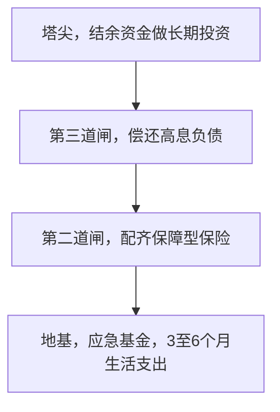

# 投资之前：理财优先级四道闸

## 是什么

很多人学习理财的第一反应是“买什么”，但格雷厄姆、博格等经典作者以及主流投教框架的共识恰恰相反：**在买任何投资品之前，有四件事必须先做完，而且顺序不能颠倒**（F-032）。它们像四道闸门，也像盖楼的地基——地基没打好，楼盖得越高，塌得越惨。

四道闸依次是：备应急基金 → 配保障型保险 → 偿还高息负债 → 结余资金做长期投资（F-032）。

为什么是这个顺序？因为投资解决的是“锦上添花”的问题，而前三道闸解决的是“一次意外就全盘皆输”的问题。下面逐道讲。

## 一、第一道闸：应急基金

**是什么**：一笔专门应对失业、疾病、突发支出的高流动性资金，标准是 **3–6 个月的家庭生活支出**（F-032）。收入不稳定者（自由职业、个体经营、单收入家庭）应往 6 个月甚至更高靠。

**为什么必须是高流动性**：应急钱的使命是“明天出事今天就能取出来”，所以它**不能**追求收益，不能放进有锁定期、会浮亏、想卖可能折价的资产。这是它和投资资金的本质区别——用途决定工具。

**放哪里**：活期存款、货币市场基金等高流动性工具。需要知道两点常识：货币基金净值通常稳定为 1 元、收益每日结转，但它**不承诺保本**，且监管规范后 T+0 快速赎回每户每日限额 1 万元（F-017）；存款则受存款保险制度保护（后续制度篇展开）。因此应急钱可以“存款为主、货基为辅”地分散放置，确保大额急用时有多条变现渠道。

**一个常见取巧想法要排除**：用信用卡额度或消费贷“当应急基金”。逻辑上不成立——信用额度恰恰最可能在你失业、生病（也就是最需要钱的时候）被降额或封卡，而且借来的钱要付利息、有还款期限。应急基金的本质是**自己的、无条件可取的钱**，不能用负债冒充。

## 二、第二道闸：保障型保险

**是什么**：用小额、确定的保费支出，转移大额、低概率但毁灭性的财务风险。主流框架建议普通家庭优先配置四类保障：**医疗保险、重大疾病保险、定期寿险、意外伤害保险**，原则是“先保障、后理财”（F-032）。

**消费型优先的逻辑**：保障型保险中，消费型产品（如定期寿险、百万医疗险的常见形态）保费低、杠杆高，几百到几千元保费对应几十万到上百万保额；而带储蓄、分红、万能账户的“理财型保险”把保障和投资捆绑在一起，保费中很大一部分变成储蓄和费用，保障杠杆被摊薄。对预算有限的普通家庭，**先用小钱把保额做足**，投资的事交给投资账户——两件事分开做，各自都更便宜、更透明。本篇不涉及任何具体产品（F-046）。

**四类保障的分工**（功能层面的通识，不涉及具体产品）：医疗险解决“大额医疗费报销”，杠杆极高、通常为一年期消费型；重疾险在确诊约定重病后一次性给付，主要用于弥补患病期间的收入中断与康复开支；定期寿险解决“经济支柱不在了，房贷、子女教育、父母赡养怎么办”；意外险以很小的保费覆盖意外身故与伤残。四者功能不同、不能互相替代，其中定期寿险对有负债、有被抚养人的家庭支柱最必要，没有家庭责任的年轻人优先级可以往后放。

## 三、第三道闸：偿还高息负债

**是什么**：信用卡分期、消费贷、网贷等年化利率达到两位数的负债，应当在投资之前优先偿还（F-032）。

**比较逻辑**：这是一道简单的算术——

- 还债的“收益”是**确定的**：**教学算例**（利率为假设）——一笔年化 15% 的消费贷，每还掉 1 万元，就确定地省下每年约 1500 元利息，零风险、免税。
- 投资的收益是**不确定的**：股票、基金长期期望收益更高，但任何一年都可能亏损（F-004），还要承担波动和费用。

用“可能赚 8%”的钱去还“确定亏 15%”的债，在数学上没有胜算。**高息负债就是普通人能找到的最好的“无风险投资”**。低息负债（如利率优惠的房贷）则不必急于提前偿还，可以与长期投资并行比较——这属于个体化决策，不在通识范围内展开。

## 四、第四道闸：风险测评，然后长期投资

三道闸过完，结余的、3 年以上不用的钱，才进入长期投资。投之前先做两件事：

**1. 生命周期定位**。有个经验法则：股票仓位 ≈ 100 − 年龄（也有 110、120 的版本）——越年轻，承受波动的期限越长，可以配置更多权益资产；临近退休则逐步降低权益比例（F-034）。注意它只是**粗略起点**，不是精确公式（F-034）。

**2. 风险测评，两个维度取低**（F-035）：

| 维度 | 含义 | 由什么决定 |
|------|------|-----------|
| 风险承受**能力**（客观） | 你输得起多少 | 年龄、收入稳定性、资产规模、投资期限 |
| 风险承受**意愿**（主观） | 你跌的时候慌不慌 | 账户浮亏 30% 时能否不恐慌割肉 |

规则是：**能力和意愿取低者**作为配置依据（F-035）。一个客观上能承受波动但主观上夜夜失眠的人，重仓股票只会在最低点割肉；反过来，意愿很强但钱明年就要用，也没有承担波动的资格。

## 五、一个流传极广的“象限图”：务必知道它的来历

中文互联网上广泛流传一张「标准普尔家庭资产象限图」：10% 要花的钱、20% 保命的钱、30% 生钱的钱、40% 保本升值的钱。需要明确告知：**标准普尔公司官方从未发布过这张图**，它应被视为经验性参考，而不是权威结论（F-033）。家庭配置必须按收入稳定性、年龄、负债情况、风险承受力个体化调整（F-033）——一个刚工作的单身年轻人和一个上有四老下有两小的中年人，套用同一张四宫格表，显然荒谬。本包讲“四道闸”的顺序逻辑，而不提供任何神奇比例。

## 怎么做：开工清单

1. **算账**：统计家庭月均刚性支出（房贷、房租、吃饭、育儿、保费），乘以 3–6，得出应急基金目标额。
2. **建池**：把应急基金放进活期存款与货币基金，与日常消费账户分开，贴上“非应急不动”的标签。
3. **盘点保单**：列出现有保单，区分“保障型”与“理财型”；核对家庭支柱的医疗、重疾、定寿、意外四类保障是否有缺口。
4. **列负债清单**：把每笔负债的年化利率（IRR，不是“月费率”“日息万分之几”的话术）算出来，年化两位数的优先偿还。
5. **做测评**：按 F-035 的两个维度给自己打分，取低者；再用“100 − 年龄”法则做粗略参照，两者综合出股债比例的起点。
6. **过闸再投**：四道闸全部完成后，结余资金才进入 [03 资产类别](03-asset-classes.md) 的工具选择与后续配置篇。

## 常见坑与边界

- **跳过地基直接投资**：没有应急基金，一旦失业或生病，只能在市场低点被迫卖出投资品变现——这是散户亏损最常见的结构性原因之一。
- **把保险当理财买**：“有病治病、没病返钱”的话术听着划算，实质是用高保费换低杠杆加低收益；保障和投资混在一起，两头都不透明。
- **被“月费率”迷惑**：信用卡分期常宣传“月费率 0.7%”之类（教学算例），由于还款本金逐月减少而费用照全额收取，真实年化利率往往接近名义月费率年化数字的两倍，比较和决策时一律换算成年化利率（IRR）再判断。
- **象限图当圣经**：标准普尔象限图来源不明（F-033），任何让你“照抄比例”的销售都要警惕；配置没有标准答案。
- **遇到“保本高收益”直接拉黑**：监管部门反复提示，承诺年化远超正规产品的“保本高收益”、拉人头返佣、无资质机构荐股代客理财、虚拟货币或原始股骗局，都是非法证券期货或非法集资的高发形态；正规机构和从业人员可在证监会、中国证券投资基金业协会官网查询资质（F-045）。**在你刚攒下第一笔本金、最想“钱生钱”的时候，也正是骗局最密集的时候。**

## 相关概念

- [00 为什么要投资：通胀、复利与时间](00-why-invest.md)：复利与通胀的基本算术。
- [02 风险与收益：分散化为什么是免费午餐](02-risk-return-math.md)：理解风险测评里“波动”到底指什么。
- [03 资产类别工具谱系](03-asset-classes.md)：过闸之后，各类工具各自的脾气。
- 事实出处与信源：[facts.md](../facts.md)。
