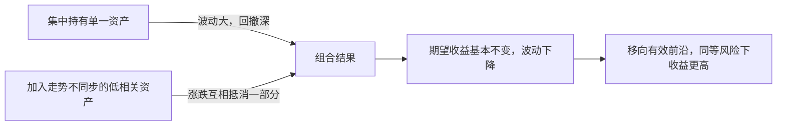

# 风险与收益：分散化为什么是免费午餐

## 是什么

[00 篇](00-why-invest.md) 给出了一条长期规律：现金、债券、股票的期望收益依次升高，波动也依次增大（F-004）。本篇回答两个紧接着的问题：**风险到底怎么度量？以及——既然风险与收益对称，凭什么说分散化是“免费午餐”？**

答案是：风险不只有“涨跌”一副面孔，而分散化降低的是组合的整体波动，却不需要你放弃期望收益。这不是鸡汤，是有数学证明、有诺贝尔奖背书的结论（F-007）。

## 一、风险怎么度量：波动率与最大回撤

日常说“风险大”，在投资里有两个常用量化口径：**波动率**（收益率围绕均值起伏的剧烈程度）和**最大回撤**（组合从历史最高点跌到后续最低点的最大跌幅）（F-005）。

回撤之所以可怕，在于回本所需的涨幅是非线性的——跌得越深，回本越难（F-005）。**教学算例**（由 1 ÷（1 − 跌幅）− 1 直接推导）：

| 从高点下跌 | 回本需要上涨 |
|-----------|-------------|
| 10% | 约 11.1% |
| 20% | 25% |
| 30% | 约 42.9% |
| 40% | 约 66.7% |
| **50%** | **100%** |

跌 50% 需要涨 100% 才能回到原值（F-005）；跌 90% 则需要涨 900%。这张表解释了两件事：为什么保守派极度看重“不犯大错”，以及为什么“浮亏拿住就能回本”的说法在深跌面前代价极其高昂。控制回撤，和追求收益同等重要。

波动率和最大回撤互相关联但并不相同：波动率刻画资产日常起伏的剧烈程度，最大回撤刻画最惨的时候你要吞下多大的窟窿。一只每天小涨小跌的资产波动率不低，但回撤可能不深；一只长期横盘后突然腰斩的资产，平时波动率不显眼，回撤却致命。对个人投资者来说，回撤往往比波动率更重要——你的人生目标（买房、教育、养老）都对应具体的用钱日期，一次深跌恰好和用钱时点撞车，就被迫把浮亏变成永久亏损，这就是“期限错配”的代价，也是 [01 篇](01-priority-before-investing.md) 反复强调“3 年以上不用的钱才投资”的数学根据。

## 二、风险不止一副面孔

只盯价格波动，会漏掉同样真实的其他风险（F-006）：

| 风险类型 | 含义 | 主要附着的资产 |
|---------|------|---------------|
| 通货膨胀风险 | 名义金额没少，购买力缩水 | 现金、存款（长期持有） |
| 信用风险 | 发行方还不上钱，违约 | 公司债等信用债 |
| 利率风险 | 市场利率上升时，存量债券价格下跌 | 债券（尤其长久期债券） |
| 流动性风险 | 想卖时卖不掉，或只能大幅折价卖 | 小众资产、封闭式产品、极端行情下的各类资产 |
| 汇率风险 | 外币资产换算回本币时的汇兑损失 | 境外资产、QDII 产品 |
| 价格波动风险 | 市场价格起伏导致浮亏 | 股票、基金等权益资产 |

这张表颠覆了两个常见错觉：**“存款最安全”只在名义金额意义上成立**——它把价格波动风险换成了通胀风险（F-003、F-006）；**“债券稳”也有前提**——国债信用风险最低，但债券价格与市场利率反向变动，加息周期里存量债券同样会跌（F-012）。没有零风险的资产，只有风险形态不同的资产。

## 三、分散化：金融中唯一的免费午餐

1952 年，哈里·马科维茨发表论文《Portfolio Selection》，开创现代投资组合理论（MPT）：用“均值—方差”刻画资产的收益与风险，证明通过搭配**走势不完全同步**的资产，可以在给定风险水平下最大化收益，这条最优组合的边界叫**有效前沿**。马科维茨因此与夏普、米勒共获 1990 年诺贝尔经济学奖，他本人称分散化是“金融中唯一的免费午餐”（F-007）。

背后的数学直觉不复杂：

- 单个资产同时贡献“期望收益”和“波动”；
- 当把两个涨跌节奏不同（低相关）的资产放在一起，它们的波动会**互相抵消一部分**（你跌的时候它在涨或不跌），组合整体波动下降；
- 但各资产的期望收益并不会因为搭配而消失，组合的期望收益是各资产期望收益的加权平均。

于是出现了“免费”的部分：**期望收益基本保留，波动却明显降低**（F-007）。

注意两个边界：其一，分散化降低的是“非系统性风险”（个别公司、个别行业的风险），整个市场一起涨跌的系统性风险无法靠分散消除；其二，分散不等于“买得越多越好”——买几十只高度同质的股票或一堆同风格基金，风险敞口仍然集中。真正的分散是**跨资产类别、跨市场、低相关**。

**分散化的三个层次**，普通人可以逐层落地：

1. **跨资产类别**：股、债、现金、黄金搭配，利用它们涨跌节奏的差异平滑组合（F-007）。这是影响最大的一层，也就是下一节要讲的资产配置。
2. **跨市场与地域**：通过 QDII 等工具把一部分资产放到境外市场（F-015），避免全部敞口押在单一国家、单一货币上。行为金融学把“过度配置本国、本公司资产”的倾向称为本土偏好，是常见偏差之一（F-029）。
3. **跨时间**：定期定额投资（美元成本平均法）——固定金额、固定间隔买入同一标的，价格高时买得份额少、价格低时买得份额多，长期摊薄持仓成本（F-010）。它不保证盈利或跑赢一次性投入，但降低了“全部买在单点高点”的择时风险（F-010），本质是用时间纪律做第三层分散。

## 四、“资产配置决定 90% 收益”？先把原文读对

中文理财圈流传一句话：“资产配置决定了投资组合 90% 以上的收益。”这话出自一篇著名论文，但转述是错的。

1986 年，Brinson、Hood、Beebower 在《金融分析师杂志》发表《Determinants of Portfolio Performance》，研究了 91 只大型养老金组合，发现：**资产配置政策（股、债、现金的比例安排）解释了组合收益随时间波动的约 93.6%**（F-008）。

注意原文度量的是“**收益波动**的解释比例”——你的组合今年涨明年跌、波动节奏有多少来自股债比例这个大框架；它**不是**说“选好股债比例就能决定你赚 90% 的钱”，更不意味着具体选了什么基金、什么时点买卖无关紧要（F-008）。这个误读流传极广，引用时务必说全：资产配置决定的是组合的**风险结构与波动来源**，收益高低仍取决于所选资产的长期回报与成本控制。

对普通人的实践含义依然扎实：与其把精力花在预测明年哪类资产涨、精选“明日之星”产品上，不如先把股、债、现金的大比例搭对——这是你能控制、且影响波动结构最大的决策。

## 怎么做：把数学变成动作

1. **先定股债现金大比例**：按 [01 篇](01-priority-before-investing.md) 的风险测评结果定大框架（生命周期法则仅作粗略起点，F-034），再谈具体产品。
2. **跨类别分散**：组合里同时有权益（股票/股票基金）、债券（债券基金/国债）、现金类（货基/存款），而不是全仓一类。
3. **检查相关性幻觉**：盘点你买的产品是否其实同涨同跌（多只互联网主题基金、本公司股票加本行业基金），同质化持仓要合并或置换。
4. **用回撤表做压力测试**：问自己“如果组合从高点跌 30%（回本需涨约 42.9%），我的工作、家庭、睡眠会不会出问题？”会出问题，就说明权益比例超出了你的风险承受意愿（F-035），现在就降，不要等跌了再割。
5. **建立再平衡纪律**：股债比例因涨跌偏离目标时，定期（如每年）或按阈值（如偏离 ±5 个百分点）卖出涨多的、买入跌多的，强制高卖低买并把风险拉回预设水平（F-009）。

## 常见坑与边界

- **把波动率当风险的全部**：存款“零波动”但有通胀风险，垃圾债“平时稳”但有信用风险，风险表要逐张核对（F-006）。
- **跌 10% 和跌 50% 当一回事**：回本涨幅非线性，深跌一次可能抹掉十年积累；仓位管理的核心是让最坏情况可承受（F-005）。
- **伪分散**：持有十几只基金但全是同一风格、同一行业、同一市场，等于没分散；分散看的是相关性，不是数量。
- **把 Brinson 结论当“配置万能论”**：93.6% 解释的是波动而非收益（F-008）；大比例搭对之后，费率、纪律、持有期限照样决定终值。
- **以为免费午餐等于稳赚**：分散化提高的是“风险调整后收益”，不消除市场整体下跌的系统性风险，也不保证任何组合不亏钱。

## 相关概念

- [00 为什么要投资：通胀、复利与时间](00-why-invest.md)：风险收益长期对称的起点。
- [01 投资之前：理财优先级四道闸](01-priority-before-investing.md)：风险测评与股债比例起点。
- [03 资产类别工具谱系](03-asset-classes.md)：各类资产的风险收益特征逐一对照。
- 事实出处与信源：[facts.md](../facts.md)。
