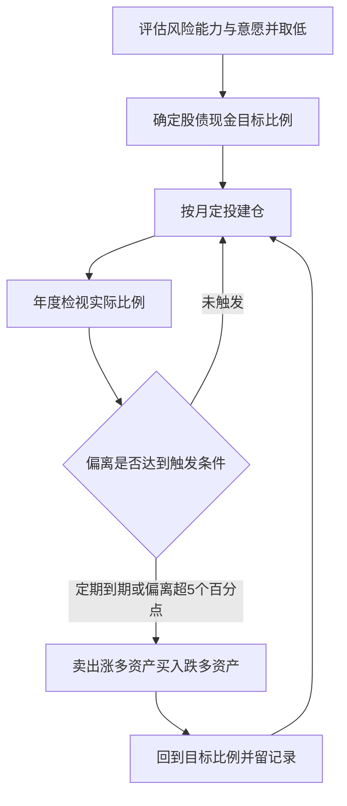

# 资产配置、定投与再平衡：把规律变成纪律

## 是什么

资产配置（asset allocation）是指决定投资组合中股票、债券、现金等大类资产各占多少比例的顶层决策。它回答的不是「买哪只」，而是「钱按什么结构放」。哈里·马科维茨 1952 年开创现代投资组合理论，用均值—方差方法刻画「在给定风险下最大化收益」的有效前沿，他与夏普、米勒共获 1990 年诺贝尔经济学奖；马科维茨把分散化称为「金融中唯一的免费午餐」（F-007）。

对普通投资者更具操作含义的是 Brinson、Hood、Beebower 1986 年对 91 只大型养老金组合的研究：资产配置政策（股、债、现金比例）解释了组合收益随时间波动的约 **93.6%**（F-008）。这一结论常被通俗转述为「资产配置决定 90% 以上收益」，但要注意：原论文度量的是**收益波动的解释比例**，而非收益高低的来源。选股、择时对某一年赚多赚少影响很大，但决定你组合长期风险水平和波动形态的，是股债比例本身。

### 大类资产各自的角色

配置比例之前，先认识三类基础资产的长期特征——这是各国资本市场长期数据反复呈现的经验规律：现金、债券、股票的长期期望收益依次升高，价格波动也依次增大（F-004）。

| 资产类别 | 长期特征 | 在组合中的角色 | 依据 |
|---|---|---|---|
| 现金及现金等价物 | 活期存款、货币基金、短期国债等；流动性最高、名义收益最低，长期主要风险是跑不赢通胀（存款「保本」但购买力会被通胀侵蚀） | 应急资金与波动缓冲垫 | F-011、F-003 |
| 债券 | 政府或企业的债务凭证，收益来自票息与价差；国债信用风险最低；债券价格与市场利率反向变动 | 组合稳定器，提供票息现金流 | F-012 |
| 股票 | 企业所有权凭证，收益来自分红与资本利得；长期期望收益最高、短期波动最大，个股可能退市归零 | 长期增长引擎 | F-013 |

配置的本质就是在这三类资产间取舍：要更高的长期期望收益，就必须接受更大的波动；要睡得安稳，就要放弃一部分长期增长。不存在「高收益、低波动、高流动性」三者兼得的资产，有人向你承诺三者兼得，对照 [07 中国市场实务](07-china-market-rules.md) 的防骗红线处理。

## 目标比例怎么定

### 生命周期经验法则：「100 − 年龄」

广泛流传的经验法则是「股票仓位 ≈ 100 − 年龄」（也有 110、120 的更激进版本）：越年轻，承受波动的投资期限越长，可以配置更多权益；临近退休则逐步降低权益比例（F-034）。

| 年龄（教学示例） | 按「100 − 年龄」的股票仓位 | 债券与现金 |
|---|---|---|
| 25 岁 | 约 75% | 约 25% |
| 35 岁 | 约 65% | 约 35% |
| 55 岁 | 约 45% | 约 55% |

这只是**粗略起点**，不是标准答案（F-034）。收入稳定性差、近期有大额支出、心理上扛不住回撤的人，都应当在此基础上下调股票比例。

### 能力与意愿取低

风险测评要看两个维度（F-035）：

- **风险承受能力**（客观）：年龄、收入、资产规模、投资期限。年轻人、收入稳定、钱 10 年不用，能力高。
- **风险承受意愿**（主观）：下跌 20% 时能不能不恐慌割肉、睡得着觉。

配置时**两者取低者**（F-035）：客观能力很高但主观上一跌就想清仓，就按低意愿配——因为执行不下去的方案等于没有方案。三类画像的具体配置演示见 [示例 01：三类风险画像配置方案](../examples/01-allocation-by-profile.md)。

## 定投：用纪律替代择时

定期定额投资（美元成本平均法，Dollar-Cost Averaging，DCA）指固定金额、固定间隔买入同一标的：价格高时买得份额少，价格低时买得份额多，长期摊薄持仓成本（F-010）。

**教学算例（数字为教学假设）**：每月投入 1000 元买同一只指数基金，连续三个月净值分别为 1.00 元、0.80 元、1.25 元。

| 月份 | 单位净值 | 投入金额 | 买入份额 |
|---|---|---|---|
| 第 1 月 | 1.00 元 | 1000 元 | 1000 份 |
| 第 2 月 | 0.80 元 | 1000 元 | 1250 份 |
| 第 3 月 | 1.25 元 | 1000 元 | 800 份 |
| 合计 | —— | 3000 元 | 3050 份 |

- 三期净值的算术平均价为（1.00 + 0.80 + 1.25）÷ 3 ≈ **1.017 元**；
- 定投的平均持仓成本为 3000 ÷ 3050 ≈ **0.984 元/份**，低于平均价——这就是「低买多、高买少」的摊薄效果；
- 若第 3 月末按 1.25 元赎回，市值为 3050 × 1.25 ≈ 3812.5 元。

**必须明确边界**（F-010）：定投**不保证盈利，也不保证跑赢一次性投入**。这个算例期末盈利，是因为净值恰好回到了高位；如果净值从 1.00 元一路跌到 0.60 元不再回来，定投同样亏损，只是亏得比一把梭少。定投的真正价值是**消除「买在单点高点」的择时风险**，并把「每月结余 → 自动买入」变成无需意志力的机械动作。

**教学反例（数字为教学假设）**：同样每月 1000 元，若三个月净值依次为 1.00 元、0.90 元、0.80 元且停在低位：

| 月份 | 单位净值 | 买入份额 |
|---|---|---|
| 第 1 月 | 1.00 元 | 1000 份 |
| 第 2 月 | 0.90 元 | 约 1111 份 |
| 第 3 月 | 0.80 元 | 1250 份 |
| 合计 | —— | 约 3361 份 |

平均成本 3000 ÷ 3361 ≈ 0.893 元/份，期末市值 3361 × 0.80 ≈ 2689 元——**仍亏损约 10%**；但若第一个月一把梭 3000 元（净值 1.00 元），同期亏损为 20%。定投在下跌中减亏、在上涨中少赚，本质是用一部分上涨弹性换取不押注单点。这也决定了定投标的应当是**长期向上的资产类别**（如宽基指数，F-013、F-016），而不是可能退市归零的单一个股。

## 再平衡：强制高卖低买的机制

再平衡（rebalancing）指：当股债比例因涨跌偏离目标时，定期或按阈值卖出涨多的资产、买入跌多的资产，使比例回到目标值（F-009）。

**教学算例（数字为教学假设）**：目标比例为股票 50%、债券 50%，初始 100 万元（股 50 万、债 50 万）。一年后股票上涨 30%、债券持平：

- 股票市值 65 万、债券 50 万，合计 115 万；
- 股票实际占比 65 ÷ 115 ≈ **56.5%**，偏离目标 6.5 个百分点；
- 若采用「偏离 ±5 个百分点」阈值触发，则卖出 7.5 万元股票、买入 7.5 万元债券，回到各 57.5 万的 50:50。

两种常见触发方式（F-009）：

- **定期再平衡**：如每年固定一次（可与生日、年终结算绑定），简单、不易被情绪干扰；
- **阈值再平衡**：任一资产偏离目标 ±5 个百分点即触发，纪律更精细。

再平衡的机制意义有两层：一是**强制「高卖低买」**——涨多的资产恰好被卖、跌多的资产恰好被买，与人的追涨杀跌本能相反；二是**控制组合风险水平**——股票大涨后若不处理，组合波动会悄悄超出你当初的承受力。

实操中有一个省成本技巧：定投者每月都有新增资金，再平衡时**优先用新增定投资金补低配资产**，尽量减少赎回超配资产带来的申赎费与交易成本（费用结构见 F-044）；新增资金不足以纠偏时，再赎回调整。

## 配置执行流程

## 怎么做：配置纪律动作清单

1. **先完成理财前置项**：应急基金（3–6 个月支出）、保障型保险、高息负债偿还都安排好之后，结余资金才进入长期投资（F-032）。
2. **定目标比例**：以「100 − 年龄」为起点（F-034），按收入稳定性和主观承受力下调，写下股、债、现金三个目标数字。
3. **选工具类别**：各资产类别用低门槛、低费率的基金工具实现（货币基金、债券基金、宽基指数基金等类别选择见 [05 指数基金与有效市场](05-index-funds-emh.md)）。
4. **自动定投**：每月工资日后固定日期自动扣款，金额固定、不因行情中断（F-010）。
5. **年度检视 + 阈值监控**：每年固定时间检视一次实际比例；任一资产偏离目标 ±5 个百分点即再平衡（F-009）。
6. **生命周期内逐年调档**：随年龄增长逐步下调权益目标，不必追求精确，每 5–10 年明显调一档即可。

## 常见坑与边界

- **把 93.6% 误读为「配置好就能赚 90% 的收益」**：F-008 解释的是收益**波动**的来源，不是收益保证；配置决定风险结构，不决定某年回报。
- **把经验法则当定律**：「100 − 年龄」只是起点（F-034），忽视收入稳定性、负债和心理承受力机械套用，下跌时必然执行不下去。
- **以为定投稳赚不赔**：定投降低择时风险但不保证盈利（F-010）；在长期单边下跌的标的上越投越亏，前提是选长期向上的资产类别（如宽基指数）而非单一个股。
- **再平衡过于频繁**：再平衡有交易成本与税费（见 [07 中国市场实务](07-china-market-rules.md)），每月操作既无必要又侵蚀收益，年度或阈值触发即可。
- **只测能力不测意愿**：问卷评分高但下跌时失眠想清仓，说明意愿才是短板（F-035），按取低原则配，能睡着觉的组合才是好组合。

## 相关概念

- [05 指数基金与有效市场](05-index-funds-emh.md)：配置中权益部分用什么工具落地。
- [06 行为金融：你自己是最大的对手](06-behavioral-discipline.md)：定投与再平衡为什么必须机械化执行。
- [示例 01：三类风险画像配置方案](../examples/01-allocation-by-profile.md)：保守、稳健、积极三档教学算例。
- 事实依据与信源：[facts.md](../facts.md)（F-007~F-010、F-034、F-035）、[经典与权威信源](../references/01-classics-and-authorities.md)。
