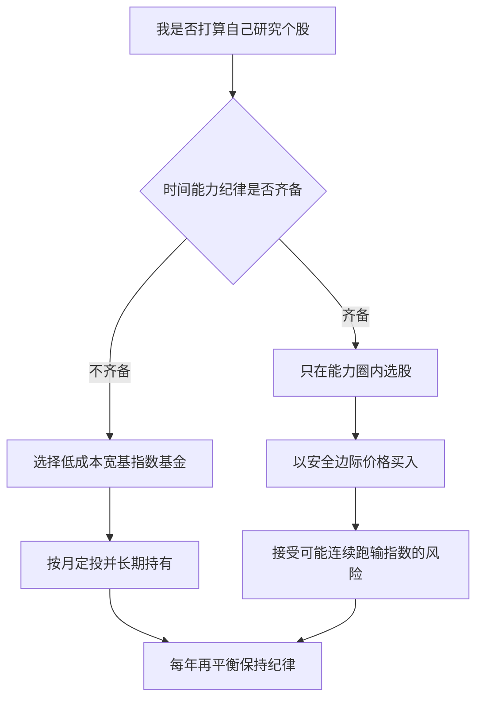

# 指数基金与有效市场：为什么多数人该选被动投资

## 是什么

被动投资是指不试图挑选个股、不预测买卖时点，而是通过持有指数基金获取整个市场（或某一大类资产）的平均收益；主动投资则依赖基金经理或个人选股、择时，试图跑赢市场平均。两者的争论不是「信仰之争」，而是有半个多世纪的理论与数据可查。对普通投资者，结论相当一致：**多数人、多数资金、用被动方式参与市场，是胜率最高的选择**（F-022、F-025）。

## 有效市场假说：是假说，不是定律

尤金·法玛 1970 年发表《Efficient Capital Markets: A Review of Theory and Empirical Work》，提出有效市场假说（EMH），按信息反映程度分三种形态（F-021）：

| 形态 | 价格已反映的信息 | 对投资者的含义 |
|---|---|---|
| 弱式有效 | 历史价格与成交量 | 技术分析无法持续获利 |
| 半强式有效 | 所有公开信息（财报、公告、宏观数据） | 基本面分析也难持续跑赢 |
| 强式有效 | 所有信息，包括内幕信息 | 连内幕者都无超额收益（现实中不成立） |

法玛因此获 2013 年诺贝尔经济学奖（F-021）。注意三点边界：① EMH 是**假说**——它描述市场趋向有效的机制，不是「价格永远正确」的定律；现实中泡沫、错杀长期存在（席勒的研究正是对立面，见 [06 行为金融](06-behavioral-discipline.md) F-030）；② 市场即使不总是有效，**利用无效也极难**——你要和满世界的专业机构比谁更快、更准；③ 假说的实践含义不是「别投资」，而是「低成本、分散化、长期持有」。

## SPIVA 长期证据：多数主动基金跑不赢

标普道琼斯指数公司长期发布 SPIVA（S&P Indices Versus Active）报告，持续统计主动管理基金相对基准指数的表现：以 10 年、20 年等长周期看，多数市场中**多数主动基金未能跑赢对应基准指数**；而且跑赢者中少有能持续多年保持领先的——业绩持续性很弱，去年的冠军基金大概率不是明年的冠军（F-022）。

这背后的逻辑并不神秘：全体投资者合起来就是市场本身，主动机构之间的交易是零和的——有人跑赢就有人跑输，而主动基金整体还要扣除更高的管理费、托管费、交易成本，整体净收益必然落后于市场平均。指数基金不追求跑赢，只追求「不跑输」，反而因此长期跑赢大多数参与者。

## 指数基金为什么天然低成本

指数基金不依赖基金经理选股，不养庞大的研究团队，持仓跟随指数成分股调整、换手率低，管理费与交易摩擦都更小（F-023、F-044）；ETF 在证券交易所内像股票一样实时交易，费率通常更低（F-016）。中国公募基金的类型谱系包括股票型、混合型、债券型、货币市场型、指数型（含 ETF）、QDII（境外投资）等（F-015），普通人做资产配置主要用到货币市场型、债券型与指数型三类，即可覆盖现金、债券、股票三个大类（资产角色见 [04 资产配置](04-asset-allocation.md)）。行业主题指数、QDII 等属于进阶后的卫星配置，不是入门必需品。

## 费率的复利侵蚀：1% 年费差，终值差一套房

基金费用包括管理费、托管费、申购赎回费、销售服务费等，按年或按次从资产中扣除（F-044）。博格在《共同基金常识》中论证：成本是投资者唯一「确定」的负担——收益不确定，但费用确定发生；长期复利下，1% 的年费差异会吃掉终值的很大比例（F-023）。

**教学算例（数字为教学假设）**：本金 10 万元，毛年化收益率 8%，投资 30 年，仅费率不同：

| 方案 | 年综合费率 | 净年化收益 | 30 年终值 | 本金倍数 |
|---|---|---|---|---|
| 高费率主动基金 | 1.5% | 6.5% | 10 万 × 1.065^30 ≈ **66 万** | 约 6.6 倍 |
| 低费率指数基金 | 0.5% | 7.5% | 10 万 × 1.075^30 ≈ **88 万** | 约 8.8 倍 |

同样的市场、同样的本金、同样的 30 年，1 个百分点的年费差带来约 22 万元终值差距——这就是复利的双刃：收益复利，费用也复利。选基金时先看综合费率，是普通投资者最确定的一次「加分」。

## 指数基金的历史与工具形态

约翰·博格 1975 年创立先锋集团（Vanguard），1976 年推出首只面向公众的指数共同基金（First Index Investment Trust，跟踪标普 500），把「赚市场平均收益」从理论变成普通人可买的产品（F-016）。ETF（交易型开放式指数基金）在证券交易所内像股票一样实时交易，通常跟踪指数、费率低廉（F-016）。A 股代表性宽基指数如沪深 300，由中证指数公司于 2005-04-08 发布（F-016）。中国公募基金行业 1998 年起步，实行托管制度——基金资产由银行托管，基金公司不能直接挪用（F-014）；公募基金按净值申购赎回，投资者按份额分享收益、承担风险（F-015）。

## 巴菲特十年赌约：一场公开验证

2008 年，巴菲特与对冲基金 Protégé Partners 打赌：2008–2017 十年间，一只低成本标普 500 指数基金的收益将跑赢一篮子精选对冲基金组合。结果是指数基金年化约 **7.1%**，对冲基金组合平均年化约 **2.2%**（F-025）。巴菲特在历年致股东信中多次建议普通投资者定投低成本宽基指数基金（F-025）。注意：这不是证明「没有高手」，而是证明**持续找到高手并以高费率分享其成果，对普通人是小概率事件**。

## 主动路线的门槛：价值投资与能力圈

被动投资之外有没有严肃的主动路线？有，即以格雷厄姆价值投资为代表的体系。格雷厄姆《聪明的投资者》1949 年初版，提出两个核心工具（F-024）：

- **市场先生**：市场短期是投票机（情绪定价），长期是称重机（价值回归）——市场每天来报价，你可以利用它而不是被它指挥；
- **安全边际**：以低于内在价值的价格买入，为判断失误留缓冲。

巴菲特补充了「能力圈」原则：只投资自己能理解的生意，圈的大小不重要，重要的是知道边界在哪里（F-026）。巴菲特称《聪明的投资者》是「有史以来最伟大的投资著作」（F-024）。

还有一层容易被忽视的事实：巴菲特本人正是指数基金最有力的推荐者——十年赌约之外，他多次在致股东信中建议普通投资者定投低成本宽基指数基金（F-025）。连主动投资最成功的样本都认为多数人不该走主动路线，这比任何理论说教都更值得普通投资者认真对待。

但要诚实看到门槛：价值投资要求阅读财报、估值、逆向持仓（越跌越买需要真正的判断而非赌气），还要接受连续数年跑输指数的心理压力。它适合有时间、有能力、有纪律的少数人；不具备这三条而贸然主动选股，结果通常是「价值投资」成为套牢后的自我安慰。

## 主动还是被动：决策树

## 怎么做：被动投资落地清单

1. **先确认前置条件**：应急基金、保障型保险、高息负债已处理（F-032），投入的是 5 年以上不用的钱。
2. **选宽基、不押行业**：入门阶段选覆盖全市场或大盘的宽基指数工具，行业主题基金是进阶后的卫星仓位。
3. **比综合费率与跟踪误差**：同类指数工具之间，费率越低、跟踪误差越小越好（F-023）。
4. **场内 ETF 与场外指数基金按习惯选**：有证券账户、能接受实时交易的可选 ETF；希望自动扣款定投的可选场外指数基金（F-016）。
5. **A/C 份额按持有期选**：长期持有偏 A 类（申购费一次性），短期或不确定持有期偏 C 类（按日计提销售服务费）（F-044）。
6. **定投 + 再平衡**：按 [04 资产配置](04-asset-allocation.md) 的流程机械执行，不用市场预测决定买卖。

## 常见坑与边界

- **把有效市场假说当定律**：EMH 是假说（F-021），市场会犯错；但「市场会犯错」不等于「你能靠犯错赚钱」，前者是事实，后者是能力测试。
- **按近一两年业绩挑主动基金**：SPIVA 显示业绩持续性弱（F-022），追冠军基金的结果往往是高位接盘。
- **只看收益率不看费率**：费率是唯一确定的扣减项（F-023），比较产品时先翻费率页。
- **指数基金闭眼买**：指数基金也有跟踪误差、场内溢价、清盘风险；同类工具仍需比较费率与规模，具体规则见 [07 中国市场实务](07-china-market-rules.md)。
- **把「价值投资」当套牢借口**：没有估值依据、越跌越补不是价值投资；安全边际和能力圈是前提（F-024、F-026），不是遮羞布。

## 相关概念

- [04 资产配置、定投与再平衡](04-asset-allocation.md)：指数工具如何嵌入股债配置与定投流程。
- [06 行为金融：你自己是最大的对手](06-behavioral-discipline.md)：为什么知道被动投资好却拿不住。
- [07 中国市场实务](07-china-market-rules.md)：基金税费、份额类型与适当性规则。
- [示例 02：指数基金定投全流程操作清单](../examples/02-index-fund-dca-checklist.md)
- 事实依据与信源：[facts.md](../facts.md)（F-014~F-016、F-021~F-026）、[经典与权威信源](../references/01-classics-and-authorities.md)。
