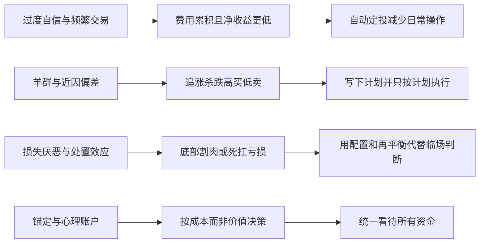

# 行为金融：你自己是最大的对手

## 是什么

传统金融理论假设人是理性的：信息一样、目标明确、决策一致。行为金融学用实验和交易数据证明：真实的人在不确定下会**系统性地、可预测地犯同一类错误**——恐惧、贪婪、从众、自负。对普通投资者，投资知识的差距远不如行为纪律的差距重要：收益曲线是市场给的，亏损往往是自己操作出来的。

## 前景理论：亏损 100 元的痛，大于盈利 100 元的快

丹尼尔·卡尼曼与阿莫斯·特沃斯基 1979 年发表前景理论（Prospect Theory），用实验证明人在不确定下的决策系统性偏离理性：**损失带来的痛苦约为同等金额收益快乐的 2–2.5 倍**（损失厌恶）（F-027）。卡尼曼获 2002 年诺贝尔经济学奖（特沃斯基于 1996 年去世未及授奖），科普著作是《思考，快与慢》（2011）（F-027）。

损失厌恶解释了投资中最常见的两个动作：下跌时恐慌割肉（兑现亏损的痛苦太真实，急于让它停止），上涨时稍有盈利就赶紧卖出（落袋为安的快乐）。两者叠加，正好构成「高买低卖」的散户标准操作。

## 处置效应：截断利润，让亏损奔跑

谢夫林与斯塔特曼 1985 年命名了处置效应（disposition effect）：投资者倾向于**过早卖出赚钱的股票、长期套牢亏损的股票**（F-028）。理性原则本该相反——让盈利的好资产继续奔跑，及时卖出基本面恶化的资产。但人把「卖出」等同于「给这段投资下结论」：卖赚钱的是宣布胜利（快乐），卖亏钱的是承认错误（痛苦，2–2.5 倍的痛苦，F-027），于是能拖就拖。账户里被套三五年的「僵尸仓位」，大多是处置效应的产物。

## 六类常见偏差与对策

| 偏差 | 典型表现 | 对策 |
|---|---|---|
| 过度自信（F-029） | 高估自己的判断与信息优势，觉得「这次我看得准」，频繁下注 | 承认自己是普通人；核心仓位用指数基金，把「主动判断」压缩到小比例 |
| 羊群效应（F-029） | 追涨杀跌的群体模仿，同事买什么跟着买，热什么追什么 | 决策前写下自己的理由；理由若只是「大家都在买」，不行动 |
| 锚定效应（F-029） | 被买入价、历史高点等无关数字锚定，「涨回成本就卖」「跌回某点再买」 | 问自己：如果现在空仓，会不会按现价买入？与成本价无关 |
| 近因偏差（F-029） | 用最近行情外推未来，连涨三年觉得永远涨，连跌三月觉得要归零 | 看十年以上的长周期数据；把定投计划写在纸上，不看行情执行 |
| 本土偏好（F-029） | 过度配置本国、本行业甚至本公司资产，中国家庭还高度集中于房产（F-020） | 用宽基指数天然分散；单一公司股票、单一房产占比主动设上限 |
| 心理账户（F-029） | 把不同来源的钱区别对待：年终奖敢亏、工资钱保守；「本金」和「盈利」分开冒险 | 钱是同质的，按总资产配置；每一笔钱都问「这是不是我愿意承担的风险」 |

## 泡沫与「这次不一样」

罗伯特·席勒《非理性繁荣》2000 年出版（书名来自格林斯潘 1996 年讲话），从行为与结构角度解释资产泡沫：当上涨本身成为买入理由，价格脱离基本面后靠故事和情绪维持（F-030）。值得注意的学术张力：席勒与法玛**同获 2013 年诺贝尔经济学奖**——市场到底有效还是非理性？诺奖委员会把奖同时给观点对立的两人，本身就在说明：市场短期会被情绪严重带偏（席勒），但长期又极难被个人持续战胜（法玛，见 [05 指数基金与有效市场](05-index-funds-emh.md)）。对普通人的实践含义一致：别参与泡沫，也别以为自己能在泡沫顶点转身离场。

## 频繁交易：最贵的爱好

学界对多个市场的研究（如 Barber & Odean 对台湾市场、美国散户的研究）发现：**交易越频繁的散户组，扣除费用与税负后的净收益越低**（F-031）。A 股个人投资者贡献了大部分交易量，但长期整体跑输指数（F-031）。原因是三重叠加：佣金、印花税、买卖价差等摩擦成本随交易次数线性累积（费率结构见 [07 中国市场实务](07-china-market-rules.md) F-040、F-044）——股票一次完整买卖要付佣金（可协商、单笔有最低收费）、出让方 0.5‰ 印花税，高频交易还叠加价差与冲击成本（F-040、F-044），每月换仓一次，一年摩擦就可能吃掉数个百分点；频繁操作放大了上述所有偏差；每一次交易都是与专业机构的零和博弈。管住手，本身就是收益来源。

## 泡沫的结构：上涨本身成为理由

席勒的研究还揭示了泡沫的典型正反馈结构：价格上涨 → 「赚钱故事」在人际间传播 → 新资金涌入 → 价格进一步上涨（F-030）。维持这个循环不需要基本面改善，只需要叙事和情绪，每一轮顶部都伴随「这次不一样」的说法——新经济、新政策、新范式。识别泡沫不需要预测顶点（那是近因偏差与过度自信的奢望），只需要一条自我规则：**没有估值依据、只因故事和热度加仓，就是参与泡沫**（F-024、F-026 的能力圈原则同样适用于此——看不懂的热闹不凑）。

## 为什么靠意志力一定会输

卡尼曼在《思考，快与慢》中把人的决策刻画为两套系统：快速、自动、情绪化的直觉系统，与缓慢、费力、理性的分析系统（F-027）。盯盘时的恐慌、浮盈的喜悦、下单的冲动，全部来自快速系统——它比理性反应快、还省力，靠「到时候忍住」是赢不了的。纪律的正确用法不是增强意志力，而是**不给快速系统上场的机会**：把决策提前到冷静时刻做好（写计划、定规则），执行环节全部自动化（定投、再平衡日历），临场只做一件事——按纸办事。这也是为什么本知识包把规律都设计成流程和清单（见 [示例 02](../examples/02-index-fund-dca-checklist.md)、[示例 03](../examples/03-behavior-self-check.md)）。

## 偏差如何变成亏损：映射图

## 怎么做：行为纪律动作清单

1. **先写投资政策书**：一页纸写清目标比例、每月定投额、再平衡规则，签字（对自己）后贴在看得见的地方。
2. **自动化一切能自动化的**：定投自动扣款、年度再平衡设日历提醒，让「不操作」成为默认项（机制见 [04 资产配置](04-asset-allocation.md) F-009、F-010）。
3. **降低查看频率**：组合一周看一次足够；天天盯盘是近因偏差和过度交易的温床。
4. **交易前设冷静期**：任何计划外买卖，先写理由并等 24 小时；说不出三条与行情无关的理由就放弃。
5. **下跌时对自己说固定台词**：「定投计划不变，低位买到的份额更多」——这不是鸡汤，是 F-010 的机制本身。
6. **用清单自查**：每季度做一次行为自查（[示例 03：投资行为与防骗自查清单](../examples/03-behavior-self-check.md)），比盘后复盘收益率更有用。
7. **给僵尸仓位定截止日**：被套后「再等等」的仓位，设一个明确的重新评估日期，到期只回答一个问题——现在空仓会不会买入它（F-028）。答「不会」就按规则处理，不与仓位谈恋爱。

## 常见坑与边界

- **以为「知道偏差」就能免疫**：偏差是系统 1 的自动反应，知识本身防不住；有效的是制度设计（自动化、冷静期、清单），不是意志力。
- **把纪律用在盯盘上**：纪律的方向是减少操作次数，不是更勤奋地择时；每天定点看盘再「纪律性交易」，仍是过度交易（F-031）。
- **拿「别人恐惧我贪婪」为频繁操作背书**：逆向投资建立在估值判断与资金期限上（F-024、F-026），没有判断框架的抄底就是接飞刀。
- **忽视制度性陷阱**：行为偏差可被骗局利用——荐股群、保本高收益正是靠贪婪与从众得手，识别红线见 [07 中国市场实务](07-china-market-rules.md) F-045 与 [示例 03](../examples/03-behavior-self-check.md)。
- **把浮亏当「不是真亏」**：不卖出不等于没损失；处置效应（F-028）的危险正在于用「再等等」回避决策，沉没成本不应影响未来判断。

## 相关概念

- [05 指数基金与有效市场](05-index-funds-emh.md)：被动投资是行为纪律的产品化。
- [04 资产配置、定投与再平衡](04-asset-allocation.md)：把纪律写进流程而非寄托于心态。
- [07 中国市场实务](07-china-market-rules.md)：交易成本与防骗红线。
- 事实依据与信源：[facts.md](../facts.md)（F-027~F-031、F-020）、[经典与权威信源](../references/01-classics-and-authorities.md)。
