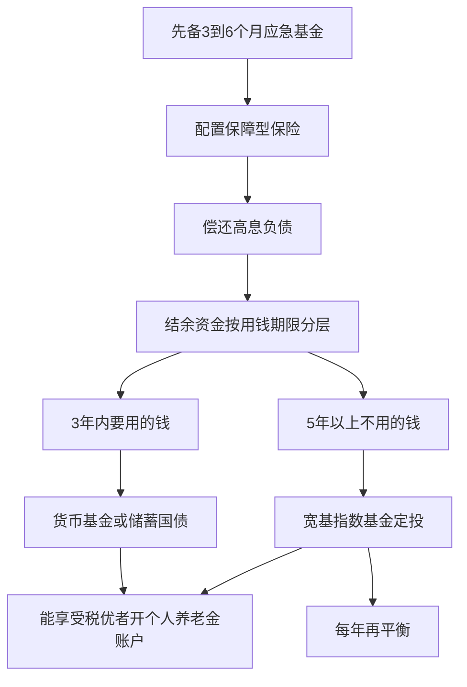

# 中国市场实务：制度、税费与防骗红线

## 是什么

投资落地的最后一层是制度：钱放在哪里受什么保护，买卖一次扣多少税、费，哪些产品有资格门槛，哪些「机会」本身就是骗局。本篇登记中国大陆居民投资人民币资产的现行制度规则（截至 2026-09）。规则会调整，税率费率以官方最新口径为准（F-046），核验渠道见文末。

## 一、存款与理财：刚兑已经打破

**存款保险**：《存款保险条例》（国务院令第 660 号）2015-02-17 公布、2015-05-01 施行；同一存款人在**同一家投保机构**的存款本息合并计算，最高偿付限额人民币 **50 万元**（F-036）。三个要点：① 保的是银行存款本息，按「同一存款人 + 同一家机构」合并算，不是按每张卡算；② **理财产品不在存款保险范围内**；③ 50 万以上的存款可通过分散到多家银行提高保障覆盖率。

**资管新规**：《关于规范金融机构资产管理业务的指导意见》（银发〔2018〕106 号，人民银行等四部门，2018-04-27 发布），核心是打破刚性兑付、产品净值化、消除多层嵌套与通道；过渡期经延长后于 **2021 年底结束**，此后银行理财全面净值化——**理财不再保本**，净值波动与亏损由投资者承担（F-037）。货币基金同样不承诺保本，2017 年监管规范后 T+0 快速赎回限额为每户每日 1 万元（F-017）。一句话：现在除存款（受存款保险限额内保障）和储蓄国债（国家信用）外，面向大众的理财产品都没有「保本」二字。

## 二、个人养老金：税优的长期账户

个人养老金制度脉络（F-038）：

- 国务院办公厅 2022-04 印发《关于推动个人养老金发展的意见》（国办发〔2022〕7 号）；
- 2022-11 人社部等五部门发布《个人养老金实施办法》，在 36 个城市（地区）先行试点；
- **2024-12-15 起在全国全面实施**。

关键规则：参加人**每年缴费上限 12000 元**，资金可购买符合规定的储蓄、理财、保险、公募基金等产品；享受 **EET 税收优惠**——缴费环节税前扣除、投资环节暂不征税、**领取时按 3% 税率**计税（F-038）。适合有稳定结余、当前适用税率高于 3%、且这笔钱能锁定到领取条件的人群；具体产品名单与人社部信息平台为准。

## 三、股票市场：注册制时代的规则变化

股票发行注册制进程（F-039）：

| 时间 | 事件 |
|---|---|
| 2019-06-13 | 科创板正式开板 |
| 2019-07-22 | 科创板首批 25 家企业上市交易，注册制试点落地 |
| 2020-08-24 | 创业板注册制落地（存量板块首例） |
| 2021-11-15 | 北京证券交易所开市 |
| 2023-02-17 | 全面实行股票发行注册制制度规则发布实施 |
| 2023-04-10 | 主板首批注册制企业上市 |

注册制下新股发行定价更市场化，上市门槛与退市常态化并存——**「打新稳赚」不再成立**（F-039）。新股上市首日即可破发，亏损公司可以上市也可能退市归零，个股风险显著高于指数（个股退市风险见 F-013）。这是普通人用宽基指数而非个股参与股市的制度性理由之一。

## 四、税费与交易成本：先算账再下单

**股票交易**（F-040、F-044）：

- 印花税：2008-09-19 起改为对出让方单边按 1‰ 征收；2023-08-28 起减半，即**出让方按 0.5‰** 缴纳（财政部、税务总局公告 2023 年第 39 号）。买入不收，卖出收。
- 个人转让上市公司股票**差价所得暂免征收个人所得税**。
- 股息红利按持股期限差别化计税（财税〔2015〕101 号）：持股 **1 个月以内按 20%**、**1 个月至 1 年按 10%**、**超过 1 年暂免**——鼓励长期持有的制度设计。
- 佣金由券商收取、**可协商**，单笔有最低收费；另有过户费等；高频交易还叠加买卖价差与冲击成本（F-044）。

**公募基金**（F-041、F-044）：

- 个人投资者从公募基金分配中取得的收入（基金分红）**暂不征收个人所得税**；个人申赎基金份额的差价收入也暂不征收个税。
- 基金费用包括申购/赎回费（持有越短赎回费通常越高）、管理费与托管费（按日从净值计提，即费率差异已体现在净值里）、销售服务费（**C 类份额**按日计提，A 类收申购费）（F-044）。

**储蓄国债**（F-043）：凭证式与电子式，财政部发行、承销团银行代销，**利息免征个人所得税**，以国家信用背书、到期还本付息；提前兑取按持有时间分档计息并付手续费。另有记账式国债可在证券账户交易，价格随市场利率波动（债券利率风险见 F-012）。

## 五、适当性：哪些产品有资格门槛

《证券期货投资者适当性管理办法》（证监会令第 130 号，2017 施行）要求经营机构**把合适的产品卖给合适的投资者**——买高风险产品前做风险测评、双录、签风险揭示书，走流程不是麻烦你，是制度保护（F-042）。

私募基金门槛更高：《私募投资基金监督管理暂行办法》（证监会令第 105 号，2014）规定合格投资者须具备相应风险识别和承担能力，**金融资产不低于 300 万元或最近三年个人年均收入不低于 50 万元**，且**单只私募基金投资金额不低于 100 万元**（F-042）。任何向普通人「1 元起投私募」「拆分份额代持私募」的，都是违规。

## 六、其他工具与家庭资产视角

入门之外还有两类工具值得知道其存在：**公募 REITs** 以不动产经营现金流（租金等）为收益来源，中国首批 9 只公募 REITs 于 2021-06-21 在沪深交易所上市，底层资产以基础设施（产业园、仓储物流、收费公路、清洁能源等）为主（F-018）；**黄金**本身不产生现金流（无利息、无分红），长期收益依赖价格上涨，常被作为抗通胀与避险配置，与股票债券相关性较低，但价格波动同样显著（F-019）。二者都属于进阶配置，入门阶段用现金类、债券类、宽基指数三类工具即可覆盖大部分配置目标。

还有一个结构性事实需要先看清：中国人民银行《2019 年中国城镇居民家庭资产负债情况调查》显示，城镇居民家庭总资产中住房资产占比约 **59.1%**，家庭资产高度集中于房产，金融资产中又以存款、银行理财为主（F-020）。这意味着多数人在开始金融投资前，风险敞口已经高度集中——配置金融资产时应有意识地分散，而不是在房产之外再加杠杆押注单一资产。

## 七、防骗红线：监管反复提示的高发形态

监管部门反复提示，以下属于非法证券期货或非法集资高发形态（F-045）：

- 承诺「**保本高收益**」，收益率远超正规产品（无风险收益参照存款、国债水平即可判断）；
- **拉人头返佣**、发展下线、按层级计酬；
- **无资质机构荐股、代客理财**，「老师」带单、荐股群、直播间喊单；
- **虚拟货币、原始股**暴富神话，「内部额度」「上市翻倍」叙事。

核验渠道：正规机构与从业人员可在**中国证监会官网（csrc.gov.cn）**、**中国证券投资基金业协会官网（amac.org.cn）** 查询资质；查不到的，一律视为不合规（F-045）。十条红旗信号的逐条自查见 [示例 03：投资行为与防骗自查清单](../examples/03-behavior-self-check.md)。

## 个人投资账户与产品选择流程

## 怎么做：实务动作清单

1. **存款分散**：单家银行存款本息控制在 50 万以内，超出部分分散机构（F-036）。
2. **看清产品性质**：合同里找「净值型」「非保本」字样；任何人口头承诺保本，对照资管新规（F-037）和防骗红线（F-045）判断。
3. **算税优账**：当前适用个税率高于 3%、能长期锁定的资金，考虑每年用足个人养老金 12000 元额度（F-038）。
4. **长期持股吃免税**：股票分红想免税需持股超 1 年（F-040），频繁换股与差别化税率的设计方向相反。
5. **选基金先看费率页**：A/C 份额按预计持有期选，持有越短越要在意赎回费与销售服务费（F-044）。
6. **开户、买产品前查资质**：机构与人员在证监会、基金业协会官网可查（F-045）；查不到即停止。
7. **制度规则每年核一次**：税率、费率、养老金规则均可能调整，以官方最新发布为准（F-046）。

## 常见坑与边界

- **以为理财还保本**：2021 年底过渡期结束后理财全面净值化（F-037），「R2 低风险也会亏」是制度现实不是事故。
- **误解存款保险**：50 万是「同一存款人在同一家机构本息合并」的限额（F-036），理财、代销基金不在其中。
- **打新信仰**：注册制下新股可破发、个股可退市（F-039），「闭眼打新」策略已失效。
- **被适当性流程绕过去**：帮人代持私募、拆分 100 万门槛均属违规（F-042），出事后不受合格投资者制度保护。
- **税率规则想当然**：股息红利税与持有期挂钩（F-040），基金分红与申赎差价暂免个税（F-041）；个案适用以税务机关 12366 答复为准。

---

> **免责声明**：本知识包为通识知识整理，不构成任何投资建议、收益承诺或产品推荐；市场有风险，决策需结合自身情况并咨询持牌机构。具体税率、费率、制度规则以财政部、税务总局、证监会、人民银行等官方最新发布为准（截至 2026-09）（F-046）。

## 相关概念

- [04 资产配置、定投与再平衡](04-asset-allocation.md)：制度框架内的资金分层落地。
- [05 指数基金与有效市场](05-index-funds-emh.md)：基金份额类型与费率比较。
- [示例 03：投资行为与防骗自查清单](../examples/03-behavior-self-check.md)
- 事实依据与信源：[facts.md](../facts.md)（F-036~F-046）、[经典与权威信源](../references/01-classics-and-authorities.md)（官方信源核验入口）。
