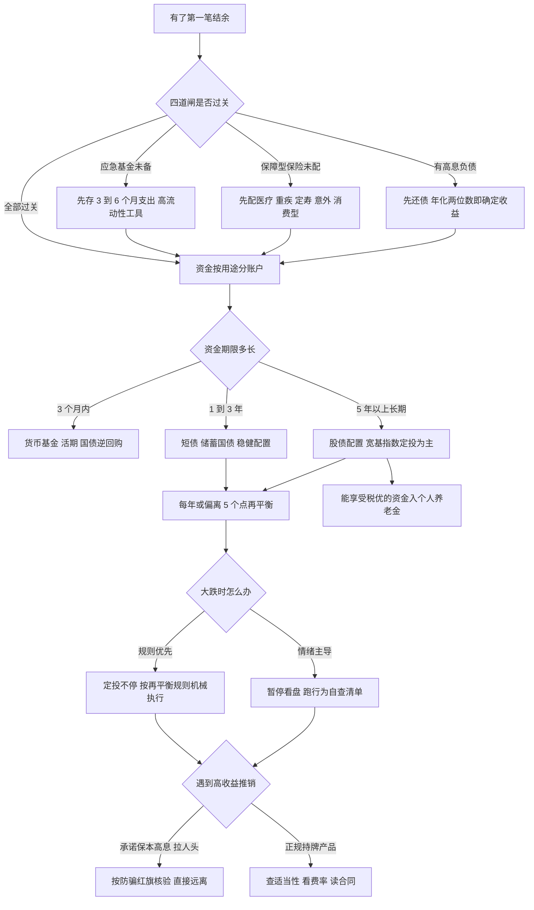

# 架构洞察（Architecture Insights）

> 基于 [事实清单](facts.md) 提炼。每条洞察按「陈述 / 证据 / 反常识点 / 行动启示」四元组组织；事实以 F 编号溯源，洞察为实务判断，不构成投资建议。

## 洞察 1：复利是非线性的——时间本身就是最大的本金

| 四元组 | 内容 |
|--------|------|
| **陈述** | 复利终值按指数增长 FV=PV(1+r)^n，后期的增长来自前期增长的自我累积；这意味着「开始得早」对终值的贡献远大于「每期投得多」，而通胀以同样的指数方式反向侵蚀购买力。 |
| **证据** | F-001（复利终值公式；1 元按 8% 复利 30 年约 10.06 元为派生教学算例，见 00 篇）、F-002（72 法则心算）、F-003（名义收益与实际收益之差、通胀长期侵蚀现金）。 |
| **反常识点** | 直觉里「投 10 万的人比投 1 万的人富 10 倍」，复利世界里真正拉开差距的是时间长度：早开始 10 年、本金只多一倍的人，终值可能是晚开始者的两倍以上；而「钱存银行最安全」在名义金额上成立，在购买力维度却是确定的缓慢亏损——不冒险也有风险（通胀风险，F-006）。 |
| **行动启示** | 理财决策的第一变量是「什么时候开始」而非「投什么」：第一笔结余到位就启动长期账户，金额可以小、纪律不能断；评估任何保守方案时同时算实际收益率（名义−通胀），别用名义安全感安慰购买力损失。 |

## 洞察 2：风险的本质是错配——同一资产对不同人是不同风险

| 四元组 | 内容 |
|--------|------|
| **陈述** | 风险不是资产的单一属性，而是「资产波动 × 投资者期限 × 心理承受力 × 流动性需求」的匹配结果；股票对 25 岁退休金账户是低风险长期资产，对 6 个月后要付首付的钱是高风险资产。 |
| **证据** | F-004（风险与收益长期对称）、F-005（波动与回撤的非线性）、F-006（通胀/信用/利率/流动性/汇率五类风险）、F-034（生命周期与「100−年龄」经验法则）、F-035（风险承受能力与意愿取低）。 |
| **反常识点** | 新手问「这个产品风险大不大」，正确答案是「你的钱什么时候要用、你跌 30% 睡不睡得着」——风险测评测的不是产品而是人；更反直觉的是，完全回避波动反而把资金暴露给了确定性更高的通胀风险（F-003），零波动不等于零风险。 |
| **行动启示** | 先按资金用途分账户（3 个月内要用的钱、3 年要用的钱、10 年不用的钱），再为每个账户选资产类别，而不是先选产品再问合不合适；风险测评在能力（客观条件）与意愿（主观感受）冲突时取低者，意愿以「历史最大回撤发生时我会不会割肉」来校准。 |

## 洞察 3：配置决定大局，纪律决定兑现——知道和做到之间隔着再平衡

| 四元组 | 内容 |
|--------|------|
| **陈述** | Brinson 研究表明资产配置政策解释了组合收益波动的约 93.6%（注意：是波动而非收益高低）；而配置方案本身不会自动生效——定投把买入纪律化、再平衡把「高卖低买」从口号变成机械动作，二者才是配置能被普通投资者兑现的原因。 |
| **证据** | F-007（马科维茨分散化与有效前沿，1990 诺奖）、F-008（Brinson 1986 及常见误读纠正）、F-009（再平衡机制）、F-010（定投摊薄机制）。 |
| **反常识点** | 「高抛低吸」人人会说，但人性要求的恰恰相反（涨了贪、跌了怕）；再平衡的机械规则在每次执行时都让人「不舒服」——涨得好的资产要卖、跌得多的资产要买，这种逆人性正是它长期有效的来源。分散化也反直觉：它永远让你的组合里「有一部分在拖后腿」，而这正是它降低整体波动的方式。 |
| **行动启示** | 把决策前置到规则里：设定目标比例（如股/债/现金）、定投自动扣款、每年或偏离 ±5 个百分点时再平衡，执行日不看新闻、不听观点；把「我这次怎么操作」改成「规则此刻要求我做什么」。 |

## 洞察 4：主动投资是一场算术上不利的游戏——成本确定、超额不确定

| 四元组 | 内容 |
|--------|------|
| **陈述** | 全部投资者集合就是市场本身，主动投资作为整体在扣费前等于市场收益、扣费后必然跑输市场；SPIVA 长期数据显示多数主动基金长周期跑输基准且业绩持续性弱，而费率按复利方式从终值中确定性地扣除。 |
| **证据** | F-021（EMH 三形态，法玛 2013 诺奖）、F-022（SPIVA 长期证据）、F-023（费率复利侵蚀）、F-016（博格与首只指数基金）、F-025（巴菲特十年赌约 7.1% vs 2.2%）、F-024/F-026（价值投资与能力圈的门槛）。 |
| **反常识点** | 「我选的基金经理/我自己炒股肯定比平均水平强」在统计上面临和「我的车技高于平均」一样的困境——半数以上参与者必然低于中位数；更隐蔽的是费率看起来每年只差 1%，30 年复利后终值差距可达 20% 以上（F-023 算例），这是唯一在买入时就能确定的「收益」。 |
| **行动启示** | 默认路径设为低成本宽基指数定投；要走主动路线，先诚实回答能力圈三问（有没有时间研究、有没有信息优势、下跌时能否独立坚持），并把主动仓位控制在可承受跑输的比例内；选基金先看综合费率与跟踪误差，把「历史业绩排名」降级为参考项。 |

## 洞察 5：最大的对手是自己——行为偏差有系统性的方向，且方向都指向亏钱

| 四元组 | 内容 |
|--------|------|
| **陈述** | 前景理论证明人对损失的痛苦约为同等收益快乐的 2–2.5 倍，由此衍生的处置效应（割盈留亏）、过度自信、羊群、锚定等偏差不是偶发错误，而是大脑的默认设置；它们在市场中的共同表现是高买低卖与过度交易。 |
| **证据** | F-027（卡尼曼前景理论，2002 诺奖）、F-028（处置效应）、F-029（六类偏差）、F-030（席勒泡沫研究，2013 诺奖）、F-031（频繁交易损害，Barber & Odean）。 |
| **反常识点** | 投资被包装成智力游戏，但长期业绩的主要解释变量是情绪纪律；散户交易越频繁收益越差（F-031），而「什么都不做」对多数人反而是最难也最优的策略。法玛与席勒 2013 年同获诺奖（一个说市场有效、一个说市场会疯）看似矛盾，对普通人的实践含义却一致：你既跑不过有效定价，也战胜不了自己的情绪。 |
| **行动启示** | 用制度对抗本能：自动定投减少决策次数、再平衡规则替代临场判断、关闭行情软件的日间提醒；大跌时按检查清单行事（见 [行为自查清单](examples/03-behavior-self-check.md)），把「我感觉」翻译成「规则说」。 |

## 洞察 6：保本时代结束了——制度规则既是保护也是地图

| 四元组 | 内容 |
|--------|------|
| **陈述** | 资管新规（2018，过渡期 2021 年底结束）后银行理财全面净值化，「卖者尽责、买者自负」成为资管市场的基础契约；与此同时，存款保险、投资者适当性、个人养老金税优、注册制退市常态化等制度构成了普通人必须读懂的规则地图——不懂规则的代价，轻则多缴税、重则进骗局。 |
| **证据** | F-036（存款保险 50 万）、F-037（资管新规净值化）、F-038（个人养老金 EET 税制）、F-039（注册制进程与打新神话终结）、F-040/F-041/F-044（税费规则）、F-042（适当性与合格投资者门槛）、F-045（非法活动识别）。 |
| **反常识点** | 「银行理财=保本」是过渡期结束后的过期认知，看到产品净值短期浮亏不等于出问题，反而承诺「保本高收益」的才是确定的危险信号（F-037、F-045）；制度对普通人其实是友好的——存款保险、基金托管、适当性管理都是保护机制，但保护只对「知道规则存在」的人生效。 |
| **行动启示** | 开户与配置前过一遍制度清单：存款类认 50 万偿付线、理财类接受净值波动、长期资金优先用满个人养老金额度（F-038）、私募产品先核对合格投资者门槛与机构资质；凡遇到「保本高收益、拉人头返佣、荐股群、原始股虚拟币」，直接按 [防骗红旗清单](examples/03-behavior-self-check.md) 核验，不抱侥幸。 |

## 知识地图（Mermaid）：个人投资决策全景

