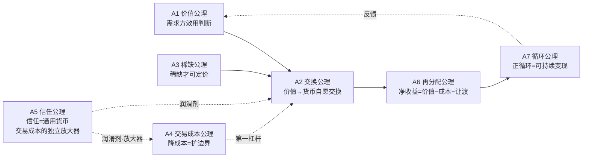

# 变现本质公理体系

## 0. 问题界定与假设剥离

"变现"一词在日常语境中隐含大量未经验证的假设。先逐条归零：

| 隐含假设 | 归零后的问题 | 结论 |
|---|---|---|
| 钱是变现的唯一目标 | 钱只是交换媒介；若钱不能交换回效用，则钱无意义 | 变现目标本质是"效用可交换性" |
| 交换是天然发生的 | 交换需要条件（价值差、低交易成本、信任） | 交换是被成本与信任约束的行为 |
| 价值是物品固有属性 | 价值是需求方效用判断，主观且随情境变化 | 价值非固有，需"被创造并被认可" |
| 变现是一次性事件 | 一次性交易只是事件，可持续变现才是系统 | 变现是可重复的正循环 |
| 变现 = 卖东西 | 卖只是通道之一；变现是"价值→货币"的通用转化 | 变现是转化函数，非特定动作 |
| 变现越多越好 | 无治理的变现会透支信任与稀缺性 | 变现受"可持续性"约束 |

## 0.5 公理性质与适用边界

- **描述性与规范性**：A1-A3 为**描述性公理**（经济事实：价值、交换、稀缺是什么）；A4-A7 为**工程性公理**（实现约束：如何做成可持续变现）。关系是"事实 → 约束"，不循环论证。
- **适用边界**：A7 描述的是**可持续变现**的理想形态（agent 自动变现平台的目标形态）；不否定一次性合法交易——一次性交易是"变现事件"，可持续变现是"变现系统"。二者都是变现，公理聚焦系统形态。
- **价值主体**：A1 的价值判断主体既可以是**个人需求方**，也可以是**集体/制度化的需求方**（社会契约、标准机构）；强制性交换（税收/罚款）属于集体效用判断的再分配，不否定 A1。

## 1. 公理体系

> 公理 = 不可再分的基础命题，作为全部推导的起点。每条公理附现实信源佐证（OKF bundles / 公认经济事实）。

### A1 价值公理：价值源于需求方的效用判断
**表述**：价值不是客体的固有属性，而是需求方对客体满足其需求之能力的判断；没有需求方的效用感知，就没有价值。
**推导链**：客体客观存在 → 但其"值得"与否由主体判定 → 同一客体对不同主体价值不同（主观价值论）→ 价值是可创造的（改变需求方感知）而非可攫取的固有物。
**信源**：[sheke/marketing](../../marketing/index.md)（营销本质——价值由顾客感知而非生产方定义）；[sheke/finance](../../finance/index.md)（收益数学——价值与价格分离）；[sheke/industry/ai-monetization](../../ai-monetization/index.md)（AI 价值 = 需求匹配度）。

### A2 交换公理：变现 = 价值向货币的自愿交换
**表述**：变现的本质是把"他人认可的价值"通过自愿交换转化为货币媒介；交换双方均预期交换后效用提升（双赢），交换才发生；强制或欺骗不可持续。
**推导链**：人有不同需求与禀赋 → 各自拥有对方更看重的价值 → 自愿让渡各自"次优"价值换取"更优"价值 → 货币作为一般等价物降低交换难度。
**信源**：[sheke/industry/ai-monetization](../../ai-monetization/index.md)（商业模式 = 价值交换结构）；[sheke/marketing](../../marketing/index.md)（STP 与交换前提）；[sheke/relationships](../../relationships/index.md)（人际互惠交换）。

### A3 稀缺公理：只有稀缺价值可被定价
**表述**：付费源于稀缺性感知；充裕到边际效用趋零的资源无法定价（空气无价）。变现者必须创造或占据某种稀缺性（信息差/能力差/位置差/时间差/注意力差/许可差）。
**推导链**：需求无限而资源有限 → 需求方为稀缺资源竞争出价 → 稀缺性决定价格上限 → 消除稀缺（技术普及）则价格归零。
**信源**：[sheke/finance](../../finance/index.md)（供需与价格）；[sheke/industry](../../index.md)（大模型成本下降→稀缺性从"能力"转移至"场景与数据"）；[jishu/ai](../../../jishu/ai/index.md)（工具普及降低稀缺）。

### A4 交易成本公理：降低交易成本即扩大可变现边界
**表述**：交易必然承担交易成本（搜索/信息/议价/决策/执行/监督）；若交易成本超过交换效用增量，交易不发生。降低交易成本是变现工程的第一杠杆（聚合、标准化、自动化、平台化）。
**推导链**：交换需要双方发现彼此（搜索）→ 核验价值（信息）→ 达成价格（议价）→ 履约（执行）→ 防违约（监督）→ 每一步都是成本 → 成本高于收益则交易死亡。
**信源**：科斯《企业的性质》（交易成本决定组织边界，公认经济事实）；[sheke/marketing](../../marketing/index.md)（顾客旅程摩擦=交易成本）；[jishu/document](../../../jishu/document/index.md) 与 [jishu/ai](../../../jishu/ai/index.md)（自动化降低执行与信息成本）。

### A5 信任公理：信任是变现的通用货币
**表述**：交换建立在信任之上；信息不对称与欺诈风险使交换成本激增或无法达成。信誉积累降低信任成本，是可持续变现的核心资本；欺诈型变现以一次性收益透支长期信任。信任成本虽是交易成本的子类，但其**非线性放大效应**（信任崩塌呈指数性）使其值得单列。
**推导链**：价值交付有先后与不确定性 → 买方需相信卖方履约 → 信任缺失则需担保/平台/验货等额外成本 → 可信度本身成为可定价资产。
**信源**：[sheke/finance](../../finance/index.md)（防骗自查清单——信任是投资前提）；[jishu/ai/ai-security](../../../jishu/ai/ai-security/index.md)（安全可信是 AI 服务前提）；[guoxue/confucian](../../../guoxue/confucian/index.md)（信——五常之一，人伦交换基础）。

### A6 再分配公理：变现所得必经再分配结构
**表述**：变现所得必然经过再分配：税收、平台抽成、渠道分成、竞争稀释、机会成本。净收益 = 创造价值 − 交易成本 − 再分配让渡；理解价值捕获（value capture）结构才能预测真实净收益。
**推导链**：交换发生在生态中 → 平台/中介/政府提供履约与秩序 → 抽取分成 → 竞争者入场稀释价格 → 净收益 ≠ 名义营收。
**信源**：[sheke/industry](../../index.md)（平台生态抽成结构）；[sheke/industry/ai-monetization](../../ai-monetization/index.md)（渠道与分成成本）；[sheke/finance](../../finance/index.md)（费率与税收）。

### A7 循环公理：可持续变现是可重复的正循环
**表述**：一次性交易不是变现；可持续变现是"价值创造→交换→反馈→再创造"的正循环。循环要求边际成本递减、复利积累（用户/数据/品牌/信任）、不竭泽而渔。
**推导链**：单次交换收益有限 → 需重复 → 重复依赖满意度与复利资产 → 反馈改善下次价值 → 形成自强化循环。
**信源**：[sheke/marketing](../../marketing/index.md)（AARRR 增长循环=获客-激活-留存-收入-推荐）；[guoxue/daojia](../../../guoxue/daojia/index.md)（"天之道损有余而补不足"——可持续的平衡观）。

## 2. 变现本质一句话概括

> **变现 = 通过降低交易成本与建立信任，把自己创造或占据的稀缺价值，以自愿交换的方式，可持续地转化为货币的正循环。**

拆解：**稀缺价值**（A1+A3，前提）→ **自愿交换**（A2，通道）→ **降低交易成本**（A4，杠杆）→ **信任**（A5，润滑剂）→ **再分配结构**（A6，约束）→ **正循环**（A7，可持续性）。

## 3. 公理间逻辑关系图

## 4. 相关概念

- [道家对齐框架](01-daojia-alignment.md)：价值判断的价值观维度
- [Agent 自动变现架构](02-agent-monetize-architecture.md)：公理体系的工程落地
- [变现通道分类学](03-channel-taxonomy.md)：价值→通道的组织骨架
