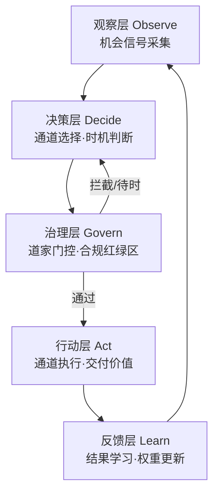

# Agent 自动变现架构

## 0. 设计目标：三特性

| 特性 | 含义 | 实现机制 |
|---|---|---|
| 自主（Autonomous） | 自动运行，无需人肉调度 | 定时/事件驱动的主循环（observe→decide→act→learn） |
| 自发（Spontaneous） | 由价值信号驱动，而非指令驱动 | 观察层持续扫描机会信号（需求/价格/热点/缺口），按信号强弱触发 |
| 自进化（Self-evolving） | 从反馈中学习改进 | 反馈层基于结果更新通道权重与策略，影响下一轮决策 |

三特性分别对应公理 [A4（降低交易成本=自动化）](00-axioms.md)、[A3（找稀缺=价值信号）](00-axioms.md)、[A7（正循环=反馈学习）](00-axioms.md)。

## 1. 五层架构



| 层 | 职责 | 关键机制 | 对应公理 | apps/agent-monetize 模块 |
|---|---|---|---|---|
| 观察层 Observe | 机会信号采集（需求/价格/热点/缺口） | 信号扫描器 + 打分（tvm-ffi） | [A3](00-axioms.md)（找稀缺）[A4](00-axioms.md)（降搜索成本） | `core/observe.py` |
| 决策层 Decide | 通道选择与时机判断 | 打分排序 + 无为门（低确定性不行动） | [A2](00-axioms.md)[A7](00-axioms.md) | `core/decide.py` + `tao/` |
| 行动层 Act | 通道执行（生成/服务/API） | Channel 抽象（4 钩子） | [A1](00-axioms.md)（交付价值）[A2](00-axioms.md)（完成交换） | `channels/` |
| 反馈层 Learn | 结果学习（收益/转化/反馈） | 权重更新、策略自进化 | [A7](00-axioms.md)（正循环） | `core/learn.py` |
| 治理层 Govern | 道家门控 + 合规红绿区 | 无为门/知止门/红区禁行 | [A5](00-axioms.md)[A6](00-axioms.md) | `tao/gates.py` + `compliance/` |

## 2. 循环协议

每轮循环（`round`）：

1. **Observe**：扫描各通道机会信号，调用 [tvm-ffi 打分函数]（`ffi_bridge`）计算机会确定性/预期收益；
2. **Decide**：候选通道按分数排序；先过**合规过滤**（红区禁行），再过**无为门**（分数 < 阈值 → 待时 no-op）；
3. **Act**：命中通道执行 `act()`，产生沙箱虚拟货币收益/成本；
4. **Learn**：按结果更新通道权重（指数加权 + 软最大），状态持久化；
5. 下一轮由更新后的权重与信号继续驱动。

## 3. 通道抽象（Channel 基类 4 钩子）

```python
class Channel:
    def observe_signal(self) -> float | None: ...   # 观察层：返回机会强度
    def decide_eligibility(self) -> bool: ...        # 决策层：通道是否可行动
    def act(self) -> ActionResult: ...               # 行动层：执行并返回收益/成本
    def learn_feedback(self, feedback): ...          # 反馈层：消费结果更新内部状态
```

新增变现通道只需继承 `Channel` 并实现四个钩子，注册后即可被自主循环调用——这是 [133 种方案](../../examples/00-catalog-summary.md) 落地的统一入口。

## 4. 自进化机制

- **通道权重**：`learn` 按收益信号更新，高收益通道权重上升，下轮更可能被选中；
- **无为自适应**：确定性阈值可随环境波动调整，避免过度保守或激进；
- **状态持久化**：`state.json` 保存余额/权重/历史，重启可恢复（自进化跨会话累积）。

## 5. 相关概念

- [变现本质公理体系](00-axioms.md)：架构的事实依据
- [道家对齐框架](01-daojia-alignment.md)：治理层的价值观
- [变现通道分类学](03-channel-taxonomy.md)：通道的组织
- [合规红绿区边界](04-compliance-zones.md)：治理层的制度边界
