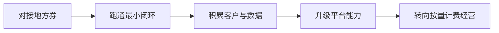

# 行业启示：运营商复制路径

文章给所有运营商写了一份可复制的样本，三条启示构成一条**渐进式切入路径**：

## 启示一：不必死磕自研大模型

做 Token 经营，不用从零做大模型。手里的云资源、算力调度能力、数据要素服务这些**现成存量资产就是最好的抓手**（F-031）。拼平台的难度比从零做大模型低太多，落地快、成本低（F-032）。

## 启示二：改"一锤子买卖"为持续消耗

过去运营商卖机柜、卖裸卡，是一锤子买卖；现在卖 Token 按量计费，是**持续消耗的收入模式**，长期价值更高（F-033～F-034）。

## 启示三：从接地方券入手，小步升级

切入地方 Token 经济，核心是**政企配合**：

1. 先从对接地方算力券/词元券入手（F-035）；
2. 跑通全流程后再慢慢升级（F-036）；
3. 地市公司不用建智算中心、不用搞大模型，凭属地网络和政企客户基础也能快速起步（F-037）。

## 可迁移的切入顺序（Transfer Layer）

这是所有想从"卖资源"转向"做经营"的实体都可复用的渐进序列，不限于运营商。

## 边界

- **这是作者的路径建议，不是已验证的必然结果**（F-035～F-037 属作者观点）。
- "其他运营商会不会跟进"是展望，跟踪它需要持续的行业观察而非一次性断言（F-040）。
- 词元调用量"高速增长"无口径来源；判断市场时机时请另行核对数据（F-038）。