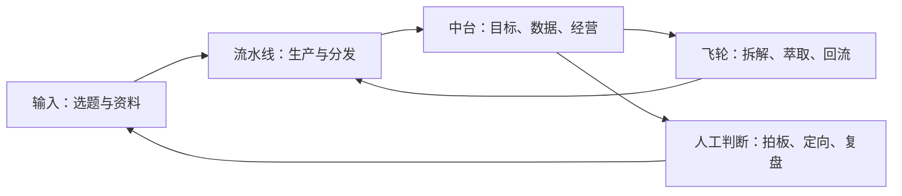

# 三层系统：流水线、中台与飞轮

文章的核心抽象不是某个 WorkBuddy 页面，而是把个人内容业务拆成三种不同职责：流水线负责“造”，中台负责“管”，飞轮负责“变强”（F-005～F-008）。

## 三层职责

| 层 | 主要问题 | 文章中的对象 |
|---|---|---|
| 流水线 | 怎样稳定地产出和分发？ | 选题、写作、标题、排版、封面、多端分发 |
| 中台 | 怎样做选择、排期和经营？ | 目标、日历、数据、客户、资产、复盘 |
| 飞轮 | 怎样让下一轮比上一轮更好？ | 爆款拆解、基因萃取、回流、再验证 |

## 为什么要分层

把“生产”和“经营”混在一起，容易出现两种浪费：生产环节没有稳定标准，经营环节只能凭感觉。文章用“流水线管做对，中台管做对的事情”区分执行质量与方向质量（F-022）。

## 可迁移边界

这是一个管理架构抽象，不是 WorkBuddy 官方架构图。任何团队都可以用相同分层组织内容、销售、客户成功或研究工作，但具体模块、触发器和工具需要重新设计。
