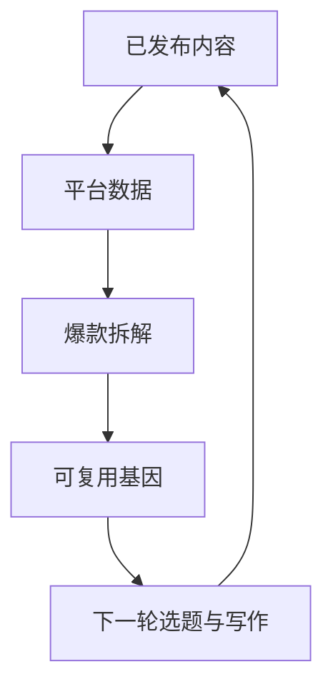

# 经验飞轮与一鱼多吃

## 经验飞轮

文章给出的闭环是“拆解爆款 → 萃取基因 → 流水线站到爆款肩上写 → 数据回流再验证”（F-023）。它把一次性内容生产改成了持续学习系统：

作者还描述了每周定时或累计 10 条新拆解触发萃取（F-024）。这属于作者系统的运行规则，并非通用最佳频率。

## 一鱼多吃

一篇终稿被拆成 8 个分身：4 个内容再创作、3 个镜像同步，以及 1 个数据回流分身（F-025～F-028）。可迁移的不是“八”这个数字，而是三个动作：

1. 保留一个语义主稿；
2. 为不同平台做格式和叙事适配；
3. 把每个平台的结果回收为同一套经营数据。

## 价值与边界

多端复用可以减少重复劳动，但不能自动保证平台表现、合规性或收益。“一篇内容在八个地方变现”和“边际成本几乎为零”是作者的价值判断或自述，缺少平台收入、转化率和时间成本数据（F-029、F-035）。

## 迁移检查

在其他内容团队中使用该模式，应增加平台版权、重复发布、事实一致性、品牌调性和数据归因检查，避免把“复制”误当成“适配”。
