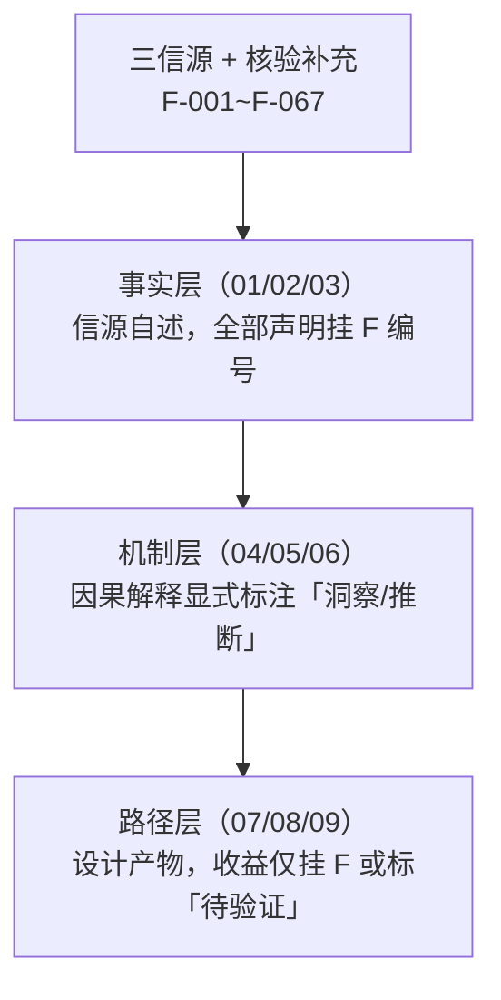

# 知乎变现体系总览：三大创作激励活动的事实、机制与路径

## 一、包定位与三大信源

本知识包解析**知乎站内面向个人创作者的激励与变现机制**，覆盖三类并行的平台活动：

| 信源 | 活动 | 性质 | 事实登记 |
|---|---|---|---|
| S1 | [AI Works 项目广场](https://www.zhihu.com/project-square)（页面标题「AI Works 项目广场 - 知乎」，F-001） | 长期项目展示与热度榜单 | F-001~F-027 |
| S2 | [创作打卡挑战赛第五十三期](https://www.zhihu.com/parker/campaign/2083977679355889635)（F-028） | 周期性创作打卡，盐粒瓜分 | F-028~F-043 |
| S3 | [知乎 × 科普中国「让知识开源」科学季 2026](https://www.zhihu.com/parker/campaign/2081789902673426369)（时间 09.30–10.30，F-044） | 季节性主题活动，含现金奖励 | F-044~F-054 |

补充事实 F-055~F-067 来自 Task 3 P0 权威核验的独立来源（合作方官方公告、权威媒体、政府通知、创作者社区旁证），全量证据 URL 见 [核验报告](../references/verification.md)。

**三层结构**（本篇为总览；各层职责与 F 编号映射的设计依据见 spec 区 `create-zhihu-monetization-okf-wiki/knowledge-map.md`，不随本包分发）：

## 二、内容导航

| 层 | 篇目 | 一句话导读 |
|---|---|---|
| 总览 | 本篇 | 三信源定位、bundle 地图、时效与 flagged 声明 |
| 事实层 | [01 · AI Works 项目广场事实](01-project-square-facts.md) | 页面框架、最热 18 项目逐条、热门榜与科学季分类项目（F-001~F-027） |
| 事实层 | [02 · 创作打卡挑战赛事实](02-checkin-campaign-facts.md) | 四 Tab 规则全量、奖池结构、参与门槛（F-028~F-043） |
| 事实层 | [03 · 科学季 2026 事实](03-science-season-facts.md) | 三计划、六圈子、影像漂流、时间表（F-044~F-054 及补充 F-055~F-058） |
| 机制层 | [04 · 盐粒激励结构](04-yuli-incentive-structure.md) | 瓜分机制、奖池分层、兑换口径与防混用三对照 |
| 机制层 | [05 · 参与门槛与时间成本](05-participation-gates-and-cost.md) | 报名关系、字数门槛、互动五选三、零门槛表述的证据层级 |
| 机制层 | [06 · 机制洞察五元组](06-mechanism-insights.md) | 现象（挂 F）+ 根因/影响/建议（洞察/推断） |
| 路径层 | [07 · 变现路径矩阵](07-monetization-path-matrix.md) | 三类角色的起点/门槛/行动/收益区间/退出条件 |
| 路径层 | [08 · AI/技术创作者主路径](08-ai-creator-main-path.md) | 起点条件到持续期的时间线设计 |
| 路径层 | [09 · 风险与边界](09-risks-and-boundaries.md) | 单源清单、规则变动、口径冲突、合规边界 |
| 信源 | [事实清单 F-001~F-067](../references/article-source.md) | 与 spec 区双份登记、逐字一致 |
| 信源 | [核验报告](../references/verification.md) | P0 结论表、勘误四清单、flagged 判定、证据 URL |

## 三、时效与核验状态声明（重要）

- **本包 `status: flagged`**：P0 事实 16 条中 10 条为平台活动页单源（含 3 项 JS 渲染未复现）；盐粒兑换比 100:1 为「合作方官方公告 + 多三级源」，未见知乎域名官方规则页原文。核心结构（活动存在性、合作方、主题、时间窗、现金奖励结构）已获多源确认。
- **`stale_after: 2026-12-31`**：打卡挑战赛按期数滚动（F-064 佐证长期滚动），规则条款存在按期变动先例（F-067 载回答字数门槛历史演变 100→300→500、想法旧口径 30 字+3 图）；科学季为季节性活动。请在 2026-12-31 前复核活动页最新规则。
- **引用纪律**：concepts 引用 F-029/F-031/F-032/F-036/F-039/F-041/F-042/F-046 时标注「仅平台活动页单源」；F-026/F-033/F-034/F-043/F-044/F-048/F-052 为部分确认，注明来源层级；口径冲突（F-065）一律以平台活动页为准（分歧详见 [09 篇](09-risks-and-boundaries.md)）。
