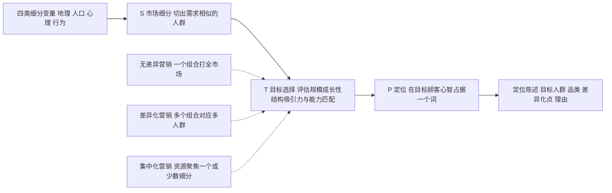

# STP 战略：市场细分、目标选择与定位

## 是什么

STP 是营销战略的三步骨架：市场细分（Segmentation）、目标市场选择（Targeting）、定位（Positioning），由科特勒体系系统化（M-010）。S 和 T 决定“在哪个战场打”，P 决定“在顾客心里占什么位置”；定位定清楚之后，才轮到 4P 战术组合上场（M-010）。一句话总结：**先选人群，再谈打法**。

很多小老板的营销是从“我有个产品，谁来买”开始的，STP 把顺序倒过来：先看市场上有哪些人群，再决定为谁做产品。本篇依次讲三步怎么做、怎么串起来，以及一张可以直接填的定位陈述模板。STP 的价值在于逼着你做减法：资源永远有限，“为谁服务、不为谁服务”想清楚了，后面的产品和传播才有判断标准，而不是看同行做什么就跟着做什么。

## S 市场细分：不要说“所有人都是我的客户”

1956 年，温德尔·史密斯在论文《产品差异化与市场细分作为可选营销战略》中提出市场细分概念：与其用一种产品打整个市场，不如把市场切成一个个需求相似的子市场（M-006）。切完之后，同一群人的需求相似，一套产品、一套话术就能服务好，资源效率远高于“什么人都招呼”。

为什么必须切？因为“所有人”并不存在。同样一瓶水，有人图便宜、有人图健康、有人图牌子撑场面——一个产品满足不了所有人，一句广告语也说服不了所有人。切分市场常用四类变量（M-007）：

| 变量类型 | 切分依据 | 常见变量举例 |
|----------|----------|--------------|
| 地理 | 人在哪 | 地区、城市级别、气候 |
| 人口 | 人是谁 | 年龄、性别、收入、职业、家庭生命周期、教育 |
| 心理 | 人怎么想 | 生活方式、价值观、性格 |
| 行为 | 人怎么买、怎么用 | 使用场景、使用率、忠诚度、追求利益、决策阶段 |

B2B 场景另有行业、企业规模、采购类型等变量（M-007）：比如同样是卖办公软件，卖给制造业和卖给教育机构是两个市场，大企业集采和中小企业现买又是两种决策逻辑。

两个实务提醒：第一，人口变量最好收集，但也最浅——两个同样 30 岁、月收入两万元的人，消费选择可能天差地别，真正决定购买的往往是行为变量和心理变量。第二，行为变量不用靠昂贵报告：门店的销售记录、会员复购数据、客服和销售跟顾客的日常聊天，都是行为线索；先把老顾客按“怎么买、为什么买”分群，比拍脑袋画像可靠得多。

## T 目标市场选择：切完之后要敢取舍

细分是把市场切开，目标选择是决定“主攻哪几块”。常用的三种覆盖模式如下（M-008）：

| 覆盖模式 | 做法 | 适合谁 | 通俗理解 |
|----------|------|--------|----------|
| 无差异营销 | 一个营销组合打全市场 | 需求高度同质的大众品 | 一款产品卖所有人，靠规模摊薄成本 |
| 差异化营销 | 多个组合对应多个细分市场 | 资源充足的成熟企业 | 例如某日化企业用不同品牌分别服务不同人群 |
| 集中化营销 | 集中资源做一个或少数几个细分市场 | 中小企业最常用 | 小池塘里当大鱼，先活下来再扩张 |

科特勒教材还给出五种细分市场覆盖的具体形态（M-008）：**密集单一市场**（只守一块）、**有选择的专门化**（挑几块互不相关但各自有吸引力的市场）、**产品专门化**（一种产品卖给几类顾客）、**市场专门化**（为一类顾客提供多种产品）、**完全市场覆盖**（全品类服务全市场，大企业打法）。三种组合策略回答「用几套打法」，五种形态回答「选几块市场、怎么选」，是同一决策的两个视角：中小企业实操中最常见的落点就是密集单一市场＋集中化营销。

选哪块市场，看三条依据（M-008）：**规模与成长性**——盘子够不够大、还在不在长；**结构吸引力**——竞争强不强、有没有强势对手压着、进入和退出难不难；**与自身能力匹配**——你的供应链、团队、资金能不能服务好这群人。三条要一起看：有些市场很大但打不进去，有些你打得赢但盘子太小养不活企业。

这里最考验的是取舍的勇气。什么人都想要，本质上就是无差异营销；而资源有限的小企业做无差异，等于在每个战场都以少打多。例如某社区水果店不跟全城比价，只服务周边三公里内“要新鲜、要顺路、要能送货上门”的家庭客群，就是典型的集中化思路。

## P 定位：终极战场在顾客心智

定位理论由艾·里斯与杰克·特劳特提出：思想先见于 1972 年《广告时代》系列文章《定位时代》，1981 年出版《定位：争夺用户心智的战争》（M-009）。核心主张是：营销的终极战场不在产品、不在渠道，而在**潜在顾客的心智**；定位就是在心智中占据一个代表品类或特性的词（M-009）。

通俗说：顾客想到某类需求时，脑子里第一个冒出你，你就赢了。这个“词”可以是**品类词**——让品牌成为某个品类的代表；也可以是**特性词**——在品类里占住一个特性，比如“最安全”“最专业”“最省事”。品类领导者适合占品类词，新进入者更现实的是占特性词：在领导者的对立面或空白处找词，别人都占“全”，你就占“专”。但无论选哪个，一个品牌同一时期只主攻一个词——这是心智容量有限这条规律决定的（M-021）。定位背后的心智运作规律在 [02 定位与品牌](02-positioning-brand.md) 展开，这里先记住一句：心智里没有“更好”，只有“先入为主”和“与众不同”。

## 三步怎么串起来：一个完整走查

以一家泛指的社区烘焙店为例走一遍：

1. **细分（S）**：按地理切，周边三公里；按行为切，有“每天早餐买面包”“生日买蛋糕”“给孩子买点心”三类场景；按心理切，家长人群高度在意“用料健康、当天现做”。
2. **目标（T）**：评估后放弃价格敏感的早餐客流（竞争激烈、结构吸引力低），集中服务三公里内“给孩子买点心和生日蛋糕”的年轻家庭——这是集中化营销（M-008）。
3. **定位（P）**：在这群家长心智里占“当天现做、孩子可以放心吃”这个词。
4. 定位之后，4P 才有方向：产品上少卖隔夜款、明示用料；价格上不跟低价店比拼；渠道上做社区群预定和自提；传播上围绕“现做”做内容。顺序就是：先有人群和词，再谈动作。

定位陈述有个常用模板（M-011）：“对于……（目标顾客及其需求），我们的品牌是……（品类），它能够……（关键利益/理由），不同于……（主要竞品），我们的不同在于……（差异化理由）”。注意它是**内部战略对齐工具，不是对外广告语**（M-011）。日常速记可以用一句填空式模板：

> 对【目标人群】而言，我们是【品类】中最【差异化点】的选择，因为【理由】。

## 怎么用：行动清单

1. 拿四类变量给现有顾客画像：地理、人口、心理、行为各写三条，其中行为变量至少占一半（M-007）。
2. 把市场切成 3–5 个细分块，逐块按三条依据打分：规模成长性、结构吸引力、与自身能力的匹配度（M-008）。
3. 按资源选覆盖模式：资源少就集中化，先在一个细分里做到第一，别一上来全面铺开（M-008）。
4. 为选中的目标市场写一句定位陈述：先用填空速记，再用 M-011 的完整模板补齐“不同于谁、不同在哪”，团队内部对齐。
5. 拿着定位陈述对照后续战术：产品、价格、渠道、促销每一项是否都在强化那个“词”？对不上的动作要么改、要么砍（衔接 [03 4P 与 4C](03-4p-4c-tactics.md)）。

## 常见坑与边界

- **只切不取**：细分做得热闹，最后说“这些人群我都要”。不取舍等于没细分，回到无差异营销（M-008）。
- **变量只用人口统计**：年龄性别收入最容易拿到，但也最不决定购买；行为与心理变量才暴露真实需求（M-007）。
- **细分过细、自嗨造词**：为每一个微小差异单设人群和产品线，会把资源摊薄到无法形成认知；细分颗粒度以“能用一套营销组合服务好”为准。
- **定位写成广告语**：定位陈述是内部对齐用的，必须落到“对谁、是什么品类、凭什么不同”；“高端大气上档次”不是定位（M-011）。
- **定位朝令夕改**：心智难以改变，定位需要时间和重复积累，频繁换词等于每次从零开始（M-021，详见 [02 定位与品牌](02-positioning-brand.md)）。
- **STP 不是一劳永逸**：人群和需求会漂移，建议每年或在大环境变化时复盘一次；但复盘不等于追着热点乱换赛道。

## 相关概念

- [02 定位与品牌：心智规律与品牌资产](02-positioning-brand.md)：定位的心智规律与落地四步法。
- [03 4P 与 4C：营销战术组合](03-4p-4c-tactics.md)：定位之后的战术展开。
- 全部事实出处见 [facts.md](../facts.md)，经典著作溯源见 [01-classics-and-frameworks.md](../references/01-classics-and-frameworks.md)。