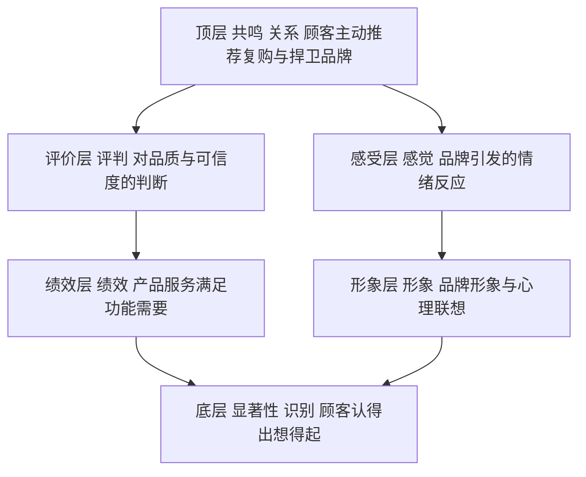

# 定位与品牌：心智规律与品牌资产

## 是什么

定位回答“在顾客心智里占哪个词”（M-009）；品牌是这个词经过长期经营后沉淀下来的资产。营销圈有个通行比喻：**定位是钉子，品牌是锤子**——钉子决定“往哪钉”，锤子（品牌名称、视觉符号、产品体验、传播内容）决定“钉不钉得进去”；钉得够深，就沉淀为品牌资产。

定位和品牌是同一件事的两面：定位是战略端的选择，品牌是顾客端的结果。对小生意来说这两件事一点也不玄：门口招牌写什么、老顾客怎么跟朋友提起你，就是定位；提起时愿不愿意夸你、下次还来不来，就是品牌资产。本篇讲四件事：定位落地的四步法、心智运作的五条规律、衡量品牌家底的两个经典模型（艾克五要素与 CBBE 金字塔），以及定位和品牌到底怎么配合。

## 定位四步法：从找位置到做传播

**第一步，找位置。** 营销的终极战场在潜在顾客的心智（M-009）。先看心智里已经有哪些词、哪些位置还空着。心智规律中有一条领先法则——成为第一胜过做得更好（M-021）：争不到品类第一，就分化出一个新品类去当第一。比如某个品类已经被强势品牌占住“最大最全”，新进入者硬拼“更好”很难，切出一个细分新品类、在新品类里当第一，反而更容易进入心智。

**第二步，找差异。** 差异化有四个来源：产品或服务本身（最优质、最专业）、人员（员工专业度）、渠道（独家或便捷）、形象（品牌识别与象征）（M-022）。好的差异化必须同时满足三条：是**顾客在乎的**、是**竞争者没有的**、是**企业能长期兑现的**（M-022）。“我们老板有情怀”这种自嗨式差异不算数；顾客不在乎的差异再独特也是浪费，企业兑现不了的差异说出去反而是埋雷。

**第三步，建信任。** 心智缺乏安全感，顾客怕买错，倾向于从众和寻找证据（M-021）。信任状可以是销量规模、第三方认可、老顾客口碑、可验证的承诺——泛指来说，“多少老顾客在复购”“有没有第三方检测或资质”“买错了能不能退”都是在给顾客安全感。底线是：信任状必须真实可查，营销素材中的数据、引语、对比性宣传须有真实依据（M-044）；“国家级”“最高级”“最佳”等绝对化用语更是广告法明令禁止的红线（M-042）。

**第四步，做传播。** 心智容量有限、又厌恶混乱（M-021）：信息要简单到一个词，口径要一致到重复无数次。这个月说自己“专业”、下个月说自己“便宜”，顾客最后什么也记不住。传播渠道和内容形式可以换，那个词不能换。

## 心智运作的五条规律

里斯与特劳特在系列著作中归纳了心智规律（M-021），每条都直接对应营销动作：

| 心智规律 | 含义 | 营销启示 |
|----------|------|----------|
| 容量有限 | 每个品类顾客只记得住少数几个品牌，记不住第 N 名 | 争第一，或分化新品类当第一 |
| 厌恶混乱 | 信息越简单越容易进入心智 | 一个品牌一个词，传播口径长期一致 |
| 缺乏安全感 | 顾客怕买错，依赖从众与证据 | 配齐信任状、口碑与可验证承诺 |
| 难以改变 | 改变已有认知极难，利用已有认知较易 | 不硬碰领导者，学会关联或对立已有认知 |
| 会失去焦点 | 品牌延伸到太多品类会稀释定位 | 谨慎扩张，新品类考虑用新品牌 |

（M-021）

这五条可以当成传播方案的审稿清单：信息是不是多到记不住？有没有证据？是不是在试图改变顾客的固有看法？一个名字是不是扛了太多品类？

## 品牌资产之一：艾克五要素

定位要靠品牌去承载。大卫·艾克 1991 年在《管理品牌资产》中提出品牌资产五要素（M-020）：

| 要素 | 通俗解释 |
|------|----------|
| 品牌忠诚度 | 老顾客是否重复购买，愿不愿原谅你的偶尔失误 |
| 品牌认知度 | 顾客见没见过你、买的时候想不想得起你 |
| 感知质量 | 没用过也觉得“这牌子应该不错” |
| 品牌联想 | 提到品牌名，脑子里冒出的颜色、场景、情绪、人物 |
| 其他专有资产 | 专利、商标、渠道关系等 |

品牌资产的直接效果是：顾客愿意为同等产品支付溢价（M-020）。所以品牌建设是投资而非费用——它存在顾客脑子里，对手单纯靠降价抢不走。五要素里忠诚度排在首位，是因为老客的重复购买和口碑推荐同时降低了获客成本，是品牌资产兑现为利润最直接的一环。

## 品牌资产之二：CBBE 品牌共鸣金字塔

凯勒在 1998 年初版的《战略品牌管理》中提出基于顾客的品牌资产模型（CBBE），用一座“品牌共鸣金字塔”描述强势品牌如何逐层建立顾客关系（M-019）。自下而上共六层：

| 层级 | 要素 | 顾客心里的问题 |
|------|------|----------------|
| 底层 识别 | 品牌显著性 | 你是谁？我认得出、想得起你吗 |
| 含义 | 绩效 | 你的产品服务能满足我的功能需要吗 |
| 含义 | 形象 | 你的品牌形象与心理联想是什么 |
| 响应 | 评判，即评价 | 我对你的质量和可信度怎么判断 |
| 响应 | 感觉，即感受 | 你引发我什么情绪和情感反应 |
| 顶层 关系 | 共鸣 | 我愿不愿意主动推荐、复购、捍卫你 |

（M-019）

金字塔必须自下而上逐层建：没人认识你时谈“共鸣”是空中楼阁；底层不牢就大谈品牌情怀，顾客接不住。建品牌的顺序，是先解决“认得出”，再解决“觉得好”，最后才到“离不开、主动夸”。以泛指的某新连锁餐饮为例：开业初期靠门头位置和大众点评解决显著性；出品稳定、明档厨房建立绩效与形象；顾客给出“干净、靠谱”的评价和“带朋友去”的感受；最终形成老客复购、主动推荐的共鸣。跳过前两层直接砸情怀广告，钱多半打水漂。

两个模型的关系：艾克五要素是一张**资产清单**，回答“品牌家底有哪几样”；CBBE 金字塔是一条**建造路径**，回答“按什么顺序攒这些家底”。盘点用前者，规划建设节奏用后者。

## 定位与品牌：钉子和锤子怎么配合

- **定位是钉子**：决定往心智里钉哪个词。方向错了，锤子挥得越猛越白费——产品、广告、渠道越努力，反而把错误认知钉得越深。
- **品牌是锤子**：名称、视觉、产品体验、价格带、渠道、传播内容，顾客的每一次接触都是在挥锤。锤子要砸在同一个点上：门店装修说“亲民”、广告说“高端”、定价又很便宜，就是三次挥锤砸在三个地方。
- **品牌资产是结果**：钉子钉得够深，就表现为艾克五要素的积累（M-020）和 CBBE 金字塔的逐层登顶（M-019）。

## 怎么用：行动清单

1. 用四个差异化来源盘点候选：产品、人员、渠道、形象各列 2–3 条，再用“顾客在乎、对手没有、我能兑现”三条筛子过一遍（M-022）。
2. 把筛出的差异浓缩成一个词，写在所有营销物料的抬头位置，半年内不换词（M-009、M-021）。
3. 为这个词配三样信任状，每样都能拿出真实证据；投放前先过广告法红线自查（M-021、M-042、M-044）。
4. 用艾克五要素给品牌做“体检”：忠诚度、认知度、感知质量、联想、专有资产逐项打分，最弱的先补（M-020）。
5. 用 CBBE 金字塔判断当前任务在第几层：认知不足先解决识别，别越级做共鸣（M-019）。

## 常见坑与边界

- **定位词是自嗨形容词**：“高端、品质、匠心”不构成定位——对手也能说、顾客无法验证（M-022）。
- **品牌延伸失焦**：一个名字什么都做，心智里那个词就被稀释了——心智会失去焦点（M-021）。
- **硬碰顾客已有认知**：改变认知极难，聪明做法是关联或对立已有认知，而不是花钱教育市场（M-021）。
- **只砸知名度不建关系**：金字塔底层之上还有五层，“听过”不等于“会买”，更不等于“会推荐”（M-019）。
- **信任状造假**：编销量、编数据、用极限词，短期可能提转化，长期是行政处罚与品牌信任双输（M-042、M-044）。

## 相关概念

- [01 STP 战略：市场细分、目标选择与定位](01-stp-strategy.md)：定位在 STP 中的位置与定位陈述模板。
- [03 4P 与 4C：营销战术组合](03-4p-4c-tactics.md)：品牌承诺最终由每一个 P 兑现。
- 全部事实出处见 [facts.md](../facts.md)，经典著作溯源见 [01-classics-and-frameworks.md](../references/01-classics-and-frameworks.md)。