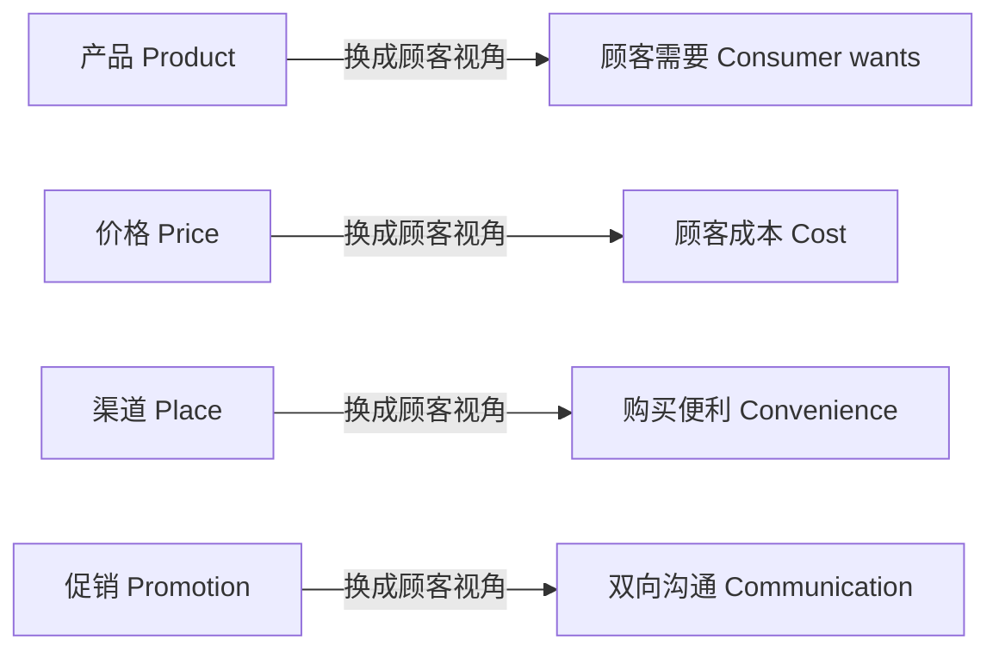

# 4P 与 4C：营销战术组合

## 是什么

STP 定的是“在哪个战场打、在顾客心智里占什么词”，4P 是把定位落到地上的战术组合：**产品（Product）、价格（Price）、渠道（Place）、促销（Promotion）**。它由杰罗姆·麦卡锡 1960 年在《基础营销》中提出，科特勒《营销管理》（1967 年初版）将其发扬光大，成为营销组合的经典框架（M-012）。后来又有从顾客视角改写的 4C（M-017），以及面向服务业扩展的 7P（M-018）。

4P 最大的用处是**保证不漏想**：谈营销时把四件事都过一遍，而不是只想到“打广告”。它和 STP 的关系是：定位回答“占什么词”，4P 回答“用哪些动作把这个词兑现”。本篇逐个讲四个 P 的要点，再讲 4C 怎么换视角、7P 加了哪三块。这些框架之所以几十年不过时，是因为它们对应着每笔生意都绕不开的四个问题：卖什么、收多少钱、在哪交付、怎么让人知道。

## 产品 Product：顾客到底买的是什么

科特勒的产品整体概念把产品分为五个层次（M-013）：

| 层次 | 含义 | 泛指举例，以某连锁咖啡为例 |
|------|------|------------------------------|
| 核心产品 | 顾客真正购买的利益 | 提神、社交场合手里的一杯饮品 |
| 形式产品 | 质量、特色、品牌、包装 | 豆子品质、杯型、门店招牌、杯套设计 |
| 期望产品 | 顾客默认应该具备的属性 | 干净、出餐快、口味稳定 |
| 延伸产品 | 售后、保证、信贷、服务 | 会员积分、外卖配送、企业团购 |
| 潜在产品 | 未来可能演化出的形态 | 咖啡订阅、门店办公空间 |

关键判断：**竞争越来越发生在延伸与潜在层次**——当核心产品大家都差不多时，谁在服务、会员、体验上多走一步，谁就赢（M-013）。实务上可以这样用：把自家产品按五层拆一遍，前三层是“不做就挨骂”的及格线，延伸层才是差异化和溢价的来源。找核心产品有个笨办法：连着问五次“顾客为什么需要它”，往往就从“买钻头”问到了“要那个孔”。

## 价格 Price：三种定价导向与心理账

定价有三种基本导向（M-014）：

| 定价导向 | 怎么定 | 适用场景 |
|----------|--------|----------|
| 成本导向 | 成本加成，成本上加目标利润 | 同质化、成本结构透明的行业 |
| 竞争导向 | 随行就市或投标比价 | 价格敏感、对手密集的市场 |
| 价值导向 | 按顾客感知价值定价 | 差异化强、有品牌溢价的产品 |

新产品上市还有两种典型策略：**撇脂定价**（高价进入、逐步降价，适合有壁垒的创新品）与**渗透定价**（低价快速抢占份额）（M-014）。经济学上价格歧视分三级，分别按顾客、按数量或版本、按市场区别定价，会员价、家庭装、区域定价都是它的日常形态（M-014）。

定价还要算心理账：锚定效应（划线原价作参照）、诱饵效应（放一个明显不划算的选项衬托目标款）、心理定价（9.9 元而非 10 元）、损失框架（“限时优惠即将结束”）（M-041）。这些技巧确实有效，但过度使用会损害信任——天天“限时”，顾客就再也不信限时了（M-041）。

## 渠道 Place：货怎么到顾客手里

渠道是产品从生产者到顾客的路径，涉及经销商、代理商、零售商等中间商（M-015）。两个角色先分清：**经销商**买断货物再转卖，承担风险、赚差价；**代理商**不取得货物所有权，赚取佣金（M-015）。

渠道决策看三个维度：**长度**（经过几层中间商）、**宽度**（每层中间商数量，分独家分销、选择分销、密集分销——奢侈品常用独家保持调性，日用品靠密集分销追求随处可买）、**渠道冲突管理**（线上线下打架、经销商之间抢客）（M-015）。今天线上线下不是二选一，而是怎么配合：线上做触达和交易效率，线下做体验和信任。渠道冲突最典型的场景就是线上长期低价冲击线下经销商——价格体系一旦穿底，经销商用脚投票，铺货再广也会塌。具体平台玩法变化极快，本包只沉淀骨架，不写操作技巧。

## 促销 Promotion：不只是打折

促销组合（Promotion Mix）有五类工具（M-016）：

| 工具 | 干什么 |
|------|--------|
| 广告 | 付费的大众传播，建认知、建品牌 |
| 人员推销 | 销售人员面对面沟通，B2B 与高客单场景常用 |
| 销售促进 | 打折、赠品、优惠券，刺激即时成交 |
| 公共关系（PR） | 媒体报道、事件、口碑，建可信度 |
| 直复营销与数字营销 | 可直接触达个人、可度量效果的传播 |

策略方向分两种：**推式策略**把产品推向渠道（先让渠道愿意进货，例如某新品牌先谈经销商铺货），**拉式策略**直接激发顾客需求、让顾客主动找渠道要货（例如靠内容让顾客到店里点名要买）（M-016）。多数生意是推拉配合：渠道解决“买得到”，传播解决“想买”。还要注意分工：广告和 PR 偏长期建心智，销售促进偏短期冲成交；如果促销预算常年占大头、品牌投入长期为零，销量可能越做越依赖打折，这正是品牌资产被透支的信号。

## 4C：把 4P 翻到顾客那一面

1990 年，罗伯特·劳特朋提出 4C，把 4P 从企业视角翻译成顾客视角（M-017）：

| 企业视角 4P | 顾客视角 4C | 自查问题 |
|-------------|-------------|----------|
| 产品 Product | 顾客需要与欲望 Consumer wants | 这是顾客想要的，还是我想做的 |
| 价格 Price | 顾客成本 Cost | 顾客为买它付出的总成本是多少，包括时间、麻烦、风险 |
| 渠道 Place | 便利 Convenience | 顾客买起来方不方便，停车、等待、退换都算 |
| 促销 Promotion | 沟通 Communication | 是单向喊话，还是双向对话 |

4C 不是取代 4P，而是提醒企业从顾客侧设计战术（M-017）。两套框架对着用：做方案时按 4P 排动作，审方案时按 4C 挑毛病——每个动作都问一句“顾客凭什么在乎”。比如“顾客成本”不只是标价：为了便宜十块钱开车半小时去远店，顾客付出的时间和油钱也是成本——理解这一点，就理解了为什么有人愿意为楼下便利店付溢价。

## 7P：服务业多出来的三块

服务营销在 4P 之外扩展为 7P：Booms 与 Bitner 于 1981 年增加**人员（People）、过程（Process）、有形展示（Physical Evidence）**（M-018）。原因是服务有四个特性——无形性（看不见摸不着）、不可分离性（生产和消费同时发生）、可变性（质量靠人现场发挥）、易逝性（不能库存），使这三个要素直接决定顾客体验（M-018）。以泛指的某连锁餐饮为例：服务员的态度和话术是人员，点餐到上菜的动线是过程，门店卫生、菜单设计、明档厨房是有形展示——这三样做不好，菜再好体验也崩。纯卖实物的生意也逃不开：客服、快递包装、开箱体验，本质都是 7P 的延伸。最后记住一条组合观：四个 P 必须互相咬合、共同指向定位——定位“高端专业”却天天九块九包邮促销，等于一边挥锤一边拔钉子。

## 怎么用：行动清单

1. 拿 4P 当检查表过一遍现状：产品、价格、渠道、促销各写三条现状，缺项就是漏洞（M-012）。
2. 产品别只盯实物：用五个层次看一遍，找出你能在延伸层多加的一项服务（M-013）。
3. 定价先定导向：你这行更适合成本、竞争还是价值导向？想清楚再标价（M-014）。
4. 每个 P 都用 4C 的问题反问一遍：顾客要什么、顾客总成本多少、买得方不方便、是不是在对话（M-017）。
5. 服务业把多出的 3P 补上：人员培训、服务流程、有形展示各设一个可检查的标准动作（M-018）。
6. 促销组合别只靠打折：广告、PR、销售促进、人员推销、数字工具按目标搭配，推拉结合（M-016）。

## 常见坑与边界

- **把 4P 做成 1P**：以为营销就是促销打广告，产品、定价、渠道全不碰——这是最常见的框架误用（M-012）。
- **定价只算成本**：成本加成保底但不保上限；差异化产品不敢按价值定价，等于把溢价白送（M-014）。
- **渠道只管铺货**：货铺下去不管理价格体系和渠道冲突，经销商互相砸价，品牌先受伤（M-015）。
- **促销依赖症**：天天打折训练顾客等折扣，价格锚点一旦下移就回不去；虚构原价等欺骗性定价更是伦理与监管红线（M-041、M-046）。
- **框架是检查清单不是答案**：4P、4C 保证“不漏想”，不保证“想得对”；战术必须服从 STP 战略，脱离定位的 4P 只是一堆零散动作（M-047）。

## 相关概念

- [00 营销是什么：从创造顾客到营销短视症](00-what-is-marketing.md)：营销观念与推销的区别。
- [01 STP 战略：市场细分、目标选择与定位](01-stp-strategy.md)：4P 是定位之后的战术展开。
- [02 定位与品牌：心智规律与品牌资产](02-positioning-brand.md)：每一个 P 都在兑现品牌承诺。
- 全部事实出处见 [facts.md](../facts.md)，经典著作溯源见 [01-classics-and-frameworks.md](../references/01-classics-and-frameworks.md)。