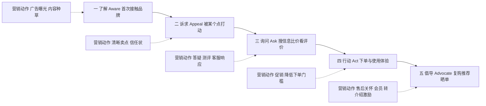

# 顾客旅程与漏斗：从 AIDA 到 5A

## 是什么

顾客不是「看见广告→立刻掏钱」的。一个人从第一次听说某个品牌，到下单、复购、主动推荐，中间要走过一串心理阶段，这串阶段就叫**顾客旅程（customer journey）**；把它画成上宽下窄的分层图形，就是**营销漏斗（funnel）**——每一层都有人掉队，走到最后的只是一小部分。

最早把这趟旅程模型化的是广告人 E. St. Elmo Lewis，他在 1898 年提出 AIDA：**注意（Attention）→兴趣（Interest）→欲望（Desire）→行动（Action）**，描述顾客从接触广告到下单的心理阶段，是最早的购买漏斗模型（M-023）。一百多年后，科特勒在《营销 4.0》（2017）中提出 5A 顾客路径：**了解（Aware）→诉求（Appeal）→询问（Ask）→行动（Act）→倡导（Advocate）**（M-024）。从 AIDA 到 5A，变的不是「顾客要经过几个阶段」这个直觉，而是两件大事：终点从「购买」延伸到了「拥护」，旅程从「单行线」变成了「往返跑」。

本篇讲三件事：两套经典阶段模型怎么对照着看、漏斗的转化率怎么算、以及漏斗思维什么时候管用、什么时候失灵。理解了旅程，才知道营销动作该排在哪个阶段——把「下单优惠」砸给连你名字都没听过的人，和在顾客已经付费后再也不理他，是同一种错误：站错了位置。

## AIDA 与 5A：两套阶段模型对照

AIDA 四个阶段回答的是「一个人怎么被一则广告说动」（M-023）：先抓住注意，再引发兴趣，兴趣累积成欲望，最后促成行动。它诞生于广告和上门推销的年代，所以终点停在「成交」——成交之后的事，模型不管。

5A 把镜头拉长到了社交网络时代（M-024）：

| 阶段 | 顾客在干什么 | 对应 AIDA |
|------|--------------|-----------|
| 了解 Aware | 第一次被动接触到品牌，知道「有这么个东西」 | 注意 |
| 诉求 Appeal | 品牌的某个点打动了他，产生好感与好奇 | 兴趣、欲望 |
| 询问 Ask | 主动搜信息、比价格、看评价、问朋友 | AIDA 没有的新阶段 |
| 行动 Act | 下单、使用、体验服务 | 行动 |
| 倡导 Advocate | 复购、推荐、晒单、产出 UGC，主动替品牌说话 | AIDA 没有的新阶段 |

5A 相对传统漏斗有两个关键区别（M-024）：

1. **终点从「购买」延伸到「拥护」**。购买不是旅程的结束，而是关系的开始：复购、推荐、用户自发内容，这些「买完之后」的行为在今天直接决定下一批顾客从哪来。
2. **顾客在各阶段之间反复往返，而非线性前进**。有人下了单又回去刷差评（行动→询问），有人用了半年才被朋友重新种草（倡导→诉求）。真实旅程是跳来跳去的，模型的箭头只是「典型路径」，不是规定路线。

下图把 5A 旅程和每个阶段对应的营销动作画在一起：

## 触点：旅程上的每一次接触

顾客在旅程的每个阶段，都会通过具体场景接触品牌，这些接触场景就是**触点（touchpoint）**。泛指来说：刷到一条短视频、搜到一篇评测、进店看到门头、下单收到的包装、售后接到的客服电话、老顾客在群里的一句推荐——都是触点。

触点管理的两个基本问题是：**每个阶段顾客最可能在哪个触点上卡住？那个触点上的体验配不配得上定位？** 例如「询问」阶段，顾客去搜你的名字，搜出来的是空白主页还是真实评价，直接决定他往「行动」走还是掉头；「倡导」阶段，顾客想推荐你却找不到一个顺手的转发理由或工具，推荐就不会发生。触点不需要多，需要的是在关键阶段不掉链子——这也是为什么漏斗分析必须落到触点，否则「转化率低」只是一句空话。

把五个阶段的典型触点和常见断点列成一张表，方便逐项排查（泛指举例）：

| 阶段 | 典型触点 | 常见断点 |
|------|----------|----------|
| 了解 | 广告、短视频、朋友偶然提及、门店招牌 | 看过即忘，不知道你是干什么的 |
| 诉求 | 种草内容、口碑帖、门店第一眼环境 | 卖点含糊，看不出和别人有何不同 |
| 询问 | 搜索结果、评价区、客服问答、比价页面 | 搜不到信息、评价造假感、问了没人答 |
| 行动 | 落地页、下单流程、收银台、店员话术 | 步骤多、价格意外、临门一脚没人推 |
| 倡导 | 售后回访、会员体系、包装、转介绍机制 | 用完没人理，想夸没渠道、推荐没好处 |

（M-024、M-025）

## 漏斗怎么算：转化率是连乘积

漏斗的通用结构是五层：**认知→考虑→转化→留存→推荐**（M-025）。每一层到下一层都有一个转化率，而**整体转化率是各层转化率的连乘积**（M-025）。

教学算例（数字均为假设）：一个四层转化的简化漏斗，每层到下一层的转化率都是 50%——

| 层级 | 本层人数 | 到下一层转化率 | 下一层人数 |
|------|----------|----------------|------------|
| 认知 | 10,000 人 | 50% | 5,000 人 |
| 考虑 | 5,000 人 | 50% | 2,500 人 |
| 转化 | 2,500 人 | 50% | 1,250 人 |
| 留存 | 1,250 人 | 50% | 625 人 |

从认知到留存共经过四次转化，整体转化率 = 0.5 × 0.5 × 0.5 × 0.5 = 0.0625 = **6.25%**（教学算例）。这就是漏斗最反直觉的地方：每层看起来都「还行」的转化率，连乘之后会缩得很小——四次 50% 最后只剩 6.25%；如果是五次转化各 50%，只剩 3.125%。

连乘积规律带来一个直接推论：**漏斗优化要先找漏损最大的那一层**（M-025）。假设三层转化率分别是 60%、10%、60%，把精力花在把 60% 提到 70%，整体只从 3.6% 升到 4.2%；而把 10% 修到 20%，整体直接翻倍到 7.2%（教学算例）。资源永远有限，先修最差的那一层——这就是漏斗思维的核心价值：它把「营销效果不好」这种模糊抱怨，变成「哪一层、哪个触点、掉了多少人」的可定位问题。

## 漏斗思维的价值与局限

**价值**：第一，分层度量，让营销从「凭感觉」变成「看数据」；第二，定位漏损最大的环节优先优化，而不是平均用力（M-025）；第三，强制团队对齐旅程语言——投放的人管认知，产品和销售管转化，客服和会员管留存推荐，漏斗让各环节知道自己在整条链路上的位置。

**局限**也要清楚：

- **线性假设**。漏斗画成单行线，暗示顾客逐层前进；5A 已经提醒我们，顾客会反复往返、跳层、回流（M-024）。把漏斗当精确地图，会漏掉「下单后又去查差评」这类回流行为。
- **容易忽略复购与推荐**。传统漏斗止于成交，但 5A 的终点是倡导（M-024）；只盯「转化」那一层，会把预算全堆在获客上，看不见老客复购和转介绍的价值——后者正是数字增长漏斗 AARRR 要修正的地方（见 [05 数字增长漏斗](05-growth-aarrr.md)）。
- **B2B 长周期决策不完全适用**。B2B 决策链长，使用者、影响者、决策者、采购者分离，一次采购可能历经数月、多人参与、反复论证（M-040），不是一个人沿漏斗顺滑下滑；这类场景更适合用「采购委员会的多角色旅程图」而非单一漏斗。
- **跨层归因难**。顾客今天刷到广告、下周搜评测、月底下单，哪一层算功劳？漏斗给的是分层视角，不是精确的归因答案。

## 怎么用：行动清单

1. 给你的生意画一遍五层漏斗：认知、考虑、转化、留存、推荐，每层写出顾客的具体行为标志（什么动作算进入了这一层）（M-025）。
2. 每层标一个可量化的转化率，用连乘积算出整体转化率；先别管数字好不好看，量起来是第一步（M-025）。
3. 找出转化率最低的一层，列出该层顾客经过的全部触点，逐个检查体验断点（M-025）。
4. 用 5A 自查旅程终点：你的营销动作覆盖到「倡导」层了吗？有没有给老客一个顺手的复购和推荐理由（M-024）？
5. 给关键阶段配动作：认知层靠曝光与内容、询问层靠口碑与答疑、行动层靠降低门槛、倡导层靠售后与会员激励（M-024）。
6. B2B 或高客单生意，把单一漏斗换成「多角色旅程图」，分别标出使用者、决策者、采购者各自的阶段和触点（M-040）。

## 常见坑与边界

- **只看最终成交数，不看分层转化率**：不知道人掉在哪一层，优化就只能靠拍脑袋加预算（M-025）。
- **把漏斗当单行线**：顾客会回流、跳层、反复比价，5A 的非线性特征在社交网络时代尤其明显（M-024）。
- **漏斗止于成交**：成交之后的留存、复购、推荐才是利润和便宜流量的来源，漏掉倡导层等于漏掉半条旅程（M-024）。
- **平均用力修漏斗**：连乘积结构决定了修最差一层的杠杆最大，逐层「都优化一点」是资源浪费（M-025）。
- **触点体验与定位脱节**：广告说「高端专业」，客服话术和包装却很粗糙——旅程上任何一个触点都是在兑现或透支定位（衔接 [02 定位与品牌](02-positioning-brand.md)）。

## 相关概念

- [05 数字增长漏斗：AARRR、PMF 与单位经济](05-growth-aarrr.md)：互联网产品把旅程改造成可逐周度量的增长指标。
- [01 STP 战略：市场细分、目标选择与定位](01-stp-strategy.md)：旅程的人群不同，阶段长短和触点也不同。
- [06 内容营销、私域与中国新营销形态](06-content-private-domain.md)：内容与私域分别作用于旅程的前半段和后半段。
- 全部事实出处见 [facts.md](../facts.md)，经典著作溯源见 [01-classics-and-frameworks.md](../references/01-classics-and-frameworks.md)。
