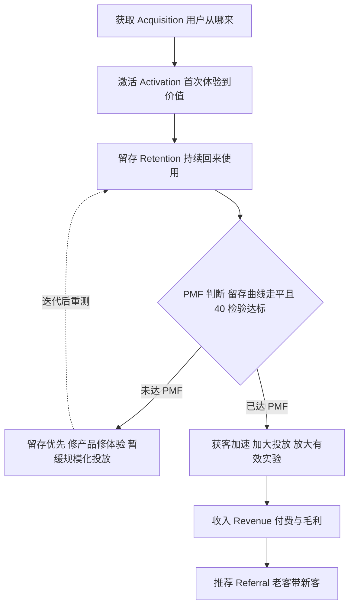

# 数字增长漏斗：AARRR、PMF 与单位经济

## 是什么

上一篇讲的 AIDA、5A 是描述顾客心理的旅程语言；到了互联网产品时代，营销人需要一套能逐周看数据、能直接指导实验的度量语言，这就是 **AARRR「海盗指标」**：获取（Acquisition）→激活（Activation）→留存（Retention）→收入（Revenue）→推荐（Referral）。它由戴夫·麦克卢尔 2007 年在《Startup Metrics for Pirates》中提出，成为互联网产品增长度量的通用骨架（M-026）。

但 AARRR 真正的价值不在五个字母，而在它逼你回答三个顺序问题：**产品留不留得住人（PMF）？一个顾客赚不赚钱（单位经济）？增长靠买还是靠传（获客与推荐）？** 增长黑客实践对 AARRR 的顺序做了著名修正——RARRA，把留存提到首位（M-027）；马克·安德森 2007 年推广的 PMF 概念解释了为什么要这么排：产品没有契合市场之前，砸钱获客等于往漏桶里倒水（M-028）。

本篇依次讲：AARRR 五层各看什么指标、为什么留存是先行信号、PMF 怎么判断、CAC/LTV 怎么算才知道一门生意成不成立、K 因子与北极星指标怎么用，最后是增长实验的节奏。

## AARRR 五层：每层看什么

| 层 | 回答的问题 | 常见指标（泛指） |
|----|------------|------------------|
| 获取 Acquisition | 用户从哪来 | 各渠道访问量、获客成本 CAC、点击率 |
| 激活 Activation | 第一次体验到价值了吗 | 注册完成率、新手关键动作完成率 |
| 留存 Retention | 还回来吗 | 次日/7 日/30 日留存、同期群留存曲线、流失率 |
| 收入 Revenue | 赚钱吗 | 客单价、付费转化率、复购率、LTV、ROAS |
| 推荐 Referral | 带新客吗 | K 因子、NPS 净推荐值、转介绍率 |

（M-026、M-029、M-030、M-031）

注意「激活」不是「注册」：用户下载了 App、填了手机号，不叫激活；完成了那个「啊哈时刻」的核心动作——比如内容产品刷到第一条满意内容、工具产品第一次成功使用——才算激活。激活定义错了，后面所有数据都是假的。

## RARRA：为什么留存要排第一

肖恩·埃利斯等增长实践者主张把漏斗顺序改成 **RARRA——留存优先**：没有留存，获取越多漏得越快（M-027）。道理很直白：100 个新人进来、95 个再不来，你花钱买的不是用户，是流失数字；留存修好之后，每一分获客投入才积累得下来。

留存怎么看？核心工具是**同期群留存曲线**：把同一时期进来的用户编成一组，看这批人随时间推移还有多少在活跃。健康产品的曲线会在某个时点**走平**——留下一批稳定使用的核心用户；曲线一路下滑到零，说明产品只是个一次性玩具。所以留存率、尤其同期群曲线是否走平，是产品有没有 PMF 的**先行指标**（M-027）——它比收入更早说话，因为收入可以靠补贴和硬推暂时撑起来，留存骗不了人。

## PMF：产品—市场契合

PMF（Product-Market Fit）概念由马克·安德森在 2007 年博文《The Only Thing That Matters》中推广：产品满足了一个好市场中的好需求，表现为需求自然拉动、用户自发传播、增长不靠硬推（M-028）。反过来说，没到 PMF 时，用户夸完就走、增长全靠买量、团队怎么使劲都觉得「推不动」。

PMF 有两个常用判断信号（M-027、M-028）：

1. **留存曲线走平**：前面说的同期群曲线出现稳定的核心用户群。
2. **40% 检验**：肖恩·埃利斯给出的经验检验——问用户「如果不能再使用这个产品，你会非常失望吗」，若回答「非常失望」的用户占比达到 **40% 左右**，视为达到 PMF 的信号（M-028）。

最关键的一条纪律是：**PMF 之前规模化投放是浪费**（M-028）。产品还没留住人就猛砸广告，是往漏桶里倒水——桶底修好（留存）之前，倒水越快亏得越多。PMF 前后的增长重心完全不同：

## 单位经济：CAC 与 LTV

增长故事讲得再热闹，最后要过一道算术题：**一个顾客赚不赚钱**。两个核心指标（M-030）：

- **CAC（获客成本）**= 获客总投入 ÷ 新增客户数。
- **LTV（客户终身价值）**= 一个客户在全生命周期内贡献的**毛利**总额（注意是毛利，不是流水）。

经验健康线：**LTV/CAC ≥ 3**，即一个客户终身贡献的毛利至少是获取成本的三倍；**CAC 回收期**（多久赚回获客成本）通常要求短于 12 个月——这是 SaaS 行业经验值，不同行业差异很大（M-030）。LTV/CAC 接近 1，说明每单赚的钱刚够买客，一有波动就亏；远低于 1，就是卖一单亏一单，增长越快死得越快；太高（比如大于 10）也未必是好事，往往说明获客投入太保守、在让出市场。

教学算例（数字均为假设）：某生意 CAC = 200 元，客单价 100 元，毛利率 50%，顾客平均年购买 3 次、生命周期按 1 年估算——

- 单次购买毛利 = 100 × 50% = 50 元；
- 年度毛利（LTV 口径）= 50 × 3 = **150 元**；
- LTV/CAC = 150 ÷ 200 = **0.75**。

判断：0.75 < 1，意味着获取一个客户花 200 元、一年只能从他身上赚回 150 元毛利——**每获一个客都在亏钱**，回收期超过一年（教学算例）。这时候正确的反应不是加投放，而是回到漏斗前面：要么提客单价或复购（做大 LTV），要么修转化率、换便宜渠道（做小 CAC），要么承认产品还没到 PMF。完整演算练习见 [examples/02 漏斗与单位经济算例手册](../examples/02-funnel-metrics-playbook.md)。

## K 因子、NPS 与北极星指标

**K 因子**度量病毒传播：K = 每个用户发出的邀请数 × 邀请转化率（M-029）。K > 1 时传播可自增长——每个老用户平均带来一个以上新用户，增长能靠产品自身滚起来；K < 1 时传播链条逐轮衰减，必须持续外部投放维持增长（M-029）。推荐环节的用户意愿还可用 **NPS（净推荐值，Reichheld 提出）** 度量：用户有多大意愿把产品推荐给别人（M-029）。

效果度量的常用指标还有转化率、ROAS（广告支出回报 = 广告带来的收入 ÷ 广告费）、ROI、客单价、复购率、流失率（M-031）。指标多了容易各看各的，所以需要一个**北极星指标**：最能代表产品向顾客持续交付价值的**单一领先指标**，例如 Airbnb 用预订间夜数（M-031）。选北极星的标准是：它变好，说明顾客真的得到了更多价值，而不只是公司多赚了钱——所以「累计注册用户数」通常不是好北极星（注册了不来也计入），「每周完成核心动作的活跃用户数」更接近。

## 增长实验：假设—实验—度量—放大或放弃

指标体系搭好之后，增长靠的是高频实验运转：**A/B 测试**（同时分流两个版本比较指标）、**对照组 holdout**（留一部分用户不触达，评估动作的真实增量）、**灰度发布**（小范围先上线）（M-036）。团队以「**假设—实验—度量—放大/放弃**」的节奏循环：先提出可证伪的假设（「把新用户引导从 6 步缩到 3 步，激活率会提升」），上线实验，用预设指标判断，胜出版本全量放大、失败版本果断放弃（M-036）。两条纪律：每个实验**预设判断指标与最小样本量**，否则数据不够就下结论是自欺；一次只动一个变量，否则不知道是谁起了作用。

## 怎么用：行动清单

1. 按 AARRR 五层各定一个你能拿到数据的核心指标，先填「哪层没有数据」这个空白（M-026）。
2. 定义你的「激活动作」：用户完成什么动作算第一次体验到价值？把它和「注册」区分开（M-026）。
3. 拉同期群留存曲线：曲线走平了吗？没走平之前，把「加大投放」从议程上拿掉（M-027、M-028）。
4. 算一遍单位经济：CAC 是多少、LTV 是多少、LTV/CAC 过不过 3、回收期几个月？算不过来就先修模型再谈增长（M-030）。
5. 给产品选一个北极星指标，要求它同时反映顾客价值与公司增长（M-031）。
6. 把本月的增长动作改成实验格式：假设、变量、判断指标、最小样本量，跑完按「放大/放弃」归档（M-036）。

## 常见坑与边界

- **没到 PMF 就猛投广告**：漏桶倒水，规模越大亏得越多，这是最贵的增长错误（M-028）。
- **把注册当激活、把下载当用户**：虚荣指标好看，留存曲线一拉全露馅（M-026、M-027）。
- **LTV 用流水而非毛利算**：把收入当利润，LTV/CAC 虚高，实际卖一单亏一单（M-030）。
- **迷信行业基准数字**：LTV/CAC ≥ 3、回收期 12 个月是跨行业经验线，具体行业差异极大，健康线要按自己的成本结构算（M-030）。
- **实验不设样本量和判断指标**：跑两天看哪个数字顺眼就信哪个，等于用数据给偏见盖章（M-036）。
- **有 K 因子幻想没 K 因子的命**：K > 1 是少数产品的奢侈品，多数生意 K < 1，老老实实算 CAC、靠留存和复购摊薄成本（M-029）。

## 相关概念

- [04 顾客旅程与漏斗：从 AIDA 到 5A](04-customer-journey.md)：AARRR 是数字产品版的漏斗，5A 强调的「倡导」对应这里的推荐层。
- [06 内容营销、私域与中国新营销形态](06-content-private-domain.md)：内容与私域是压低 CAC、做厚 LTV 的主要战术。
- [07 营销策划、预算、定价心理与合规红线](07-planning-budget-compliance.md)：增长实验如何嵌入策划全流程与合规关卡。
- 全部事实出处见 [facts.md](../facts.md)，经典著作溯源见 [01-classics-and-frameworks.md](../references/01-classics-and-frameworks.md)。
