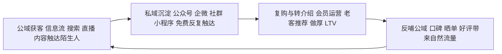

# 内容营销、私域与中国新营销形态

## 是什么

数字时代营销战术的变化最热闹，但拆开看只有一条主线：**流量越来越贵，「自己拥有的注意力」越来越值钱**。围绕这条主线，长出了两组战术——一组是「买流量」的数字广告，一组是「攒资产」的内容营销与私域运营；再叠加中国市场特有的 KOL、种草、直播、兴趣电商形态，以及 2023 年起进入生产链的 AIGC，构成了今天的新营销版图（M-032~M-035）。

**内容营销**：以对目标顾客有用的内容（文章、视频、直播、白皮书）吸引和留住受众，而非直接打断式推销；内容营销学院（Content Marketing Institute）的定义强调「持续创造与分发有价值、相关、一致的内容」（M-033）。三个关键词缺一不可：有价值（对顾客有用，不是自夸）、相关（对着目标人群）、一致（长期持续，不是发三条就停）。

**私域**：中国市场对应的突出形态——通过微信公众号、企业微信、社群、小程序等可**免费、反复、直接触达**的渠道沉淀顾客资产，与依赖平台采买的公域流量相对（M-033）。公域的流量是租来的：停投即停流，规则平台定；私域的注意力是攒下的：一次沉淀，反复触达。本篇讲清公域怎么买、私域怎么攒、中国特有的内容电商形态怎么理解、AIGC 带来什么变化，最后给一张串起全部要素的飞轮图。

## 数字广告：形态与计价

数字广告的主要形态（M-032）：

| 形态 | 是什么 | 目标 |
|------|--------|------|
| 搜索营销 SEM | 竞价排名，用户搜关键词时展示广告 | 接住已有需求，转化导向 |
| 搜索引擎优化 SEO | 不靠竞价，赚取自然搜索流量 | 长期免费流量，见效慢 |
| 信息流广告 | 嵌入内容流、按算法定向推送 | 激发潜在需求，规模化获客 |
| 效果广告 | 按转化或点击计价 | 直接要成交、要留资 |
| 品牌广告 | 按曝光计价 | 建心智、建认知，偏长期 |

计价方式三种（M-032）：**CPM** 按千次曝光付费（适合品牌曝光）、**CPC** 按每次点击付费（适合引流）、**CPA/CPS** 按每次行动或成交付费（适合效果转化）。计价方式对应漏斗位置：CPM 买的是「认知层的看见」，CPC 买的是「考虑层的到访」，CPA 买的是「转化层的行动」。一个常见错误是用 CPM 思维考核成交、用 CPA 预算做品牌——目标和计价错配，钱花了还说不清效果。

## 公域与私域：租流量 vs 攒资产

公域（平台广告、搜索、信息流）解决「被更多陌生人看见」，私域（公众号、企业微信、社群、小程序）解决「把见过的人留下来、反复服务」（M-033）。两者不是替代关系，而是前后接力：公域负责获客，私域负责留存、复购和转介绍——正好对应漏斗的前半段和后半段（见 [04 顾客旅程与漏斗](04-customer-journey.md)）。

私域的财务意义要挂到单位经济上理解：公域获客的 CAC 随流量价格水涨船高，而私域里的复购和转介绍几乎不花渠道费，直接做厚 LTV、摊薄 CAC（M-030，见 [05 数字增长漏斗](05-growth-aarrr.md)）。但私域不是「拉个群发广告」：内容营销定义里的「有价值、相关、一致」同样适用于社群——群里只有促销链接，顾客会用退群投票。

## 中国特有形态：KOL、种草、直播与兴趣电商

中国电商与内容生态长出了一批特有形态（M-034）：

- **KOL（关键意见领袖）/KOC（关键意见消费者）**：前者是有专业度或粉丝量的头部创作者，背书力强；后者是普通消费者身份的真实分享，信任度高、单价低。两者对应 5A 旅程里「询问」阶段的口碑需求（M-024）。
- **「种草」**：用内容激发欲望——顾客本来没打算买，刷到内容后「被种了草」，主动去搜、去比、去下单。
- **直播电商**：把讲解、演示、促销、下单压缩在同一个实时场景里，缩短从诉求到行动的路径。
- **兴趣电商**：抖音电商于 **2021 年**提出「兴趣电商」概念——以内容激发潜在兴趣、「货找人」，与传统「搜索—比价」的货架电商（「人找货」）形成补充（M-034）。

理解「货找人」就理解了内容电商与传统电商的分工：货架电商承接的是**明确需求**（顾客知道自己要买什么，去搜、去比）；兴趣电商激发的是**潜在需求**（顾客本来没想买，被内容唤起欲望）。前者对应 SEM 逻辑，后者对应信息流逻辑。

## AIGC 进入营销生产链

2023 年起，大语言模型与图像、视频生成模型规模化用于文案、素材、短视频、客服与个性化推荐内容生产，显著降低内容供给成本、提升「千人千面」的内容密度（M-035）。内容营销本来就要求「持续、一致」地供给内容（M-033），AIGC 把供给成本打下来，让小团队也能维持高频内容生产。

但风险同样明确（M-035）：

- **同质化**：人人都用相似工具生产相似内容，「有价值、相关」的门槛反而提高——稀缺的不再是内容产量，而是独特经验和真实观点。
- **虚假宣传**：AI 生成的「用户评价」「使用效果」若与事实不符，落入虚假广告与虚假宣传的监管范围（M-042、M-046）。
- **版权合规**：生成内容的版权归属与训练素材授权仍在快速演化，商用前需谨慎（本包不做具体判例断言）。

## 土壤与时效：11 亿网民与骨架分层

这些形态为什么在中国市场格外发达？CNNIC 历次《中国互联网络发展状况统计报告》显示，中国网民规模已超过 **11 亿**、网络购物与网络支付用户超 9 亿（具体数字以 CNNIC 最新一期报告为准）；移动互联网渗透率全球领先，是私域、直播、移动支付闭环这套方法论生长的土壤（M-045）。

最后必须分清什么会过时、什么不会：STP、4P、定位、漏斗、AIDA 是跨周期的思维骨架，数十年有效；具体平台的算法、流量成本、投放后台玩法以季度为单位过时（M-047）。本篇里的「私域怎么在某个具体 App 里操作」「某个平台当前的投放规则」都属于技巧层，不在本包断言范围内；学习投资应优先骨架层，把技巧层当作持续跟踪项（M-047）。

飞轮的逻辑：公域花钱买来的顾客，沉淀进私域后通过持续内容和服务产生复购、推荐与晒单；这些口碑内容又成为公域里最便宜的信任状和自然流量，让下一轮公域获客成本更低。飞轮转不起来的卡点通常有两个：公域流量不往私域导（租来的流量用完即弃），或私域只发广告不提供价值（沉淀下来的人迅速流失）。

## 怎么用：行动清单

1. 先分清手上每个动作属于哪段：公域买量管获客，内容和私域管留存复购，别用一类预算考核另一类目标（M-032、M-033）。
2. 检查计价方式与目标是否匹配：曝光目标用 CPM、引流用 CPC、转化用 CPA，错配就是糊涂账（M-032）。
3. 给内容营销立三条纪律：对顾客有用、对着目标人群、长期持续更新；把「自夸型宣传」从内容计划里删掉（M-033）。
4. 设计公域到私域的承接动作：每个广告、每笔订单、每次直播后，给顾客一个进入私域的理由和入口（M-033）。
5. 盘点你的「货找人」机会：除了等顾客搜索，哪些潜在需求可以被内容主动激发（M-034）？
6. 用 AIGC 提效但加三道闸：事实核验、极限词与虚假宣传排查、素材版权确认（M-035、M-042）。
7. 每季度更新一次平台技巧认知，但不要追着技巧改战略——骨架层按年复盘（M-047）。

## 常见坑与边界

- **把私域当免费广告频道**：群里只有促销和转发，顾客迅速退群；私域的前提是持续提供价值（M-033）。
- **只买公域不沉淀**：流量是租来的，停投即停流，CAC 永远降不下来（M-030、M-033）。
- **效果广告考核品牌目标**：用 CPA 的钱要求「建立品牌认知」，或用 CPM 的曝光量自欺成交，都是目标与计价错配（M-032）。
- **迷信 KOL 流量不看相关性**：种草有效的前提是人群和场景相关，粉丝量不等于信任度（M-034）。
- **AIGC 直接发稿不核验**：AI 生成的「事实」可能出错，虚假评价和极限词还会直接触发广告法责任（M-035、M-042）。
- **把平台技巧当方法论**：后台玩法以季度过时，投在追技巧上的精力远不如先把漏斗和单位经济算通（M-047）。

## 相关概念

- [04 顾客旅程与漏斗：从 AIDA 到 5A](04-customer-journey.md)：内容作用于认知与诉求层，私域作用于留存与倡导层。
- [05 数字增长漏斗：AARRR、PMF 与单位经济](05-growth-aarrr.md)：私域复购做厚 LTV、口碑推荐压低 CAC 的度量逻辑。
- [07 营销策划、预算、定价心理与合规红线](07-planning-budget-compliance.md)：内容与广告素材上线前必须过的合规关卡。
- 全部事实出处见 [facts.md](../facts.md)，经典著作溯源见 [01-classics-and-frameworks.md](../references/01-classics-and-frameworks.md)。
