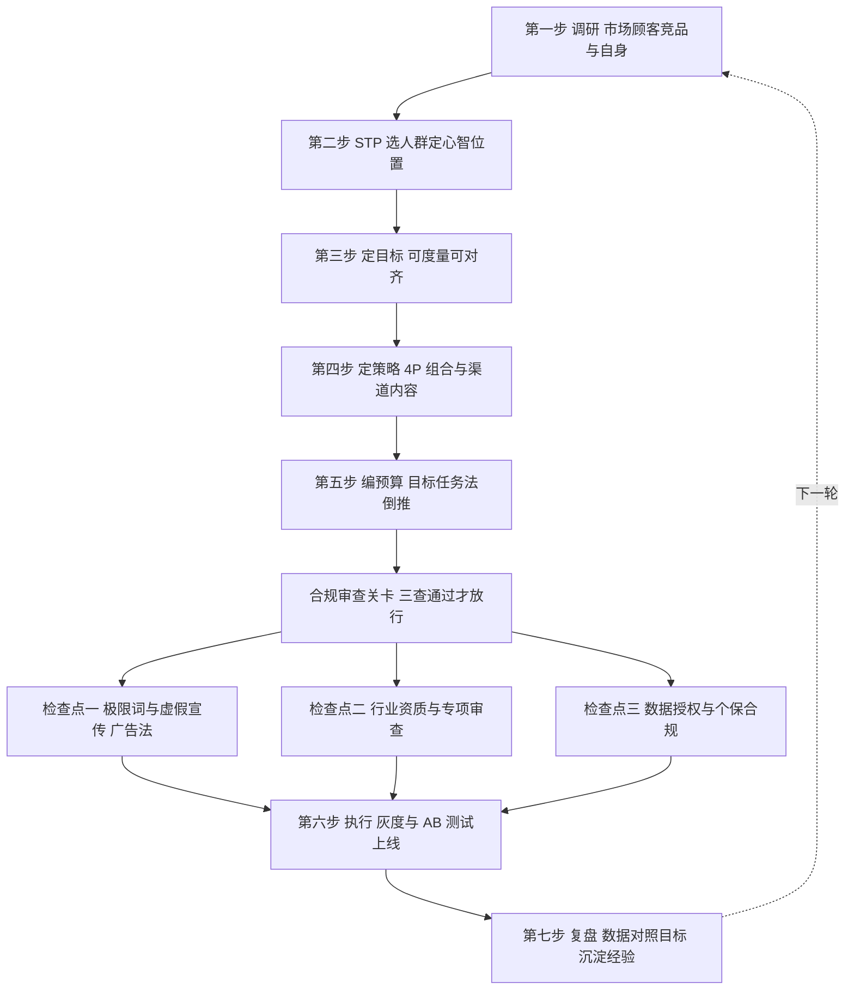

# 营销策划、预算、定价心理与合规红线

## 是什么

前面六篇给的是零件：营销观念（[00](00-what-is-marketing.md)）、STP 战略（[01](01-stp-strategy.md)）、品牌定位（[02](02-positioning-brand.md)）、4P/4C 战术（[03](03-4p-4c-tactics.md)）、顾客旅程（[04](04-customer-journey.md)）、增长漏斗与单位经济（[05](05-growth-aarrr.md)）、内容与私域（[06](06-content-private-domain.md)）。本篇做总装：一次完整的营销策划怎么从调研走到复盘，预算怎么编，增长方向怎么选，定价有哪些心理技巧可用，以及哪些线绝对不能碰——广告法、个人信息保护法和行业专项审查（M-042~M-044、M-046）。

策划的本质是把「想做的事」排成一条有先后、可检查、能复盘的流程。流程的价值不在于漂亮文档，而在于**强制顺序**：先有人群和定位再花钱，先过合规再上线，先定目标再复盘——顺序错了，每一步都在给前面的错误擦屁股。

## 策划全流程：七步走

| 步骤 | 干什么 | 对应框架 |
|------|--------|----------|
| 1 调研 | 看市场、看顾客、看竞品、看自己 | 顾客与行为数据（M-007） |
| 2 STP | 细分市场、选目标人群、定心智位置 | STP（M-006~M-011） |
| 3 定目标 | 目标可度量、有期限、能对齐团队 | 北极星指标（M-031） |
| 4 定策略 | 用什么产品、价格、渠道、内容组合 | 4P/4C（M-012~M-017） |
| 5 编预算 | 按目标倒推或按规则分摊费用 | 预算四法（M-037） |
| 6 执行 | 素材制作、灰度上线、实验迭代 | 增长实验（M-036） |
| 7 复盘 | 数据对照目标，沉淀经验再进入下一轮 | ROAS/ROI（M-031） |

执行环节要用增长实验的节奏代替「一次性大投放」：以「假设—实验—度量—放大/放弃」推进，A/B 测试、对照组、灰度发布轮流上，每个实验预设判断指标与最小样本量（M-036）。复盘不是写总结，是回答三个问题：目标差在哪、漏斗哪一层漏得最多（M-025）、下一轮改哪个动作。

## 预算四法：怎么编营销预算

科特勒体系给出四种预算编制方法（M-037）：

| 方法 | 怎么编 | 优点 | 缺点 |
|------|--------|------|------|
| 销售额百分比法 | 按预期或历史销售额提固定比例 | 简单、与支付能力挂钩 | 逻辑倒置：销售好才有钱做营销，而营销本是为了做销售 |
| 量入为出法 | 看兜里还剩多少就花多少 | 小公司保命 | 营销投入随现金流波动，无法支撑长期建设 |
| 竞争对等法 | 对标竞品的投放力度 | 不落下风、维持行业声量 | 对手的目标和资源未必和你一样，盲目跟跑 |
| 目标任务法 | 先定目标、拆任务、再倒推预算 | 逻辑最顺：目标决定任务，任务决定费用 | 费时费力，要求目标和任务拆得足够具体 |

目标任务法是科特勒推荐的逻辑顺序（M-037）：先明确「要让多少目标顾客完成什么动作」，再拆「需要哪些渠道和内容触点」，最后给每项任务标价加总。它逼你把预算和漏斗挂钩——认知层缺多少曝光、转化层差多少转化率，预算就是补这些缺口的价格。

## 增长方向：安索夫矩阵与 SWOT

预算解决「花多少」，方向解决「往哪增长」。两个经典工具：

**安索夫矩阵**（Igor Ansoff，1957）以「现有/新产品」×「现有/新市场」给出四个象限（M-038）：

|  | 现有产品 | 新产品 |
|--|----------|--------|
| **现有市场** | 市场渗透：让老顾客多买、抢对手顾客 | 产品开发：给老市场推新品 |
| **新市场** | 市场开发：老产品找新人群、新区域 | 多元化：新产品打新市场 |

四象限里**多元化风险最高**——产品和市场两头都陌生，等于同时跳进两个不确定（M-038）。对中小企业的通常建议是从市场渗透起步，沿矩阵的边一格一格挪，避免对角跳。

**SWOT 分析**：优势（Strengths）、劣势（Weaknesses）、机会（Opportunities）、威胁（Threats）；框架成型于 20 世纪 60 年代斯坦福研究院的企业战略研究，经肯尼斯·安德鲁斯《公司战略概念》（1971）推广（M-039）。SWOT 本身只是一张清单，真正的价值在于**交叉策略**（M-039）：

- **SO 增长**：用优势抓机会（例如私域运营能力强，赶上内容电商红利）；
- **WO 改进**：补短板以接机会；
- **ST 防御**：用优势化解威胁；
- **WT 规避**：劣势撞上威胁，收缩回避。

只列 S/W/O/T 四个清单而不做交叉，等于体检完不看报告。

## 对谁做：B2B 与 B2C 的差异

同样的流程，对象不同打法不同（M-040）：

| 维度 | B2B | B2C |
|------|-----|-----|
| 决策链 | 长，使用者、影响者、决策者、采购者分离 | 短，个人或家庭快速决策 |
| 决策依据 | 理性，看重 ROI 与风险 | 情感与品牌权重高 |
| 客户结构 | 数量少、单客价值高 | 数量大、单客价值低 |
| 内容要求 | 专业深度：白皮书、案例、试用 | 大众媒介与电商触点为主 |

（M-040）

B2B 的营销动作要对着「采购委员会」设计：给使用者做体验、给决策者算 ROI、给采购者备资质与合规文件；旅程也不是个人漏斗，而是多角色长周期决策（M-040，见 [04 顾客旅程](04-customer-journey.md) 的边界说明）。

## 定价心理：四个技巧与一条边界

定价环节有四个被行为经济学反复验证的心理技巧（M-041）：

1. **锚定效应**：先给一个高价参照（原价、划线价、高端款），再让目标价格显得划算。
2. **诱饵效应**：加入一个明显不划算的选项，衬托目标选项——泛指来说，三档套餐里中间档往往是真正想卖的，低档和高档共同构成诱饵。
3. **心理定价（尾数定价）**：9.9 元而非 10 元，利用左位数感知让价格显得更低。
4. **损失框架**：「限时优惠即将结束」——强调「不买就失去」比「买了能得到」更能推动行动。

边界只有一条但必须记住：**这些技巧有效，但过度使用损害信任**（M-041）。天天「限时」就没有限时，虚构原价划线则直接越线成为欺骗性定价——既违反伦理底线，也触碰广告法与反不正当竞争的监管红线（M-046）。技巧是调味料，不是主菜；主菜永远是产品对不对、价值够不够。

## 合规红线：三条线加一条底线

营销可以创意奔放，合规不能赌。三条硬线：

**1. 广告法（M-042）**。《中华人民共和国广告法》1994 年通过，现行版本为 2015 年修订（2015-09-01 施行，后经 2018、2021 年修正）；第九条明确禁止使用「国家级」「最高级」「最佳」等绝对化用语（俗称「极限词」），并对虚假广告、未经证实的数据与统计、未取得资质的医疗/金融广告等设处罚条款（M-042）。实务含义：文案里「最、第一、国家级、顶级、极致」这类词逐个排查；宣传数据必须有真实可查的依据。

**2. 个人信息保护法（M-043）**。《中华人民共和国个人信息保护法》2021-08-20 通过、2021-11-01 施行：处理个人信息须取得同意（敏感信息需单独同意）、遵循最小必要原则、明示目的与方式；数字营销中的用户画像、精准推送、数据采集（Cookie、表单、通讯录）均受约束，**用户有权拒绝个性化推送**（M-043）。实务含义：授权要勾选而非默认，采集要克制，推送要给退订入口。

**3. 专项行业审查（M-044）**。金融、医疗、教育、保健食品等行业广告有专项审查与资质要求——例如金融广告不得承诺收益、保健食品不得宣称疗效；营销素材中的数据、引语、对比性宣传须有真实可查的依据（M-044）。

再加一条伦理底线（M-046）：不得虚假宣传、不得欺骗性定价（虚构原价）、不得利用未成年人与弱势群体、不得违法处理个人数据；短期「转化技巧」与长期品牌信任之间存在权衡，刷单炒信、虚构评价既是伦理问题也受反不正当竞争法规制。创意可以野，合规不能赌——上线前的合规审查应当是流程里的强制关卡，而不是可选项。

可直接对照执行的上线前清单见 [examples/03 营销活动上线全流程清单](../examples/03-campaign-launch-checklist.md)。

## 怎么用：行动清单

1. 把下一次营销活动按七步流程排期表，缺步骤的先补——尤其是「定目标」和「复盘」最容易被省掉（M-031）。
2. 今年预算改用目标任务法试编一次：目标→任务→费用，再和销售额百分比法的结果对照差异（M-037）。
3. 用安索夫矩阵标出当前增长动作落在哪个象限，确认没有盲目跳多元化（M-038）。
4. 给企业做一次 SWOT 交叉：每个象限至少写出 SO/WO/ST/WT 各一条策略（M-039）。
5. 定价技巧逐个对照自查：锚点真实吗？诱饵厚道吗？尾数用得适度吗？「限时」是真限时吗（M-041）？
6. 所有素材上线前过三道合规检查：极限词逐词排查、行业资质确认、数据授权与退订入口确认（M-042、M-043、M-044）。

## 常见坑与边界

- **跳过 STP 直接做活动**：没想清楚对谁说话、占什么词，预算和创意都是无的放矢（M-010）。
- **预算用销售额百分比法还倒因为果**：生意差时砍营销预算，越砍越差；目标任务法才是逻辑顺序（M-037）。
- **SWOT 列完就存档**：不做 SO/WO/ST/WT 交叉策略，清单毫无价值（M-039）。
- **B2B 照搬 B2C 打法**：用大众投放打采购委员会，内容没有 ROI 论证和资质材料，决策链上没人接得住（M-040）。
- **定价技巧越界成欺诈**：虚构原价、虚假限时、编造数据，短期提转化，长期是行政处罚加品牌信任双输（M-041、M-042、M-046）。
- **合规事后补救**：素材发出去再删，处罚记录和截图已经留下；合规必须是上线前的强制关卡（M-042、M-043、M-044）。

> 免责声明：本篇为营销通识教育材料，不构成对任何具体行业、企业或项目的经营与合规建议；涉及合规的具体情境，以监管部门最新规定与专业法律意见为准（截至 2026-09，M-048）。

## 相关概念

- [01 STP 战略：市场细分、目标选择与定位](01-stp-strategy.md) 与 [02 定位与品牌](02-positioning-brand.md)：策划流程第二步的展开。
- [03 4P 与 4C：营销战术组合](03-4p-4c-tactics.md)：策略步骤的战术清单。
- [05 数字增长漏斗：AARRR、PMF 与单位经济](05-growth-aarrr.md)：目标与复盘环节的度量语言。
- 实战模板见 [examples/01 STP 与定位工作坊](../examples/01-stp-positioning-workshop.md)、[examples/02 漏斗与单位经济算例手册](../examples/02-funnel-metrics-playbook.md)、[examples/03 营销活动上线全流程清单](../examples/03-campaign-launch-checklist.md)。
- 全部事实出处见 [facts.md](../facts.md)，经典著作溯源见 [01-classics-and-frameworks.md](../references/01-classics-and-frameworks.md)。
