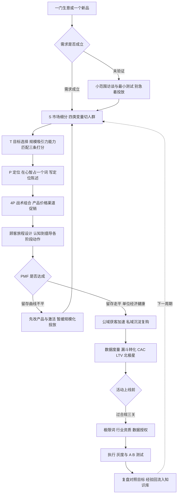

# 架构洞察（Architecture Insights）

> 基于 [事实清单](facts.md) 提炼。每条洞察按「陈述 / 证据 / 反常识点 / 行动启示」四元组组织；事实以 M 编号溯源，洞察为实务判断，不构成具体经营建议。

## 洞察 1：营销的主语是顾客——营销短视症是组织级慢性病

| 四元组 | 内容 |
|--------|------|
| **陈述** | 营销与推销方向相反：推销从卖方现有产品出发，营销从买方需求出发组织全链路（M-004）；德鲁克把创造顾客定义为企业唯一有效目的（M-001），莱维特指出衰退企业的共同病因是把自己定义为「生产某种产品」而非「满足某种需求」（M-003）。 |
| **证据** | M-001（德鲁克 1954：营销与创新是仅有的两项创造成果的职能）、M-003（莱维特 1960《营销短视症》：铁路 vs 运输）、M-002（观念演进五阶段）、M-005（需要/欲望/需求三分：营销不创造需要，只影响欲望）。 |
| **反常识点** | 企业内部最常讨论的是「我们的产品怎么做、怎么卖」，而顾客付钱买的从来不是产品本身——买钻头的人要的是墙上的洞。越以产品自豪的团队越容易短视：把「我们技术更强」等同于「顾客更需要」，在需求迁移时集体失明。 |
| **行动启示** | 每季度做一次「业务定义重写」：把「我们是做 X 的」改写成「我们帮谁解决什么问题」；新品评审第一问从「它有什么功能」改为「它替代了顾客的哪个旧方案」；营销文案先写顾客场景，再写产品参数。 |

## 洞察 2：战略的本质是取舍——STP 回答的是「不做谁的生意」

| 四元组 | 内容 |
|--------|------|
| **陈述** | STP 三步中，S 与 T 决定战场、P 决定心智位置，定位之后才轮到 4P 战术（M-010）；细分市场五种覆盖模式与三种组合策略（M-008）的真正功能是逼迫企业放弃一部分市场。 |
| **证据** | M-006（史密斯 1956 市场细分）、M-007（地理/人口/心理/行为四类变量）、M-008（五种覆盖模式+三种组合策略，选择依据三条）、M-009（定位战场在心智）、M-011（定位陈述模板）。 |
| **反常识点** | 新手做营销想的是「怎么让所有人都买我」，成熟营销想的是「怎么让非目标用户主动放弃我」——资源有限时服务所有人等于在每个战场以少打多；「这些人群我都要」不是雄心，是没做战略。定位陈述也一样：写在内部文件里的定位越像广告语，说明战略越没想清楚（M-011）。 |
| **行动启示** | 用 [STP 工作坊模板](examples/01-stp-positioning-workshop.md) 走一遍：四类变量给顾客画像→3–5 个细分块按规模/吸引力/能力匹配三条打分→只选一块主攻→写出「对谁、是什么品类、凭什么不同」的定位陈述，再让 4P 每个动作对齐那个「词」。 |

## 洞察 3：心智战是非对称的——成为第一胜过做得更好

| 四元组 | 内容 |
|--------|------|
| **陈述** | 定位理论主张营销终极战场在顾客心智（M-009）；心智有五条运作规律——容量有限、厌恶混乱、缺乏安全感、难以改变、会失去焦点（M-021）；品牌资产（CBBE 金字塔、艾克五要素）是心智位置的长期沉淀（M-019、M-020）。 |
| **证据** | M-009（里斯与特劳特 1972/1981）、M-021（心智五规律与领先法则）、M-022（四种差异化来源必须顾客在乎、对手没有、自己能兑现）、M-019（凯勒 1998 CBBE 六层金字塔）、M-020（艾克 1991 品牌资产五要素）。 |
| **反常识点** | 「产品更好就该卖得更好」是产品观念的幻觉——心智先入为主后，后来者的「更好」会被当成「模仿者的自夸」；改变顾客既有认知的成本远高于利用既有认知（教育市场是最贵的营销）。品牌延伸看起来能借力，实际稀释焦点（M-021），一个名字代表一个词时品牌最有力。 |
| **行动启示** | 定位找「空位」而非找「更好」：新品类里抢第一、成熟品类里对立领导者（特性对立）、或聚焦一个细分场景；所有传播物料只重复一个核心词，年度检查品牌延伸是否让认知失焦；差异化三问（顾客在乎吗、对手没有吗、我们能长期兑现吗）不过关的卖点不投放。 |

## 洞察 4：框架是检查清单不是答案——骨架跨周期，技巧按季度过期

| 四元组 | 内容 |
|--------|------|
| **陈述** | 4P/4C/7P（M-012~M-018）、安索夫矩阵（M-038）、SWOT（M-039）等框架的价值是保证「不漏想」，不保证「想得对」；营销知识存在时效分层——战略骨架数十年有效，平台玩法以季度过时（M-047）。 |
| **证据** | M-012（麦卡锡 1960 提出 4P）、M-017（劳特朋 1990 的 4C 是视角补充而非取代）、M-018（服务 7P）、M-038（安索夫 1957 四象限风险递增）、M-039（SWOT 价值在交叉策略而非列清单）、M-047（骨架/技巧分层）。 |
| **反常识点** | 学营销的人最容易两种走偏：一种是囤框架、套模型，把 SWOT 填满就以为战略完成（清单不是结论）；另一种是追热点、学黑话，平台规则一变全部归零。4C 没有「打败」4P，新框架也几乎从不真正推翻旧框架——它们大多只是换了视角或加了维度。 |
| **行动启示** | 建两层知识系统：骨架层（STP、定位、4P、漏斗、单位经济）反复练到条件反射，技巧层（投放后台、算法、流量玩法）按季度跟踪、用完即弃；每次策划先用框架过一遍完整性，再用数据验证判断对错——框架负责不出局，数据负责定输赢。 |

## 洞察 5：增长的杠杆在留存——PMF 之前买流量是给漏水的桶加水

| 四元组 | 内容 |
|--------|------|
| **陈述** | AARRR 把增长拆成获取/激活/留存/收入/推荐五层（M-026），增长实践者修正顺序为 RARRA——留存先行（M-027）；没有 PMF 时规模化获客是浪费（M-028）；单位经济（CAC/LTV、回收期）是判断增长是否健康的算术底线（M-030）。 |
| **证据** | M-026（麦克卢尔 2007 海盗指标）、M-027（留存曲线走平是 PMF 先行信号）、M-028（安德森 2007 PMF、埃利斯 40% 检验）、M-030（LTV/CAC≥3 经验线与回收期）、M-029（K 因子）、M-031（北极星指标）、M-025（漏斗转化率连乘积）。 |
| **反常识点** | 增长团队最显眼的动作是投放获客，但漏斗是连乘积结构（M-025）：留存漏损 50% 的产品，获客加倍只是让漏走的人加倍——获客成本是确定的，漏损用户是沉没的。把预算花在获取「留不住的用户」上，规模越大亏得越快；而留存改进同时抬升 LTV、口碑与自然推荐（M-029），是唯一三重杠杆。 |
| **行动启示** | 增长诊断先看同期群留存曲线是否走平，没走平先改产品别急着加预算；每个投放决策先过单位经济（[算例手册](examples/02-funnel-metrics-playbook.md)）：CAC、LTV、回收期算不清的渠道不放大；漏斗优化从转化率最低的一层入手，而非从最容易花钱的一层入手。 |

## 洞察 6：合规是营销的硬约束——创意可以野，红线不能赌

| 四元组 | 内容 |
|--------|------|
| **陈述** | 广告法绝对化用语禁令与虚假广告规制（M-042）、个人信息保护法的同意与最小必要原则（M-043）、专项行业审查（M-044）构成营销活动的三条法律红线；社会营销观念（M-002）与营销伦理（M-046）要求在短期转化与长期信任之间做权衡。 |
| **证据** | M-042（广告法 2015 修订，第九条「国家级/最高级/最佳」禁令）、M-043（个保法 2021-11-01 施行，个性化推送可拒绝）、M-044（金融/医疗/教育/保健食品专项审查）、M-046（不得虚假宣传、欺骗性定价、利用弱势群体）。 |
| **反常识点** | 合规常被创意团队视为「扫兴的流程」，但处罚逻辑是非对称的：一条极限词罚单可能吞掉整个活动利润，数据违规在个保法下可按营业额比例处罚；反过来看，「限时优惠即将结束」这类心理技巧（M-041）短期有效，滥用却系统性透支信任——转化技巧和品牌资产在抢同一个顾客的同一份信任。 |
| **行动启示** | 把合规审查嵌入上线流程而非事后补救：素材发布前对照 [上线合规清单](examples/03-campaign-launch-checklist.md) 逐项过（极限词逐词排查、行业资质留档、用户授权与退订入口齐备）；增长实验同样受个保法约束，数据采集先答「最小必要」；定价促销的划线价、倒计时必须真实可证（M-041/M-046）。 |

## 知识地图（Mermaid）：营销决策全景

