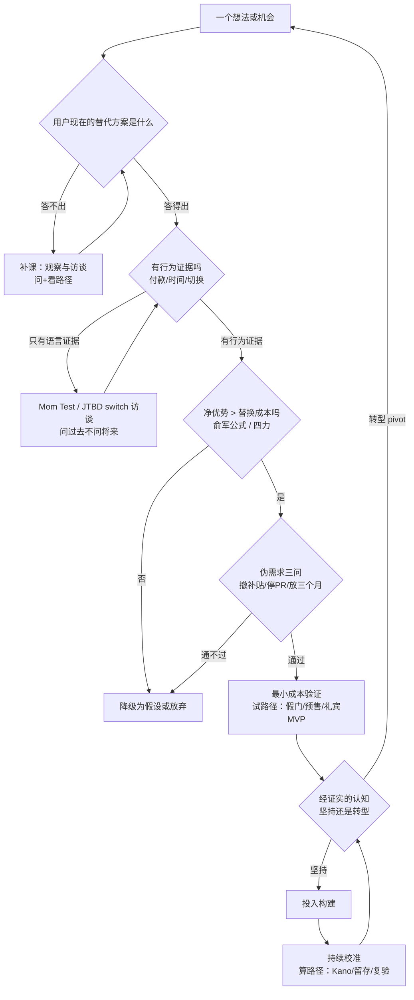

# 架构洞察（Architecture Insights）

> 基于 [事实清单](facts.md) 提炼。每条洞察按「陈述 / 证据 / 反常识点 / 行动启示」四元组组织；事实以 F 编号溯源，洞察为方法论判断，不构成具体经营建议。

## 洞察 1：真需求的判别通货是行为证据，不是语言承诺

| 四元组 | 内容 |
|--------|------|
| **陈述** | 西方四大方法论在底层共用一个判别标准——布兰克要求「走出办公楼」看真实客户（F-012），Mom Test 规定只问「过去的具体行为」（F-014），精益创业以「经证实的认知」为唯一产出（F-045），梁宁的真需求三角以「模式可持续运转」收口（F-007）：**语言的承诺不值钱，行为的代价才算数**——付过的钱、花过的时间、忍受过的麻烦、已经做出的切换。 |
| **证据** | F-012（get out of the building）、F-014/F-015（问过去不问将来、恭维是危险信号）、F-036/F-045（build-measure-learn 与 validated learning）、F-044（付费信号高于口头承诺）、F-026（言行差距是系统性现象）。 |
| **反常识点** | 最不可信的需求证据恰恰是最容易获得的那些：问卷里勾选的「感兴趣」、访谈时说的「会买」、会议室里的一致叫好。恭维之所以危险，是因为它让提问者误以为验证完成（F-015）——热情的语言与真实需求之间的相关系数之低，使得「聊得很开心」成为需求验证失败的第一大假象。 |
| **行动启示** | 给需求证据排等级并贴在团队墙上：付款 > 预付定金 > 留资并回复 > 实际使用 > 口头承诺 > 恭维。任何需求评审先问「我们手里最高等级的证据是什么」；只有语言证据的需求一律降级为假设，进入验证队列而非开发队列。 |

## 洞察 2：真伪之辨的关键变量是替换成本，不是满意度

| 四元组 | 内容 |
|--------|------|
| **陈述** | 俞军公式（用户价值 = 新体验 − 旧体验 − 替换成本，F-005）与 JTBD 四力（推力+拉力须压过焦虑+惯性，F-018）在数学上是同构的：需求能否成立，取决于新方案相对**用户现有替代方案**的净优势。满意度问卷测量的是感受，替换成本决定的是行为。 |
| **证据** | F-005（俞军公式）、F-018（switch 四力）、F-017（奶昔的竞品是香蕉与无聊而非其他奶昔）、F-061（早期采用者与主流市场之间的鸿沟）、F-046（Dropbox 视频触发的是「现有同步方案太烂」的集体共鸣）。 |
| **反常识点** | 「用户说很喜欢」与「用户会切换」之间隔着整个旧世界：迁移数据的麻烦、重新学习的成本、现有工作流的惯性、对新方案的不信任。大量产品死在「各方面都比旧方案好一点」上——好一点不足以支付切换的票价，好到十倍才够。同理，奶昔案例揭示了找错竞品的危险：你的真竞品从来不是长得像你的那个。 |
| **行动启示** | 需求评审加一栏必答题：「用户现在用什么替代方案解决这个问题？切换过来要付出什么？」答不出旧体验与替换成本的需求文档打回重做；做 switch 访谈（见 [concepts/03-interview-playbook](concepts/03-interview-playbook.md)）时优先访谈**已经完成切换的人**，回溯四力而非预测四力。 |

## 洞察 3：问、看、算、试是四条互补路径——单一路径必有盲区

| 四元组 | 内容 |
|--------|------|
| **陈述** | 需求发现方法可按信息获取方式分为四路：问（访谈：Mom Test、JTBD switch）、看（观察：民族志、情境访谈、同理心地图）、算（数据：Kano 问卷、ODI 机会算法、留存分析）、试（实验：MVP 谱系、假门、pretotyping）。四路证据强度递增而成本也递增，且各有不可消除的盲区（F-067）。 |
| **证据** | F-011~F-020（问）、F-021~F-027（看）、F-028~F-035（算）、F-036~F-045（试）、F-035（数据路径需要存量）、F-041（实验有信任成本）。 |
| **反常识点** | 团队总是使用自己最熟的那条路而不是最有效的那条路：工程师出身的团队直接跳到「试」（做出 MVP 才发现要问的问题没问），市场出身的团队困在「问」（十轮焦点小组仍无行为证据），数据团队空等「算」（冷启动阶段根本没有数据）。方法论的熟练反而构成路径依赖。 |
| **行动启示** | 按阶段选路径：冷启动先「问+看」形成假设（成本最低），有原型即「试」收割行为证据，有用户量后「算」做持续校准。任何重大需求决策要求至少两条独立路径的证据交叉——单路径证据视为线索，双路径交叉才算验证。 |

## 洞察 4：伪需求有三类温床，全部生长在供给方一侧

| 四元组 | 内容 |
|--------|------|
| **陈述** | 反面案例呈三种稳定结构（F-060）：①技术自恋型——能做出来的就当被需要的（Google Glass、Juicero、Segway）；②补贴伪高频型——用钱买来的订单被误读为需求（O2O 上门潮、共享单车）；③痒点错觉型——新鲜感引爆被误读为可持续需求（脸萌等速朽应用）。三类温床都不在用户身上，而在供给方的认知里。 |
| **证据** | F-053（Glass 场景不清）、F-054（Juicero 手挤曝光）、F-056（Segway 预期落空）、F-057（补贴停需求停）、F-058（ofo 押金）、F-059（脸萌速朽）、F-007（梁宁三角：模式不可持续即三角不成立）。 |
| **反常识点** | 伪需求最危险的时刻是它看起来最真的时刻：补贴期的订单曲线、发布会后的媒体热度、上线首周的下载量——这些「需求信号」全是供给方花钱买来的。识别伪需求不需要更聪明的头脑，需要的是问一个笨问题：**把补贴撤了、把 PR 停了、把新鲜感放三个月，它还剩什么？** |
| **行动启示** | 立项前做「伪需求三问」：这需求离了补贴还在吗？用户为它放弃的旧方案是什么？三个月后新鲜感退化时留存靠什么？三问有一问答不出，先补验证再谈投入；定期用 [examples/04-need-self-check-list](examples/04-need-self-check-list.md) 给在研需求体检。 |

## 洞察 5：经典名言多为误传——而误传本身暴露了认知极化

| 四元组 | 内容 |
|--------|------|
| **陈述** | 「福特说更快的马」无原始出处（F-063），「乔布斯不做市场调研」是语境剪裁（F-064）。两条误传被反复引用，是因为它们为「不用问用户」提供了权威背书——而真实的方法论传统（布兰克、克里斯坦森、莱斯、梁宁、俞军）没有一家主张不听用户，他们主张的是**换种问法、更看行为**。 |
| **证据** | F-063（Quote Investigator 考证）、F-064（1998 BusinessWeek 语境）、F-014（Mom Test 反对的是错误问法而非提问本身）、F-017（JTBD 恰恰靠深度访谈发现奶昔的真任务）。 |
| **反常识点** | 误传把需求研究极化成两个假选项：「用户说什么就做什么」或「完全别理用户」。真实的方法论站在中间——用户不会告诉你答案，但用户的行为里藏着全部答案。「更快的马」的正确读法不是「别问用户」，而是「问出那个『更快』背后的任务」。 |
| **行动启示** | 团队内禁用这两条名言作为不调研的挡箭牌；把它们改写为正确版本贴在工位：「用户说不出解决方案，但说得出自己的麻烦」。引用名言前先查出处——名言的失真往往是方法论失真的起点（勘误全文见 [references/02-source-verification](references/02-source-verification.md)）。 |

## 洞察 6：验证先于构建的可行性是时代变量——且拐点已至

| 四元组 | 内容 |
|--------|------|
| **陈述** | 需求验证的成本曲线在持续下移：萨沃亚的 pretotyping 把验证压到「别针与纸片」级别（F-039/F-040），精益创业把 MVP 定义为学习装置而非产品（F-037），预售模式把验证直接货币化（F-044）。2023 年后 AI 工具让原型与内容生产成本再降一个量级（F-066）——「先做再验」的最后借口（构建太贵所以赌一把）正在消失。 |
| **证据** | F-036/F-037（BML 与 MVP 定义）、F-039/F-040（pretotyping 与 IBM 假门）、F-047/F-048（Zappos 与 Buffer 的近乎零成本验证）、F-066（AI 时代构建成本下降）、F-042（PR/FAQ 把验证前移到文档阶段）。 |
| **反常识点** | 多数团队「跳过验证」的理由是赶时间，但失败案例的共同成本恰恰是省掉验证省出来的：Juicero 烧掉约 1.2 亿美元才发现手能挤（F-054），Quibi 用 17.5 亿美元学到一个落地页就能测出的答案（F-055）。验证不是速度的对价，验证就是速度本身。 |
| **行动启示** | 把「最低成本验证物」设为立项流程的强制交付物：一个想法进入开发前，必须先说清它的 Zappos 式验证动作是什么（见 [examples/03-one-week-validation-plan](examples/03-one-week-validation-plan.md)）；AI 时代更要把省下的构建成本转投到需求验证上——构建越便宜，验证越值钱。 |

## 洞察 7：需求是移动靶——发现不是一次性动作而是持续校准

| 四元组 | 内容 |
|--------|------|
| **陈述** | Kano 退化规律使兴奋点不断变成门槛（F-029），摩尔鸿沟使早期信号不能外推（F-061），莱斯用 pivot 概念把 PMF 变成需要持续再验证的状态（F-065）。需求发现没有「完成时」，只有「本轮校准完成」。 |
| **证据** | F-029（退化规律）、F-061（跨越鸿沟）、F-065（需求漂移）、F-034（留存走平是持续信号）、F-059（新鲜感需求的时间半衰期）。 |
| **反常识点** | 「我们三年前做过用户调研」是最常见的需求管理幻觉——调研结论有保质期，兴奋型功能的退化速度往往快于组织的认知更新速度。昨天的差异化是今天的标配，用户不会通知你需求已经搬家。 |
| **行动启示** | 给核心需求假设标注保质期（本包 stale_after 逻辑的产品版）：每 6–12 个月重跑一次 Kano 问卷或留存同期群分析；把「需求复验」排进版本规划而非等留存报警；跨越鸿沟阶段重新做一轮 switch 访谈——主流用户雇用你的理由可能与早期用户完全不同。 |

## 洞察 8：需求发现的元能力是「悬置供给方视角」

| 四元组 | 内容 |
|--------|------|
| **陈述** | 贯穿全部方法论的元能力只有一项：把「我们想做什么」从问题里拿掉。莱维特说顾客要的是洞不是钻头（F-003），克里斯坦森说顾客雇产品完成任务（F-016），俞军把用户定义为需求的集合（F-005），梁宁把价值判定交给对方（F-007）——一切技术（Mom Test 的不谈想法、观察法的不打断、PR/FAQ 的从客户写起）都是悬置供给方视角的装置。 |
| **证据** | F-003、F-016、F-005、F-007、F-014（三规则第一条就是不谈你的想法）、F-022（师徒式伙伴关系）、F-042（从新闻稿倒推）。 |
| **反常识点** | 供给方视角最强大的时刻是团队最专业的时候：对技术的深情、对行业的熟悉、对愿景的信仰，都会把「我们能做到」翻译成「用户需要」。乔布斯误传（F-064）之所以迷人，正因为它给供给方视角颁发了天才证书——但乔布斯的原话谈的恰恰是产品设计之难，而非需求洞察之不必要。 |
| **行动启示** | 在需求文档首页印两个固定问题：「这解决了谁的什么麻烦？」「麻烦的证据是什么？」；团队复述需求时禁止出现产品名，只允许出现用户、场景与任务；把「悬置」练成肌肉记忆——先成为用户处境的学生，再做解决方案的供应商。 |

## 知识地图（Mermaid）：真需求发现决策全景

> 图例：判定节点（菱形）对应四道门——替代方案之门（洞察2）、行为证据之门（洞察1）、净优势之门（洞察2）、伪需求三问之门（洞察4）；四条路径（问/看/算/试，洞察3）分布在各门之间，最终汇入持续校准环（洞察7）。

---

## 关联

- 事实溯源：[facts.md](facts.md)（F-001 ~ F-068）
- 方法论展开：[concepts/](concepts/index.md)；实操模板：[examples/](examples/index.md)
- 同组相关：[sell-before-build-validation](../sell-before-build-validation/index.md)（「试」路径的预售专项）、[marketing-fundamentals](../marketing-fundamentals/index.md)（STP/定位/漏斗通识）
