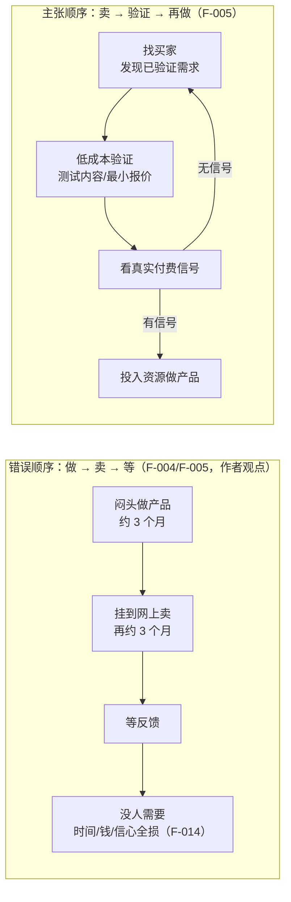

# 核心论点：赚钱的顺序问题

> 本篇拆解博文的**主张层**（What）。博文学者/名人引述已完成核验；作者本人的判断均标注"作者观点"，不与可核验事实混层。完整事实登记见 [../references/article-source.md](../references/article-source.md)，逐项核验见 [../references/verification.md](../references/verification.md)。

## 1. 两种顺序的对照

博文作者（自称"12 年野路子投资"，F-002，**作者自述无法独立核验**）提出：普通人赚不到钱，首要问题不是能力而是**顺序**（F-003，作者观点）。

| 维度 | 错误顺序（作者描述的常见路径） | 正确顺序（作者主张） |
|------|------------------------------|---------------------|
| 链路 | 做 → 卖 → 等反馈（F-005） | **卖 → 验证 → 再做**（F-005） |
| 第一步 | 闷头做产品，花三个月做出来挂网上等（F-004） | 先"找买家"，验证是否有人需要、愿意付费（F-005） |
| 失败成本 | 六个月后发现没人要，时间、钱、信心全垮（F-014） | 以最低成本试错，证伪即换方向（F-025） |
| 决策依据 | "我有个好点子" | "已经有人为这类东西付过钱"（F-009） |

两种顺序的流程对比：

> **分层提示**：上图右半是博文的方法主张，其**思想内核**（先验证后投入）有成熟方法论谱系支撑（精益创业 MVP、YC、Ash Maurya，见 [02 一周验证法与方法论边界](02-one-week-validation-playbook.md)）；但"这样做就能赚到钱"的成效承诺无任何实测数据支撑，博文自己的一周方案亦无成交记录（见 [../references/verification.md](../references/verification.md) 信源距离评估）。

## 2. 逆向思维的哲学来源：芒格与雅各比（核验通过 ✅）

博文以查理·芒格引数学家雅各比的话立论："反过来想，永远反过来想。"（F-006）该引语经核验**属实且归属正确**（F-032）：

- **雅各比**：卡尔·古斯塔夫·雅各布·雅各比（Carl Gustav Jacob Jacobi，1804-1851），19 世纪德国数学家、椭圆函数论奠基人之一。其治学格言德语原文为 **"man muss immer umkehren"**（直译：人必须总是反过来/逆向思考）——遇到正向解不开的数学难题时，把问题翻转过来解。
- **芒格的推广**：查理·芒格在 **1986 年 6 月 13 日哈佛学校（Harvard School，洛杉矶一所中学）毕业演讲**中引用雅各比，并在《穷查理宝典》（*Poor Charlie's Almanack*）中固化为英文世界熟知的 **"Invert, always invert"**：很多难题正向无解，反过来想反而有解——例如想幸福先研究如何必然痛苦，想投资成功先研究如何必然输光。

**与本文论点的连接**：把"怎么做一个成功产品"翻转为"怎么保证产品失败"——答案是"先花三个月做一个没人要的东西"；避开失败模式，就得到了"先验证需求"的顺序。这是逆向思维在创业决策上的直接应用。

## 3. 需求发现论：发现，而非发明（作者观点）

博文的第二层主张（F-007，**作者观点**）：

> 需求从来不需要你发明，只需要你发现……真正稀缺的不是"发现新需求"，而是"发现一个已经被验证、但还没被满足好的需求"。

由此推出实操判据——作者自述其看项目"第一眼不看产品，看三问"（F-009，作者观点）：

1. **谁需要它？**（有没有具体的人群，而不是"所有人"）
2. **为什么现在需要？**（时机与触发条件）
3. **已经有人为它付过钱了吗？**（需求是否已被真金白银验证）

第三问是整篇方法论的枢纽：**付费历史是需求真实性的最强证据**。这与 Lou Shipley 的观点、Ash Maurya 的 offer 验证（让真实客户做出付费承诺，见 [02 篇](02-one-week-validation-playbook.md)）方向一致。

## 4. 学者佐证：Lou Shipley 与"构建前先卖出"

博文援引"哈佛商学院的高级讲师 Lou Shipley"支撑论点（F-008）。核验结果（F-031）：

- **观点属实**："先看你的点子能不能卖出去，再去构建产品（sell before you build）"确为 Lou Shipley 的公开主张。他在 2025 年 12 月的播客中讲得很直白："为什么不反过来呢？先看你的想法能不能卖出去，**然后**再造产品。"该思想出自其 2025 年著作《Unlikely Entrepreneurs》。
- **身份勘误**：哈佛商学院官方 2021-03-01 新闻稿的原文称谓是 **"Lecturer  Lou Shipley"（讲师）**，与 "Senior Lecturer Mark Roberge"（高级讲师）并列——博文"高级讲师"的头衔较官方口径**拔高了半级**。他同时是连续创业者（任 CEO 把 Avid 从 0 做到约 5 亿美元、Black Duck 售予 Synopsys），在 HBS 参与"创业销售（Entrepreneurial Sales）"课程教学。
- 博文转述其核心判断——典型的"先做后卖"顺序往往导致失败，创始人应在投入时间与资源构建之前先把产品卖出去——与他在播客中的公开表述一致。

## 5. 论点的可采信边界

| 层次 | 内容 | 可信度 |
|------|------|--------|
| 哲学层 | 逆向思考（雅各比/芒格） | ✅ 出处可靠（F-032） |
| 学者层 | 构建前先卖出（Lou Shipley） | ✅ 观点可靠；⚠️ 博文头衔有误（F-031） |
| 方法层 | 卖→验证→做、付费验证需求 | ✅ 方向有精益创业谱系支撑（F-035） |
| 成效层 | "按此顺序就能赚到钱""一周可跑通" | ⚠️ 作者主张，无实测/统计证据（F-018、F-026） |
| 叙事层 | 标题"一天搭建自动赚钱系统" | ⚠️ 标题党，正文实为一周手动验证（F-029） |

下一篇对博文引用的两个企业案例（Dropbox、亚马逊）做核验版重建：[01 证据与案例核验](01-evidence-and-case-studies.md)。
