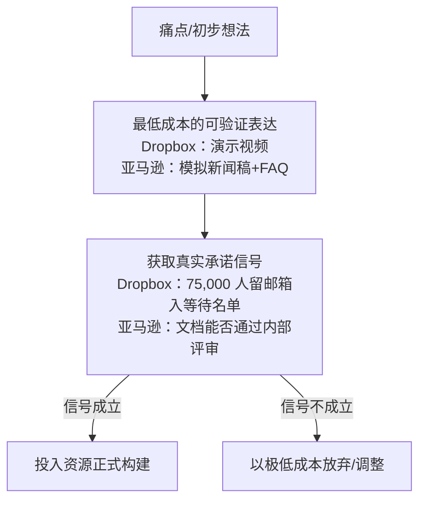

# 证据与案例核验：Dropbox 与亚马逊

> 本篇是博文**证据层**（Why）的核验版重建。两个案例的方向与关键数字/机制均真实，但博文作为大众化转述存在细节夸张与无出处数字。以下统一呈现**核验后口径**，博文原口径与差异在各节对照表中保留。核验过程见 [../references/verification.md](../references/verification.md)。

## 1. Dropbox：演示视频即 MVP

### 1.1 核验版时间线（F-010、F-012、F-030）

| 时间 | 事件 |
|------|------|
| 2006-12 | Drew Houston 在波士顿→纽约的大巴上忘带 U 盘、无法工作，动手写了一个粗略的文件同步原型——**这是 Dropbox 的起点，也是代码的起点** |
| 2007 | Houston 以此原型申请 Y Combinator；在 YC 合伙人 Paul Graham 建议下找到 MIT 校友 Arash Ferdowsi 作为联合创始人；同年夏季进入 YC，Demo Day 上面向投资人展示 |
| 2008 | 团队制作演示视频（原版时长约 **3 分 41 秒**，故公开来源有"3 分钟/4 分钟"两说），以"My YC app: Dropbox - Throw away your USB drive"为标题发布；视频主要登上 **Digg** 首页走红，同步出现在 Hacker News（item 8863） |
| 视频发布后 24 小时内 | beta 等待名单（waitlist）从约 **5,000 人暴涨到 75,000 人**——团队原本期望能到 15,000 就算成功；无付费广告、无 PR  campaign |
| 此后 | 凭等待名单背书拿到红杉 120 万美元种子轮；产品转入完整开发，2009 年正式开放，后以双向往返邀请机制实现病毒式增长 |

数字 5,000 → 75,000 的最早权威转述来自  Eric Ries（精益创业概念提出者之一）在 TechCrunch 的文章《How DropBox Started As A Minimal Viable Product》，后被创业教材与多家公司史重复确认。**博文 F-012 引用的数字准确。**

### 1.2 博文口径勘误："没有写一行代码"不成立 ⚠️

博文为强化"先卖后做"的戏剧效果，称当时"产品还不存在""在没有写一行代码、没有开发出一个完整产品之前"，视频只是演示了一个"看起来像真的"的界面（F-011）。**核验表明该表述夸张失实**：

- 视频发布**之前**，Houston 已在大巴上写过粗略原型，申请 YC 时已有能演示的 demo（"barely had a prototype"，但绝非零代码）；
- 视频演示的是**真实在开发中的软件**（含当时尚未发布的功能与面向早期用户的内部梗），不是纯虚构的界面动画；
- 准确的表述是：在**完整产品开发与 private beta 扩大之前**，用一支低成本演示视频验证市场需求——验证对象是"等产品做好的人会不会来排队"，而非"凭空虚构一个界面能不能骗人注册"。

博文的顺序结论（先验证、后重投入，F-013）依然成立，只是不应把"低成本验证"夸大为"零代码、零产品"。

### 1.3 案例有效的真正机制

1. **演示的是结果，不是功能清单**：视频直接展示"多台电脑间文件自动同步"这一用户结果与痛点（忘带 U 盘、邮件传文件、命名最终版真的最终版）；
2. **选对了早期受众**：Digg/HN 上的技术早期用户看得懂梗、愿意容忍半成品，他们的传播带来可信度外溢；
3. **指标是行为而非态度**：衡量标准不是问卷里的"你感兴趣吗"，而是**留下邮箱加入等待名单**这一真实承诺行为；
4. **验证成本相对于错误成本极低**：一支视频 vs 数月开发——这与博文"纸面排雷 vs 开发中纠错"的成本对比同向。

## 2. 亚马逊：Working Backwards（逆向工作法）

### 2.1 机制核验（F-015、F-033）

Working Backwards（逆向工作法）及其主工具 **PR/FAQ**（Press Release + Frequently Asked Questions，模拟新闻稿 + 问答文档）真实存在，是亚马逊 2004 年以来多数重大产品（Kindle、Prime、AWS、Alexa 等）共同的立项方法，权威记述来自前亚马逊高管  Colin Bryar 与  Bill Carr 2020 年合著的《Working Backwards》。

AWS 官方白皮书对其顺序的表述是：

> "在我们申请预算、组建团队、写下一行代码之前——**先写一份新闻稿**。"（"before we ever request a budget, assemble a team, or write a line of code – we write a press release"）

流程要点：

1. **先写模拟新闻稿（PR）**：假设产品今天发布，用客户视角写标题、目标客户与收益、摘要、客户痛点、解决方案与客户引语；篇幅强制限一页（或一到两页），写不进一页被视为思路不清；
2. **再写 FAQ**：外部 FAQ 回答客户/记者会问的定价、兼容性、限制、与替代品差异；内部 FAQ 回答工程、财务、法务会问的开发量、风险、依赖、成功指标；
3. **反复迭代文档直到逻辑成立**，再决定是否立项投入；
4. 思想根源是亚马逊第一条领导力准则 **Customer Obsession**："Leaders start with the customer and work backwards（领导者从客户出发，逆向工作）。"

博文 F-015 对"先新闻稿、再 FAQ、最后写代码"的描述与官方机制一致。

### 2.2 两处勘误

| 博文表述（F-016/F-017） | 核验结果 |
|------------------------|---------|
| "团队在写代码之前，会花 **18 个月**反复迭代这份文档"（F-016） | ❌ **无权威出处**。AWS 官方白皮书、《Working Backwards》作者官方书站、前亚马逊总监 Ian McAllister 2012 年广为流传的 Quora 说明中，均只有"PR 限一页""迭代到思路清晰"的定性要求，**不存在 18 个月的固定时长**。本 bundle 不采信该数字 |
| 贝佐斯："从客户需求出发，反向决定做什么工作。"（F-017） | ⚠️ 这是亚马逊领导力准则 "Leaders start with the customer and work backwards" 的**准确中文意译**，并非可逐字归属的贝佐斯原话；引用时应表述为"亚马逊领导力准则要求……"，不宜加引号冒充逐字引语 |

### 2.3 案例有效的真正机制

- **强制换位**：写新闻稿时无法用"我们有什么技术"自说自话，必须站在发布日客户的立场上回答"这跟我有什么关系"；
- **纸面排雷**：文档阶段否定一个点子的成本，远低于开发后否定；文档还是跨团队对齐与资源评审的通用货币；
- **一页纸约束**：长度本身是质量门——价值主张讲不清，通常是因为还没想清客户是谁、问题有多痛。

## 3. 两个案例的共同结构

| 要素 | Dropbox | 亚马逊 PR/FAQ |
|------|---------|--------------|
| 验证物 | 3 分多钟演示视频 | 一页模拟新闻稿 + 内外 FAQ |
| 验证对象 | 外部早期用户是否愿意排队 | 内部评审能否被客户价值说服 |
| 承诺信号 | 邮箱注册（行为） | 文档通过、预算获批（决策） |
| 先于什么 | 完整产品开发与 beta 扩大 | 组团队、申请预算、写代码 |
| 博文失真点 | "没写一行代码"夸张（F-011）；渠道笼统称"网上"（实为 Digg/HN） | "18 个月"无出处（F-016）；准则意译冒充引语（F-017） |

**关键提醒**：两个案例都是"用**可感知的价值表达**换**真实承诺信号**"，而不是"什么都没有就去收钱"。这一区分在理解普通人版方案时尤其重要——见 [02 一周验证法与方法论边界](02-one-week-validation-playbook.md)。
