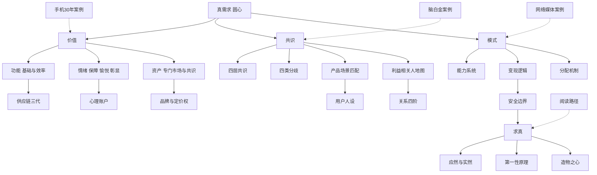

# 架构洞察（Insights）

> 基于 [事实清单](facts.md) 提炼。每条洞察遵循四元组结构：陈述 / 证据 / 反常识点 / 行动启示。洞察是解释层，不构成新事实；事实依据均回指 F 编号。

## 洞察 1：三角框架的解释力来自"圆心"，而不是三个顶点

| 四元组 | 内容 |
|--------|------|
| **陈述** | 价值、共识、模式这三个词在商业书里并不新鲜，本书真正的装置是把三者画成一个圆内接三角，并在圆心放上"真需求"。圆心的作用是提供统一判据：三角任何一环出问题，都可以回溯追问"那个真实需求是否存在、是否足够强"。于是三角不再是三张彼此独立的检查清单，而是同一个对象的三个投影。 |
| **证据** | F-009（图 0-1 以真需求为圆心）；F-007、F-008（三要素的顺序与各自产出）；F-012（以真需求为互联网时代的天道）。 |
| **反常识点** | "真需求"在书中始终没有被操作化为可测量指标，它更像一个信念锚点而非变量。这意味着框架擅长事后解释与方向排查，不擅长事前给出量化结论；把"我找到了真需求"当作论证完成，反而违背了求真的本意。 |
| **行动启示** | 评审任何项目时可以只问三个同轴问题：谁的什么需求被满足（价值）、他为什么现在行动（共识）、这套做法凭什么持续（模式）。三问答不出共同的圆心，就说明项目还停留在拼凑要素的阶段。 |

## 洞察 2：三类价值与"组合创新"反转了"产品即功能"的默认认知

| 四元组 | 内容 |
|--------|------|
| **陈述** | 价值公式把情绪与资产抬到与功能并列的位置，进一步把创新定义为不同价值要素的重新组合。按此视角，许多看似离谱的商品并非功能进步，而是在情绪账户或资产市场上开辟了新格子；反过来说，只在功能轴上努力的产品，会被迫进入性价比与高频的绞杀。 |
| **证据** | F-020（情绪价值三要件与功能客观、情绪主观）；F-023（三个付费触发点）；F-027（资产价值判据与两支柱）；F-031（创新即价值组合）；F-032（盲盒的三合一结构）。 |
| **反常识点** | 情绪与资产价值高度依赖情境与共识，无法像功能参数那样跨人群通用：同一双鞋、同一款游戏皮肤，在某个亚文化里是资产，在圈子外只是普通物件。因此价值组合的迁移必须连同场景与共识一起迁移，单点照搬往往失效。 |
| **行动启示** | 给自己的产品做一次"价值三列盘点"：功能列写基础与效率，情绪列写保障、愉悦、彰显各由哪个细节触发，资产列判断是否存在可持续的二手市场。空白的那一列不是缺陷，但需要确认它本来就不该由你承担。 |

## 洞察 3："有价值"不等于"被接受"——共识是独立于价值的第二战场

| 四元组 | 内容 |
|--------|------|
| **陈述** | 许多失败不是产品没有价值，而是价值没有转化为各方的共同行动。本书把共识单独成章并给出四层结构：先内部，再客户，再市场，最后社会；分歧来自感知、想象、场景与利益，像重力一样无法消除，只能设计交会点。场景匹配（PSF）与人设方法，都是把"好产品"翻译成"特定人在特定时刻会行动"的装置。 |
| **证据** | F-040（两个核心能力与四层共识）；F-041（分歧四来源与利益交会）；F-045（PSF 先于 PMF 及 OICQ 案例）；F-047（利益相关人地图与利益即态度）。 |
| **反常识点** | 共识不保证正确：皇帝的新装说明非共识既可能是创新起点，也可能是骗局温床；社会共识还会被舆论与认知战主动操纵。领导共识因此必须与创造价值、求真同时在场，脱离价值圆心的"共识能力"就是操纵术。 |
| **行动启示** | 推不动一个方案时，先别急着加强说服，而要分层定位卡点：是团队内部不信、客户感知不到、市场场景太弱，还是触动了某方的负利益。每一层对应不同动作——对齐、演示、选场景、改分配——用错层的努力只会放大分歧。 |

## 洞察 4：求真是模式的底座——应然与实然的次序决定企业生死

| 四元组 | 内容 |
|--------|------|
| **陈述** | 模式篇的三板块（能力系统、变现逻辑、分配机制）看似是术，其成立却依赖一个更底层的求真判断：你是从应然出发还是从实然出发。草根创新者先有实然（一个真实付费的小场景）再长出应然，精英叙事容易先有应然（宏大故事与融资）再寻找实然，后者在融资退潮时集体现出原形。第一性原理、行动力识人、安全边界，都是同一条求真主线的不同侧面。 |
| **证据** | F-049（模式三板块与"只有模式是自己的"）；F-050（"拿谁的钱"与瑞幸、每日优鲜的对照）；F-054（应然实然与 hao123 双线）；F-055（创新者象限与第一性原理）。 |
| **反常识点** | "实然优先"不是反规划的乡愿：星链与 SpaceX 恰恰是先有极强的应然愿景，再以工程上的第一性原理把成本逐层做实。真问题不是要不要愿景，而是愿景的每个环节是否允许被实然反复修正。 |
| **行动启示** | 为自己的项目做一次次序体检：把收入、用户、复购等实然证据与愿景叙事分两列写出。若应然列很长、实然列只有试点传闻，模式设计应立刻收缩到最小可验证场景，先补实然再谈扩张。 |

## 知识地图



## 阅读路径推荐

```
实用取向：00 框架 → 01 价值 → examples/01 手机30年 → 02 共识
理论取向：00 框架 → 01 价值 → 03 模式 → 04 求真
质疑取向：04 求真（知识边界一节）→ facts.md 边界与放弃登记 → references/01 版本信息
```

## 跨包参照

- **方法层配合**：本书回答"真需求如何嵌入商业闭环"，发现真需求的具体步骤与访谈方法见姊妹通识包 [真实需求发现方法](../real-needs-discovery/index.md)。
- **概念层互证**：求真篇的应然/实然、第一性原理与该包的需求验证清单可对照使用，避免把本书的经验框架误读为通用操作手册。
