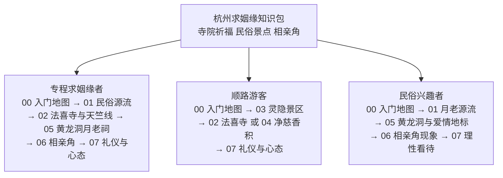

# 入门地图：杭州求姻缘知识包讲什么、怎么用

## 学习目标

- 说清本知识包覆盖的三类地点形态（寺院祈福、民俗景点、相亲角）与 8 篇概念文档的分工；
- 判断自己属于哪类读者，按读者路径图选出适合自己的阅读顺序；
- 掌握本束的信息复核原则：时效性事实以官方最新公告为准、口径冲突两说并列、灵验说法只作传播现象记录；
- 知道本束不提供什么（灵验排序、实时票务、相亲撮合），避免错配预期。

## 一个典型问题：去杭州求姻缘，去哪、怎么去、信谁？

在社交平台搜"杭州求姻缘"，会得到一堆互相矛盾的答案：有人说法喜寺，有人说灵隐寺，有人说黄龙洞月老祠，还有人推荐万松书院相亲角；票价口径从免费到几十元都有，预约攻略有的让上某个平台、有的说平台已停用。矛盾不是读者的问题——事实清单显示，大量条目只能以"两说并列"登记（如相亲角周六时段两说，[facts.md](../facts.md) F-064），而灵隐飞来峰景区 2025-12-01 起免票并改实名预约后，旧攻略仍在转载 75 元双票制的历史票价（F-027、F-031）。本知识包要做的事，就是把这些散落在各层级信源里的信息整理成**可回查、带时间戳、冲突不隐瞒**的行程知识。

## 知识包定位：三类形态一张图

杭州市文化广电旅游局主题文将三生石（法镜寺后）、三情人桥（长桥/断桥/西泠桥）、黄龙洞月老祠、万松书院并列为杭州爱情文化地标，婚恋主题的求姻缘民俗在杭州呈"寺院祈福+民俗景点+相亲角"多形态并存（F-008）。本束即按这三类形态组织：

| 形态 | 体验逻辑 | 代表地点 | 对应篇目 |
|------|----------|----------|----------|
| 寺院祈福 | 人向神/文化符号祈愿，重仪式感与秩序 | 法喜寺及天竺线、灵隐景区、净慈寺、香积寺 | [02](02-faxi-temple-and-tianzhu-line.md)、[03](03-lingyin-feilaifeng-scenic-guide.md)、[04](04-jingci-and-xiangji-temples.md) |
| 民俗景点 | 围绕月老祠、爱情传说的民俗体验 | 黄龙洞圆缘民俗园月老祠、西湖爱情地标 | [05](05-huanglongdong-yuelao-shrine.md) |
| 相亲角 | 人找人的社交集市，重信息密度 | 万松书院公益相亲会 | [06](06-wansong-academy-matchmaking-corner.md) |

三类形态不可互相替代（[insights.md](../insights.md) 洞察三）：去寺院找不到信息集市，去相亲角没有宗教仪式；时间窗口也完全不同——相亲角仅周六上午数小时（F-064），寺院则日常开放（如法喜寺 06:30—18:00，F-009）。行程规划前请先想清楚自己要的是哪一类体验。

## 三类读者画像与使用路径

**图 1｜三类读者的分支阅读路径**：中心为本束三类形态主线，三条分支按身份给出阅读顺序（数字为概念文档编号）。专程求姻缘者走完全程，把三类形态都覆盖到；顺路游客以交通便利性为先，抓大放小；民俗兴趣者重点在源流与现象，参拜细节可按需翻阅。

- **专程求姻缘者**：00 → 01（先搞清月老民俗的来龙去脉）→ 02（法喜寺与天竺线是寺院线主轴）→ 05（黄龙洞月老祠是民俗点主轴）→ 06（若以结识对象为目标，周六上午留给相亲角）→ 07（礼仪与心态收尾）。两者兼顾的一日行程按"相亲角上午闭场"倒排，下午再接寺院或黄龙洞（洞察三；F-051、F-060）。
- **顺路游客**：00 → 03（灵隐景区免票但需预约，先解决入场资格）→ 02 或 04 按动线选其一 → 07（赠香限香等现场规则必看，避免白跑）。要社交素材去法喜寺机位与三生石，要便利选地铁直达的黄龙洞，要避开人流选天竺线深处与北高峰灵顺寺（洞察二；F-010、F-015、F-052、F-037）。
- **民俗兴趣者**：00 → 01（月老出处与媒神谱系）→ 05（月老祠民俗与爱情地标传说）→ 06（相亲角作为当代婚恋民俗现象）→ 07（灵验叙事为什么只能当传播现象看）。

## 信息复核原则（使用前必读）

本束全部论断回指 [facts.md](../facts.md) 的 F 编号（F-001 三位制，78 条事实逐条内嵌信源 URL），使用时应连同以下四条原则一起接受：

1. **时效层只锚定官方入口**：门票、开放时间、预约规则是衰减最快的事实层（洞察四），本束采集时间为 2026-10，出行前一律回官方通告复核——灵隐景区看西湖管委会通告（F-027、F-029 信源），除夕安排看当年通告（F-069、F-070）。见到无时间戳的票价/预约信息一律存疑。
2. **口径冲突两说并列，不替读者取舍**：法喜寺赐名帝王（F-012）、飞来峰造像尊数（F-032）、净慈寺初名与开放时间（F-039、F-040）、香积寺复建年份与停止入场时间（F-046、F-048）、相亲角周六时段（F-064）、预约平台停用与否（F-042、F-074）等，本束均并列呈现并标注信源层级，读者按官方/现场口径收口。
3. **灵验说法只作传播现象记录**：凡"网红机位""热门祈福地"一类说法，本束统一按"网络热门说法/赞誉说法"客观记录并归因信源（如 F-010、F-033），不作任何灵验程度断言与排序（洞察五）；行程建议只落在可核维度——交通、票务、时段、体验类型。
4. **热度不等于灵验**：寺院热度由交通可达性与社交传播素材双因素决定（洞察二），人最多的点排队与预约成本最高（灵隐节假日预约量 6.5 万/日，爽约处 30/60/90 日禁约，F-028、F-029），低热度点反而体验从容且同属年票覆盖（F-020、F-037）。

## 本束不提供什么

- 不提供灵验排序与灵验断言：各点位只讲可核事实与文化源流，不讲"哪家最灵"；
- 不提供实时票务与预约代办：票价/预约只给规则框架与官方入口，不替代出行前的官方复核；
- 不提供相亲撮合服务：[06 篇](06-wansong-academy-matchmaking-corner.md) 只对相亲角现象作客观描述，不含任何可识别个人信息，也不提供征婚信息发布渠道；
- 不重复交通实时信息：公交线路以采集时口径登记（F-075），实际运营以出行当日为准。

## 小结

- 本知识包按"寺院祈福+民俗景点+相亲角"三类形态组织（F-008），对应 02—06 五篇点位指南，三类体验逻辑不同、不可互相替代（洞察三）；
- 三类读者各有路径：专程求姻缘者走全程，顺路游客先解决灵隐预约再按动线选点，民俗兴趣者重源流与现象；
- 四条复核原则：时效层锚定官方、冲突两说并列、灵验只作传播记录、热度不等于灵验；
- 本束不做灵验排序、不做实时票务、不做相亲撮合、不替代出行当日信息。

下一篇：[月老信仰与杭州姻缘民俗源流](01-yuelao-faith-and-hangzhou-folklore.md)——先搞清"月老"到底是谁。
