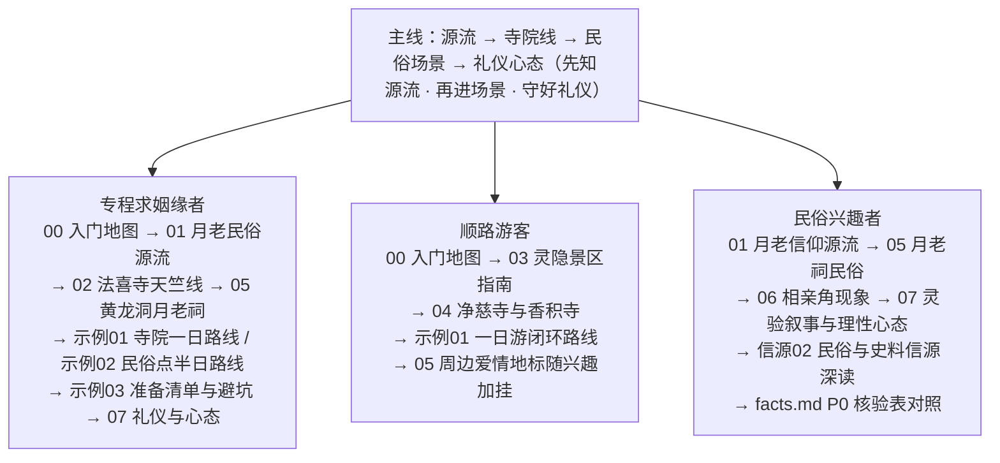

# 杭州求姻缘地点指南：月老民俗·寺院参拜·黄龙洞月老祠·相亲角

本知识包（bundle）是面向专程求姻缘者、顺路游客与民俗兴趣者的杭州姻缘民俗场景**实地指南**，基于 Web 公开信源调研整理（信源逐条登记于 [事实清单](facts.md)，编号 F-001 至 F-078，文末附 P0 双源核验表）。一句话定位：**杭州姻缘民俗场景的实地参拜指南——月老民俗源流打底、寺院线与民俗点双线并进、礼仪与理性心态收束**。全束按"源流→寺院→民俗场景→礼仪心态"主线组织（详见下文[快速导航](#-快速导航)与读者路径图）。


> ⚠️ **使用红线先行**：① 门票、开放时间、预约规则等时效性口径采集于 2026-10，出行前一律以官方最新公告为准（复核入口见 [示例03 信息复核清单](examples/03-preparation-checklist-and-pitfalls.md)）；② 凡"灵验/最灵"类说法仅作网络热门说法的客观记录，不作真实性断言（见 [概念07](concepts/07-etiquette-and-rational-mindset.md)）；③ 相亲角相关内容不含可识别个人信息，到场不拍摄、不传播他人资料（见 [概念06](concepts/06-wansong-academy-matchmaking-corner.md)）。

## 📚 快速导航

### [概念文档](concepts/index.md) — 8 篇核心概念

| 序号 | 文档 | 内容 |
| -- | -- | -- |
| 00 | [入门地图：知识包讲什么、怎么用](concepts/00-overview-reading-map.md) | 知识包定位、三类读者画像与使用路径、信息复核原则、读者路径分流图 |
| 01 | [月老信仰与杭州姻缘民俗源流](concepts/01-yuelao-faith-and-hangzhou-folklore.md) | 月老形象的文献出处、媒神谱系、杭州姻缘民俗当代格局、三生石语义流变 |
| 02 | [法喜寺参拜指南（含天竺线）](concepts/02-faxi-temple-and-tianzhu-line.md) | 历史沿革两说并列、门票开放、公交到达、三生石/法镜寺/法净寺姻缘点位与参拜要点 |
| 03 | [灵隐寺景区参拜指南](concepts/03-lingyin-feilaifeng-scenic-guide.md) | 四寺构成、免票与实名预约新规、飞来峰造像口径、姻缘行程定位 |
| 04 | [其他相关寺院：净慈寺与香积寺](concepts/04-jingci-and-xiangji-temples.md) | 两寺历史沿革（口径分歧并列）、门票开放、南屏晚钟与运河第一香、参拜要点 |
| 05 | [黄龙洞月老祠与西湖爱情地标](concepts/05-huanglongdong-yuelao-shrine.md) | 圆缘民俗园属性、月老祠民俗、门票开放与交通、三情人桥/我心相印亭等周边爱情地标 |
| 06 | [万松书院相亲角](concepts/06-wansong-academy-matchmaking-corner.md) | 书院背景、公益相亲会现象（时间两说并列）、参与方式客观描述、隐私提示 |
| 07 | [参拜礼仪与理性看待](concepts/07-etiquette-and-rational-mindset.md) | 赠香限香礼仪、免费日与年票成本优化、除夕年度通告制、灵验叙事的正确打开方式 |

### [实践示例](examples/index.md) — 3 篇实操指南

| 序号 | 文档 | 内容 |
| -- | -- | -- |
| 01 | [寺院一日参拜路线：法喜寺天竺线 + 灵隐飞来峰景区](examples/01-faxi-lingyin-one-day-route.md) | 前一晚预约 → 上午灵隐、下午天竺线闭环时间轴，交通衔接、费用小计（必缴 10 元）、备选方案 |
| 02 | [民俗点半日路线：黄龙洞月老祠 + 万松书院](examples/02-huanglongdong-wansong-half-day-route.md) | 平日版与周六相亲角版两套时间轴；相亲角时间两说并列；费用小计 25 元；西湖爱情地标串联 |
| 03 | [参拜准备清单与避坑指南](examples/03-preparation-checklist-and-pitfalls.md) | 行前检查表、到场礼仪自查表、避坑清单（爽约禁约/第三方代约/历史票价误导/相亲角跑空）、信息复核清单 |

### [信源参考](references/index.md) — 3 篇信源登记

| 序号 | 文档 | 内容 |
| -- | -- | -- |
| 01 | [寺院官方信源](references/01-temple-official-sources.md) | 灵隐寺官网、西湖管委会免票通告与预约须知、上城区政府免费日安排；官方预约/购票渠道与渠道冲突并列 |
| 02 | [民俗与史料信源](references/02-folklore-historical-sources.md) | 月老信仰文献与权威研究、市文广旅游局主题文、权威媒体寺院史料报道、相亲角媒体追踪；百科词条等二级信源仅作线索 |
| 03 | [交通与实用信息信源](references/03-transport-practical-sources.md) | 杭州文旅官方入口、市政府景区名录、管委会黄龙洞专页、免票落地报道、门票/开放时间/年票实用指南与公交线路速查 |

### 工作文档

- [事实清单](facts.md) — 78 条零推测客观事实登记（F-001 至 F-078）：月老民俗源流、各寺院与民俗点沿革口径、门票开放与预约新规、交通与实用信息，信源 URL 逐条内嵌，文末附 P0 双源核验表 22 行。

- [架构洞察](insights.md) — 本束知识地图的七条核心洞察：民俗源流是理解场景的总钥匙、寺院线与民俗点双线并进、官方口径优先于攻略口径、冲突口径并列而非取舍、灵验叙事只记录不断言、时效性事实年度复核、隐私红线先于内容完整。

- [审查报告](review.md) — V 阶段四视角对抗审查结论（2026-10-01）：意见清单 10 条（4 条 P1、5 条 P2、1 条 P3），8 条采纳并已落盘修正，2 条转开放问题；修正严守 facts.md 唯一事实源。

## 🚀 推荐阅读路径



**图 1｜三类读者的分支阅读路径**：中心为本束主线"源流→寺院线→民俗场景→礼仪心态"，三条分支按读者身份给出建议阅读顺序（数字为概念文档编号，信源篇以"信源NN"标注）。

## 知识结构：源流—寺院—民俗场景—礼仪心态

- **源流（理解入口）**：[月老信仰与杭州姻缘民俗源流](concepts/01-yuelao-faith-and-hangzhou-folklore.md)——月老形象的文献出处（《续玄怪录·定婚店》）、媒神谱系与杭州姻缘民俗的当代多形态格局、三生石语义流变；先读源流再看场景，避免把民俗场景读成孤立的"灵验打卡点"。

- **寺院线（参拜主场）**：[法喜寺参拜指南（含天竺线）](concepts/02-faxi-temple-and-tianzhu-line.md)——三生石与天竺三寺姻缘点位；[灵隐寺景区参拜指南](concepts/03-lingyin-feilaifeng-scenic-guide.md)——免票与实名预约新规下的姻缘行程定位；[净慈寺与香积寺](concepts/04-jingci-and-xiangji-temples.md)——南屏晚钟与运河第一香两寺参拜要点，沿革口径分歧并列。

- **民俗场景（当代形态）**：[黄龙洞月老祠与西湖爱情地标](concepts/05-huanglongdong-yuelao-shrine.md)——圆缘民俗园的月老祠民俗与周边爱情地标；[万松书院相亲角](concepts/06-wansong-academy-matchmaking-corner.md)——公益相亲会现象的客观描述与隐私红线。

- **礼仪心态（收束与红线）**：[参拜礼仪与理性看待](concepts/07-etiquette-and-rational-mindset.md)——赠香限香等通用礼仪、免费日与年票成本优化、灵验叙事的正确打开方式；配套 [示例03 准备清单与避坑指南](examples/03-preparation-checklist-and-pitfalls.md) 落到行前检查与信息复核。

```{toctree}
:hidden:
:maxdepth: 7

concepts/index
examples/index
references/index
facts
insights
review
```
