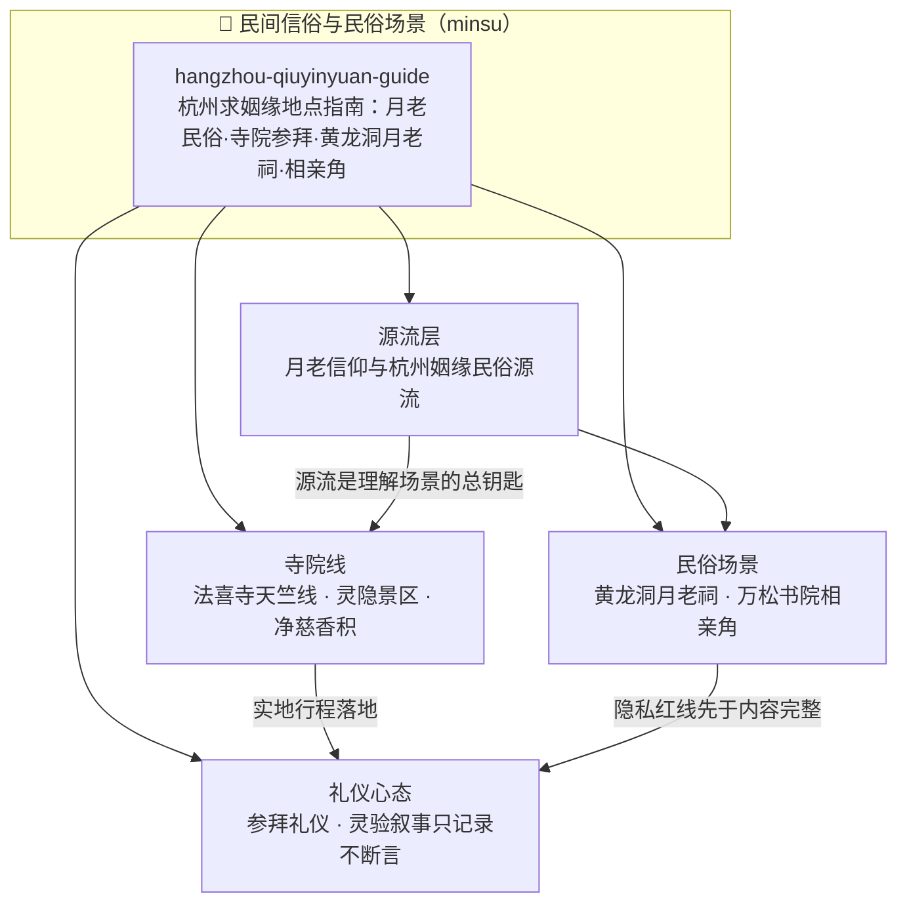

# 🏮 民间信俗与民俗场景


本分组收录民间信俗与民俗场景的实地指南类中文知识包，以公开信源调研整理民俗源流、场景实况、交通信息与参拜礼仪，帮助读者把"听说很灵"的民俗场景还原为可规划、可复核、有分寸的实地行程。分组的共同方法论：源流先行（先懂民俗再来场景）、官方口径优先（门票/开放/预约以官方通告为准）、冲突口径并列（不替读者取舍）、"灵验"叙事只记录不断言。

> **阅读提示**：本分组知识包以**原创中文整理与实地指引**为主体，全部事实均登记于各束 `facts.md` 并逐条内嵌信源 URL；门票、开放时间、预约规则等时效性内容以各束采集日期口径为准，出行前请以官方最新公告复核。

## 分组导航

| 知识包 | 定位 | 核心概念 |
|--------|------|----------|
| [hangzhou-qiuyinyuan-guide/](hangzhou-qiuyinyuan-guide/index.md) | 实地指南 · 杭州姻缘民俗场景 | 月老信仰源流、法喜寺天竺线、灵隐飞来峰、净慈香积、黄龙洞月老祠、万松书院相亲角、参拜礼仪与理性心态 |

## 知识地图



实线表示分组内知识包的结构关系：源流层打底，寺院线与民俗场景双线并进，礼仪心态收束。

## 阅读路径

- **按需进入**：计划专程求姻缘行程 → 直接进入 [hangzhou-qiuyinyuan-guide](hangzhou-qiuyinyuan-guide/index.md)，从其 00 入门地图的"专程求姻缘者"路径读起；顺路游西湖/灵隐 → 同束"顺路游客"路径；关注月老民俗与相亲角现象本身 → 同束"民俗兴趣者"路径。

```{toctree}
:glob:
:hidden:
:maxdepth: 7

hangzhou-qiuyinyuan-guide/index
```
