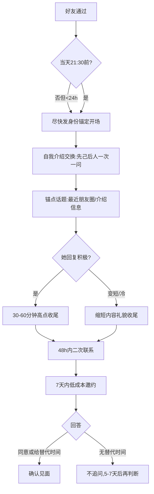

# 03 邀约与风控：什么时候约、冷场怎么办、哪些话不能说

> 返回 [知识包首页](../index.md) ｜ 上一篇：[02 话题与高点收尾](02-topics-and-ending.md)

## 1. 二次联系与邀约节奏

| 时间 | 动作 |
|---|---|
| 首聊后 **48 小时内** | 用具体由头二次联系，2—3 轮即可（她朋友圈的新动态 / "昨天说的那家店我搜了下看着不错"） |
| 认识 **7 天内** | 发出线下见面邀约 |
| 见面后 | 节奏交给现场判断，本包不覆盖 |

不建议连续多日纯文字热聊而不推进——微信缺少面对面的多线索通道（F-004），停留过久会把关系固定在"网友"形态（首页 I-2）。

## 2. 邀约话术：低成本、低仪式感

**标准版**：

> 跟你聊天挺轻松的，这周末你有空吗？找个地方喝杯咖啡，当面坐坐？

**她提到过具体兴趣时**：

> 你上次说想吃日料，我知道有一家评价还不错，这周末要不要一起去尝尝？

设计要点：

| 要点 | 原因 |
|---|---|
| 给具体时间（这周末）和具体形式（咖啡/某家店） | 降低她的决策成本，可直接回答行或不行 |
| 选咖啡/简餐等短时长场景 | 双方都可进可退，低压力 |
| 不约晚餐+电影的长套餐 | 首见仪式感和时间负担过重 |
| 邀约是陈述不是请求批准 | 保持双向筛选的平等姿态 |

## 3. 对方的三种回答与应对

| 回答 | 含义 | 应对 |
|---|---|---|
| "好呀，周六下午可以" | 接受 | 确认地点，简短聊两句即收尾，不把期待感堆满 |
| "这周末不行，下周吧" | 接受但改期，**给了替代时间** | 顺势定下下周，视为积极信号 |
| "最近比较忙，再说吧" | 无替代时间，意愿低或确有安排 | 回一句"没事，你先忙～"，**不追问、不重复约**；隔 5—7 天可轻聊一次再判断，两次模糊则体面退出 |

## 4. 冷场与异常预案

**情况 A：她回复变短、变慢**

- 不补发消息、不问"怎么不说话"、不发表情包轰炸；
- 按她的节奏缩短回复，用 [02 的高点收尾话术](02-topics-and-ending.md)结束当晚。

**情况 B：当晚完全没聊起来（她只回一两个字）**

- 礼貌收尾："那你先忙，改天聊～"；
- 48 小时后换一个具体由头轻聊一次；
- 连续两轮都无法展开 → 可请介绍人侧面了解她的意愿，自己不追问。

**情况 C：48 小时完全不回**

- 不重复发消息、不质问；
- 联系介绍人了解情况；
- 介绍人确认无意 → 体面结束，不做最后表态。

## 5. 全程禁雷清单（任何一轮都不碰）

- [ ] 不问/不提收入、房、车、存款
- [ ] 不提前任、不打听她的感情史
- [ ] 不聊婚育时间表、不发表"女人就该怎样"的言论
- [ ] 不评价她的长相和身材，不发"美女"类称呼
- [ ] 不发土味情话、不开任何带颜色的玩笑
- [ ] 不连发语音、不要求视频通话
- [ ] 不查户口式连环提问、不追问未回的消息
- [ ] 不向介绍人之外的共同圈子打听她

## 6. 一页速查：先认后约全流程

