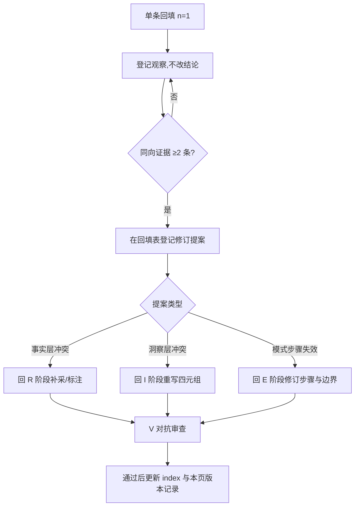

# 应用回填机制与记录表：blind-date-first-wechat

> 返回 [知识包首页](../index.md)

本页规定「先认后约」模式在真实场景中应用后，**如何回填结果、证据如何累积、何时触发修订与成熟度升级**。回填记录是知识包从 draft（方法论推导）走向 verified（实证支撑）的唯一通道。

- **启用时点**：自知识包入库（2026-10-07）起，任何一次真实相亲初次微信互动均可回填
- **记录编号**：A-001 起（A = Application），每次独立互动一条；跨域应用（销售破冰等）编号为 X-001 起
- **当前回填数**：A 组 0 条、X 组 0 条

---

## 1. 回填纪律（五条）

1. **24 小时内回填执行记录**：首聊结束当天或次日完成 A—D 段，避免事后记忆重构；见面结果在见面后 48 小时内补 E 段。
2. **全程去标识化**：不写真实姓名、微信号、单位全称、手机号，不粘贴聊天截图；人物以"女方/介绍人"指代，城市写到层级（一线/新一线/二线等）。
3. **成败平等回填**：见面失败、被冷淡、中途终止的案例同样必须登记——失败案例是反模式的主要证据来源，缺失败样本的证据集不予升级。
4. **单条不改结论**：n=1 的记录只作观察登记，不直接修改事实表/洞察/模式；≥2 条同向证据才触发修订（见 §3）。
5. **保真度自评**：记录实际执行与五步法的偏离点；关键步骤保真度过低的案例计入"情境观察"，不计入成熟度升级样本。

## 2. 结果指标定义（统一口径）

| 指标 | 取值 | 记录方式 |
|---|---|---|
| 首聊完成 | 是 / 否（对方未回应=否） | 附首条消息发出与最后一条消息的间隔 |
| 首聊时长 | 分钟 | 首条与末条消息时间差 |
| 信息交换对称度 | 对称 / 基本对称 / 单向 | 双方各自给出的表层信息条数 |
| 高点收尾达成 | 是 / 否 | 末条消息时对方情绪状态（积极/中性/消极） |
| 48h 二次联系响应 | 积极回应 / 简短回应 / 无回应 | 客观描述，不归因 |
| 邀约答复 | 接受 / 给替代时间 / 无替代时间拒绝 / 未邀约 | 附邀约距加好友的天数 |
| 是否见面 | 是 / 否 | — |
| 见面后两周状态 | 继续了解 / 冷淡 / 终止 / 未到观察期 | 以双方实际互动事实描述 |

## 3. 证据累积与修订触发

- 任何修订完成后必须再过一次 V 门（魔鬼代言人 + 未来视角为必选），并在本页 §5 追加版本记录。
- 回填记录本身只追加、不改写；若事后发现记录有误，新增一条勘误条目并互引编号。

## 4. 成熟度升级判据

| 升级路径 | 条件 | 升级动作 |
|---|---|---|
| **L1-draft → L2**（实证初验） | ① A 组 ≥2 个完整闭环案例（走到见面，或对方明确终止且各阶段记录完整）；②五步法关键步骤（身份锚定/先己后人/高点收尾/邀约时点）保真度均 ≥80%；③其中至少 1 个为失败或部分成功案例；④结果指标按 §2 口径全部填写 | 模式成熟度改 L2；首页状态可改 `status: reviewed` |
| **L2 → L3**（可复用） | ① A 组 ≥5 个案例，或 A 组 ≥2 + X 组 ≥1（跨域完整应用）；②可给出标注样本局限的区间性结果陈述（如"邀约答复为接受/替代时间的比例区间"，n 与口径并陈）；③至少 1 次由回填证据驱动的模式修订已闭环 | 模式成熟度改 L3；包 `status: verified`；摘要数字与本页核对一致 |
| **降级触发** | 回填中出现 ≥2 条同向证据表明核心步骤在边界内失效，且 30 天内未完成修订 | 模式回 L1-draft，首页标注 `status: draft` 与待修订项 |

> 样本纪律：全部案例来自同一城市层级、同一年龄段或同一介绍人网络时，升级结论中必须标注样本同质化，不给出跨群体的成功率陈述。

## 5. 版本记录（修订追溯）

| 日期 | 事件 | 关联编号 |
|---|---|---|
| 2026-10-07 | 回填机制建立，A/X 记录启用 | — |

---

## 6. 回填记录模板（复制本节填写）

### A-XXX ｜ 回填日期：YYYY-MM-DD

**A. 背景（去标识化）**

- 城市层级：一线 / 新一线 / 二线 / 其他
- 双方年龄段：男方 / 女方（如 25—27）
- 介绍人关系类型：亲属 / 父母朋友 / 同事朋友 / 其他
- 回填前对女方的已知信息来源：介绍人口述项数、朋友圈可见情况

**B. 五步法执行核对**

| 步骤 | 执行 / 偏离 / 未执行 | 实际做法与偏离说明 |
|---|---|---|
| ① 身份锚定（当天 21:30 前，三要素） | | |
| ② 自我介绍交换（先己后人、一次一问） | | |
| ③ 锚点话题（最近 1—2 条朋友圈/介绍信息） | | |
| ④ 高点收尾（30—60 分钟、积极时主动结束） | | |
| ⑤ 一周内邀约（低成本、拒绝不追问） | | |

- 关键步骤保真度自评：__/4（四项关键步骤达成数）

**C. 结果指标（按 §2 口径）**

- 首聊完成 / 时长：
- 信息交换对称度：
- 高点收尾达成：
- 48h 二次联系响应：
- 邀约答复（附距加好友天数）：
- 是否见面：
- 见面后两周状态：

**D. 意外事件（首聊后 24h 内填写）**

- 客观描述出现的计划外情况（如介绍人中途介入、对方主动提问、冷场节点），每条一行，不归因。

**E. 见面补充（见面后 48h 内填写，未见面写"不适用"）**

- 现场事实：时长、场景、双方实际表现的客观描述。

**F. 假设检验与修订建议**

- 本包预测中被证实的条目（引洞察/模式原文）：
- 被证伪或未观察到的条目：
- 修订提案：拟修订层级（R/I/E）+ 证据编号（本条 + 关联条目）；n<2 时标注"待累积"。

---

## 7. 已回填记录索引

| 编号 | 回填日期 | 城市层级 | 是否走到见面 | 关键发现 | 修订提案 |
|---|---|---|---|---|---|
| _（暂无）_ | | | | | |
