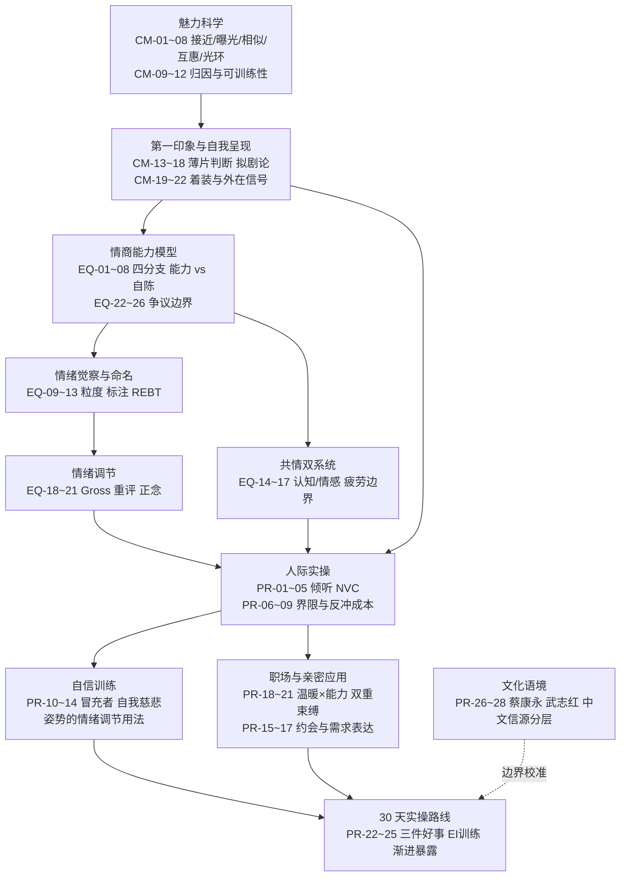

# 架构洞察（Insights）

> 基于 [事实清单](facts.md) 提炼。每条洞察遵循四元组结构：陈述 / 证据 / 反常识点 / 行动启示。洞察是解释层，不构成新事实；事实依据均回指 CM-/EQ-/PR- 编号。

## 洞察 1：魅力是「他人归因」而非「个人特质」——可学习的是信号管理，不是"变成另一个人"

| 四元组 | 内容 |
|--------|------|
| **陈述** | 从韦伯（CM-09）到当代魅力研究（CM-12），魅力的定义始终是**观察者归因**的结果——追随者/旁观者把「非凡禀赋」投射到某人身上。这带来一个关键推论：魅力训练（Cabane 三要素、Riggio 六技能）能干预的不是"灵魂"，而是**可被感知的信号**（临在、力量、温暖的外显表达），以及第一印象的前几秒（CM-13、CM-14）。 |
| **证据** | CM-09（Weber 归因定义）；CM-10（Cabane 三要素为可训练信号）；CM-12（Antonakis 2011 训练效应 d≈0.62）；CM-13（30 秒薄片判断 r=.76）、CM-14（100ms 定印象）。 |
| **反常识点** | 「美即好」光环（CM-05）与「性化外表减分」（CM-21）并存说明：信号的方向性比信号的强弱更重要——同样的外在呈现，在能力评价语境可能是加分项也可能是减分项（CM-26）。同时 Cabane 警告"伪装"会经微表情/呼吸泄露（CM-25），信号管理必须服务于内在状态。 |
| **行动启示** | 练习顺序应为「内在状态 → 外显信号」：先用情绪调节技术（EQ-18~21）稳定内在状态，再训练临在/温暖的外显表达；不要把「气场训练」窄化为穿衣化妆，也不要把魅力完全寄托于"真实做自己"而拒绝任何呈现优化。 |

## 洞察 2：情商概念的「能力 vs 混合」之争，决定了你该信哪个测量与哪条训练路径

| 四元组 | 内容 |
|--------|------|
| **陈述** | 情商不是单一定义：Mayer-Salovey 能力模型（四分支，MSCEIT 按正确性评分）与 Goleman 混合模型（五要素，含动机/社交技能等人格与动机成分）是两条不同赛道。能力模型与人格几乎无关，混合模型与人格高度重叠（r=.60-.80）。选择哪条路径决定了训练目标和测量方式：能力型可训练、增量效度有限但可核验；混合型覆盖面广但科学性争议大。 |
| **证据** | EQ-01~03（能力模型三代定义）；EQ-05、EQ-25（MSCEIT 与自陈测量几乎不相关）；EQ-23（混合模型与人格重叠）；EQ-24（能力型 EI 对绩效预测 r≈.23，仅为认知能力的 1/3）；EQ-22（Locke 批判）。 |
| **反常识点** | 「自评情商高」与「测出情商高」是两回事（EQ-25）；Goleman 式断言（「EQ 解释 58% 工作表现」）缺乏严格元分析支持（EQ-26）。但能力型 EI 的增量效度本身也很有限（EQ-24）——情商既不是万能钥匙，也不是伪概念，它是一项**可训练、可测量、但与其他能力协同起作用**的技能。 |
| **行动启示** | 读任何情商书籍先问三个问题：作者用的是能力模型还是混合模型？主张基于什么测量？有复制/元分析证据吗？训练上优先选择有 RCT 证据的组件（EI 培训 d=.61，PR-23；情绪标注 EQ-10~12；重评 EQ-19），把"情商课"作为技能训练而非人格改造。 |

## 洞察 3：情绪调节的杠杆在「早期干预」与「命名即调节」——改变的不是感受，而是对感受的加工

| 四元组 | 内容 |
|--------|------|
| **陈述** | Gross 过程模型（EQ-18）说明情绪在生成链条上有多个人为干预点，且**越早干预越有效**；Lieberman 的情绪标注研究（EQ-10）给出一个反直觉结论：仅仅是给情绪命名，杏仁核反应就会下降——调节不必然等于"改变感受"，很多时候是改变与感受的关系。 |
| **证据** | EQ-18（五节点过程模型）；EQ-19（重评降体验、抑制不减体验反增唤起并损害记忆）；EQ-10~12（标注即调节）；EQ-20（表达抑制与症状相关）；EQ-21（正念元分析，焦虑 0.38/抑郁 0.30）。 |
| **反常识点** | 大众直觉以为"管理情绪 = 压抑/控制情绪"，实证恰恰相反：抑制（suppression）是最低效的策略之一，重评与标注才是有效杠杆；REBT（EQ-13）进一步说明情绪困扰源于信念（B）而非事件（A）——改变认知比压抑反应更根本。 |
| **行动启示** | 实操上按「认知先行」排序：①命名（情绪粒度+标注，EQ-09~12）；②重评（改写对事件的解释，EQ-19）；③正念（不评判地观察，EQ-21）；最后才考虑表达抑制类策略。这一排序可直接嵌入 [30 天路线](examples/00-overview.md) 第二周。 |

## 洞察 4：女性实操语境存在「结构性反冲」——同样的行为，性别不同收益不同，需配套信号补偿

| 四元组 | 内容 |
|--------|------|
| **陈述** | 女性在职场/关系边界中执行"自信、断言、表达愤怒"等建议时，会遭遇实证可测的**反冲成本**：Brescoll & Uhlmann 2008 显示男性表达愤怒获地位提升、女性失地位（PR-09）；完全相同的断言行为被性别不同地解读（PR-20）；成功女性被评"不可爱"（PR-19）。因此"变自信"对女性不是纯个人心理问题，而是需要**信号补偿策略**的社交工程。 |
| **证据** | PR-09（愤怒反冲）；PR-19（双重束缚与 communal 信号补偿）；PR-20（断言性别不对称与缓解策略）；PR-21（能力可见化与自我代言）；PR-18（温暖×能力四象限，warmth 是女性被宽容的通行证）。 |
| **反常识点** | 冒充者现象（PR-10~12）的性别差异证据其实**不一致**（Bravata 2019 无稳定性别关联），部分"女性更容易冒充者"的说法是媒体放大；真正稳定的性别差异出现在**他人评价**层面（反冲），而非自我体验层面——问题不在女性的内心，而在评价者的双重标准。 |
| **行动启示** | 训练设计应区分「自我层面」（冒充者应对、自我慈悲 PR-14）与「社交层面」（温暖×能力平衡、断言+温暖组合、"替团队发声"框架、能力可见化 PR-19~21）；本知识包的 [职场应用](examples/04-workplace.md) 与 [界限设定](examples/02-boundary-setting.md) 即按此双轨设计，避免只教"勇敢"而忽略结构性成本。 |

## 知识地图



## 阅读路径推荐

```
实用取向：concepts/00 总览 → examples/00 30 天路线 → 01 沟通 → 02 界限 → 03 自信
理论取向：01 吸引力科学 → 04 能力模型 → 05 混合模型争议 → 08 情绪调节
质疑取向：05 混合模型争议 → facts.md 批判条目（CM-16/23/24, EQ-22~26）→ references/01-studies
```

## 跨书参照

魅力×情商框架与分组内外知识包存在多组交叉：

- **情绪命名与自我慈悲**：与《情绪急救》式自愈框架同源，可对照 [relationships 分组](../../relationships/index.md) 下情绪主题知识包。
- **亲密关系中的表达**：NVC 需求表达与依恋理论「直接表达需求」相互印证，见 [《依恋》知识包](../../relationships/attached/insights.md) 洞察 2-3。
- **界限与反冲**：女性边界反冲成本（PR-09）是对《取悦症》类读物"学会拒绝"建议的实证校准——拒绝的姿势需要配套信号补偿，见 [职场应用](examples/04-workplace.md)。
