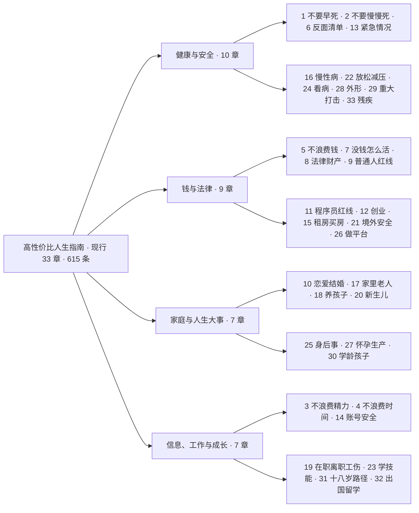

# 33 章导览与长文地图

> 本篇是**导航层**：不展开条目细节（标杆条目在 [04-high-value-entries.md](04-high-value-entries.md)），只回答"我现在的问题该去第几章"。章名与顺序按原仓现行 33 章（2026-09-28，F-023）；注意旧博文盘点的是 31 章时代（F-022）。

## 1. 四大板块全景

板块是本教程的归并，原书并不显式分块——它的条目是**跨板块互引**的（例：老人摔倒在第 13 章，但费用、追责、长期安排分别互引第 8、17、25 章）。

**各章条目数（对原仓完整本地克隆逐章机器统计，求和 = 615，F-089）**：

> 1=36 · 2=42 · 3=25 · 4=18 · 5=39 · 6=26 · 7=21 · 8=43 · 9=23 · 10=18 · 11=17 · 12=23 · 13=41 · 14=9 · 15=8 · 16=9 · 17=8 · 18=6 · 19=17 · 20=12 · 21=11 · 22=11 · 23=23 · 24=12 · 25=10 · 26=11 · 27=16 · 28=8 · 29=13 · 30=13 · 31=16 · 32=10 · 33=20

最厚的是第 8 章法律与财产安全（43 条）、第 2 章不要慢慢死（42 条）、第 13 章急救（41 条）——恰好对应"一次出事损失最大"的三个领域；最薄的是第 18 章养孩子划不划算（6 条），算账维度集中不需铺开。

## 2. 健康与安全（第 1、2、6、13、16、22、24、28、29、33 章）

| 章 | 章名 | 代表问题 / 内容要点 | 主口径 |
|---|---|---|---|
| 1 | 不要早死 | 安全带、头盔、报警器、燃气、蘑菇、血压血糖筛查、儿童意外；**36 条**，几乎不花钱降低外因死亡 | 死亡率 |
| 2 | 不要慢慢死 | 烟酒戒断（戒烟药/门诊/热线、酒精戒断不能硬扛）、运动、睡眠、午睡、夜班账、食用油与加工肉 | 死亡率 |
| 6 | 反面清单 | 看似高性价比实则不是的东西：保健品、智商税体检套餐、无效减肥/医美产品；含"意志力会用完"这一说法的核查 | 金钱/健康 |
| 13 | 紧急情况：先做什么 | CPR/AED、卒中、心梗、眼中风、大出血、烧烫、过敏、骨折、火灾溺水蛇咬地震；老人扶不扶；按"多常见×差多少命"排序 | 存活率/金钱/自由 |
| 16 | 得了慢性病之后怎么活 | 服药依从、门诊慢特病跨省结算、长期处方、家庭医生、并发症筛查、痛风达标、肾结石复发预防 | 死亡率/金钱 |
| 22 | 怎么放松：娱乐场所和减压 | KTV/网吧/密室避坑、明码标价、涉毒红线；运动、正念、呼吸、社交、绿地等有证据的减压方式 | 自由/精力/死亡率 |
| 24 | 看病：怎么少花钱少走弯路 | 分级诊疗、起付线连续计算、异地就医、急诊预检分诊四级、病历封存、疾病应急救助、伤残鉴定时机 | 金钱/时间 |
| 28 | 别为了外形把身体搞坏 | 进食障碍、医美两证、填充致盲、西布曲明、合成代谢类固醇、减肥药处方复查、体像评估 | 死亡率/自由 |
| 29 | 遭遇重大打击之后 | 丧亲头月心血管窗口、重病诊断第一周、失业/丧偶半年、哀伤卡住去哪挂号、12356/12355（热线出处 F-088）、别在应激期做不可逆决定 | 死亡率/金钱 |
| 33 | 残疾之后怎么活 | 自主神经反射异常现场处置、致残后十年自杀窗口、六项待遇、康复救助、无障碍改造、按比例就业、C5 驾照、行为能力认定 | 死亡率/金钱/自由 |

## 3. 钱与法律（第 5、7、8、9、11、12、15、21、26 章）

| 章 | 章名 | 代表问题 / 内容要点 | 主口径 |
|---|---|---|---|
| 5 | 不要浪费钱 | 订阅、彩票、保险、基金费率、个人养老金、预付款、直播带货、医保个人账户、充值退款、盲盒抽卡、海外资产合法渠道 | 金钱 |
| 7 | 没钱的时候怎么活 | 救助补贴、找活、住宿吃饭、医疗救助、欠薪维权与避坑 | 金钱/保障 |
| 8 | 别把自己搭进去：法律与财产安全 | 交通事故处置、被骗止付（110/96110）、AI 换脸、自首减刑、被诬告救济、担保、彩礼、婚前财产、诉讼时效、失信名单、养犬责任 | 自由/金钱 |
| 9 | 普通人容易踩的法律红线 | 谣言、英烈、传播色情、兼职"跑分"洗钱、骗贷骗保、高空抛物、仿真枪、无人机、偷拍、赌博、野味、器官买卖 | 自由/金钱 |
| 11 | 程序员和技术人容易踩的红线 | 外挂、爬虫入罪边界、抢票脚本、删库、带走源码、接单开发、竞业、GPL 传染性、ICP 备案 | 自由/金钱 |
| 12 | 创业与做生意：别把家底赔进去 | 本钱与担保、主体选择、注册许可、纳税发票、涉税诈骗、合同用人、知识产权量产红线、退场 | 金钱/法律责任 |
| 15 | 租房与买房 | 押金、暴力腾退、中介代收、资金监管、买卖不破租赁、产权核对、交易资金专户、隔断房 | 金钱 |
| 21 | 出国、旅行与境外安全 | 安全提醒级别、12308 与领事保护边界、境外保险、高薪招聘骗局、年度取现额度、证件丢失、境外驾照、中介备案（热线出处 F-088） | 金钱/自由 |
| 26 | 做一个网站或平台：资质、备案和服务器 | 支付红线、ICP 许可与备案、直播视听资质、平台核验与涉税报送、内容治理、数据出境、服务器选型（**有独立长文**） | 自由/金钱 |

## 4. 家庭与人生大事（第 10、17、18、20、25、27、30 章）

| 章 | 章名 | 代表问题 / 内容要点 | 主口径 |
|---|---|---|---|
| 10 | 恋爱和结婚划不划算 | 择偶策略、纠缠红线、异地恋、登记婚检、健康/时间/钱三本账、父母出资买房、共同债务、退出成本（**有独立长文**） | 时间/钱/健康 |
| 17 | 家里有老人 | 意定监护、遗嘱形式、账户话术、投资养老/以房养老骗局、长护险、卧床压疮防护 | 金钱/自由/死亡率 |
| 18 | 养孩子划不划算 | 育儿补贴、产假与生育津贴、三期保护、养育的时间账与钱账 | 金钱/时间 |
| 20 | 刚出生的孩子怎么带 | 安全睡眠、乙肝首针、免疫规划、母乳辅食、冲奶水温、维生素 K、发热红线、不摇晃、高危儿早引入花生防过敏 | 婴儿死亡率/金钱 |
| 25 | 人走了以后要办什么 | 死亡证明、遗体接运火化、死因异议与尸检、注销户口、殡葬基础项目与价格违法、公积金社保余额、死者个人信息权利 | 金钱 |
| 27 | 怀孕和生产：从发现怀孕到出院办证 | 叶酸、建册免费产检、三病筛查、孕期烟酒、妊糖、立刻就医信号、破水、无痛分娩、剖宫产指征、生育保险、出生证、落户、42 天复查 | 死亡率/金钱 |
| 30 | 上学以后的孩子 | 按小时算的急症、别为考试推迟治疗、反欺凌、每天户外 2 小时、青少年抑郁筛查、近视产品辨伪、睡眠作业硬规定、休学保留学籍、窝沟封闭 | 死亡率/健康/金钱 |

## 5. 信息、工作与成长（第 3、4、14、19、23、31、32 章）

| 章 | 章名 | 代表问题 / 内容要点 | 主口径 |
|---|---|---|---|
| 3 | 不要浪费精力 | 睡眠、打断、多任务、决策疲劳、人际负债、与机构打交道的预期管理 | 精力 |
| 4 | 不要浪费时间 | 无收益项目、沉没成本、拖延（情绪解释/改环境/承诺装置/习惯周期）、会议、通勤 | 时间 |
| 14 | 账号与信息安全 | 二次验证、密码、SIM 卡、手机丢失第一步、银行卡盗刷、登录设备、App 权限、人脸识别、查阅与删除权 | 金钱/个人信息 |
| 19 | 在职、离职和工伤 | 加班费三档、年休假、试用期、N/N+1/2N、不签主动辞职、留证；职业病三检与防护、工伤认定时限、单位未参保、工亡待遇 | 金钱 |
| 23 | 学什么技能划算 | 教育回报率、童工年龄线、山寨证书、培训补贴、抗自动化能力、紧缺职业查询、自测/分散/交错练习、"学习风格无证据"、职称申报与代评造假 | 金钱/时间 |
| 31 | 十八岁之后有哪几条路 | 十二条路的法定门槛：当兵（拒服兵役联合惩戒/退役金）、基层服务定向考录、特岗教师、消防员与军队文职、自考成考开放大学、公费师范/定向医学生 6 年履约、出国务工、远程接单个税、创业担保贷、灵活就业社保、骑手职业伤害保障 | 金钱/时间/自由 |
| 32 | 出国留学：身份、打工、保险和回国认证 | 认证院校名单、F-1 规则动态、四国打工时数、全日制是身份的根、搬家 10 日报备、留学预警、OSHC、英国医疗附加费、留服认证时长、加强审查名单 | 金钱/自由 |

> 跨板块提示：第 21 章（旅行）与第 32 章（留学）是后期拆分/新增的境外主题姊妹章；第 6 章《反面清单》和第 29 章《重大打击》同时挂健康与金钱两类内容，检索时记得两个口径都试。

## 6. docs/ 五篇独立长文

条目为了保持"一行查得到"的密度，把需要展开算的大话题放进了 5 篇长文（F-012）：

| 长文 | 体量 | 配套章 | 什么时候读 |
|---|---|---|---|
| 结婚划不划算 | 18.5KB | 第 10 章 | 真要算账时：时间/钱/健康/法律后果分开记的完整账本与填空清单 |
| 家庭应急装备清单 | 11.7KB | 第 1、13 章 | 采购前：按优先级排、每样写用途与"不买的理由" |
| 生物钟和夜班 | 11.2KB | 第 2 章 | 倒班/熬夜：夜班年数账与调整方法 |
| 遇到陌生人出事该不该停 | 8.6KB | 第 13 章 | 纠结救不救陌生人时：免责条款、被讹风险、救人风险分开讨论 |
| 做平台要办哪些证 | 9.2KB | 第 26 章 | 建站收钱前：ICP→直播资质→数据出境按证件类型列清单 |

另有 `docs/引用对照.md`（约 110KB）与 `docs/核实记录/` 目录，是全书引文的对照与核实过程——想审查某条数字的引用链时从那里入手。

---

下一篇 [04-high-value-entries.md](04-high-value-entries.md) 用 21 条标杆条目示范"一条好条目该怎么读"。
