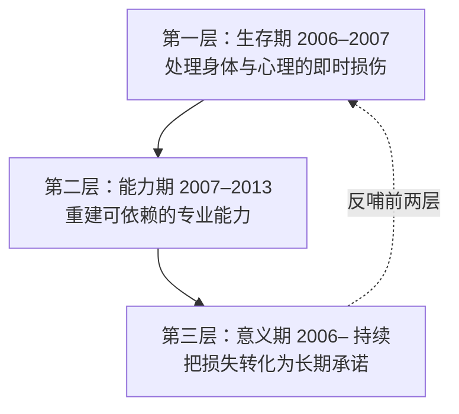

# 00 · 2006：不可逆事件与三重重建

## 1. 事实基线

| 项 | 内容 | 出处层级 |
|---|---|---|
| 时间 | 2006 年 8 月 29 日夜，沪杭高速嘉兴段 | C |
| 场景 | 拍完《射雕英雄传》后从横店返回上海途中 | C |
| 座位 | 因助理张冕临时调换，他原本坐副驾，改坐后排 | C |
| 后果一 | 助理兼好友张冕（23 岁，北师大艺术系研二学生）当场遇难 | C |
| 后果二 | 颈部与右眼重伤，手术 6 个半小时，缝合 100 多针；颈部伤口距颈动脉约一毫米 | C |
| 后果三 | 右眼植皮，从耳后取皮；前后近 10 次修复手术 | C |
| 后遗症 | 常年偏头痛、眼睛畏光干涩；拍摄时灯光与化妆需专门调整以遮挡右眼疤痕 | C |
| 心理 | 首次看到镜中自己后一度认定演员路走到尽头；曾动过放弃演戏的念头 | C |
| 信息 | 剧组最初隐瞒了张冕离世的消息，他得知真相后陷入长久自我愧疚 | C |

> **本包的立场声明（重要）**：
>
> 本页处理的是一个真实的死亡事件与真实的创伤。**本包不做「励志化」的渲染，不使用「他很坚强所以你也要坚强」这类叙述。**
>
> 本页要做的只有一件事：**拆解他在事件之后的行动结构**。事实是事实，机制是机制，两者分开。

## 2. 为什么这件事构成「不可逆事件」

三个不可逆性（推断层）：

| 维度 | 不可逆性 | 依据 |
|---|---|---|
| **身体** | 右眼疤痕、偏头痛、畏光干涩伴随至今 | F-HG-025（C 级） |
| **关系** | 张冕死亡 | F-HG-021（C 级） |
| **职业** | **他的主要资本是「面孔」**——靠脸吃饭的演员，脸部重创等于核心资产损毁 | 推断（F-HG-026 的自述支撑） |

> **第三条是最关键的结构性不可逆**（推断）：
>
> 2005 年的胡歌是「无胡歌不仙剑」——他的市场价值高度绑定在面孔与青春偶像形象上。**这场事故直接损毁了他赖以生存的资产。**
>
> 这解释了为什么他后来说的那句话（本包认为是他最重要的一句）：**「如果外表无法复原，那就用思想去填满它吧」**（C 级流传，详见第 4 节）。

## 3. 三重重建的结构（本包核心框架）

把 2006–2015 这九年的行动按功能分为三层：



### 第一层：生存期（2006–2007）

**行动**：
- 近 10 次修复手术（F-HG-024，C 级）
- 出版《幸福的拾荒者》，为治疗期间创作（F-HG-028，A/B 级）
- 该书关于张冕的内容占三篇，标题《冕》（F-HG-029，A 级）
- 沉寂 10 个月后复出（F-HG-031，C 级）
- 复出初期用刘海遮挡伤疤（F-HG-032，C 级）

> **这一层最值得注意的是写作这个动作**（推断）：
>
> **在身体与心理同时受损的时期，他选择了记录而不是沉默。**
>
> **写作在结构上做了什么**（推断）：
> ```
> 创伤后的默认反应：封闭、不说、回避（F-HG-027 记载他把自己封闭起来）
> 写作做的事：把无序的事件变成有顺序的叙述
>            → 叙述本身就是秩序的重建
> ```
>
> 进一步：**这本书后来成为公益的载体**（版税全部交给张冕父母，F-HG-030，A 级）。也就是说，**第一层的产物成了第三层的启动资金**。
>
> **这是本包观察到的第一个结构性事实：三层不是串行的，是有资金与材料流动的闭环。**

### 第二层：能力期（2007–2013）

**行动**（详见 [01 慢功夫](01-stage-craft.md)）：
- 沉寂 10 个月后复出拍《仙剑三》
- 大量话剧演出：《如梦之梦》（五号病人）、《永远的尹雪艳》（徐壮图，全程上海话）（F-HG-050/051，B 级）
- 2012 年《轩辕剑》身兼制片人与主演（F-HG-053，B 级）
- 2017 年 3 月赴美国深造（F-HG-058，B 级）

> **这一层的核心动作是「去到一个不能 NG 的地方」**（推断）：
>
> 电视剧的本质是**可剪辑**的——拍不好可以重来、可以换角度、可以后期修。**这意味着它是「永远不失败」的环境**。
>
> 话剧《如梦之梦》是**环形舞台、不能 NG**（C 级 F-HG-052）。**一个不能重来的地方，才是有真实反馈的训练场。**
>
> **这是本包最看重的一个判断（推断）**：他的能力重建之所以有效，是因为**他选了一个「失败成本真实」的环境**。

### 第三层：意义期（2006 起持续）

**行动**：
- 2006 年伤未好即赴云南张冕老家，灵堂跪下承诺赡养二老，近二十年未断（F-HG-038，A/C 级）
- 2009 年 10 月「张冕苗圃希望小学」落成并验收（F-HG-034，A 级）
- 以张冕名义累计捐赠 30 多所希望小学（F-HG-035，A/C 级）
- 每月给二老生活费；请保姆、升级护理团队、翻修老屋（F-HG-038/039，A/C 级）
- 司机小凯服刑结束后仍是他团队司机；他说「全世界都可以怪他，我不能，如果我不原谅他，这个小孩就完了」（F-HG-037，A 级）
- 2010 年起资助山区女孩符桂兰至其成为家乡首位博士生（F-HG-082，C 级）
- 2010 年《我在你身边》综艺中特意选择贫困村乡村教师，飞机→汽车→拖拉机颠簸两小时（F-HG-083，A 级）
- 2013 年起连续十多年赴青海做环保志愿者（F-HG-070/072/073，A 级）
- 2023 年发起《一路前行》环保公益纪实节目（F-HG-063，A 级）

> **这一层的结构特征是「长期 + 具体 + 不可替代」**（推断）：
>
> | 特征 | 证据 | 反例（无效公益） |
> |---|---|---|
> | 长期 | 近二十年赡养；青海十多年 | 一次性捐赠 |
> | 具体 | 每月固定；每年多次；每所学校验收 | 只捐钱不接触 |
> | 不可替代 | 用自己名字做不到的事（以逝者之名） | 换个名人也能做 |
>
> **第三点最关键**（推断）：**以张冕之名建校这件事，一般人做不了——因为需要一个「值得用这个名字」的对象。** 这使他的公益不可被稀释。

## 4. 三个可提炼的机制（本包核心产出）

### 机制一：把损失转为长期承诺，而非转为控诉

对照两种可能的走向（推断）：

```
走向 A：损失 → 控诉 → 「世界对我不公」 → 长期消耗
走向 B：损失 → 承诺 → 「我能为谁做什么」 → 长期投入
```

**事实**：他从未公开把车祸作为控诉材料使用；相反，他把张冕的名字用在了 30 多所学校的校门上（F-HG-035）。

> **这不是道德要求，是策略要求**（推断）：
>
> **控诉的注意力在过去的损失上，承诺的注意力在未来的对象上。** 只有后者能产生长期投入。
>
> **可迁移判据**：当你遭遇重大损失时，问一句——**「这件事的产出，是控诉文本还是承诺清单？」**

### 机制二：选一个「失败成本真实」的环境

| 环境 | 失败成本 | 反馈真实性 |
|---|---|---|
| 电视剧（F-HG-009/054/055） | 低（可重拍、可剪） | **虚假反馈** |
| 话剧《如梦之梦》环形舞台不可 NG（F-HG-052，C 级） | 高（一错全场看到） | **真实反馈** |
| 青海环保捡拾（F-HG-072） | 高（你不捡垃圾就在那里） | **真实反馈** |
| 乡村支教（F-HG-084） | 高（孩子们真的会受影响） | **真实反馈** |

> **机制二的本质（推断）**：**在「不能失败」的环境中，人不会真正成长——因为失败信号被消除了。**
>
> **这与陶行知的六大解放形成有意思的张力**：陶行知主张「解放双手」——让人动手、在真实的生活中学习（F-TX-056）。**而「真实」的前提是有真实后果。** 晓庄的招生考试含垦荒、施肥、修路（F-TX-009），而不是笔试——**垦荒种不活是真实后果**。
>
> **两人在「真实」这一点上相遇，但场域不同**。

### 机制三：把「记录」作为重建的第一动作

**证据链**：写作（F-HG-028）→ 版税成为公益资金（F-HG-030）→ 公益成为持续十九年的承诺（F-HG-038）。

> **「记录」的特殊性（推断）**：
>
> 记录是唯一一个**同时完成三件事**的动作：
> 1. **对内**：把无序事件变成有序叙述（心理秩序的重建）
> 2. **对外**：把经历转为可传递的文本（后来影响他人）
> 3. **物质**：把叙述变成版税（变成第三层的启动资金）
>
> **很多人不记录，是因为觉得「没人会看」。** 但记录的第一读者永远是自己。

## 5. 三个「不要误读」的地方

| # | 误读 | 事实纠正 | 出处 |
|---|---|---|---|
| 1 | **「他很坚强」** | 他有完整的创伤反应：自我愧疚、整夜做车祸噩梦、封闭自己、动过放弃演戏的念头 | F-HG-026/027（C 级） |
| 2 | **「车祸是他一生的转折点，所以他后来才行」** | 他 2005 年已成名；**车祸摧毁的是资本，不是能力**。能力重建用了近十年，且与车祸无因果关系——他 2015 年拿白玉兰时车祸已过去九年 | F-HG-009/056 |
| 3 | **「他不接偶像剧是因为oty不可」** | 更准确的解读是**他选了一个失败成本真实的环境**（话剧），理由是能力建设，不是外形 | 推断 |

> **误读 2 特别说明（推断）**：
>
> 常见叙事是「车祸 → 蜕变 → 封神」，把它读成一个因果链。
>
> **但这条因果链里有几个断裂**（推断）：
> - 车祸后他沉寂了 10 个月才复出（F-HG-031）
> - 2015 年的白玉兰，距离车祸是**九年**（F-HG-056）
> - 期间他做了大量话剧、出国深造、做了 30 多所学校
>
> **换言之：从事故到封神，中间隔着十年的具体工作。** 「车祸让他成功」是一种简化到失真的叙事——**它把十年的工作压缩成一个事件。**
>
> **正确的读法**：车祸**不是原因**，它只是**把他推到了一个必须重建的处境**，而重建需要十年。

## 6. 引用与溯源

车祸全貌见 F-HG-020~F-HG-027；100 多针见 F-HG-023（C 级）；植皮见 F-HG-024（C 级）；后遗症见 F-HG-025（C 级）；心理反应见 F-HG-026/027（C 级）；《幸福的拾荒者》出版见 F-HG-028（A/B）；《冕》三篇见 F-HG-029（A）；版税交给张冕父母见 F-HG-030（A）；10 个月沉寂复出见 F-HG-031（C）；刘海遮挡疤痕见 F-HG-032（C）；「用思想填满」见 F-HG-033（C 级流传）；希望小学落成见 F-HG-034（A）；30 多所见 F-HG-035（A/C）；赡养近二十年见 F-HG-038（A/C）；不原谅司机见 F-HG-037（A）；话剧见 F-HG-050/051（B）；《如梦之梦》不可 NG 见 F-HG-052（C）；赴美深造见 F-HG-058（B）；2015 白玉兰见 F-HG-056（B）；事故前成名见 F-HG-009（B）；青海环保见 F-HG-070/072/073（A）；《一路前行》见 F-HG-063（A）；陶行知六大解放见 F-TX-056（见 `../../taoxingzhi-life-education/references/facts.md`）。

**本篇推断部分**（「不可逆性三维」「三重重建框架」「三个机制」「两个走向对比」「机制二与陶行知的张力」「误读 2 的因果链断裂分析」）为本包 D 级推断。

**下一篇**：[01 慢功夫：话剧作为方法](01-stage-craft.md) —— 为什么是话剧，而不是继续拍剧？
