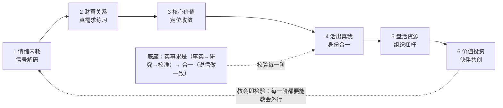

# 人的进化有哪些真需求？

本知识包解读一份两版笔记照片中的个人成长提纲。经用户裁定，标题为 **「人的进化有哪些真需求？」**（最新版照片写作「人性的进化」，按画面异文登记）。提纲正文是六个「主题词——动作短语」条目：

> 1、情绪内耗——正面解读　2、财富关系——找到真需求（练）　3、核心价值——商业定位
> 4、活出真我——陪跑（合一）　5、盘活资源——10倍好组织事情　6、价值投资——联合创造
>
> 学会不如教会！！！　　【实事求是】合一

> **信任提示（先读）**：提纲仅有照片、无作者署名，用户声明其出自公开文章/书籍，但 2026-10-06 三轮公开检索未能定位出处（F-HE-009）。因此本包中**提纲字面事实**可信（逐字登记），**所有机制解读均标注「本包解读」**，外部理论只作独立锚点、不互相背书。完整核验见 [出处与版本核验](references/01-source-provenance.md)。
>
> **2026-10-06 增补**：用户提供了腾讯会议链接，经采集确认**存在一套与本提纲逐条对应、顺序一致、连括号动词与最新版措辞都吻合的课程讲解**（F-HE-056）。这使「提纲是某门课程的提纲」成为可能性显著上升的推断，**但提纲出处仍为 flagged**——课程讲义不等于提纲原始文本，也不能证明笔记作者即该课程讲师。课程纪要为 **AI 加工产物、非逐字稿**，在本包中一律作**对照源**使用，商业与社群运营内容已隔离。逐条对照表见 [课程对应关系核验](references/01-source-provenance.md#二点五课程对应关系核验2026-10-06-增补)。

## 核心读法：六阶进化链（本包解读装置）

本包把六个条目读作一条有向链：作用半径从「自己内部」逐级扩展到「与伙伴联合创造」，前一阶是后一阶的条件；「学会不如教会」是每一阶的检验装置，「实事求是」是合一状态的底座。



## 快速导航

### [概念文档](concepts/index.md) — 9 篇

- [00 总览](concepts/00-overview.md) — 提纲原貌、六阶链读法、课程增补的六条随身判据、使用方法与六条边界
- [01 情绪内耗](concepts/01-stage-emotion.md) — 内耗信号论、「情绪是情绪，你是你」、三行书写、反刍/重评对照、安全边界
- [02 财富关系](concepts/02-stage-wealth.md) — 财富即关系、真需求三证据、练的最小单元、乙方陷阱与方向修正
- [03 核心价值](concepts/03-stage-value.md) — 定位一句话公式、价值三来源、「对方主动来」的验收方式
- [04 活出真我](concepts/04-stage-self.md) — 真我 vs 合一辨析、品质技能身份三层自测、放下≠放弃、空谈/工具/表演三失败模式
- [05 盘活资源](concepts/05-stage-resources.md) — 两版措辞修订（传播→组织）、资源三分类、点线面与小盘大盘、10 倍修辞纪律
- [06 价值投资](concepts/06-stage-cocreation.md) — 共创四条件、合作三级台阶、退出设计、「越联合创造越易失去人脉」
- [07 实事求是与合一](concepts/07-foundation-heyi.md) — 词源、三条校验、感恩与敬畏两条日课路径、底座在全链中的位置
- [08 古为今用：《诫子书》与六阶链](concepts/08-ancient-jiezishu.md) — 86 字原文（verified）、逐句白话、同构映射、淫慢/险躁分型、第三例共现与待核项

### [实践工作表与对外稿](examples/index.md) — 4 篇

- [六阶自检工作表](examples/01-six-stage-self-check.md) — 60 分钟定位主卡点阶+ 三条随堂速查 + 4 周练习表
- [正面解读三行书写](examples/02-positive-reframing-practice.md) — 阶段一配套，含范例与失败样式
- [教会测试](examples/03-teaching-test.md) — 15 分钟教学闭环，含六阶题库（不使用学习金字塔伪数字）
- [群发说明稿（结合道三）](examples/04-group-share-draft.md) — **对外**自包含说明稿：六阶×道三七条判据对照、三种失败形态速查、三处「三之位」暗线；正文可直接复制发群，文末内部备注转发前删

### [信源参考](references/index.md) — 3 篇

- [出处与版本核验](references/01-source-provenance.md) — 三轮检索记录、两版异文、**Day6 课程逐条对应核验与采集条件留痕**、flagged 状态
- [外部概念锚点对照](references/02-external-anchors.md) — 九组对照与逐条禁用方式
- [知识边界与延伸阅读](references/03-boundaries-further-reading.md) — 五类边界与姊妹包分工

### 工作文档

- [事实清单](facts.md) — 99 条六层可信度事实（素材/逐字/外部锚点/诫子书/跨包方法论/**课程原声**/待核项分离）
- [架构洞察](insights.md) — 8 条四元组洞察 + Mermaid 知识地图（含课程对照节点）
- [更新日志](log.md)

## 快速开始

- **总觉得内耗、动不起来**：读 [01](concepts/01-stage-emotion.md) + 做 [三行书写](examples/02-positive-reframing-practice.md)；先做 [淫慢/险躁 30 秒分型](concepts/08-ancient-jiezishu.md)（瘫 vs 乱，用药相反）。
- **想变现但不知道别人要什么**：读 [02](concepts/02-stage-wealth.md)，注意 [乙方陷阱](concepts/02-stage-wealth.md#31-练的方向修正别把自己卖得更用力课程增补)；配合姊妹包 [真需求发现通识](../real-needs-discovery/index.md)。
- **会做不会卖、定位模糊**：读 [03](concepts/03-stage-value.md)。
- **事业与自我感撕裂**：读 [04](concepts/04-stage-self.md) 的「真我 vs 合一」三层自测 + [07 底座](concepts/07-foundation-heyi.md)；若正准备放弃某件事，先做[放下≠放弃](concepts/04-stage-self.md#二点五增补放下-放弃真我不会被误认成可以丢弃的东西)自测。
- **一个人干不动、想放大**：读 [05](concepts/05-stage-resources.md)，先分清你在「点」还是只有「线」。
- **在考虑深度合伙/共创**：读 [06](concepts/06-stage-cocreation.md)，先小事再绑定，并注意[合作挤掉人脉](concepts/06-stage-cocreation.md#四点五课程的反常识提醒越联合创造越容易失去人脉)的代价。
- **不确定自己卡在哪**：先做 [六阶自检工作表](examples/01-six-stage-self-check.md)。

```{toctree}
:hidden:
:maxdepth: 7

concepts/index
examples/index
references/index
facts
insights
log
```
