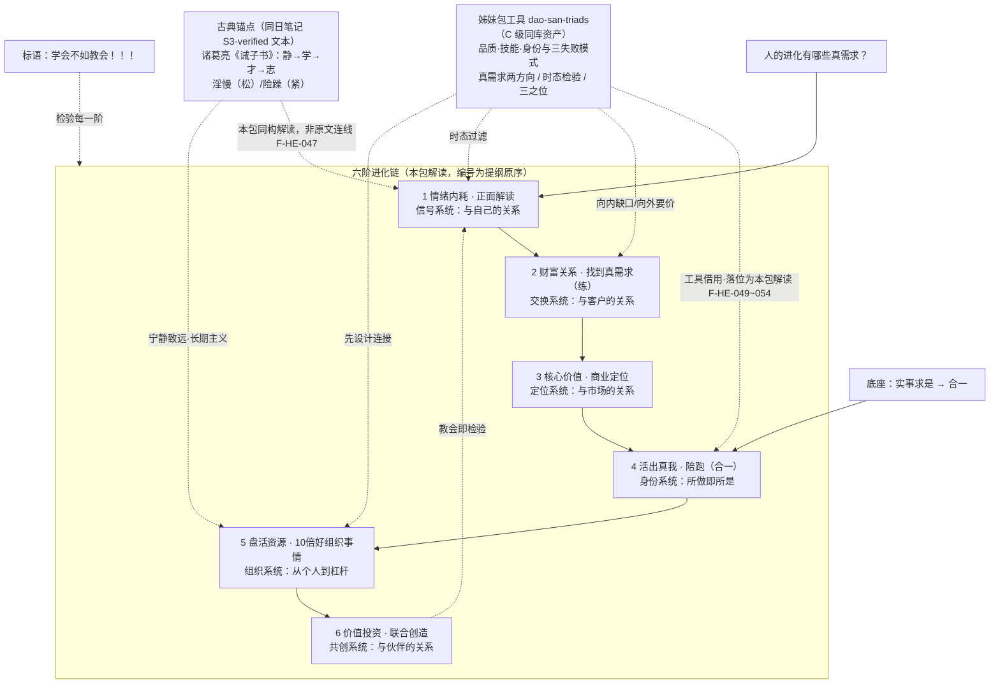

# 架构洞察（Insights）

> 基于 [事实清单](facts.md) 提炼。每条遵循四元组：陈述 / 证据 / 反常识点 / 行动启示。
> **层级声明**：提纲只提供了六个短语与两条标语（F-HE-011~025），以下所有因果、序列、机制判断均为 **本包解读**，不是提纲原文；外部研究（F-HE-027~036）只作概念锚点，不替提纲背书。

## 洞察 1：六个条目不是六个并列话题，而是一条「自我 → 关系 → 贡献」的有向序列

| 四元组 | 内容 |
|--------|------|
| **陈述** | 提纲以 1–6 固定编号排列六个四字主题词，起点是向内处理情绪（情绪内耗），终点是向外联合创造（价值投资）；作用半径从个体内部，扩到一对一的财富关系，再到市场定位、陪跑关系、组织、合伙网络。本包解读为一条「内→外、己→人、受→给」的有向进化链，而非六张并列的自助标签。 |
| **证据** | F-HE-011（编号 1–6 与「主题词——动作短语」固定结构）；F-HE-024（六个左半主题词）；F-HE-025（六个右半动作短语）；F-HE-026（提纲未标注「阶段」二字，序列属性是结构推断）。 |
| **反常识点** | 流行成长内容多从「搞钱」「定位」开始讲，本提纲却把「情绪内耗」放在第 1 位——按序列解读，先修信号系统再谈交易与创造，顺序反了，后面的努力会被内耗反复清零。 |
| **行动启示** | 不要六门课同时上。先定位自己实际卡在哪一阶：前一阶没有松动，跳到后一阶通常表现为「学了很多但动不起来」。定位方法见 [六阶自检工作表](examples/01-six-stage-self-check.md)。 |

## 洞察 2：「正面解读」把情绪内耗从故障重新定义为信号

| 四元组 | 内容 |
|--------|------|
| **陈述** | 条目 1 不给「停止内耗」的方法，而给「正面解读」这个动作。本包解读：提纲把内耗视为携带信息的信号（什么事被反复想起，什么就在提示未被满足的真实在意），解读的方向是寻找其正面功能，而非压制念头。这与心理学中把反刍与认知重评分开对待的思路相容——被动重复是消耗，主动重新赋义是调节。 |
| **证据** | F-HE-012（条目 1 原文）；F-HE-029（反刍思维构念）；F-HE-030（认知重评）。 |
| **反常识点** | 「正面」在这里不是自我安慰。若把正面解读执行成「凡事往好处想」，恰好退回内耗的另一种形态（压抑真实信号）。判据是：解读之后是否出现了可执行的下一步；只有情绪安抚没有行动，是鸡汤不是解读。 |
| **行动启示** | 对内耗事件做一次三行书写：①我反复在想什么（事实）；②它在保护我什么/提示我在意什么（正面功能）；③最小的下一步动作是什么。第三行空白，说明还停留在安慰层。 |

## 洞察 3：第 2→3 阶完成了一次关键转向——从「钱的数字」转向「关系中的真实需求」

| 四元组 | 内容 |
|--------|------|
| **陈述** | 条目 2 是「财富关系——找到真需求（练）」，把财富定义为关系问题而非金额问题，并标注「练」字，提示这是技能训练而非认知顿悟；条目 3 随即要求把找到的需求收敛为「核心价值——商业定位」。本包解读：先在真实交易关系里识别他人愿意为什么付钱，再据此刻自己的位置，顺序不可颠倒——没有需求证据的定位是自嗨。 |
| **证据** | F-HE-013（财富关系＋「练」标注）；F-HE-023（「真需求」在标题与条目 2 两处出现）；F-HE-014（核心价值——商业定位）；F-HE-027/F-HE-028（外部需求理论仅作对照）。 |
| **反常识点** | 「财富关系」这个组合词本身就反常识：多数人把财富当人与钱的关系，提纲把它当人与人的关系（钱只是关系中价值流动的计量）。于是财富卡点的诊断不是「我怎么赚到更多」，而是「我在为谁解决什么真问题、这件事是否被反复练习过」。 |
| **行动启示** | 做一次「练」的最小单元：找 3 个真实付费/交换场景，写下对方的原话需求、你的交付、对方的复购或转介绍行为。没有「练」的证据，不进入第 3 阶定位讨论。 |

## 洞察 4：第 4→6 阶是身份与杠杆的两次跃迁，「合一」是状态声明不是终点

| 四元组 | 内容 |
|--------|------|
| **陈述** | 条目 4「活出真我——陪跑（合一）」把自我实现落在一个服务动作（陪跑他人）上；条目 5「盘活资源——10倍好组织事情」（最新版措辞，F-HE-016）从个人努力跃迁到组织资源；条目 6「价值投资——联合创造」再跃迁到合伙共创。末行「【实事求是】合一」（F-HE-020）把「合一」锚定在实事求是之上。本包解读：合一是「所做即所是、知行不断裂」的持续状态，且必须以事实求是的校验为底座，否则合一感只是自我感动。 |
| **证据** | F-HE-015（陪跑＋合一）；F-HE-016/017（条目 5 两版措辞差异：传播 10 倍好 → 10 倍好组织事情）；F-HE-018（联合创造）；F-HE-020/F-HE-022（末行与「合一」2 次出现）；F-HE-031（10x 话语的外部出版物锚点）；F-HE-032/033（实事求是词源与经典阐释）；F-HE-034（知行合一）。 |
| **反常识点** | 条目 5 的版本修订方向值得注意：从「传播 10 倍好」（放大声量）改为「10 倍好组织事情」（放大组织）——重心从「让人知道」移到「把事组织好」。本包解读这是在防一种常见跑偏：资源盘活被做成流量焦虑。同时「10 倍好」无任何量化定义，不能当绩效指标用。 |
| **行动启示** | 评估第 5 阶时不问「我流量涨了多少」，而问「哪些事在我不在场时仍被 10 倍好地组织完成」；评估第 4 阶时用「合一缺口」测试：我做的事和我说的自己，最大的一处断裂在哪。 |

## 洞察 5：「学会不如教会」是整条链的检验装置——输出即闭环

| 四元组 | 内容 |
|--------|------|
| **陈述** | 「学会不如教会！！！」单独成行、三个感叹号，是全提纲唯一带强烈情绪标记的句子（F-HE-019）。本包解读它的功能是检验装置：每一阶的「学会」都以能否「教会他人」为完成判据——能教会意味着已能把默会知识拆成对方可执行的结构。这与本库 [正面解读师框架](../taoxingzhi-youbenchang-huge/concepts/05-framework-positive-reader.md)「不接受句子，接受结构」同构。 |
| **证据** | F-HE-019（标语原文与排版强度）；F-HE-026（提纲无图示无其他说明）。 |
| **反常识点** | 「教」不是学完之后的馈赠，而是学的最高形式——但流行的「学习金字塔 90%」数字并无可靠原始实验证据（F-HE-035），「费曼学习法」也是后世冠名（F-HE-036）。因此该标语的依据应落在可检验的机制（教会迫使结构化、暴露缺口、获得外部反馈），而不是伪造的留存率百分比。 |
| **行动启示** | 每学完一阶，做一次 15 分钟「教会测试」：向一个外行讲清「这是什么、何时用、第一步做什么、不要做什么」。对方复述不出第一步，说明自己还没结构化，回炉重学。 |

## 洞察 6：《诫子书》是六阶链的一份古典同构文本——「静」是全链闸门，「淫慢/险躁」是内耗的两种古典形态

| 四元组 | 内容 |
|--------|------|
| **陈述** | 同页笔记本的「古为今用」栏收录诸葛亮《诫子书》全文（F-HE-037/038）。本包解读：这篇 86 字短文与六阶链存在**结构性同构**——「静以修身」对应第 1 阶信号系统，「俭以养德/淡泊明志」约束第 2–3 阶的财富与定位，「学—才—志」条件链对应「练」与教会检验，末句「年与时驰」提供全链的时间压力。照片特意标色「淫慢」「险躁」（F-HE-039），本包解读为笔记主人也把这两词当作全文枢纽。 |
| **证据** | F-HE-038（全文）；F-HE-039（两处颜色标注）；F-HE-045（两词通行释义：放纵懈怠 / 轻薄浮躁）；F-HE-046（五段结构）；F-HE-047（照片未做显式连线，同构关系是本包解读）。 |
| **反常识点** | 两种「内耗」方向相反：**淫慢是松的内耗**（放纵、提不起劲、励不了精），**险躁是紧的内耗**（浮躁、冒险、定不下性）。流行说法把内耗只理解为「想太多」（紧的一侧），忽略了「刷手机/拖延/提不起劲」同样是消耗（松的一侧）。《诫子书》在 1800 年前就成对地警戒了这两侧，且都归因于「不静」——闸门只有一个：静。 |
| **行动启示** | 三行书写（[02 练习](examples/02-positive-reframing-practice.md)）前增加一步分型：这次内耗更接近「淫慢」（松/瘫）还是「险躁」（紧/乱）？淫慢的对症动作是立小约（一个最小启动动作），险躁的对症动作是减事项（停掉一件并行任务）——方向相反，用错药会加重。 |

### 同构映射详表（本包解读，非诸葛亮原意）

| 《诫子书》成分 | 六阶链对应 | 可操作的连接 |
|---------------|-----------|-------------|
| 静以修身 | 第 1 阶 情绪内耗·正面解读 | 静＝信号系统不被反刍占满，是后续一切的前置条件 |
| 俭以养德 / 非淡泊无以明志 | 第 2–3 阶 财富关系·核心价值 | 俭/淡泊＝降低伪欲望噪声，真需求与真志才显形 |
| 非宁静无以致远 | 第 5–6 阶 盘活资源·联合创造 | 致远＝长期主义；组织与合伙要求不被短期声量牵动（呼应 [05 的流量跑偏反模式](concepts/05-stage-resources.md#六反模式)） |
| 学须静→才须学→非学广才→非志成学 | 「练」与「教会」检验 | 静→学→才→志是闭环：志驱动学，学产出才，教会是学的外部检验 |
| 淫慢不能励精 / 险躁不能治性 | 第 1 阶两类反模式 | 松/紧两类内耗分型，对症动作相反 |
| 年与时驰……悲守穷庐，将复何及 | 全链时间维度 | 六阶不是终身排队的课程表；时间衰减是真实约束，支持「一次只攻一阶但要尽快开始」 |

> **证据纪律**：上表是两份文本在本包解读下的结构对照（F-HE-047 已登记照片无显式连线）；《诫子书》原文可信（verified），映射关系不可信为诸葛亮原意。

## 洞察 7：合一是校准动作（关系位），真我是被技能证据撑住的身份叙事——「活出真我」不可直接声称

| 四元组 | 内容 |
|--------|------|
| **陈述** | 学习同库姊妹包 [三元组探究](../../../guoxue/laozi/dao-san-triads/index.md) 后，本包对第 4 阶「活出真我——陪跑（合一）」获得一个可操作的辨析装置（F-HE-049~051）。该包把个人能力分为三层：品质＝无人监督时的选择倾向，技能＝可重复产出且可验证的能力，身份＝自我叙事（可被表演）。借它重读本阶：**「真我」不是一个可以直接找到并宣布的内在实体，而是「品质→技能→身份」三层被证据自上而下撑住后的样子；「合一」不是真我本身，而是反复核对说/信/做是否一致的那个校准动作**——用姊妹包的语言说，合一是「关系位」，真我若被当成第三个可拥有的东西，就立刻退化为表演。 |
| **证据** | F-HE-050（三层定义：品质/技能/身份及其可验证性差异）；F-HE-051（空谈/工具/表演三失败模式与「先做出一件东西」短路规则）；F-HE-015（提纲本阶原文「活出真我——陪跑（合一）」）；F-HE-020（末行「【实事求是】合一」）。本阶文档原有机制陈述（「身份由证据而非宣言构成」）与该三元组独立同构。 |
| **反常识点** | ①「真我」越用力直接追求越容易假：跳过技能证据直接宣布「我是什么人」，正是三失败模式里的「表演」（只有身份没有技能）。②反过来，只有技能不回答「我是谁」则成「工具」——只做事不叙事，意义无法整合；只有品质没有技能是「空谈」——境界感无产出支撑。③因此「活出真我」的语序是**做出来→讲出来→被反复核对**，不是「找到真我→照着活」。陪跑之所以是动作而非比喻，正因为它强制产出「我确实帮成过谁」的技能证据。 |
| **行动启示** | 把 [合一缺口测试](concepts/04-stage-self.md) 升级为三层自测：①品质层——无人看见时我最近一次的选择是什么？②技能层——过去 30 天哪一件产出有作品/数据/他人反馈支撑？③身份层——我讲的自己，与②的证据逐条对得上吗？②为空时不做③的宣称（短路规则）。三层之外再加关系位一问：我说的、我信的、我做的此刻一致吗——这一问就是合一，它永远是动词。 |

### 附：三失败模式在六阶链中的落位（本包解读）

| 三元组失败模式 | 发生机制 | 在六阶链中的典型形态 | 对症 |
|---------------|---------|---------------------|------|
| 空谈（有品质无技能） | 停在未分化的「一」，无具体产出 | 用境界话语回避前 3 阶的收费、定位功课（＝精神化逃避反模式） | 先做出一件东西 |
| 工具（有技能无身份） | 停在「二」，只分化不整合 | 什么都会、接单很多，却说不出自己是谁、为什么做 | 写身份叙事，再回事实核对 |
| 表演（有身份无技能） | 跳过「二」直接声称「三」 | 头衔/人设齐全，无可验证作品；合一感最强时分裂最深 | 停宣称，补一项 30 天可验证产出 |

> **证据纪律**：品质·技能·身份的定义与三失败模式是姊妹包对 `.agents/skills/role-model-methodology/SKILL.md` v1.1.0 的登记转述（F-HE-049~051，C 级同库资产）；它们与六阶提纲的落位对应是**本包解读**，提纲本身只有「活出真我——陪跑（合一）」八个字，不得写成提纲作者持有身份理论。另一条可迁移工具「真需求」方向分叉（向内缺口/向要价，F-HE-052）落到 [02 财富关系](concepts/02-stage-wealth.md)；时态检验与「三之位」（F-HE-054）分别落到 [01 情绪内耗](concepts/01-stage-emotion.md) 与 [05 盘活资源](concepts/05-stage-resources.md)。

## 洞察 8：Day6 课程与提纲逐条对应——提纲的「作者原意」有了可对照的讲解版本，但有四处实质增补

| 四元组 | 内容 |
|--------|------|
| **陈述** | 2026-10-06 直接采集的「如何找到真需求Day6」元宝纪要（F-HE-055~098）中，讲师**按相同顺序逐条讲了六个阶段**：情绪内耗→正面解读、财富关系→找到真需求（练）、核心价值→商业定位、活出真我→陪跑（合一）、盘活资源→10倍好组织事情、价值投资→联合创造（F-HE-056）。本包解读：这说明提纲并非随手写下的六条并列标签，而是一份**有配套讲解的课程提纲**；提纲与课程是「纲」与「讲义」的关系。此前六阶链的「有向序列」解读（洞察 1）由结构推断升级为**有外部讲义佐证的结构**。但须严格区分：这证明「存在一套与提纲一致的讲解」，**不证明笔记作者就是该课程讲师**，也不构成对提纲原始出处的定位（见下条反常识点）。 |
| **证据** | F-HE-056（六阶段逐条对应）；F-HE-057（第 5 阶最易卡）；F-HE-058（先看清在哪层就重点做那层）；F-HE-059（课后作业三条：定位所处阶段→制定行动计划→预约一对一梳理）；F-HE-055（会议与讲师身份登记）。 |
| **反常识点** | **① 这不等于找到了提纲出处。** 提纲的 flagged 状态**不解除**：纪要是第三方课程的 AI 加工产物（F-HE-056），笔记照片带用户私人水印与 2026-10-01 画面日期（F-HE-007/004），「笔记是听课笔记」这一最可能解释仍未经证实（可能性显著上升，但仍是推断）。**② 课程版本与照片版本存在可辨识差异**，见下方增补表——提纲是压缩后的提纲，课程是展开版，二者不是同一文本。**③ 课程含大量商业与社群运营内容**（F-HE-089/094/096/098），这些不属于提纲六阶本身，本包已单独隔离登记，防止把营销话术读成方法论。 |
| **行动启示** | 本教程此后以课程讲义作为**对照源**而非**权威源**使用：概念页中凡与课程讲法冲突处，以提纲字面与本包解读为准；凡课程提供了提纲没有的判据（如「放下≠放弃」「点线面」），作为**增补工具**引入并标注来源与弱信源级别。 |

### 8.1 课程相对提纲的四处在增补（本包解读）

提纲每阶仅四字主题词 + 短动作短语，课程给出了三条提纲完全没有的判据。它们是本次学习最有价值的收获——**补的是提纲被压缩掉的操作层**：

| 增补 | 课程原意（据 AI 纪要） | 提纲中的位置 | 本包处置 |
|------|----------------------|-------------|---------|
| **放下 ≠ 放弃** | 放下是策略性暂停（暂放、等准备好重来，如跌倒先休息再出发）；放弃是切断可能。凡会放弃东西的人都很难活出真我，因为真我没有那个分别的「我」（F-HE-077） | 第 4 阶「活出真我」仅有短语，无此辨析 | 落入 [04 阶段四](concepts/04-stage-self.md)「真我不会被误认为可被丢弃」，并与《诫子书》「悲守穷庐」「将复何及」的时间警示接上 |
| **点 / 线 / 面** | 找人真需求是「点」，组织活动是「线」，未到「面」；须先在点上击穿再扩展。做组织者若只做组织不找真需求，容易「元神消散」（F-HE-086/087） | 第 5 阶「盘活资源——10倍好组织事情」 | 落入 [05 阶段五](concepts/05-stage-resources.md)，作为「组织的单位是连接方式」（3.1）的**前置顺序判据**：先点后面 |
| **乙方陷阱与「无招胜有招」** | 「真问题→真目标→真需求」前三步共有的结构问题是都处在**乙方关系**（把自己卖给对方，很累）；解法是切回第三步找自己核心价值、让人主动为你而来。顶级水平时这三个词一个字都不能对对方说，否则暴露意图（F-HE-071/072） | 第 2→3 阶「找到真需求（练）→商业定位」的跃迁只有短语 | 落入 [02 阶段二](concepts/02-stage-wealth.md) 与 [03 阶段三](concepts/03-stage-value.md)，作为「练」的**方向修正**：练不是把自己卖得更用力 |
| **感恩与敬畏：合一的两条路径** | 给出通向合一的两条心法：感恩、敬畏；所举敬畏例证为「举头三尺有神明」与晨间供祖先牌位烧香；并称儒家的敬畏、佛学的深信不疑、道家的自然三者都含合一元素（F-HE-079/080/081） | 末行「【实事求是】合一」只有四字 | 落入 [07 底座](concepts/07-foundation-heyi.md)，作为「合一」从抽象校准动作**落到可日课操作**的路径 |

### 8.2 课程给出的一条反直觉顺序判断

纪要中讲师明确指出**第 5 阶（盘活资源）是六阶中最容易卡住的一步**（F-HE-057），并给出「先看清自己处在哪一层，就重点做那层的事，逐步往下走」（F-HE-058）。

本包解读：这对本教程原有的「一次只攻一阶」建议是一个**重要校准**。原建议隐含「逐阶上升」的直觉，但课程经验指出最容易断裂的不是第 1 阶（内耗，人人都知道要处理），而是**跨过第 4 阶进入第 5 阶的那个跃迁**——从「我的事」变成「组织别人的事」，单位从个人变成事与系统。理由可从既有事实推出：前 4 阶的单位都是「我自己」，第 5 阶第一次要求单位变成「事」（见 [05](concepts/05-stage-resources.md) 第二节），且课程同时给出了「小盘/大盘」的区分（F-HE-088）——没有合一性底盘的人做大盘会被反噬。**这条校准的证据来自弱信源纪要，本包采信方向、不采信强度**，落地为 [六阶自检工作表](examples/01-six-stage-self-check.md) 中的一个专项提示。

### 8.3 课程原声中已被隔离、不进入方法论层的内容

以下内容客观存在于纪要中，但本包**判定其不属于提纲六阶的方法论**，隔离登记于事实层，不进入任何概念页的机制陈述：

| 内容 | 事实编号 | 隔离理由 |
|------|---------|---------|
| 一对一梳理服务定价 5.18 元、上微店售卖、讲师咨询费 6000 元/小时、年度陪跑 33 万 | F-HE-089/096 | 商业定价与营销参照，不构成方法论；且此类数字最易被误读为「方法有效性的证明」 |
| 训练营按期举办、每日选组长/副组长赋能、配额与报名机制 | F-HE-094 | 社群运营机制，属课程交付方式而非个人成长方法 |
| 分享名额、提问名额、扣 111、合影齐呼「人生 10 倍好」 | F-HE-098 | 仪式性社群动作；「10 倍好」本身无量化定义（见 [05](concepts/05-stage-resources.md) 第四节） |
| 「酒类项目首月名额已满正做置换」 | F-HE-089 | 讲师个人业务事项，与价值投资概念无关 |
| 学员个案转述（HR 转直销等） | F-HE-097 | 个体叙述，可作共鸣素材，不作论据 |

## 知识地图

> 图中虚线为本包推断的回流关系（提纲画面无箭头，F-HE-026）；诫子书节点与六阶的连线同样是本包映射（F-HE-047），不是照片原有。姊妹包节点只表示工具借用方向（F-HE-049~054），不表示两包之间有出处或传承关系。阶段名称为提纲原文，机制说明为解读层。
