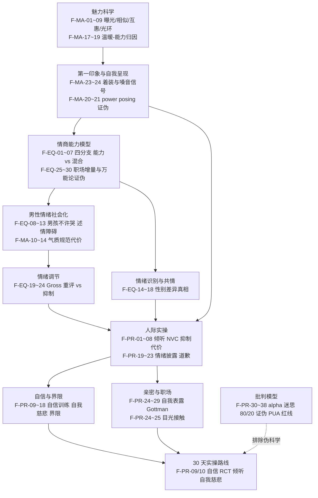

# 架构洞察（Insights）

> 基于 [事实清单](facts.md) 提炼。每条洞察遵循四元组结构：陈述 / 证据 / 反常识点 / 行动启示。洞察是解释层，不构成新事实；事实依据均回指 F-MA-/F-EQ-/F-PR- 编号。

## 洞察 1：魅力是被归因的——男性向训练的重点是松开「高冷」枷锁，而非加装「alpha」姿态

| 四元组 | 内容 |
|--------|------|
| **陈述** | 从温暖-能力双维（F-MA-17 解释人际评价约 82% 方差）到第一印象的快速形成（F-MA-23 着装信号约 129ms 生效），魅力的定义始终是**观察者归因**的结果。这带来一个关键推论：男性向训练能干预的不是"灵魂"，而是**可被感知的信号**（温暖/能力的外显表达、自我呈现节奏），以及第一印象的前几秒。而实证支持的亲近机制——自我表露（F-PR-24）、目光接触（F-PR-25）、脆弱性信息（F-MA-15）——全都指向"松开高冷"，而非"加装姿态"。 |
| **证据** | F-MA-17（温暖-能力 82% 方差）、F-MA-18（温暖先于能力且权重更高）；F-MA-23（着装 129ms 能力判断）、F-MA-24（合身西装提升自信/成功/收入评价）；F-MA-15（脆弱性信息提升友谊亲密）；F-PR-24（自我表露元分析三关联）、F-PR-25（目光接触预测力超感知吸引力）。 |
| **反常识点** | 「冷酷/高冷才有魅力」是男性圈主流想象，但「高冷」无任何对应实证研究；「alpha 姿态」概念源自已被原作者纠正的圈养狼研究（F-PR-30/31），power posing 的激素/行为效应复制失败（F-MA-20、F-MA-21、F-PR-36/37）。实证指向的相反方向：表达抑制损害人际功能（F-PR-08），披露正情绪反而提升温暖、能力与领导力评价（F-PR-19）。 |
| **行动启示** | 练习顺序应为「松开高冷 → 信号管理 → 自我表露」：①先练积极倾听与目光接触（F-PR-01、F-PR-25）；②再练按节奏的适度自我表露（F-PR-24，参照 Aron 45 分钟互惠递进）；③外在信号（着装 F-MA-23）只需注意方向性即可，不必追求"气场表演"（F-MA-20）。 |

## 洞察 2：男性情绪抑制有实证代价——「男儿有泪不轻弹」是可被训练逆转的社会化产物，而非天性

| 四元组 | 内容 |
|--------|------|
| **陈述** | 男性从儿童期即被社会化为情感克制（F-EQ-10 父亲对男孩愤怒更关注、对女儿悲伤更关注；F-EQ-11 父母与女儿谈论情绪更多），传统男性气质规范与孤独、述情障碍、求助减少一致相关（F-MA-10/11、F-EQ-13、F-PR-23）。但抑制策略有系统性代价：不降低内在体验、反升心血管激活（F-EQ-20），损害记忆（F-EQ-21），降低社会支持与亲密感（F-EQ-22、F-PR-08）。 |
| **证据** | F-EQ-08（儿童情绪表达性别差异总体 g<.10）、F-EQ-10、F-EQ-12（述情障碍差异仅 d=0.22）、F-EQ-19（Gross 五类策略）、F-EQ-20（重评 vs 抑制）、F-EQ-21（抑制损害记忆）、F-EQ-22（习惯性抑制与社会支持降低）、F-PR-08（Gross & John 2003）、F-PR-23（规范性男性述情障碍=社会化而非病理）。 |
| **反常识点** | 「不动声色=强大」被当作男性美德，实证恰恰相反：抑制是最低效的情绪调节策略之一，重评与命名才是有效杠杆（F-EQ-19/20）；「男人天生不善表达」被数据弱化——共情性别差异在 EEG 神经测量上为零（F-EQ-16），儿童期差异受情境调节、青春期才扩大（F-EQ-09），述情障碍差异仅 d=0.22（F-EQ-12）。「男儿有泪不轻弹」是可逆的社会化脚本，不是生理宿命。 |
| **行动启示** | 用前摄策略替代抑制：①命名情绪（结合 F-EQ-19 认知改变节点）；②重评改写对事件的解释（F-EQ-20）；③允许适度情绪表达——披露正情绪提升温暖与领导力评价，男女收益相同（F-PR-19）；④对「示弱=丢面子」的恐惧，可借「阳刚名誉→道德声誉」的重构提升表达意愿（F-PR-22）。 |

## 洞察 3：情商「能力 vs 混合」模型之争，决定你该信哪个测量与哪条训练路径——且「情商万能论」是伪命题

| 四元组 | 内容 |
|--------|------|
| **陈述** | 情商不是单一定义：Mayer-Salovey 能力模型（四分支，F-EQ-01/02，MSCEIT 按正确性评分，F-EQ-03）与 Goleman 混合模型（五要素，混入人格特质，F-EQ-05）是两条赛道。选择哪条路径决定了测量方式与训练目标：能力型可训练、增量效度有限但可核验；混合型覆盖面广但被批评为「什么都是、什么都不是」（F-EQ-06）。 |
| **证据** | F-EQ-01~03（能力模型三代定义与 MSCEIT）、F-EQ-04（能力型 vs 自评与认知能力相关 .29 vs .12）、F-EQ-05（混合模型）、F-EQ-25（三类情商测量与绩效相关 .24-.30）、F-EQ-26（控制 IQ 与大五后增量 r≈.03-.07）、F-EQ-28（学业增量解释率 0.7%-2.3%）、F-EQ-29（「80% 成功」无实证）、F-EQ-30（EI 培训 d≈0.53-0.61）。 |
| **反常识点** | 大众以为「情商=成功万能钥匙」，实证显示：①「自评情商高」与「测出情商高」是两回事（F-EQ-04）；②「情商决定 80% 成功」源自畅销书转述、无任何实证支持（F-EQ-29），控制 IQ 与大五后增量解释率仅约 0.7%-7%（F-EQ-26/28）；③但情商训练确实有效（F-EQ-30）——情商既非万能钥匙，也不是伪概念，它是一项**可训练、可测量、但与其他能力协同起作用**的技能。 |
| **行动启示** | 读任何情商书籍先问三个问题：作者用的是能力模型还是混合模型？主张基于什么测量？有复制/元分析证据吗（F-EQ-06/07 的批评可作试金石）？训练上优先选择有元分析支持的组件（F-EQ-30 的 EI 培训），把"情商课"作为技能训练而非人格改造。 |

## 洞察 4：男性圈（Red Pill/PUA/alpha）主张系统性伪科学——最扎实的提升路径反而是实证支持的沟通、自我表露与自信训练

| 四元组 | 内容 |
|--------|------|
| **陈述** | Manosphere/Red Pill/PUA/alpha 的核心主张在实证层面系统性失效：「alpha 狼」源自被原作者纠正的圈养狼研究（F-PR-30/31）；红丸哲学被学术批判为基于伪科学假设且内部自相矛盾（F-PR-32）；「80/20 规则」无同行评审支持（F-PR-35）；PUA 以技巧压缩关系进程、关系多短暂难维系（F-PR-38）。与之对照，实证支持的最扎实提升路径恰恰是男性圈鄙视的"软技能"：倾听（F-PR-01）、自信训练（F-PR-09/10）、自我表露（F-PR-24）、Gottman 冲突管理（F-PR-27~29）。 |
| **证据** | 伪科学面：F-PR-30（Mech 1999 原作者纠正）、F-PR-31（alpha/beta 无实证基础）、F-PR-32（红丸批判）、F-PR-33（选择性挪用进化心理学）、F-PR-35（80/20 证伪，在线约会以相似匹配为主）、F-PR-36（power posing 复制失败）、F-PR-38（PUA 批判）。实证提升面：F-PR-01（倾听元分析）、F-PR-02（复述提升社会吸引力）、F-PR-09/10（自信训练 RCT 与元分析）、F-PR-24（自我表露元分析）、F-PR-25（目光接触）。 |
| **反常识点** | 男性圈把两性关系当作「零和博弈/性市场」（F-PR-33），但实证显示在线约会以相似吸引力匹配为主（F-PR-35）；被男性圈视为「示弱」的道歉与情绪披露，反而通过可信赖度修复信任（F-PR-20）并提升领导力评价（F-PR-19）。「展示脆弱增强领导力」虽被畅销书过度普适化（F-PR-06 质性研究无 RCT），但其内核（情绪披露、接受影响）有实验支持（F-PR-19、F-PR-29）。 |
| **行动启示** | 用本知识包批判条目（F-PR-30~38）作男性圈话术的证伪清单（alpha/beta、80/20、性市场价值、PUA 技巧）；实操只走 RCT/元分析支持的路径：积极倾听（F-PR-01/02）、自信训练（F-PR-09）、自我表露节奏（F-PR-24）、Gottman 冲突管理（F-PR-27~29），并对照 [30 天路线](examples/00-overview.md) 每周校验证据等级。 |

## 知识地图



## 阅读路径推荐

```
实用取向：facts.md → 30 天路线 → 沟通倾听 → 自我表露 → 界限与自信
理论取向：魅力科学（F-MA-01~09）→ 能力模型（F-EQ-01~07）→ 情绪调节（F-EQ-19~24）
质疑取向：批判模型（F-PR-30~38）→ 混合模型争议（F-EQ-25~30）→ references/01-studies
```

## 跨书参照

魅力×情商框架与分组内外知识包存在多组交叉：

- **男性情绪社会化与自我表露**：与 [《依恋》知识包](../../relationships/attached/insights.md) 的"直接表达需求"相互印证——自我表露（F-PR-24）是实证支持的亲近机制。
- **界限与情绪抑制**：男性「高冷」文化与情绪抑制代价（F-PR-08）是对《界限》类读物"学会拒绝"建议的男性向校准——先松开抑制，再谈界限表达。
- **亲密关系中的 Gottman 方法**：接受影响（F-PR-29）与 [relationships 分组](../../relationships/index.md) 下关系维护主题知识包相互印证。
