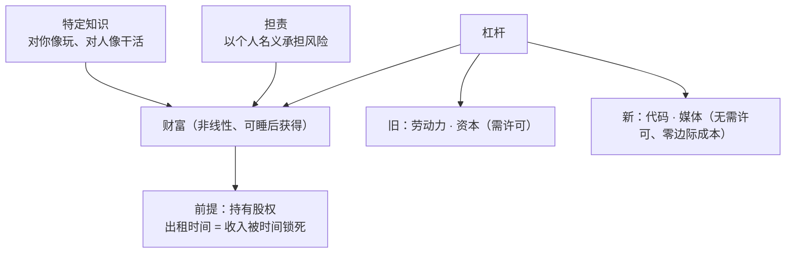

# Naval 其人与其财富公式的原始框架

> 本页回答两个问题：被博文引用的"纳瓦尔"是谁？他本人关于财富的**可逐字核验**的框架是什么？所有事实见 [核验报告](../references/verification.md)，博文原文口径见 [博文事实清单](../references/article-source.md)。

## 一、纳瓦尔是谁

纳瓦尔·拉维坎特（Naval Ravikant），1974 年 11 月 5 日生于印度新德里，后移民美国，硅谷投资人与创业者（F-019）：

- **2007 年**创立早期投资基金 Hit Forge，早期投资了 Twitter、Uber、Stack Overflow 等公司；
- **2010 年**与 Babak Nivi 联合创办 AngelList（早期创投与初创融资平台）；
- 个人天使投资超过 **200 家**公司，是硅谷最知名的个人投资人之一；
- 2018 年在 Twitter 发布 40 条推文组成的风暴帖 **《How to Get Rich (without getting lucky)》（不靠运气致富）**，是其财富思想最集中的一手文本（F-020）；
- 他本人没有写书。流传最广的结集是 Eric Jorgenson 编纂、2020 年出版的 **《The Almanack of Naval Ravikant》**（中译《纳瓦尔宝典》），CC BY-NC 协议、官网 navalmanack.com 免费阅读（F-026）。

> ⚠️ 口径修正：博文说他"投资**孵化**了推特、优步等上百家企业"（F-003）。准确说法是：他是这些公司的早期**投资人（investor）**，不是孵化者/创办人；投资数量 200+ 与"上百家"相容（F-019）。

## 二、原始财富公式：三个支柱，不是三个动作

Naval 2018 年 tweetstorm 的核心可概括为：

> **财富 = 特定知识 × 担责 × 杠杆**（Specific Knowledge + Accountability + Leverage）
> 个人品牌口号：**"Productize Yourself"（把你自己产品化）**（F-020）

注意这是三个**结构性支柱**（缺一项回报就被压回线性区间），而不是"每天循环做三件小事"式的时间管理动作。三者各自含义：

### 1. 特定知识（Specific Knowledge）

- 定义：无法通过标准化培训批量传授、与你的天赋和经历深度绑定的知识；
- 判据原话："**feels like play to you, but looks like work to others**"（对你像玩，对别人像干活）；
- 不可替代性原话："**If society can train you, society can train someone else, and replace you.**"（社会能培训你，就能培训别人来替代你）（F-025）；
- 获取方式：大量阅读（Naval 自述阅读量约每天 1–2 小时，F-023）、追随好奇心而非追热点、在真实项目中积累。

博文"特定知识无法标准化教学、结合个人经历特长"的说法（F-007）**与原文一致**，是全文转述最准确的一段（F-025）。

### 2. 担责（Accountability）

- 以**个人名义**在商业活动中承担风险、明确所有权，用个人声誉做杠杆；
- 承担责任有失败的风险（"society will punish you for it"），但因此回报也明确归属于你；
- 在现代商业中，担责集中体现为：你是否以自己的名字对产品/判断负责，是否持有明确归属的成果。

这一支柱在博文"学造连"中**完全没有对应物**（F-022/F-027）。

### 3. 杠杆（Leverage）：财富非线性的真正来源

Naval 把杠杆分为两代四类（F-022）：

| 代际 | 杠杆 | 特征 | 是否需要他人许可 |
|------|------|------|-----------------|
| 旧杠杆 | 劳动力 | 让别人为你工作 | 需要（管理成本高） |
| 旧杠杆 | 资本 | 用钱放大产出 | 需要（要有人给你钱） |
| **新杠杆** | **代码** | 产品睡后仍在运行、零边际复制成本 | **不需要** |
| **新杠杆** | **媒体**（内容/播客/书/视频） | 一次创作无限分发、睡后仍在传播 | **不需要** |

新杠杆"无需许可（permissionless）"是 Naval 认为这一代普通人最大的机会窗口。与之配套的硬性推论是：

> **要拥有股权（Equity）**——拥有公司或产品的一部分，才能获得非线性回报；只出租时间（拿工资/按件计费），收入永远被工作时间锁死（F-022）。

## 三、原文中的"造与卖"

博文把行动端概括为"造（作品）+ 连（人脉）"。Naval 原文的对应说法是：

> "**Learn to sell, learn to build. If you can do both, you will be unstoppable.**"（学会卖，学会造；两者皆会，你将不可阻挡。）（F-020）

- **build（造）**：从无到有做出产品——编程、设计、写作、制造；
- **sell（卖）**：面向市场的销售、分发、说服、招募——与 build 并列的必需技能，不是"搞好人际关系"；
- 两者齐备的人可以独立创业；只会其一的人需要与另一方合作（F-027）。

## 四、一张图记住原始框架

## 五、时间尺度：复利，不是速成

Naval 明确把财富（以及知识、健康、关系）的回报归入**复利**：所有回报都来自复利，兑现周期"通常 10–20 年，有时也要 5 年"（F-024）。他主张的恰恰是放弃"快速致富秘诀"式预期——这与博文"三年被动收入超过工资"的速成叙事（F-002）方向相反。

## 小结

| 维度 | Naval 本人框架（可核验） |
|------|--------------------------|
| 公式 | 特定知识 + 担责 + 杠杆 |
| 口号 | Productize Yourself |
| 行动技能 | build **and** sell（两者皆会） |
| 普通人入口 | 代码/媒体这类无需许可的新杠杆 |
| 分配前提 | 拥有股权，而非只挣工资 |
| 时间尺度 | 复利，5–20 年 |
| 一手文本 | 2018 tweetstorm；二手权威汇编《The Almanack of Naval Ravikant》（F-026） |

下一页 [01 框架对勘](01-learn-build-link-audit.md) 逐项拆解博文"学造连"与本框架的对应与错位。
