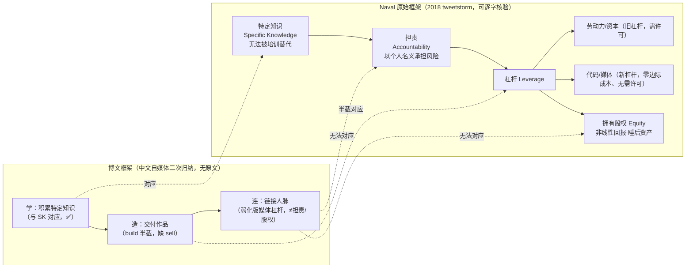

# 核验报告："学造连"与 Naval 原始框架对勘

> ## ⚠️ flagged 状态明示（先读本节）
>
> 本知识包的核验结论是 **status: flagged**，原因是博文**标题级主推框架**"学、造、连"**核验失败**：
>
> 1. **无原始出处**：Naval Ravikant 本人 2018 年 tweetstorm《How to Get Rich (without getting lucky)》、播客访谈与《纳瓦尔宝典》中均无"学造连"三字框架（F-020、F-021）；
> 2. **遗漏核心要素**：原始框架是"特定知识 + 担责 + 杠杆"，并以拥有**股权**为财富非线性增长的前提；博文用"链接人脉"替代了杠杆/股权/担责（F-022、F-027）；
> 3. **两处量化失实**：每天 30 分钟（Naval 自述 1–2 小时阅读，F-023）、三年被动收入超工资（Naval 称复利通常 10–20 年，F-024）。
>
> **影响范围**：本 bundle 可以作为"二手财富励志内容如何核验"的教学样本阅读，也可以借助其中正确的部分（特定知识概念 F-025）进入 Naval 思想；但**不得把"学造连"当作 Naval 本人观点引用**，更不构成投资建议或收益承诺。正文所有概念页均在正确值旁标注了博文口径。stale_after（2026-12-31）前需复核本结论。

## 一、核验方法与信源距离

- **被核验对象**：微信公众号"洋洋读书成长记"2026-10-02 文章，第三方中文自媒体，全文无任何引用链接、无书名、无访谈出处，信源距离 = 二手转述/再创作。
- **权威基准**：① Naval 本人 2018-05 tweetstorm 原文的逐字整理页（sloww）；② 多档播客访谈要点汇编（podcastnotes，含 Shane Parrish《The Knowledge Project》）；③ 特定知识专题梳理（studiolayerone）；④ 百科生平页（kiddle）；⑤ Eric Jorgenson 编《The Almanack of Naval Ravikant》（2020，CC BY-NC，官网免费），该书为 Naval 本人认可的思想汇编，但 Naval 未亲自写书，仍属二手权威。
- **裁决规则**：可逐字定位到 Naval 本人原话的，判 ✅；框架/口号在本人全部一手材料中无对应物的，判 ❌；方向相通但概念被替换的，判 ⚠️。

## 二、逐项核验结论（7 项）

| # | 博文声明（F 编号） | 权威口径 | 结论 |
|---|------------------|---------|------|
| 1 | "纳瓦尔投资孵化了推特、优步等上百家企业"（F-003） | Naval 1974 年生于新德里；2007 年 Hit Forge 基金投资 Twitter、Uber、Stack Overflow 等；2010 年联合创办 AngelList；个人天使投资 200+ 家（F-019） | ✅ 身份与规模属实；**用词修正：投资（invest）≠ 孵化（incubate）**，他不是这些公司的创办/孵化者 |
| 2 | 致富秘诀是循环做"学、造、连"三件事（F-004） | 原始财富公式 = Specific Knowledge + Accountability + Leverage；口号 Productize Yourself；原文 "learn to build **and sell**"（F-020）；三字诀无任何原文对应（F-021） | ❌ **核心框架归属失败** |
| 3 | 特定知识"无法标准化教学"，结合个人经历特长沉淀（F-007） | 原话："If society can train you, society can train someone else, and replace you."；判据 "feels like play to you, but looks like work to others"（F-025） | ✅ 与原文一致 |
| 4 | "每天留出 30 分钟就足够"（F-008） | Naval 在 Farnam Street 等访谈中自述阅读约每天 1–2 小时（F-023） | ❌ 量化失实，且方向上 Naval 强调的是大量阅读的生活方式，不是下限 30 分钟 |
| 5 | "三年被动收入超过固定工资""三年收入结构质变"（F-002、F-017） | Naval：各类回报来自复利，财富兑现"通常 10–20 年，有时 5 年"（F-024）；博文故事匿名、无数据 | ❌ 时间尺度直接冲突，属励志叙事非事实 |
| 6 | 知识本身不值钱，成果解决问题才换回报（F-013） | 与 build and sell 方向相通，但 Naval 的机制解释是**杠杆**（代码/媒体零边际成本复制）+ **股权**（拥有资产而非出卖时间）（F-022） | ⚠️ 方向对、机制被抽空 |
| 7 | （延伸）Naval 思想有结集书可查 | 《The Almanack of Naval Ravikant》，Eric Jorgenson 编，2020，CC BY-NC，navalmanack.com 免费（F-026） | ✅ 属实，列为读者一手入口 |

**汇总：7 项中 ✅ 3 项（第 1 项附带用词修正、第 3、7 项）、❌ 3 项（第 2、4、5 项）、⚠️ 1 项（第 6 项）。** 因第 2 项是文章的标题级核心主张，按方法论规则整包判 flagged，而非逐点放行。

## 三、框架对勘详图：博文丢了什么

图注（F-020、F-022、F-027）：博文三要素中只有"学"与原始框架完整对应；"造"只覆盖 build，丢了 sell（销售/分发是与造并列的必需能力）；"连"是"用作品吸引同频"的软建议，无法对应 Naval 硬性的 Accountability（以个人声誉为赌注担责）和 Equity（持有公司股权）两个概念。对普通人最关键的操作推论——**优先用代码/媒体这类无需许可的杠杆，并争取持有资产而非只挣工资**——在博文中完全缺席。

## 四、失实点的危害性分级

| 失实点 | 危害类型 | 为什么需要显式勘误 |
|--------|---------|-------------------|
| "学造连"冒充 Naval 框架（F-020/F-021） | 权威背书伪造 | 读者会把自媒体归纳当作硅谷投资人的方法论引用，错误继续二次传播 |
| 漏杠杆/股权（F-022） | 机制层抽空 | 按"学造连"执行可能只成为"持续输出的自由职业者"，按小时/按件计费，恰好错过 Naval 所说的非线性财富机制 |
| 三年质变（F-024） | 时间预期误导 | 短期未见效易归因于"自己不够努力"或方法论失效；Naval 的复利尺度是 5–20 年 |
| 每天 30 分钟（F-023） | 剂量误导 | 把高强度长期输入美化为低门槛习惯，低估特定知识积累所需的投入量级 |

## 五、权威信源 URL 汇总

| 信源ID | URL | 覆盖事实 |
|--------|-----|---------|
| src-sloww | https://sloww.co/how-to-get-rich-naval-ravikant/ | F-020、F-022、F-025（tweetstorm 逐字） |
| src-podcastnotes | https://podcastnotes.org/ （站内检索 Naval Ravikant） | F-020、F-023（访谈要点） |
| src-layerone | https://studiolayerone.com/ （Specific Knowledge 专题） | F-020、F-025（公式与判据） |
| src-kiddle | https://kids.kiddle.co/Naval_Ravikant | F-019（生平、Hit Forge、AngelList、200+） |
| src-usethebitcoin | https://usethebitcoin.com/ （Naval 生平介绍，交叉佐证） | F-019 |
| src-manack | https://www.navalmanack.com/ | F-024、F-026（复利尺度与结集书） |
| 被核博文 | https://mp.weixin.qq.com/s/PuC1WJL0rc98a3EbnZj37w | F-001 ~ F-018 |

> 复核提示：播客访谈类二手索引（podcastnotes、studiolayerone）用于定位说法出处；逐字引用 Naval 原话时以 tweetstorm 原文整理页与《Almanack》文本为准。2026-12-31 前若 Naval 本人新材料出现，应重跑本核验表。
