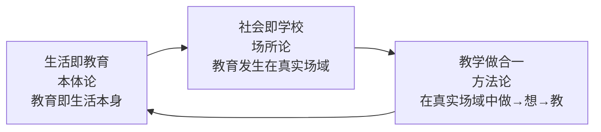

# 01 · 三大命题：生活教育体系

## 1. 三命题的分工（这是最容易被讲错的部分）

绝大多数二手叙述把「生活即教育、社会即学校、教学做合一」并列成三个口号，这会丢掉它最重要的结构——**三者分属不同层面，各自解决一个独立问题**（F-TX-040）：

| 命题 | 层面 | 解决的问题 | 如果缺失会怎样 |
|---|---|---|---|
| **生活即教育** | 本体论 | 教育**是什么**（教育的存在论根据） | 教育变成学校里的专门科目，与生活脱节 |
| **社会即学校** | 场所论 | 教育**在哪里发生**（场域问题） | 学习被关在围墙内，与真实问题隔绝 |
| **教学做合一** | 方法论 | 教育**如何发生**（机制问题） | 教、学、做三者分离，学用脱节 |

> **为什么这个分层重要（推断）**：只有明确「哪一层缺了什么」，才能诊断。现实中 90% 的教育问题不是理念不对（本体论层），而是**场域没打开**（社会即学校缺失）或**机制没闭环**（教学做分离）。诊断错层，处方就错。

## 2. 两次反转：与杜威的分歧点在哪

陶行知的三命题源自杜威的进步主义教育思想，但**他明确把杜威的表述「翻了个个儿」**（F-TX-041）：

| 维度 | 杜威 | 陶行知 | 分歧的性质（本包推断） |
|---|---|---|---|
| 教育与生活 | 教育即生活（为未来生活做准备） | **生活即教育**（生活本身即教育） | 方向反转：杜威把生活放在终点（准备），陶行知把生活放在起点（当下即教育） |
| 学校与社会 | 学校即社会（用学校功能替代社会功能） | **社会即学校**（把学校外延扩展到社会自然） | 方向反转：杜威把社会装进学校，陶行知把学校放回社会 |
| 儿童与实践 | 做中学（learn by doing） | **教学做合一**（教/学/做同一） | 扩展：杜威讲学生怎么做，陶行知讲教师、学生、做事三者如何统一 |

### 为什么必须反转（这是本篇最重要的一段）

陶行知自己给出了理由：杜威的理论产生于**美国社会已高度发展**的语境，美国有条件「先建学校再谈做中学」；而当时中国**大多数人还没受过教育**，「教育即生活」在中国根本没有存在根基（F-TX-041 明确记载此判断）。

**这意味着（推断）**：

> **移植一个方法论之前，必须先问：它成立的前提条件在这里存在吗？**

杜威的前提是「教育已经被普遍承认有价值、且学校体系已经建立」；中国当时的前提是「教育本身尚未普及」。在前提缺失的语境里照搬「教育即生活」，等于让还没受教育的人先学会「为教育而生活」——门槛错配。

> **这是本包萃取的第一条通用原则（详见 [../../youbenchang-jigong/](../../youbenchang-jigong/index.md) 与 [../../huge-actor-craft/](../../huge-actor-craft/index.md) 的同构应用）**：
> **任何「方法论移植」的第一道工序，是核验其隐含前提在本地是否成立。** 陶行知做对了这一步，才有了后面所有的本土化。

## 3. 「教学做合一」的完整拆解

这是三命题中**唯一直接可操作**的方法论，也是最适合现代人照搬的部分。

### 3.1 三重表述（F-TX-043）

原文三重表述，逐层递进：

| 层级 | 表述 | 含义 |
|---|---|---|
| 顺序表述 | 事怎样做便怎样学，怎样学便怎样教 | 做事的方法决定学的方法，学的方法决定教的方法 |
| 角色表述 | 对事说是做，对己说是学，对人说是教 | 同一件事，三个视角：做事者/学习者/传授者 |
| 定义表述 | 教育不是教人，不是教人学，乃是教人学做事 | 教育的对象不是「人」而是「人做的事」 |

### 3.2 一句最关键的话（F-TX-044）

> **「先生拿做来教，乃是真教；学生拿做来学，方是实学。」**

这句话的分量在于它给出了一个**判定标准**：教与学是否真实，不看投入了多少，不看讲得多完整，而看**「做」这个环节是否在场**。讲得再好的知识，若不进入「做」，就只是「非真教」。

### 3.3 「做」的三特征（F-TX-045）

陶行知明确「做」不是盲行盲动，它有三个特征：

1. **行动**——有实际产出，不是空想
2. **思想**——行动伴随思考，不是机械重复
3. **新价值的产生**——行动产生新东西，不是原地打转

> **关键约束（推断）**：第三特征是最难的，也是最容易被跳过的。「做了」不等于「有效」——重复无新价值产生的劳动，不满足「教学做合一」。这个约束防止了「教学做合一」被降级为「学+练」的机械组合。

### 3.4 现代可操作版本（推断层，本包提出）

把「教学做合一」翻译成今天的三步循环：

```
做（行动） → 想（思想+新价值） → 教（传授给他人）
     ↑                              │
     └──────────────────────────────┘
        第三环节是「教」——不做第三步，学习停在自用
```

**为什么必须包含第三步「教」**（推断）：

- 费曼学习法的内核是「讲给别人听」；
- 陶行知的小先生制是同一逻辑的制度化——让识字儿童当小先生，让知识受用者同时成为传播者（F-TX-063）；
- **教学做合一与只做「学+做」的循环，差的就是「教」这一步，而这一步恰恰是知识固化的最强机制**。

> **可直接照做的最小版本**：每学完一个东西，写一篇 500 字的「给外行看的说明」，或教给一个真实的人。写不出 500 字 = 你还没懂。

## 4. 与另外两个命题的连接

三命题不是并列的清单，而是一条链（F-TX-040/041/043）：



- 只有「生活即教育」（承认生活即教育），才可能主张「社会即学校」（把真实生活当学校）；
- 只有「社会即学校」（场域打开），才可能做到「教学做合一」（在真实问题中学做）；
- 而「教学做合一」产生的真实经验，又反过来证明「生活即教育」——**这就是他改名的理由**（F-TX-046/047）：行是知之始，知是行之成。

## 5. 本篇的适用边界（先说清不能做什么）

| 不能这样用 | 为什么 | 该怎么用 |
|---|---|---|
| 把「生活即教育」理解成「教育即放任」 | 他同时主张六大解放 + 三大需要 + 因材施教（F-TX-056/059），是解放不是放任 | 六大解放针对的是「裹头布」，不是必要的规则 |
| 把「社会即学校」理解成「学校取消」 | 他办的是有校舍、有课程、有作息的实际学校（F-TX-010/011） | 场域扩展，不是机构取消 |
| 跳过「教学做合一」只学「六大解放」 | 六大解放是环境条件，教学做合一是运行机制（F-TX-062） | 环境 + 机制配套，缺一不可 |
| 忽略前提核验直接照搬 | 他的方法论本来就是「核验前提后本土化」的产物（F-TX-041） | 先问前提，见第二节 |

## 6. 引用与溯源

本篇 F 编号均可回溯 [../references/facts.md](../references/facts.md)。「三层分工」「现代可操作版本」「适用边界四表」三部分为本包推断层（D 级），是对陶行知原文的结构化重述，不是原话。

**下一篇**：[02 每日四问：完整结构与用法](02-daily-four-questions.md) —— 唯一可以今天就开始用的工具。
