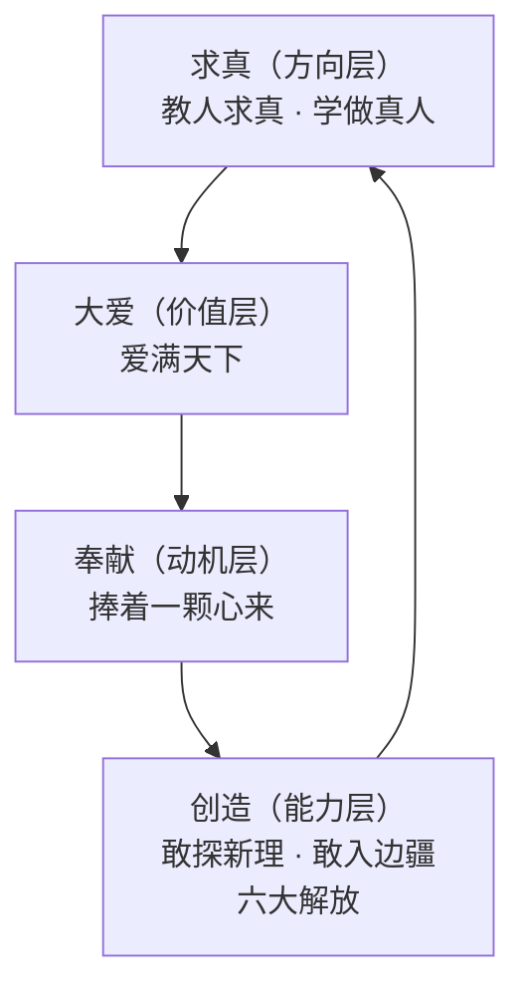

# 04 · 品质信号：十二句教诲与日常细节

> **本篇的方法论立场**：金句摘抄不产生改变。本篇只做一件事——**把语录还原成行为模式，再把行为模式抽成可复制的品格结构**。每一条教诲后面都标注「它在什么处境下产生」，因为脱离处境的语录是空的。

## 1. 十二条教诲全文与处境还原

以下十二条出自南京市博物总馆纪念晓庄建校 80 周年所辑（F-TX-093）：

| # | 原文 | 产生处境（推断） | 可复制动作 |
|---|---|---|---|
| 1 | 我们要跟小孩学习，不要向小孩子学习的人，不配做小孩子的先生 | 反对以成人权威压制儿童 | 遇到不懂的，承认不懂并去学 |
| 2 | 人人都说小孩小，谁知人小心不小。你若小看小孩子，就比小孩还要小 | 同上 | 不以年龄/资历预判判断力 |
| 3 | 怕难、怕苦、怕孤、怕死，就好好地埋没了一生 | 劝人不要自我设限 | 识别自己最怕的一件事，单独排期 |
| 4 | 绝望是懦夫的幻想 | 劝人在困境中保持行动 | 困境中只列「下一步」，不列「完了」 |
| 5 | 行动是老子，知识是儿子，创造是孙子 | 强调行动先于知识（F-TX-048 同源） | 先做出来，再补知识 |
| 6 | 四体不勤，五谷不分，孰为夫子；小疑必问，大事必闻，才称学生 | 反对空谈 | 手上要有实际产出 |
| 7 | 义则居先，利则居后；敬其所长，恕其所短 | 论用人和交友 | 排序上义先利后；评价上先看长处 |
| 8 | 行是知之始，知是行之成 | 核心知行观（F-TX-047） | 以「做」为知识成立的检验 |
| 9 | 不能用人之长，便是自己之短 | 论用人 | 把「我的人」当能力清单看 |
| 10 | 滴自己的汗，吃自己的饭，自己的事自己干；靠人、靠天、靠祖上，不是好汉 | 论自立 | 有一件事完全自己承担 |
| 11 | 人人说我是「共呆」，愿与众生共忧灾；金向青天立一誓，不带债务进棺材 | 自我期许（与「共」谐音双关） | 定期检查自己是否在还债式地生活 |
| 12 | 捧着一颗心来，不带半根草去 | 1939 年为新安小学题写的对联（F-TX-045 相关，上海市行知中学工具书载） | 动机审查：我做这件事的回报是什么？ |

> **教诲 12 的出处说明**：F-TX-045 载「1929 年 6 月 6 日，陶行知在江苏淮安萧湖创办新安小学，任首任校长。面对经费校舍短缺的困境，陶行知为学校题写了『捧着一颗心来，不带半根草去』的对联」——**注意这与 F-TX-023 育才学校（1939 年）是两个不同时间地点的机构**，该联属新安小学。

## 2. 四大精神的结构（而非四句金句）

四大精神的归纳出自搜狐《永怀赤子之心》（F-TX-061，B/A 混合层级——**该归纳为该文作者所加的结构化整理，非陶行知本人原话**）：

| 精神 | 原文 | 支撑事实 | 结构定位（推断） |
|---|---|---|---|
| **大爱** | 爱满天下 | 晓庄墓碑横梁「爱满天下」（F-TX-032） | 价值层：为什么做 |
| **奉献** | 捧着一颗心来，不带半根草去 | 新安小学对联（F-TX-045） | 动机层：以什么姿态做 |
| **创造** | 敢探未发明的新理，敢入未开化的边疆 | 六大解放（F-TX-056） | 能力层：能做出什么 |
| **求真** | 千教万教教人求真，千学万学学做真人 | 1943 年诗作（F-TX-078）、晓庄墓碑石柱（F-TX-032） | 方向层：最终要成什么 |

**结构关系（推断）**：

**为什么这个顺序有意义（推断）**：**「创造」被放在最内层**。也就是说，创造力不是首要的也不是最终的，它是**中间环节**——前面有动机（奉献）把关，后面有方向（求真）校准。**没有求真约束的创造力会变成炫技；没有奉献支撑的创造力会变成自我表现**。这与本包在其他两个 bundle 中看到的「长期积累」「把事做成」构成一个完整的品格链。

## 3. 日常细节里的品格结构（比金句更可靠）

### 3.1 校训「实」与命名偏好

- 安徽公学校训定为「**实**」（F-TX-091）
- 将「小庄」改「**晓**庄」（取日出而作），将「老山」改「**劳**山」（F-TX-092）

> **推断**：**他的校训、他的校名、他自己的名字，用的是同一套词**——实、行、知、行。这说明他的价值观不是「写进校训当装饰」的，而是**持续体现在每一个命名决策上**。
>
> **可复制动作**：检查你所在组织/项目的名字、slogan、文档标题——它们是否与实际行为一致？不一致的命名会持续释放错误信号。

### 3.2 四块糖的故事（F-TX-090，人民日报海外版）

学生用小石块砸同学，陶行知制止后让他放学到校长室。到达时他给了糖果，表扬了四件他观察到的好行为（守时、尊重、与人为善等），第四块糖时说明「有同学打你，你却能克制/report 老师，这是正义感」。

> **推断**：这个行为的精妙之处在于**奖励的不是「犯错后的表现」，而是「犯错之前已有的品质」**。他做的事：**把注意力从「你做错了」转移到「你身上已有的好」**。
>
> **可复制动作**：当团队成员犯错的常规处理是「指出错误 + 要求改正」时，可尝试替换为「**先具体指出他做对的三件事（要有事实支撑）**，再谈第四件（错误的处理）**」**。注意前提——必须有**真实的、可观察的**好行为，不能编造。

### 3.3 「跟武训学」：把筹资困境转成道义叙事

育才学校经费极度困难时，陶行知不是简单募捐，而是公开倡导学习武训**行乞兴学**（F-TX-024），并称这带来两个具体结果：① 感召剪伯赞、郭沫若、贺绿汀、夏衍、田汉等名人来兼职；② 学校得以维持。

> **推断**：这是一个**叙事层面的杠杆**。同样缺钱，「缺钱」只能引来同情，**「跟着武训行乞兴学」把缺钱变成了一个可被认同的价值主张**，于是吸引了认同者（名人兼职）。**当资源不足时，稀缺的不是钱，是让资源愿意来的理由。**
>
> 这与本包在 `../../youbenchang-jigong/` 中记录的「一集一元出让首播权」是同一种结构：**用不划算的规则换取更值钱的东西。**

### 3.4 招生广告的门槛式自筛（F-TX-008）

> 「小名士、书呆子、文凭迷最好不来。」

这是本包在 [00 生平](00-life-and-decisions.md) 中提到的「门槛筛选」的实例。补充观察：这句话同时完成了**三件事**——筛选来者、声明标准、划定边界。一句话完成三重功能。

## 4. 品格结构总表（推断层）

把 4.1–4.3 汇总为可复制的品格结构：

| 结构 | 表现 | 支撑事实 | 现代可复制动作 |
|---|---|---|---|
| **方向明确** | 校训、命名、校歌一致指向「实/行/真」 | F-TX-091/092/032/078 | 校验命名与 slogan 是否与行为一致 |
| **动机纯净** | 「跟武训学」把困难转为价值叙事 | F-TX-024 | 资源不足时先重写动机叙事，而非先诉苦 |
| **反馈设计** | 四块糖：先见长处再谈错 | F-TX-090 | 纠错时先列三条真实优点 |
| **边界自陈** | 招生广告直接写「谁不适合」 | F-TX-008 | 公开写「我们不适合谁」 |
| **标准对称** | 四问对师生同用；教职员「躬亲共做/共学/共守」 | F-TX-070/080 | 规则对包括自己在内的所有人同样适用 |
| **长期在场** | 每天四问；最后 100 天 100 多次讲演 | F-TX-070/094 | 建立可长期坚持的自查机制，而非一次性动员 |

## 5. 引用与溯源

十二条教诲见 F-TX-093（南京市博物总馆）；四大精神见 F-TX-061（搜狐，B/A 混合，已注明为二手归纳）；四大精神配套事实见 F-TX-023/024/032/056/078；校训「实」见 F-TX-091（广东省教育资源平台）；命名偏好见 F-TX-092（同上）；四块糖见 F-TX-090（人民日报海外版 + 百度百科）。

**本篇推断部分**（「教诲处境还原表」「四大精神四层结构」「品格结构总表」及各处「可复制动作」）为本包 D 级推断。

**下一篇**：[05 适用边界与迁移禁区](05-boundaries.md) —— 哪些能学、哪些会学坏、过度理解的症状是什么。
