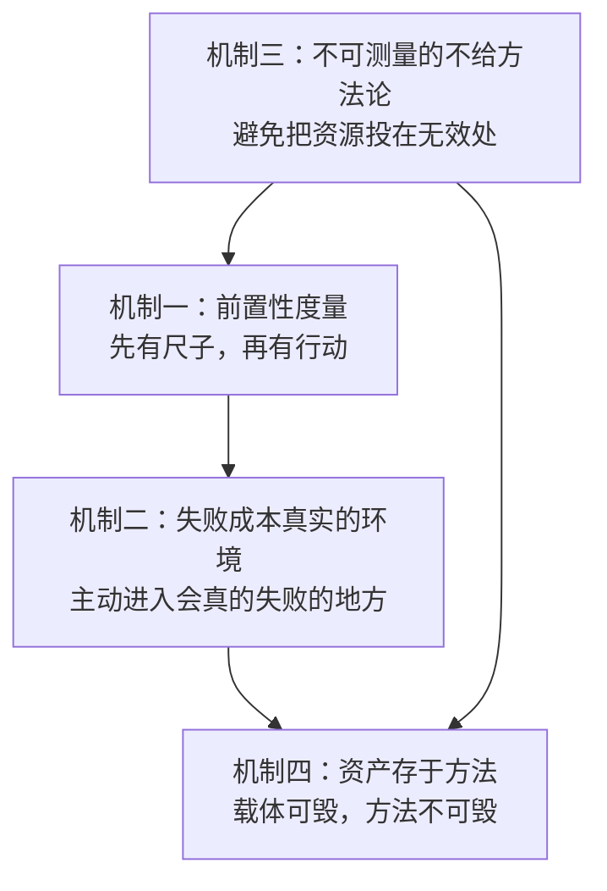

# 00 · 共同机制：四层结构

> **本篇要解决一个常见错误**：把「他们都很努力」「他们都很善良」「他们都很坚持」当作发现。
>
> **这三条都不是发现，因为它们无法被拆解、无法被检验、无法被迁移。**
>
> 本篇只收录**能被拆成零件、能被检验、能在别的领域复现**的机制。四条。

## 机制一：前置性度量（先有尺子，再有行动）

### 三人对照

| 人物 | 度量工具 | 层级 | 出处 |
|---|---|---|---|
| **陶行知** | **每天四问**（身体/学问/工作/道德，每问带「进步多少」后追问） | **日** | F-TX-070/071/072 |
| **游本昌** | **「拿到自己最好的名次」**（把评价基准从外部排名转向自身极限） | **状态** | F-YB-058 |
| **胡歌** | **幸存者偏差自审**（不断问「有多少人做对了 X 却没成功」） | **元** | `../huge-actor-craft/concepts/05-boundaries.md` |

### 提炼（D 层）

三人的度量工具在**时间尺度**上依次递进：

```
陶行知：日  → 每天问自己，填增量
游本昌：状态 → 不跟别人比，跟自己的极限比
胡歌：  元  → 对整个方法论的有效性做元层面审查
```

> **「前置性」的准确含义**（推断）：
>
> **不是「边做边量」，而是「在开始之前尺子已经存在」。**
>
> - 陶行知的四问在他办第一所学校之前就存在了（1930 年代初提出，1927 年已办晓庄——**实际是边做边提，但提出后即刻适用**）；
> - 游本昌的「最好的名次」在他 90 岁时仍在用；
> - 胡歌的幸存者偏差自审是**读到这个案例的人应该做的**，不是他做的——**这一条是本包从他的案例中反推出来的**。
>
> **「前置」的关键作用（推断）**：**没有前置的度量，行动会在中途被短期反馈劫持。** 因为人天生会用「最近一次的结果」代替「长期的标准」。

### 迁移方式（D 层）

**最小迁移版本**：任何一件事开始之前，先写下「我用什么判断这件事做对了」。

| 常见的伪度量 | 更可靠的度量 |
|---|---|
| 「我今天工作了几小时」 | 「今天有什么东西是**完成**的（不是 60% 状态）」 |
| 「我发了多少条内容」 | 「有多少人**因为它做了某个动作**」 |
| 「我这周学了多少小时」 | 「我能**讲给别人听**的部分有几个」 |

**注意最后一行的依据**：这正是陶行知「教学做合一」第三步（见 `../taoxingzhi-life-education/concepts/01-three-propositions.md`）与游本昌给乡村孩子的「还能是什么」（F-YB-088）指向的同一个机制。

---

## 机制二：失败成本真实的环境

### 三人对照

| 人物 | 他/他们**主动选择**的失败成本真实的环境 | 放弃了什么 | 出处 |
|---|---|---|---|
| **陶行知** | **晓庄招生考试含垦荒、施肥、修路**（不收束脩，穷学生也可来） | 城市里的大学教职与稳定薪资 | F-TX-009；F-TX-005（放弃 400 银元） |
| **游本昌** | **话剧**（自组团队、自负盈亏、卖房巡演 120 场） | 商业邀约（他长期不接破坏角色底线的剧本） | F-YB-072/075 |
| **胡歌** | **话剧《如梦之梦》环形舞台、不能 NG** | 电视剧的稳定曝光与收益 | F-HG-050/052 |

### 提炼（D 层）

**三人都做了同一件事：主动进入一个「失败会真的发生」的地方。**

而三人都**放弃了**的，是那个「失败不会发生」的地方：

| 人物 | 放弃的「永不失败」的环境 |
|---|---|
| 陶行知 | 大学讲堂（讲得好不好，没有直接后果） |
| 游本昌 | 商业片酬（演完就有钱，评价不影响收入） |
| 胡歌 | 电视剧（可重拍、可剪辑，评价被技术手段稀释） |

> **这个结构是本包最有迁移价值的一条**（推断）：
>
> **大部分人的成长困境不是不努力，是「待在一个失败不会发生的地方」。**
>
> ```
> 在「可剪辑」的环境中：
>   你的标准会自动降低（因为不需要）
>   你的反馈会被延迟（因为还没播出）
>   你的失败成本是零（所以不需要真的变好）
> ```
>
> **陶行知用「种不出庄稼」来检验，游本昌用「票房赔钱」来检验，胡歌用「全场观众盯着」来检验。三种检验的共同点是：失败会真的发生。**

### 一个反直觉的推论（D 层）

**「主动失败」是一种能力，不是运气。**

它的前提是**有能力承受失败的物质基础**：

- 陶行知在晓庄有自己与同事的集资（放弃 400 银元薪资后仍能办学）；
- 游本昌在卖房前已有《济公》的收入基础；
- 胡歌在车祸后已有成名的经济基础。

> **这意味着「主动选一个失败成本真实的环境」这个建议，不适用于没有物质基础的人。**（推断）
>
> **正确的分层做法**（推断）：
> - 有基础 → 主动选高失败成本环境（陶行知式）
> - 无基础 → 先在低失败成本环境中积累能力，同时**主动降低自己的反馈延迟**（见 `../huge-actor-craft/examples/00-feedback-latency.md`）

---

## 机制三：不可测量的东西不给方法论

### 三人对照（这是本包最惊人的发现）

| 人物 | 对「可测量的」给了方法论 | 对「不可测量的」的处理 | 出处 |
|---|---|---|---|
| **陶行知** | 身体→四策略；学问→五字箴言「一集钻剖韧」；工作→三点建议 | **道德问：完全没有配套方法论** | F-TX-074/075/076 vs 道德问无方法 |
| **游本昌** | 戏剧教育→**七步法**（完全可操作） | **「打分就是给孩子贴标签」**——明确拒绝量化孩子的心理成长 | F-YB-088 vs F-YB-089 |
| **胡歌** | 公益→**具体动作**（每月、每年、去几次） | **「个人的力量非常有限」**——拒绝给「影响力」任何数字 | F-HG-070~073 vs F-HG-077 |

> **三个人在两个相隔近百年的语境里（1940s 的教育、2020s 的艺术教育/公益），独立地、明确地做出了同一个判断**（推断）：
>
> > **当一个领域出现大量方法论时，往往正是它最不需要方法论的时候。**

### 提炼（D 层）

这条机制有一个非常清晰的形式：

```
可测量的东西  →  给步骤、给指标、给表格、给周期
不可测量的东西  →  只记事件，不记分；只问「有没有」，不问「多少」
```

三人的具体做法：

| 人物 | 对可测量的 | 对不可测量的 |
|---|---|---|
| 陶行知 | 「进步多少」——必须填增量值 | 道德问**按周结算，只记一件事，不打分**（见 `../taoxingzhi-life-education/examples/00-daily-30day.md` 第 3 周设计） |
| 游本昌 | 七步法——零基础老师能直接用 | 「你要怎么给一个孩子的心理打分呢？就是在给孩子贴标签」 |
| 胡歌 | 环保动作——具体到「沿公路 10 米范围捡拾」「临走打包带回回收点」 | 「个人的力量非常有限……最重要的是对自身的改变」 |

### 迁移方式（D 层）

**自查动作**：列出你正在追求的所有「提升」类目标，逐个问：

```
「这个能测量吗？」
  能  → 给它设指标、设周期、设记录表
  不能 → 停。改为「只记事件，不记分」
```

> **最常见的错误是给不可测量的东西硬设指标**（推断）：
> - 「提升情商」——不可测量的
> - 「提升幸福感」——不可测量的
> - 「人脉变好了」——不可测量的
> - 「写作能力」——**部分可测量的**（能否讲清、能否写出完的东西）→ 可以设指标
> - 「作品质量」——部分可测量（能否发表/演出/被使用）→ 可以设指标

**判据（推断）**：**如果一个目标的达成标志只能由自己宣布，那它就不可测量。** 「我变自信了」只能自己宣布；「我今天讲了 20 分钟没逃跑」可以观察。

---

## 机制四：资产存于方法，而非机构

### 三人对照

| 人物 | 遭遇的「载体被摧毁」或「个人被替代」的时刻 | 他的判断 | 出处 |
|---|---|---|---|
| **陶行知** | 1930 年晓庄被查封、10 名学生被杀、本人遭通缉流亡 | **「晓庄是同志的结合，不是少数个人的私有品」**；坚信「种子已遍撒全社会」 | F-TX-014/015/016/017 |
| **游本昌** | 1991 年后沉寂近 30 年（表面原因：耍大牌） | **不解释，只继续做**——1998 年自组公司拍《济公游记》，2009 年卖房拍《弘一》 | F-YB-022/070/072/078 |
| **胡歌** | 2006 年车祸，核心资产（面孔）损毁 | **转能力不转资产**——从「靠脸」转向「靠对话与身体表达」 | F-HG-020/050/051 |

### 提炼（D 层）

三人的共同结构是：

```
载体（机构 / 身份 / 外形）  可以被摧毁
        ↓
方法（可教给别人、可复现的做法）  摧毁不了
        ↓
所以：重建的成本 = 重新获得一个载体
     继续的成本 = 继续使用方法
```

> **陶行知是最清晰的例证**（推断）：
>
> 晓庄被查封后，他 1932 年办山海工学团、1934 年办小先生运动。**载体换了一个又一个，但方法（工以养生学以明生团以保生 / 让识字儿童教别人）是同一个。**
>
> **他自己说得很明白**：「晓庄是同志的结合，不是少数个人的私有品，拘捕几个人，不能叫他根本动摇」——**这句话的结构就是「载体 ≠ 事业」**。

> **游本昌的例证是反向的**（推断）：
>
> 1991 年的沉寂**不是他选择的方法消失，而是载体（商业邀约）消失了**。他没有转型去拍广告或上综艺赚钱，而是**继续用同一个方法（把资源转成社会资产）**——只是换了一个载体（自己组团队）。
>
> **胡歌的例证是最彻底的**（推断）：
>
> 他的资产是面孔，面孔损毁。**但「用身体表达」这项方法没有损毁**——所以他能通过话剧（不能用 NG 的环境）重建能力。

### 迁移方式（D 层）

**自查动作**：在你的每一件重要的事上问——

```
1. 我现在的「方法」是什么？（用一句话说清）
2. 我现在的「载体」是什么？（机构/身份/平台/形式）
3. 如果载体明天消失，方法还在吗？
   □ 在 → 继续
   □ 不在 → 你把资产存错了位置（见 ../taoxingzhi-youbenchang-huge/concepts/06-learning-path.md 第 3 阶段）
```

**注意「方法」必须用一句话说清**（推断）——**说不清就说明还没有方法，只有习惯。** 习惯依附于载体，方法可以脱离载体。

---

## 四条机制的相互关系



> **读法（推断）**：
> - **机制一是前提**——没有尺子，另外三条都无法判断成败；
> - **机制二是引擎**——它是动力的来源（真实反馈）；
> - **机制三是过滤器**——它防止把有限资源投在不可测量的伪目标上；
> - **机制四是保险**——它保证失败不会归零。

**四条机制里，机制一最容易被跳过，也最不能跳过。** 因为其他三条都需要用它来验证效果。

## 引用与溯源

完整出处见三个主体包：
- `../taoxingzhi-life-education/references/facts.md`（F-TX 79 条）
- `../youbenchang-jigong/references/facts.md`（F-YB 90 条）
- `../huge-actor-craft/references/facts.md`（F-HG 85 条）

本篇引用的关键事实：F-TX-070/071/072（每天四问）、F-TX-074/075/076（身体四策略/五字箴言/工作三点）、F-TX-005（放弃 400 银元）、F-TX-009（晓庄考试含垦荒）、F-TX-014~017（晓庄被查封与护校宣言）；F-YB-058（最好的名次）、F-YB-088（七步法）、F-YB-089（打分就是贴标签）、F-YB-022/070/072/078（沉寂与继续）；F-HG-020（车祸）、F-HG-050/051/052（话剧与不可 NG）、F-HG-070~073（青海环保具体动作）、F-HG-077（个人的力量非常有限）。

**本篇为跨包归纳**（四层结构的提炼、时间尺度的递进解读、机制间的因果关系）为本包 D 级推断。

**下一篇**：[01 关联证据：六条桥接](01-evidence-bridges.md) —— 「他们之间有关联」这句话，有什么证据？
