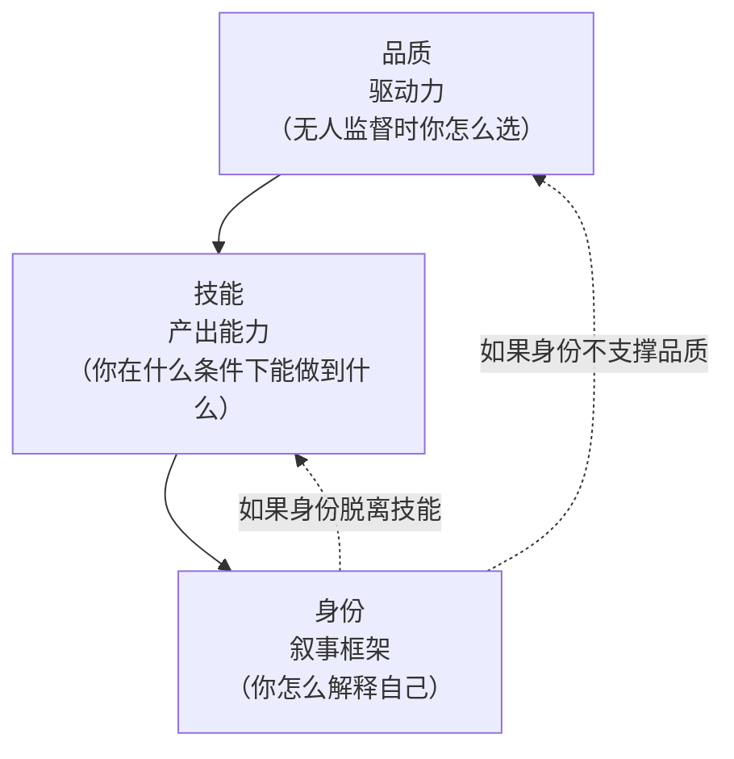

# 04 · 框架二：品质 · 技能 · 身份

> **本框架要解决的问题**（推断）：
>
> 「榜样学习」最常见的两种失败，都源于**三层的混淆**：
>
> 1. **把品质当技能学**——「学他无私奉献」→ 结果只是自我感动，没有能力积累；
> 2. **把技能当身份学**——「学他演济公」→ 结果只是模仿技巧，身份未变。

## 一、三层的定义与判据

| 层 | 定义 | 核心判据 | 验证方式 | 可迁移性 |
|---|---|---|---|---|
| **品质** | 你的**选择倾向**（在没有外部约束时会怎么选） | **在无收益、无人监督时你怎么选？** | 长期一致性 | **低**——品质无法通过听/看获得 |
| **技能** | 你的**可重复产出的能力** | **你能在什么条件下稳定做出什么？** | 可展示的产出 | **高**——技能可以练 |
| **身份** | 你的**自我叙事**（你是谁、你属于哪） | **你的行为与这个叙事一致吗？** | 他人的观察 | **最低**——身份是叙事，可被表演 |

> **三层的关键区别（推断）**：
>
> ```
> 品质 → 驱动力（在没有奖励时你还做不做）
> 技能 → 产出能力（做的时候能做到什么水平）
> 身份 → 叙事框架（你怎么解释自己）
> ```
>
> **只有技能层有客观验证。** 品质靠自证，身份靠他证，两者都不稳定。

## 二、三人的层位分布

| 人物 | 品质层的表现 | 技能层的表现 | 身份层的表现 |
|---|---|---|---|
| **陶行知** | 放弃 400 银元月薪（F-TX-005）；捧着一颗心来不带半根草去（F-TX-093） | 办学能力：零物质条件下让学校运转（F-TX-009/011） | 极强：**「生活教育」成为一套体系**——人名与思想绑定 |
| **游本昌** | 不爱艺术中的自己（F-YB-050）；「我不是公益人士」（F-YB-097） | 表演：52 岁演济公，87 岁演爷叔（F-YB-015/030）；**七步法教学**（F-YB-088） | 中等：**主动去个人化**——基金会不叫他的名字（F-YB-086） |
| **胡歌** | 「行善」不可考；但**「所有人的力量非常有限」**体现为认知谦逊（F-HG-077） | 表演：从偶像到戏骨，跨度极大（F-HG-054/055/064） | 弱：**主动消解**——「我感觉我一直在变」（待核）；30 多所学校以他人命名（F-HG-034） |

> **注意三人的身份层策略完全不同**（推断）：
>
> | 人物 | 身份层策略 | 依据 |
> |---|---|---|
> | 陶行知 | **强化**（人名绑定思想，成为符号） | 客观事实 |
> | 游本昌 | **去个人化**（组织不叫他的名字） | F-YB-086 |
> | 胡歌 | **转给他人**（学校以张冕命名） | F-HG-034/036 |
>
> **三种策略的适用条件**（见 [02 差异坐标](02-difference-map.md) 第三节）：传主张→绑定；传机制→去个人化；传纪念→转他人。

## 三、为什么顺序不能颠倒

### 3.1 只有品质没有技能 = 空谈

**游本昌的反证**（推断）：

> **如果只有「无私奉献」的品质而没有演技，他能「济世为公」吗？**
>
> 不能。**他的公益能持续，恰恰因为它建立在「观众愿意看」这个基础上**——而「观众愿意看」是技能的结果。
>
> 换言之：**品质决定他做什么，技能决定他能不能持续做。**

**具体链条**：
```
演技（技能） → 观众看（反馈） → 名气（资源） → 卖房拍《弘一》（行动） → 济世为公（品质体现）
                    ↑
              这一环断了，后面全部不成立
```

> **所以「学习他的无私」是无效的**（推断）：**因为无私无法直接学。** 你能学的是「提升演技到能支撑你的想法」——这是技能层的路径。

### 3.2 只有技能没有身份 = 工具

**陶行知的反证**（推断）：

> **六大解放是一套「环境诊断表」**（见 `../taoxingzhi-life-education/concepts/03-six-liberations.md`）——它告诉你「这个环境的六个缺口是什么」。
>
> **但它不告诉你「为什么要在意这六个缺口」。**
>
> **「为什么在意」是身份层的问题。**
>
> 如果你把六大解放当工具用，你会得到「我这个团队头脑解放得不够」这样的诊断——**但你不会因此去改变它。**
>
> **「因为我要让创造力活过来」是身份层的判断。**

> **陶行知自己的定位**（推断）：他把「解放儿童创造力」定义为「一场战斗」——「如果中华民族不想以三寸金头出现于国际舞台，唱三花脸，就要打开裹头布」（F-TX-057）。
>
> **「不想让中华民族以三寸金头出现」是身份层的判断。** 没有这层，六大解放就只是六条技术建议。

### 3.3 只有身份没有技能 = 表演

**这是最需要警惕的层**（推断）：

| 症状 | 表现 | 本质 |
|---|---|---|
| **用身份代替能力** | 「我是一个终身学习者」但没有任何可展示的产出 | 身份是叙事，技能才是证据 |
| **用身份解释失败** | 「我尽力了，只是运气不好」 | 身份层提供了不需改进的借口 |
| **过度经营人设** | 所有输出都在强化「我是谁」，没有「我做成了什么」 | 叙事取代了行动 |

> **胡歌案例中的一个警示**（推断）：他在访谈中多次表示「我感觉我一直在变」「不确定自己在做什么」。这类表述**本身是健康的**（不把身份固定），但**如果它成为对外的主要叙述**，就滑向「用变化的形象替代具体成就」。
>
> **判据（推断）**：
> ```
> 你的自我描述里，有多少是「我是谁」（身份）
>              多少是「我做了什么」（技能/证据）
> 健康的比例：后者应该更多
> ```

## 四、三层的相互支撑关系



> **读法（推断）**：
> - **正向**：品质驱动技能积累，技能支撑身份可信；
> - **反向风险一**：如果身份（我是什么样的人）无法支撑品质（我实际怎么选），人会**焦虑**——因为叙事和事实不符；
> - **反向风险二**：如果身份与技能脱节（我的叙事很好但没有产出），会滑向**表演**。
>
> **三层的健康状态是：品质可被行为验证，技能可被展示，身份可被行为支撑。**

## 五、自检工作表

### 第 1 步：品质层自检（不查行为，只问倾向）

```
在没有任何人知道、没有任何回报的情况下，以下三件事我会做吗？
  □ 每周花 2 小时做一件短期无回报、长期有用的事
  □ 承认自己在某件事上不行（对别人）
  □ 拒绝一个对我有利的、但我知道不对的机会

三个都勾 → 你的品质层是稳的
勾 0-1 个 → 品质层需要建设（见下方动作）
```

> **注意第 3 勾**（推断）：「拒绝对我有利的」是品质层的**核心判据**——因为「做好事」在没有诱惑时是容易的，**在诱惑面前拒绝才是品质**。

**品质层建设动作（若勾 ≤1）**：**不要立志，要设计诱因**（推断）。给一件你确实想做的事设置一个「无监督版本」——比如不告诉任何人你今天要做什么。

### 第 2 步：技能层自检

```
我的技能清单（能稳定做出的东西）：
  1. ______（在什么条件下能做）
  2. ______
  3. ______

每一项的验证方式：□ 有作品 □ 有数据 □ 有他人反馈 □ 无（只是「我会」）

有几项有「实际验证」？
  □ 全部有 → 技能层扎实
  □ 部分有 → 挑最重要的那一项，做出可验证的产出
  □ 全部无 → 技能层是想象的；本框架不适用，你需要的不是这三层而是先做出一件东西
```

> **第 3 步的最后一格是重要的**（推断）：**如果全部无验证，本框架不适用**——因为品质和技能都还没有落地，讨论身份是空谈。**先做出一件东西。**

### 第 3 步：身份层自检

```
我的自我描述（别人问「你是做什么的」，我会说）：
  ______

这个描述里：
  有多少是身份（我是什么样的人）：______
  有多少是证据（我做了什么）：______

判断：□ 证据为主（健康）□ 身份为主（需调整）□ 几乎全是身份（危险）
```

**身份层调整动作（若身份为主）**（推断）：**把描述从「我是什么人」改写成「我做了什么」**。
```
❌ 我是一个热爱学习的人
✅ 我每年读完 20 本书并写 4 篇笔记
```

## 六、三层框架与框架一的关系

> **两个框架的关系**（推断）：
>
> ```
> 框架一（真问题·真需求·真目标）  →  诊断层：我在哪
> 框架二（品质·技能·身份）          →  能力层：我缺什么
> ```
>
> **配合方式**：
>
> | 当框架一告诉你… | 去框架二检查… |
> |---|---|
> | 真需求是「我需要更强的 X 能力」 | **技能层**（X 是否在技能清单里） |
> | 真问题反复出现在「我总是不开始」 | **品质层**（是意愿问题还是能力问题） |
> | 真目标说不清 | **身份层**（你还没想清楚你是谁） |

> **最有用的配合场景（推断）**：**当框架一第 3 步（真需求）列不出任何一项时，回到框架二第 2 步（技能层）**——因为「列不出需求」通常意味着**你还没有任何可展示的能力**，所以想不出下一步。

## 引用与溯源

陶行知样本见 `../taoxingzhi-life-education/references/facts.md`（F-TX-005 放弃高薪、F-TX-093 十二条教诲、F-TX-057 裹头布与「不想以三寸金头出现」）；六大解放作为诊断表的论证见 `../taoxingzhi-life-education/concepts/03-six-liberations.md`；游本昌样本见 `../youbenchang-jigong/references/facts.md`（F-YB-050 不爱艺术中的自己、F-YB-097 我不是公益人士、F-YB-015/030 表演、F-YB-088 七步法、F-YB-086 基金会命名）；胡歌样本见 `../huge-actor-craft/references/facts.md`（F-HG-077 力量有限、F-HG-054/055/064 作品跨度、F-HG-034/036 命名）；身份层命名策略的三种类型见 [02 差异坐标](02-difference-map.md) 第三节。

**本框架为本包原创**（三层定义与判据、三人层位分布、顺序不可颠倒的三条论证、三层相互支撑模型、三步自检工作表、与框架一的配合）为本包 D 层推断。

**上一篇**：[03 框架一：真问题·真需求·真目标](03-framework-problem-need-goal.md) | **下一篇**：[05 框架三：正面解读师](05-framework-positive-reader.md)
