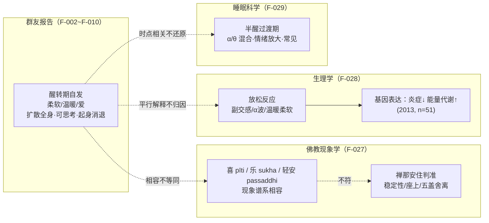

# 参照层："醒来的柔软"在三套参照系之间

> 本页不追问"它本质上是什么"（这个问题超出任何单一框架的裁决权），而是问：这段体验在**已被充分记录的知识**里能找到哪些位置？三套参照系分别是——佛教禅修现象学（传统）、放松反应研究（生理学）、半醒过渡期（睡眠科学）。逐项核验见 [核验报告](../references/verification.md)。

## 一、传统参照：pīti（喜）、sukha（乐）、passaddhi（轻安）

### 1.1 三个核心心所

在巴利语佛教经论体系中，与"正向禅修体验"相关的三个术语经常成对出现：

| 巴利语 | 中译 | 现象学特征 | 与本案的对照 |
|--------|------|-----------|-------------|
| **pīti** | 喜、rapture | **振奋、充盈、涌动**的喜，可带明显身体感（震颤、暖流、充盈）；《清净道论》列其五种强度：小规模鸡皮疙瘩→瞬间的闪电→海浪式拍打→腾空感→遍满全身 | "扩散全身""无限柔软""一根筋连到胸口"的**身体性愉悦**最接近 pīti 谱系 |
| **sukha** | 乐、ease/pleasure | 较细微、持久、宁静的愉悦，非感官刺激型 | "泡在里面""幸福"接近 sukha 的质地 |
| **passaddhi** | 轻安 | 身心的沉静、放松、粗重感消退 | "四肢柔软温暖、腰部僵硬变软"（F-009）近 passaddhi |

七觉支（bojjhaṅga，见 SN 46《觉支相应》）把"喜（pīti）"与"轻安（passaddhi）"都列为觉悟的构成因素——也就是说，**在这个传统里，禅修中出现的身体性喜悦不但不是歧途，反而是路径的一部分**。这为老师"快乐可以是进步标志"的态度（F-024）提供了传统依据。

### 1.2 但为什么"现象学相容"不等于"就是初禅"

大方老师说"还算不上极乐"（F-012），这个克制与传统判准意外地一致。经论对 jhāna（禅那）的传统判准包括：

- **稳定性**：境界不是几十秒到几分钟的偶然心境，而是可反复安住、维持一段时长的稳定状态；
- **座上成就**：通常在精进禅坐中、以舍离五盖（欲贪、嗔恚、昏沉睡眠、掉举恶作、疑）为前提达成——"离生喜乐"（vivekaja-pītisukha）；
- **次第性**：初禅有寻有伺有喜有乐有一心，二禅舍寻伺，三禅"离喜"（pīti 消退）唯留 sukha，四禅连 sukha 也舍、住不苦不乐；现代各派对 jhāna 深浅虽有争议（深定派 vs 浅定派），但都要求明显的稳定性与自主性。

对照本案（F-002/F-007/F-008）：

- ❌ 自发于**醒来/午睡醒来**，而非座上；
- ❌ 起床活动即消退，无法自主维持；
- ❌ 没有舍离五盖的相关描述；
- ✅ 但质地（无对象的身体性喜悦、轻安感）确实落在 pīti/passaddhi 的**现象描述范围**内。

> 保守结论：这可以读作一次**落入"喜/轻安"现象谱系的、浅层的、状态依赖的体验**；任何"这就是初禅/打通了某轮"的断言都缺乏判准支持。老师"算不上极乐"的分级，比 DeepSeek"就是极乐"的回答更接近传统的谨慎态度（F-027）。

### 1.3 跨传统的亲戚："存在即乐"的家族相似

老师哲学化的部分（"只是存在本身就快乐"，F-017/F-018）在多个传统里有**家族相似**，但都不是等同：

- 佛教：出离乐、远离之乐、"无生之乐"（注意其前提是戒律与修行，不是单纯心情好）；
- 《庄子·至乐》："至乐无乐"——最高的快乐不系于具体乐事；
- 儒家："孔颜乐处"——箪食瓢饮而不改其乐，系于德性而非境遇。

大方老师的版本（还包括"按神的方式生活"，F-025）是**现代个人化灵性综合**（F-033）：可作为进入这些传统的对话入口，但不能当作其中任何一家的忠实转述来引用。

## 二、科学参照：Benson 与"放松反应"

### 2.1 什么是放松反应

哈佛医学院心脏病学家 Herbert Benson 在 1970 年代以超觉静坐（TM）练习者为首批受试者，提出**放松反应（relaxation response）**：它是"战或逃"应激反应的生理对立面，特征包括（F-028）：

- 副交感神经主导：心率减慢、呼吸变慢、代谢率与氧耗下降；
- 脑电 α 波增强（放松性清醒）；
- 血压的急性下降。

### 2.2 基因表达层面的证据

Benson-Henry 身心医学研究所 2013 年发表于 PLOS ONE 的研究（26 名 8 周新手 + 25 名 4–25 年长期练习者，检视 22000+ 基因表达）报告：

- **单次**放松练习即可引起表达变化：线粒体能量代谢通路上调、NF-κB 炎症通路受抑、胰岛素通路改变；
- 长期练习者的模式更明显、更稳定。

### 2.3 这份证据能说明什么、不能说明什么

| 能说明（✅） | 不能说明（⚠️） |
|-------------|---------------|
| 长期规律放松练习与"深度放松、温暖、柔软、情绪改善"方向相容，群友两年练习后出现这类体验**不奇怪** | 不能对**这一个案**做归因——没有测量、没有对照，连体验发生时是否处于放松反应状态都不知道 |
| "僵硬感减轻"可由肌张力下降、注意力转向内感受得到常识性解释 | 不能支持"量级会越来越大""可不依赖身体常时存在"（F-020）——研究没有这类无限增长的报告 |
| 内感受注意可改变身体知觉（主观体感放大/重评） | 不能支持"链接信息能量""进入另一维度"（F-021/F-023）——这些不在生理学的解释范围内 |

## 三、半醒过渡期：为什么时点本身是一条线索

### 3.1 hypnopompic state

**半醒过渡期（hypnopompic state，F. Myers 1904 年命名）** 指从睡眠过渡到完全清醒之间的半意识状态，可残留梦样意象、情绪体验被放大、脑电呈 α/θ 混合；与之镜像的是入睡前的 hypnagogic state。入睡前/醒转期的生动体验在普通人群中报告率很高，绝大多数没有病理意义（F-029）。

### 3.2 对本案的提示与限制

- **提示**：体验严格定时出现（醒来、午睡醒来）、严格定时消退（起身活动），说明它至少部分是**状态依赖**的——与"不管什么时候都能进入的稳定境界"（F-020 老师的预测）在当前证据下恰恰相反；
- **限制**：状态依赖不"解释掉"体验。它与"两年训练改变了醒转期的默认心境"并不矛盾——半醒过渡期可能只是训练效应**显现的窗口**，而非体验的全部成因；
- 同样不能因为"贴着睡眠边界"就把该体验归为"梦/幻觉"并否定其主观真实性与后续影响（他在状态中调整了对问题的感受，F-010 是真实的使用记录）。

## 四、"内在阴阳融合"：一个必须溯源的说法

群友问 DeepSeek，得到"内在阴阳融合的极乐"（F-005）；老师答"DeepSeek 说的是对的"（F-019）。但术语溯源显示（F-030）：

- **"内在阴阳融合"不是道家内丹学或中医学的标准术语**。内丹话语是"阴阳交媾""坎离交媾""性命双修"等，各有明确的经典语境与修证次第；
- 它是大模型把"冥想 + 身体快感 + 体感路径"等关键词综合生成的**现代杂交说法**，听起来像传统术语，实则没有经典所指；
- 有意思的是，老师采纳后立刻转用自己的话——"没理由的快乐、不依赖的快乐、存在性的快乐、内在性感"（F-012~F-017），真正支撑其论述的是**他自己的哲学**，而非道家或 AI 的术语。

> 引用纪律：在本包及二次创作中，"内在阴阳融合"只能写成"**DeepSeek 给出、大方老师采纳的一种说法**"，不得写成"道家认为……"或"中医认为……"。

## 五、三套参照系对同一体验的并置

**读这张图的纪律**：三个参照系是并置的三种语言，不互相还原，也不能叠加成"铁证"——"传统有记录 + 生理有变化 + 睡眠期常见"三者加在一起，依然不能把个案体验裁决为"极乐""能量融合"或"疾病疗愈"。

## 六、本页小结

1. **传统定位**：落入 pīti/passaddhi 现象谱系的浅层、状态依赖体验；老师"算不上极乐"的分级与传统相容，DeepSeek 的命名与老师的进阶承诺则超出判准；
2. **生理定位**：放松反应为"两年练习→深度放松→温暖柔软情绪改善"提供平行解释，但不支持无限进阶、能量、维度等主张；
3. **时点定位**：半醒过渡期解释了"为何总在醒来时"，是状态依赖的线索，而非体验的全部解释；
4. **术语纪律**："内在阴阳融合"是 AI 生成的非标准术语，即便被老师采纳也不得冒充传统概念；
5. 下一步：作为普通读者，如何使用这类内容而不被任何一种语言俘获——[02 边界层](02-reading-meditation-experience.md)。
